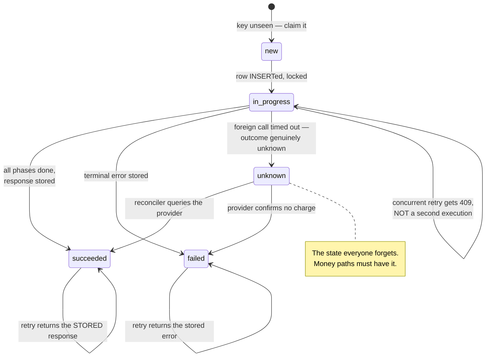
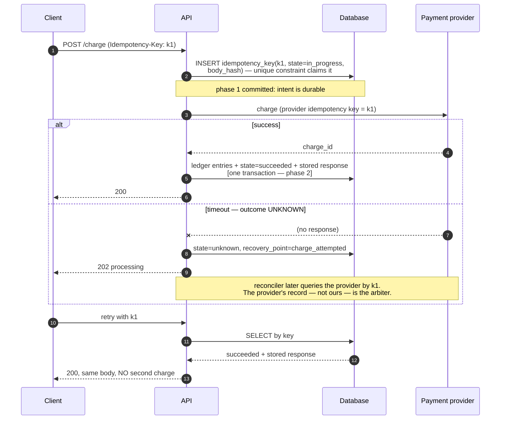

# Idempotency

## Core concept

Idempotency is what makes retries safe, and retries are unavoidable: a client that does not receive
a response cannot distinguish "the request never arrived", "it succeeded and the response was
lost", and "it is still running". Since it must retry, **the server's job is to make the second
attempt produce the same outcome as the first** — not to prevent it.

The distinction that organises everything: a **natural** idempotent operation needs no
bookkeeping (`SET status='shipped'`, `PUT` an object, insert with a unique natural key), while an
operation with a **foreign state mutation** — a charge, an email, a call to another service —
cannot be made naturally idempotent because the effect is outside your transaction. Those need a
persisted key, a stored response, and a recovery path for the case where the outcome is genuinely
unknown.

The failure most designs share: they treat idempotency as a duplicate-filter at the edge, when the
hard part is **the request that failed halfway through**, leaving state the retry must reconcile
rather than repeat.

## Mechanics & internals

### The key: scope, lifetime, and who generates it

| Property | Rule | Why |
|---|---|---|
| **Generated by the client** | The client owns the key, per logical operation | Only the client knows that two requests are the same intent. A server-generated key cannot dedupe a retry |
| **Scoped to (account, endpoint, key)** | Never global | A key reused across accounts or endpoints is a cross-tenant data leak, not a bug |
| **Stable across retries, new per intent** | A retry reuses it; "charge again on purpose" gets a new one | The user pressing Pay twice deliberately must be able to pay twice |
| **Bound to the request body** | Store a hash; a mismatch is a **client error (422)**, not a cache hit | Same key + different body means a client bug; silently returning the old response hides it |
| **Retained ≥ max retry delay** | 24 h is a common floor; longer if clients retry from queues | Too short and a late retry re-executes; Stripe documents 24 h |

### The three states, and why "in flight" is the hard one

Three responses a retry can receive, and a correct implementation needs all three:

1. **Completed** → return the **stored response**, byte for byte, with the original status code.
   Re-executing is wrong even if it would be harmless.
2. **In progress** → return `409 Conflict` (or `425`), do **not** execute concurrently. The claim
   is made by inserting the key row inside a transaction and relying on the unique constraint —
   the loser of that race is a duplicate by definition.
3. **Unknown** → the outcome cannot be determined yet; return `202` and let a reconciler resolve
   it against the downstream system's own record.

### Foreign state mutations and atomic phases

Brandur's formulation of the Stripe pattern is the one worth internalising: identify each
**foreign state mutation** (anything outside your ACID store), then split the request into
**atomic phases** whose boundaries sit either side of those mutations. Each phase commits its
local changes *and* its recovery point in one transaction. A retry reads the recovery point and
resumes from there rather than restarting.

Two details that make this work in production and are usually missing:

- **Pass the key downstream.** Your idempotency key should become the provider's idempotency key,
  so their dedup and yours agree. Otherwise your retry is their new charge.
- **The provider's record is the arbiter for unknowns.** Reconciliation queries them; it never
  guesses from local state. Settlement files exist for exactly this.

### Natural idempotence beats every mechanism

Before building any of the above, check whether the effect can be made naturally idempotent —
it costs nothing and has no window, no retention and no cleanup job:

| Not idempotent | Idempotent equivalent |
|---|---|
| `balance = balance - 10` | `INSERT INTO ledger(txn_id, delta) ...` with `UNIQUE(txn_id)`; balance is a materialised sum |
| `counter += 1` | Insert the contributing event ID; count distinct — or accept approximate counting deliberately |
| `INSERT INTO orders ...` | `INSERT ... ON CONFLICT (client_order_id) DO NOTHING` |
| `status = next_status()` | `UPDATE ... SET status='shipped' WHERE status='packed'` — a compare-and-set that is a no-op on retry |
| "Send email" | Insert into an `outbox` keyed by `(user_id, template, entity_id)`; the sender dedupes on the key |
| `POST /resources` | `PUT /resources/{client-generated-uuid}` |

The last row is a whole API-design lever: **a client-generated resource ID converts a
non-idempotent `POST` into an idempotent `PUT`**, and the idempotency-key machinery disappears.

## Numbers that matter

| Quantity | Value | Confidence |
|---|---|---|
| Stripe idempotency key retention | **24 hours** | [Stripe docs](https://docs.stripe.com/api/idempotent_requests) — after that, the same key is a new request |
| Recommended retention | ≥ max retry window; days if clients retry from durable queues | Design decision — state it |
| Key storage cost | ~200–500 B per key (key, state, body hash, stored response) | 10 M requests/day at 24 h ≈ 2–5 GB live |
| Duplicate rate driving this | 0.001–0.1% steady, **percent-level during incidents** | Order of magnitude; duplicates cluster exactly when stakes are highest |
| Cost of the claim | One indexed insert per request | Often the cheapest part; the stored response dominates storage |
| Reconciler cadence for unknowns | Minutes for money; hours is a customer-visible SLA breach | Product decision |
| Concurrent-retry response | `409` — never a second execution | Correctness, not preference |

**The retention arithmetic.** If a client retries from a durable queue with exponential backoff up
to 6 hours, a 1-hour key retention means the final retry re-executes the operation as new. Retention
must exceed the client's *maximum* retry horizon, not its typical one — and if clients are external
and you cannot bound their behaviour, say so and pick 24 h+ as Stripe does.

## Failure modes

| Failure | Symptom | Mitigation |
|---|---|---|
| **Concurrent retries execute twice** | Double charge under a slow first attempt | Claim the key with a unique constraint **before** doing work; return 409 to the loser |
| **Same key, different body** | A client bug silently receives a stale, wrong response | Store a body hash; mismatch → 422 |
| **Key not scoped to the account** | One tenant's key collides with another's; cross-account response leak | Scope `(account, endpoint, key)` and treat it as a security control |
| **Retention shorter than the retry horizon** | A late retry re-executes as new | Retention ≥ max client backoff; document it |
| **No `unknown` state** | Provider timeout leaves state permanently ambiguous; someone fixes it by hand | Explicit unknown state + reconciler against the provider's record |
| **Key not passed downstream** | Your retry is the provider's new request | Propagate the key to every foreign call |
| **Response not stored** | The retry re-executes to "get the answer again" | Store the status code and body at completion |
| **Idempotency at the edge only** | The gateway dedupes but internal retries between services do not | Idempotency belongs at every hop that can retry, not just the front door |
| **Key reuse for genuinely new intent** | The user's second, deliberate payment silently returns the first one's response | Key is per intent; the client mints a new one on user action |

**The pattern to cite.** Stripe's public design — a client-supplied `Idempotency-Key` header,
server-side storage of the request's outcome, 24-hour retention, and the same response returned on
retry — is the industry reference precisely because the money path forces every case to be handled.
Brandur's write-up adds the part the docs omit: **recovery points and atomic phases**, so a request
that dies between the local write and the foreign call resumes rather than restarting, and the
reconciler resolves the unknowns using the provider as the arbiter. The generalisation to remember:
**an idempotent endpoint is a small state machine with durable state, not a cache of responses.**
([Brandur](https://brandur.org/idempotency-keys), [Stripe](https://docs.stripe.com/api/idempotent_requests))

## Trade-offs vs alternatives

| Approach | Guarantee | Cost | Choose when |
|---|---|---|---|
| **Natural idempotence** (upsert, CAS, client-generated ID) | Infinite window, no state | Design work on the schema/API | **Always first.** No retention, no cleanup, no window |
| **Idempotency key + stored response** | Exactly-once effects within retention | One insert + stored response per request | Foreign state mutations; public APIs |
| **Dedup table on message ID** | Same, for async consumers | A write per message | At-least-once consumers whose effects cannot be made idempotent |
| **Provider-side idempotency** | The foreign system dedupes for you | Free when offered — **always use it** | Any provider that supports an idempotency key |
| **Optimistic concurrency (version/ETag)** | Prevents lost updates, not duplicate side effects | Retries on conflict | Update endpoints on mutable resources |
| **Distributed lock per key** | Serialises attempts | A lock service on the write path, and a zombie-holder problem | Rarely — the unique constraint is cheaper and safer ([leases-locks-and-fencing.md](./leases-locks-and-fencing.md)) |
| **Do nothing** | None | Free | Read-only endpoints, or effects that are genuinely harmless to repeat — and say which |

### Where staff engineers get this wrong

1. **Treating it as deduplication.** Deduplication handles the request that arrives twice.
   Idempotency must also handle the request that *died halfway*, which is the expensive case.
2. **Claiming the key after doing the work.** The claim must be the first durable act, or two
   concurrent retries both pass the check and both execute.
3. **Not storing the response.** Returning "already processed" instead of the original response
   forces clients to re-query and makes the endpoint useless for retries.
4. **Skipping the unknown state.** Any call to a system you do not control has three outcomes, not
   two. Money paths without an `unknown` state get reconciled by humans reading logs.
5. **Not propagating the key.** Idempotency that stops at your boundary just relocates the double
   charge to the provider.
6. **Ignoring the body hash.** Same key with a different body is a client bug you should surface,
   not silently paper over.
7. **Building the machinery before checking for natural idempotence.** A unique constraint on
   `client_order_id` deletes most of this page's complexity.

## Real-world examples

- **Stripe** — `Idempotency-Key` header, 24-hour retention, stored responses; the reference
  implementation for a public money API.
- **Kafka idempotent producer** — producer ID + epoch + per-partition sequence numbers, so broker-
  side dedup removes retry duplicates within a session. Same idea at the transport layer; see
  [delivery-semantics.md](./delivery-semantics.md).
- **AWS EC2 `ClientToken`** — the same pattern in infrastructure APIs, precisely because "did my
  instance launch?" is unanswerable after a timeout.
- **HTTP semantics** — `PUT` and `DELETE` are defined as idempotent, `POST` is not. Designing with
  client-generated IDs to prefer `PUT` is the cheapest idempotency in existence.
- **Payment reconciliation** — settlement files as the arbiter for unknowns: the provider's record
  of truth, compared daily, is what closes the state machine.

## Staff-level follow-ups

1. Two retries of the same idempotency key arrive concurrently, 5 ms apart. Walk through your
   implementation and show which mechanism guarantees only one executes.
2. Your provider call times out and the outcome is unknown. Design the state machine, the
   reconciler, and the customer-facing behaviour in the meantime — then say what your maximum
   ambiguity window is.
3. Redesign a `POST /transfers` endpoint so that idempotency needs no key at all. What changes in
   the API contract and what do clients now have to do?
4. A client retries from a durable queue for up to 12 hours; your key retention is 1 hour.
   Describe the failure, then choose between raising retention and changing the effect.
5. Where in a request path with an API gateway, three internal services and a message bus should
   idempotency live? Justify each placement, and name what breaks if it exists only at the edge.

## See also

- [delivery-semantics.md](./delivery-semantics.md) — why at-least-once makes this mandatory
- [transaction-isolation-levels.md](./transaction-isolation-levels.md) — the unique constraint and lost-update mechanics behind the claim
- [leases-locks-and-fencing.md](./leases-locks-and-fencing.md) — why a lock is the wrong tool here
- [../02-primitives/transactions-and-idempotency.md](../02-primitives/transactions-and-idempotency.md) — outbox, sagas, ledgers (still in the bundled note)
- [../03-backend-cases/payments-ledger.md](../03-backend-cases/payments-ledger.md) — this page applied end to end

## Referenced by

- [Delivery semantics](delivery-semantics.md)
- [Expand–contract migration](../patterns/expand-contract-migration.md)
- [Fundamentals index](README.md)
- [Log vs queue](log-vs-queue.md)
- [Outbox pattern](../patterns/outbox-pattern.md)
- [Saga pattern](../patterns/saga-pattern.md)
- [Timeouts, retries and backoff](timeouts-retries-backoff.md)
- [Topic manifest](../topics/manifest.md)
- [Transactions, sagas and idempotency](../02-primitives/transactions-and-idempotency.md)

## Sources

- [Brandur Leach — Implementing Stripe-like idempotency keys in Postgres](https://brandur.org/idempotency-keys) — foreign state mutations, atomic phases, recovery points
- [Stripe API — idempotent requests](https://docs.stripe.com/api/idempotent_requests) — 24-hour retention, stored responses
- [Kafka KIP-98 — idempotent producer and transactions](https://cwiki.apache.org/confluence/display/KAFKA/KIP-98+-+Exactly+Once+Delivery+and+Transactional+Messaging)
- [AWS — ensuring idempotency with `ClientToken`](https://docs.aws.amazon.com/AWSEC2/latest/APIReference/Run_Instance_Idempotency.html)
- [RFC 9110 — HTTP semantics, idempotent methods](https://www.rfc-editor.org/rfc/rfc9110#name-idempotent-methods)
