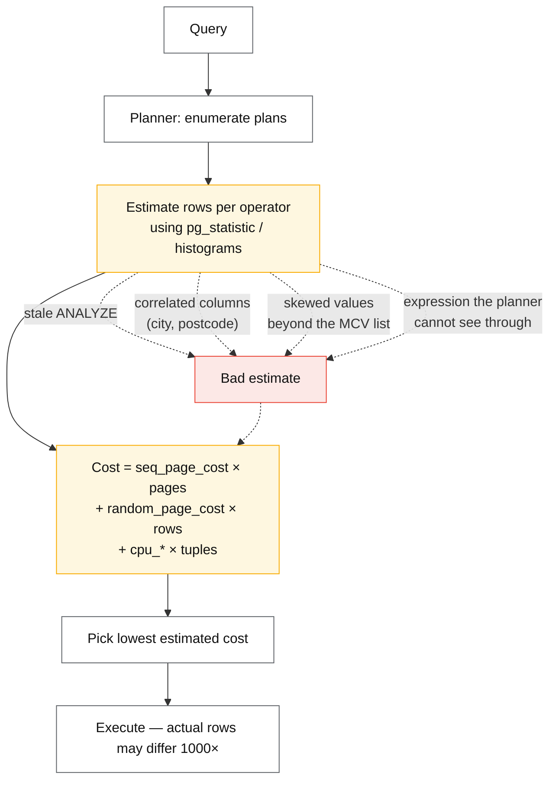
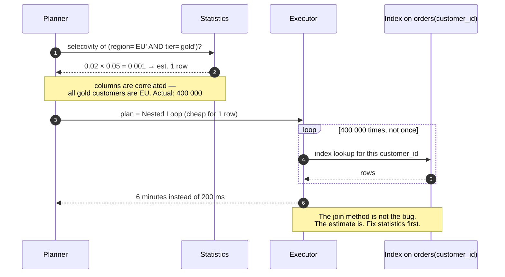

# Indexing and query planning

## Core concept

An index is a redundant, ordered copy of part of your data, maintained on every write, chosen by a
cost model you do not control. Two facts follow, and almost every indexing mistake is a failure to
hold both at once:

1. **Order in a composite index is not a detail, it is the index.** `(a, b)` and `(b, a)` serve
   different queries and are not substitutes.
2. **The planner will ignore your index whenever its cost model says a scan is cheaper**, and its
   cost model runs on *estimates*. When estimates are wrong — correlated columns, skewed values,
   stale statistics — the planner makes a confident, catastrophic choice, and no amount of adding
   indexes fixes it.

The staff-level skill is not knowing that indexes speed up reads. It is reading a plan, spotting
the row-estimate error that caused a bad join order, and knowing which of the six available fixes
addresses the actual cause.

## Mechanics & internals

### Composite index order: the leftmost-prefix rule

A B-tree index on `(tenant_id, created_at, status)` is sorted by `tenant_id`, then `created_at`
within it, then `status`. It can serve:

| Query predicate | Usable? | Why |
|---|---|---|
| `tenant_id = ?` | ✅ Full seek | Leftmost prefix |
| `tenant_id = ? AND created_at > ?` | ✅ Seek + range | Prefix then range on the next column |
| `tenant_id = ? ORDER BY created_at` | ✅ **No sort needed** — the index is already in that order | The most under-used property of composite indexes |
| `created_at > ?` alone | ❌ | Not a leftmost prefix; a scan of the whole index at best |
| `tenant_id = ? AND status = ?` | ⚠️ Partial | Seeks on `tenant_id`, then filters `status` — the `created_at` gap stops the seek |

The rule that generalises: **equality predicates first, then the one range/sort column, then
anything else.** Once you hit a range column, no column after it can be used for seeking. This is
why `(status, created_at)` and `(created_at, status)` have wildly different performance for
`WHERE status = 'open' AND created_at > now() - interval '1 day'` — the first seeks, the second
scans a day of every status.

### Covering indexes and the visibility problem

An **index-only scan** answers a query entirely from the index, never touching the table. It is
often a 10× win, and it has an engine-specific catch:

- **InnoDB** secondary indexes store the primary key, so a covering index avoids a second lookup
  into the clustered index. Adding the selected columns to the index is a pure win.
- **PostgreSQL** stores no visibility information in indexes, so an index-only scan must still
  check the **visibility map**; if the page is not marked all-visible (recent writes, vacuum
  behind), it falls back to a heap fetch. An index-only scan on a hot table can silently be a
  normal index scan until `VACUUM` runs. `INCLUDE` columns add payload without widening the key.

### Why the planner ignores your index

The five real causes, in rough order of frequency:

1. **Low selectivity.** If the predicate matches 30% of rows, a sequential scan genuinely is
   cheaper — random IO per row costs more than streaming pages. The planner is right and the
   index is the wrong tool.
2. **Stale or insufficient statistics.** Postgres samples 300 × `default_statistics_target`
   (default 100 ⇒ 30 000 rows) per column. A skewed column with many distinct values gets a
   histogram that misses the shape. `ANALYZE`, or raise the target on that column.
3. **Correlated columns.** The planner multiplies independent selectivities: `city = 'Paris' AND
   country = 'France'` is estimated as `P(city) × P(country)`, which underestimates by orders of
   magnitude. Postgres's fix is **extended statistics** (`CREATE STATISTICS ... (dependencies,
   ndistinct)`), and almost nobody creates them.
4. **The predicate is not sargable.** `WHERE date(created_at) = '2026-09-02'` or
   `WHERE lower(email) = ?` cannot use a plain index on the column. Use an **expression index**,
   or rewrite as a range: `created_at >= '2026-09-02' AND created_at < '2026-09-03'`.
5. **Type mismatch or implicit cast.** Comparing a `varchar` column to an integer parameter, or
   `bigint` to `int` across a join, silently disables index use in several engines.

### Reading a plan like an engineer, not a tourist

Run `EXPLAIN (ANALYZE, BUFFERS)`. Then look at exactly one thing first: **`rows=` estimated
versus `actual rows=`.** A ratio above ~10× at any node is the bug; everything downstream of a bad
estimate is a bad decision, and fixing the join method without fixing the estimate just relocates
the problem.

The classic signature: an estimate of 1 row leads the planner to choose a **nested loop**, the
actual is 400 000 rows, and the query runs 400 000 index lookups instead of one hash join. The
query does not look pathological — it looks like a plan that would have been optimal if the
estimate had been right.

`BUFFERS` gives the second number that matters: **shared hit vs read**. A query that is fast in
staging and slow in production is usually reading from disk what staging served from cache.

### The write side of an index

Every index is maintained on every write. The costs are engine-specific and both matter:

- **InnoDB** — secondary index entries hold the primary key, so a **wide primary key inflates
  every index**. A 40-byte natural PK across six indexes costs 240 bytes per row before any data.
- **PostgreSQL** — an update writes a new tuple version; unless the update is HOT-eligible (no
  indexed column changed *and* the page has free space), **every index gets a new entry**. This is
  the write amplification Uber cited when moving to MySQL — index entries pointing at physical
  tuple locations rather than at the primary key.

The practical consequence: **unused indexes are not free.** They are write amplification, storage,
buffer-pool competition, and extra plans for the planner to consider. Audit
`pg_stat_user_indexes.idx_scan` or `sys.schema_unused_indexes` and drop what nothing reads.

## Numbers that matter

| Quantity | Value | Confidence |
|---|---|---|
| Selectivity where an index stops winning | Roughly **5–20%** of the table | Rule of thumb; depends on `random_page_cost` and row width |
| Postgres default `random_page_cost` | 4.0 — calibrated for spinning disks | On SSD/NVMe, **1.1** is the common correction and it changes plans |
| Postgres statistics sample | 300 × `default_statistics_target` = 30 000 rows | [PostgreSQL docs](https://www.postgresql.org/docs/current/planner-stats.html) |
| Estimate error worth investigating | ≥ 10× at any plan node | Convention; ≥ 100× is almost always the root cause |
| Write cost per additional index | ~5–15% write throughput each | Order of magnitude — measure on your workload |
| Index size vs table | 10–30% of table size per index, more for wide keys | Order of magnitude |
| Index-only scan speedup | 2–10× when it applies | Order of magnitude |
| B-tree depth for 100 M rows | 3–4 | Fan-out 100–500 per page |

**Arithmetic that settles the "just add an index" argument.** A table with 12 indexes at 10% write
cost each is not 12% slower — it is closer to a doubled write cost, and every index also competes
for buffer pool. On a write-heavy table, dropping four unused indexes is frequently a larger
performance win than adding the "missing" one.

## Failure modes

| Failure | Symptom | Mitigation |
|---|---|---|
| **Nested loop from a 1-row estimate** | Query is 1000× slow, plan looks reasonable | Fix the estimate: `ANALYZE`, extended statistics, raise the target; do not force the join method first |
| **Correlated-column underestimate** | Multi-predicate queries pick terrible join orders | `CREATE STATISTICS` on the correlated pair |
| **Non-sargable predicate** | Full scans on an indexed column | Expression index or a rewrite to a range |
| **Plan flip** | A query that was fast for months becomes slow after a data-volume change, no deploy | Understand the tipping point; plan management / hints as a last resort, statistics first |
| **Index bloat** | Index larger than the table; scans slow | `REINDEX CONCURRENTLY`; investigate the update pattern |
| **Unused indexes** | Write throughput mysteriously low | Audit `idx_scan`; drop |
| **Blocking index build** | `CREATE INDEX` locks writes for the whole build | `CREATE INDEX CONCURRENTLY` (Postgres) / online DDL (MySQL) — and know they can fail leaving an invalid index |
| **Index-only scan degrades silently** | Postgres falls back to heap fetches when the visibility map is stale | Keep autovacuum aggressive on hot tables |
| **Wide primary key** | Every secondary index inflated in InnoDB | Narrow surrogate PK; keep the natural key as a unique constraint |

**Documented case.** Uber's Postgres→MySQL write-up is, read carefully, an *indexing* story:
because Postgres index entries point at the physical tuple location, updating any column forced
updates to **every** index on the row, which multiplied both disk writes and WAL volume. InnoDB's
choice to store the primary key in secondary indexes means only indexes on changed columns are
touched. The counterpoint from the Postgres community — HOT updates avoid this when no indexed
column changes and the page has room — is exactly the kind of qualification that separates a
citation from an argument.
([Uber](https://www.uber.com/en-US/blog/postgres-to-mysql-migration/),
[Markus Winand's analysis](https://use-the-index-luke.com/blog/2016-07-29/on-ubers-choice-of-databases))

## Trade-offs vs alternatives

| Index type | Buys | Costs | Use when |
|---|---|---|---|
| **B-tree** | Equality, range, ordering, prefix | Write cost, size | The default; 95% of cases |
| **Composite** | Multi-predicate seeks, sort elimination | Order matters; rigid | You know the query shape |
| **Covering / `INCLUDE`** | Index-only scans | Wider index, more write cost | Hot read paths with few columns |
| **Partial** (`WHERE deleted_at IS NULL`) | Tiny index for a common filter | Only serves queries with that predicate | Soft deletes, status flags, sparse data |
| **Expression** | Sargable `lower(email)`, `date(ts)` | Rebuilt on write; planner must match exactly | Case-insensitive lookups, computed keys |
| **Hash** | Slightly faster equality | No ranges, no ordering | Rarely worth it over B-tree |
| **GIN / inverted** | Arrays, JSONB, full text | Expensive writes, large | Containment and search queries |
| **BRIN** | Enormous tables with physical-order correlation | Useless without correlation | Append-only time-series — a 1000× smaller index |
| **No index** | Zero write cost | Full scans | Small tables, low-selectivity predicates, write-only tables |

### Where staff engineers get this wrong

1. **Adding an index instead of reading the plan.** The plan names the cause; the index is a guess.
   If the estimate is wrong, the new index gets ignored too.
2. **Getting composite order backwards.** Equality columns first, then the single range/sort
   column. `(created_at, tenant_id)` for a per-tenant recent-items query is a scan wearing an
   index's clothes.
3. **Believing an index-only scan is guaranteed.** In Postgres it depends on the visibility map,
   so it can silently stop being index-only under write load.
4. **Ignoring the write side.** Twelve indexes on a write-heavy table is a design decision nobody
   made. Audit and drop.
5. **Leaving `random_page_cost = 4` on NVMe.** The default encodes 2005 hardware and systematically
   biases the planner toward sequential scans. Changing it is a one-line, whole-system improvement
   — and must be verified, not assumed.
6. **Reaching for hints first.** Hints freeze today's plan against tomorrow's data. Fix statistics,
   fix the predicate, fix the schema; hint only when you have lost the argument with the optimiser
   and can say precisely why.

## Real-world examples

- **PostgreSQL** — cost-based planner with MCV lists and histograms, extended statistics for
  correlated columns, `CREATE INDEX CONCURRENTLY`, BRIN for append-only data, HOT updates as the
  mitigation for index write amplification.
- **MySQL / InnoDB** — clustered PK with secondary indexes storing it; the optimiser trace
  (`SET optimizer_trace`) shows exactly why an index was rejected; index condition pushdown moves
  filtering into the storage engine.
- **CockroachDB / Spanner** — distributed indexes are separate ranges, so a secondary index lookup
  can be a network hop; covering indexes matter far more than on a single node.
- **DynamoDB** — no planner at all: the access path is the key, LSIs and GSIs are explicit
  structures with their own capacity. The absence of a planner is why key design carries all the
  weight — see [partitioning-strategies.md](./partitioning-strategies.md).
- **Elasticsearch** — inverted index as the primary structure; the same selectivity arithmetic
  drives filter ordering and caching decisions.

## Staff-level follow-ups

1. A query slowed 500× overnight with no deploy. Walk your diagnosis from `EXPLAIN (ANALYZE,
   BUFFERS)` to root cause, and name the three most likely causes in order.
2. Given `WHERE tenant_id = ? AND status = 'open' AND created_at > ? ORDER BY created_at DESC
   LIMIT 50`, design the index. Justify the column order, say whether you would add `INCLUDE`
   columns, and state what happens as one tenant grows to 90% of the table.
3. Explain, at the level of what is stored in an index entry, why the same update pattern costs
   more in Postgres than InnoDB — then state the condition under which it does not.
4. Your table has 14 indexes. Design the audit that decides which to drop, including how you avoid
   dropping one that only a quarterly report uses.
5. When would you accept a sequential scan over an index scan on a 200 M-row table? Give the
   selectivity threshold and the reasoning behind it.

## See also

- [storage-engines.md](./storage-engines.md) — what maintaining an index costs the engine
- [transaction-isolation-levels.md](./transaction-isolation-levels.md) — MVCC, HOT updates, and vacuum
- [partitioning-strategies.md](./partitioning-strategies.md) — local vs global secondary indexes when sharded
- [caching-strategies.md](./caching-strategies.md) — the other answer to a slow read
- [../02-primitives/storage-and-databases.md](../02-primitives/storage-and-databases.md) — the bundled note being split

## Referenced by

- [Caching strategies](caching-strategies.md)
- [Expand–contract migration](../patterns/expand-contract-migration.md)
- [Fundamentals index](README.md)
- [Storage and databases](../02-primitives/storage-and-databases.md)
- [Storage engines — B-tree vs LSM](storage-engines.md)
- [Topic manifest](../topics/manifest.md)

## Sources

- [PostgreSQL — how the planner uses statistics](https://www.postgresql.org/docs/current/planner-stats.html) and [extended statistics](https://www.postgresql.org/docs/current/sql-createstatistics.html)
- [Markus Winand — Use The Index, Luke](https://use-the-index-luke.com/) — composite order and sargability, the best treatment available
- [Markus Winand — On Uber's choice of databases](https://use-the-index-luke.com/blog/2016-07-29/on-ubers-choice-of-databases)
- [MySQL — optimizer trace and index condition pushdown](https://dev.mysql.com/doc/refman/8.0/en/index-condition-pushdown-optimization.html)
- [Uber — Why Uber Engineering switched from Postgres to MySQL](https://www.uber.com/en-US/blog/postgres-to-mysql-migration/)
