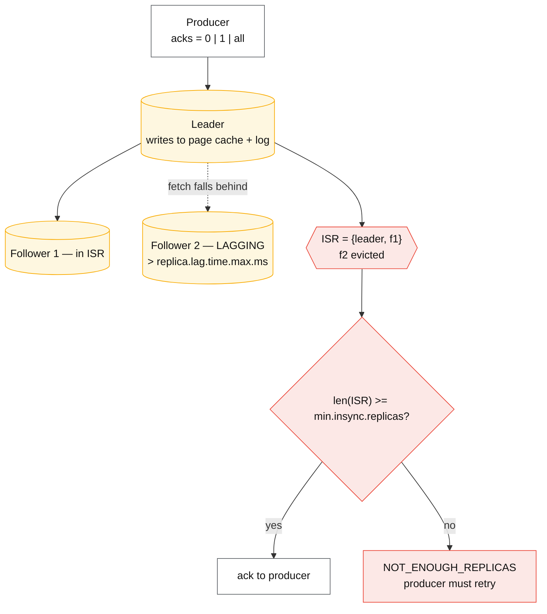
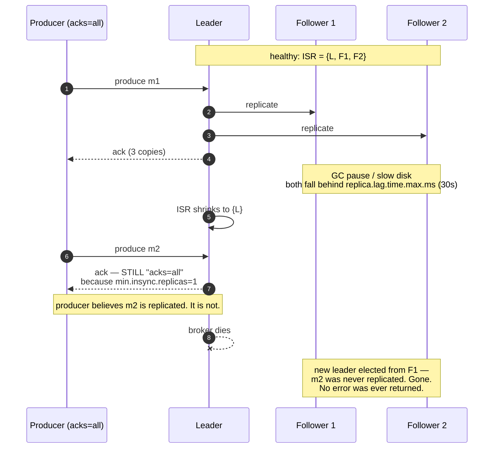

# Kafka internals

## Core concept

Kafka is a partitioned, replicated commit log where **durability is a function of three settings
that must agree**: the producer's `acks`, the topic's `min.insync.replicas`, and the broker's
`unclean.leader.election.enable`. Get any one wrong and the cluster will acknowledge writes it
cannot keep — silently, with no error and no metric moving until a broker dies.

The single most important internal is the **ISR (in-sync replica) set**: it is dynamic, it shrinks
under load, and `acks=all` means "all replicas *currently in the ISR*", not "all replicas". With
the default `min.insync.replicas=1`, an ISR that has shrunk to just the leader still acknowledges
`acks=all` writes — which is exactly the moment those writes have no second copy.

## Mechanics & internals

### The durability triangle

| Setting | Value | Meaning |
|---|---|---|
| `acks=0` | Fire and forget | The producer does not know if anything happened. Metrics only |
| `acks=1` | Leader's log only | Leader dies before replication ⇒ **acknowledged data is gone** |
| `acks=all` | Everyone **in the ISR** | Safe only in combination with `min.insync.replicas` |
| `min.insync.replicas=1` (default) | ISR of one is acceptable | Combined with `acks=all` this is a **false sense of safety** |
| `min.insync.replicas=2` + RF=3 | Two copies required | Rejects writes with `NOT_ENOUGH_REPLICAS` when only one replica remains. **The correct production setting** |
| `unclean.leader.election.enable=true` | An out-of-sync replica may lead | Availability over durability: **committed messages are permanently lost** |

The configuration a staff engineer states without hesitating: **RF=3,
`min.insync.replicas=2`, `acks=all`, `enable.idempotence=true`, unclean leader election off.** That
survives one broker loss with no data loss, rejects writes when it cannot guarantee two copies, and
prevents a stale replica from becoming leader. It also means **losing two brokers stops writes** —
say that trade out loud rather than discovering it during an incident.

`UncleanLeaderElectionsPerSec` is not a performance metric. Any non-zero value is a data-loss
event and should page.

### The ISR shrink, which is where the surprise lives

A follower is in the ISR while it has fetched up to the leader's log end offset within
`replica.lag.time.max.ms` (default **30 s**). Under a load spike, a GC pause, or a slow disk, a
follower falls behind, is evicted, and the ISR shrinks — with **no producer-visible change** if
`min.insync.replicas=1`. Writes continue to be acknowledged as `acks=all` while only one copy
exists. If the leader then fails, those messages are gone and the cluster reports nothing unusual.

Alert on `UnderReplicatedPartitions` and `IsrShrinksPerSec`, not just on broker liveness.

### High watermark, and why consumers cannot read the newest data

Consumers may only read up to the **high watermark** — the highest offset replicated to all ISR
members. Two consequences worth knowing:

- Data is durable *before* it is visible; a slow follower delays consumer visibility, so
  end-to-end latency depends on the slowest ISR member.
- With transactions, readers at `read_committed` are further limited to the **last stable offset**
  (LSO): everything before the earliest still-open transaction. **One hung transaction blocks
  consumption of that partition** for `transaction.timeout.ms` even though the data is committed
  and replicated.

### Rebalancing: eager, cooperative, static

Partition assignment changes whenever group membership changes, and the protocol determines whether
that is a blip or an outage:

| Protocol | Behaviour | Cost |
|---|---|---|
| **Eager** (legacy default) | Every consumer revokes **all** partitions, then reassigns | Stop-the-world per event; a rolling deploy of N consumers = N pauses |
| **Cooperative incremental** (KIP-429) | Only partitions that must move are revoked | Deploys stop being latency events |
| **Static membership** (KIP-345, `group.instance.id`) | A restarting consumer reclaims its partitions within `session.timeout.ms` | No rebalance at all on restart |

The classic self-sustaining failure: processing slows, a consumer exceeds
`max.poll.interval.ms` (5 min default), it is ejected, its partitions move to consumers that are
already slow, they exceed the interval too. Cut `max.poll.records` and raise the interval to break
it; both are one-line changes that people reach for only after the third incident.

### Log compaction turns a topic into a table

`cleanup.policy=compact` retains **the latest value per key** indefinitely, with deletes
represented as null-valued tombstones held for `delete.retention.ms` (24 h default) so consumers
have a window to observe them. This is what makes a topic a replayable materialised table — the
substrate for CDC, config distribution, and Kafka's own `__consumer_offsets`.

The trap mirrors [quorums-and-anti-entropy.md](./quorums-and-anti-entropy.md): a consumer that is
offline longer than `delete.retention.ms` and then bootstraps from the compacted topic **never
sees the tombstone**, so the deleted key silently reappears in its state store.

### KRaft and tiered storage

- **KRaft** (KIP-500) replaced ZooKeeper with a Raft-based controller quorum: metadata is itself a
  Kafka log. This removed an entire external dependency and raised the practical partition ceiling
  by orders of magnitude, because metadata propagation is now incremental rather than a full
  ZooKeeper read.
- **Tiered storage** (KIP-405) offloads closed segments to object storage. Retention stops being
  bounded by broker disk, which changes both the cost model and the plausibility of "replay from
  the beginning" as a recovery plan.

## Numbers that matter

| Quantity | Value | Confidence |
|---|---|---|
| Production baseline | RF=3, `min.insync.replicas=2`, `acks=all`, idempotent producer | The answer to give |
| `replica.lag.time.max.ms` | 30 s default — the ISR eviction threshold | Kafka broker default |
| `max.poll.interval.ms` | 5 min default — exceed it and you are ejected | Kafka consumer default |
| `transaction.timeout.ms` | 60 s default; a hung transaction blocks `read_committed` reads until then | Kafka default |
| `delete.retention.ms` (compacted) | 24 h — the window to observe a tombstone | Kafka default |
| Throughput per broker | 100 MB/s–1 GB/s, sequential-IO bound | Order of magnitude; batching and compression dominate |
| End-to-end latency | 5–50 ms typical; `linger.ms` trades latency for batch efficiency | Order of magnitude |
| Partitions per cluster | Tens of thousands under ZooKeeper; far more under KRaft | Order of magnitude |
| `UncleanLeaderElectionsPerSec` | Any value > 0 = data loss | Definitional |

**The availability arithmetic of `min.insync.replicas=2`.** With RF=3 you survive one broker loss
for writes and two for reads. During a rolling restart one replica is always down, so a *second*
failure during maintenance stops writes on affected partitions. That is the intended behaviour —
it is choosing `NOT_ENOUGH_REPLICAS` errors over silent data loss — but it means maintenance
windows and failure budgets interact, and RF=4 or spreading partitions across more brokers is the
mitigation, not lowering `min.insync.replicas`.

## Failure modes

| Failure | Symptom | Mitigation |
|---|---|---|
| **`acks=all` with `min.insync.replicas=1`** | Acknowledged writes lost when the leader dies during an ISR shrink; no error anywhere | Set `min.insync.replicas=2` and alert on `UnderReplicatedPartitions` |
| **Unclean leader election** | Committed offsets go backwards; consumers see messages disappear | `unclean.leader.election.enable=false`; page on `UncleanLeaderElectionsPerSec` |
| **Rebalance storm** | Consumers repeatedly ejected; throughput collapses and stays collapsed | Cooperative assignor, static membership, smaller `max.poll.records` |
| **Hung transaction** | `read_committed` consumers stall on one partition while the data is committed | Alert on LSO lag; bound `transaction.timeout.ms`; ensure producers fence properly |
| **Compaction tombstone missed** | Deleted keys reappear in a rebuilt state store | Bootstrap consumers within `delete.retention.ms`, or reconcile against the source |
| **Partition skew from key choice** | A few partitions carry most traffic; adding brokers does not help | Key design — see [hot-shard-mitigation.md](./hot-shard-mitigation.md) |
| **Increasing partition count** | Existing keys rehash; per-key ordering breaks; stateful consumers see keys move | Treat partition count as schema; over-provision at creation |
| **Disk full on one broker** | That broker stops; partitions it led fail over; under-replication spreads | Quota producers, alert on log dir size, retention that fits the disk |
| **Zombie producer after a pause** | Duplicate or out-of-order writes | `enable.idempotence=true` (producer epoch fencing) — see [delivery-semantics.md](./delivery-semantics.md) |

**Documented analysis.** Jack Vanlightly's *How to lose messages on a Kafka cluster* series walks
the exact interleavings: with `acks=all` and `min.insync.replicas=1`, an ISR that has shrunk to the
leader still acknowledges writes, so a subsequent leader failure loses acknowledged data with no
error surfaced to the producer; and with unclean leader election enabled, a replica that never
received those messages can be promoted, permanently truncating the log. Neither scenario requires
a bug — both are the documented behaviour of default settings, which is precisely why they keep
happening.
([Vanlightly](https://jack-vanlightly.com/blog/2018/9/18/how-to-lose-messages-on-a-kafka-cluster-part-2),
[Confluent DR guidance](https://www.confluent.io/blog/best-practices-for-validating-apache-kafka-r-disaster-recovery-and-high/))

## Trade-offs vs alternatives

| Choice | Buys | Costs |
|---|---|---|
| `acks=1` over `acks=all` | Lower write latency (no follower wait) | Data loss on leader failure. Almost never worth it for durable data |
| `min.insync.replicas=1` over `2` | Writes continue with one replica | The durability guarantee you thought you had |
| Unclean leader election on | Availability during multi-broker failure | Permanent, silent data loss |
| More partitions | Consumer parallelism, throughput | Metadata, rebalance time, file handles; **cannot be reduced** |
| Compaction over time retention | Infinite key history at bounded size | Tombstone-window subtlety; no full event history |
| Tiered storage | Long retention at object-storage prices | Restore/replay latency from cold storage; newer, less battle-tested |
| KRaft over ZooKeeper | One fewer system, more partitions, faster failover | Newer; operational muscle memory is still ZooKeeper-shaped in many teams |

### Where staff engineers get this wrong

1. **Believing `acks=all` is a durability setting on its own.** It is half of one. Without
   `min.insync.replicas=2` it degrades to `acks=1` exactly when you need it.
2. **Leaving unclean leader election enabled "for availability".** It trades a bounded outage for
   unbounded, silent, permanent data loss.
3. **Treating rebalances as unavoidable.** Cooperative assignment plus static membership makes
   deploys uneventful; most teams discover this after an incident rather than before.
4. **Ignoring the LSO.** With transactions, consumer visibility is bounded by the oldest open
   transaction, so one stuck producer stalls consumers on a partition whose data is fine.
5. **Using Kafka as a database without compaction semantics.** "The log is the source of truth"
   requires infinite or compacted retention and a bootstrap story, not a 7-day default.
6. **Sizing partitions for today.** The count is effectively immutable for keyed topics; choose for
   the traffic you expect in two years.

## Real-world examples

- **LinkedIn** — Kafka's origin and still one of the largest deployments; the tiered-storage and
  KRaft work was driven by clusters where metadata, not data, was the scaling limit.
- **Cloudflare, Uber, Netflix** — publicly documented multi-trillion-message-per-day pipelines;
  the recurring published lesson is that partition count and consumer-group protocol choices
  dominate operational pain, not raw throughput.
- **Confluent's DR guidance** — validating that `min.insync.replicas` and unclean leader election
  are set correctly is presented as a *disaster-recovery drill*, not a config review, because the
  failure is invisible until a broker dies.
- **Redpanda / WarpStream / Bufstream** — Kafka-protocol-compatible engines with different storage
  designs (thread-per-core C++, object-storage-native). They inherit the protocol's semantics —
  and, as Jepsen showed for Redpanda 21.10, must independently get transaction semantics right.

## Staff-level follow-ups

1. Give the four settings that make a Kafka write durable, then walk the exact interleaving where
   three of them are correct and data is still lost.
2. Your consumer group rebalances every 90 seconds during peak. Diagnose it, name the two
   configuration changes you would make first, and explain why the loop is self-sustaining.
3. A `read_committed` consumer has zero lag on nine partitions and unbounded lag on the tenth,
   while the producer reports success. What is happening, and how do you confirm it?
4. Compute the storage and broker count for 200 k msg/s of 1 KB messages, RF=3, 14-day retention,
   then decide whether tiered storage changes your answer.
5. Argue for and against `unclean.leader.election.enable=true` for a clickstream topic versus a
   payments topic, with the failure scenario attached to each.

## See also

- [log-vs-queue.md](./log-vs-queue.md) — whether you needed a log at all
- [delivery-semantics.md](./delivery-semantics.md) — idempotent producers, transactions, exactly-once effects
- [stream-processing-semantics.md](./stream-processing-semantics.md) — consumers with state
- [replication-topologies.md](./replication-topologies.md) — the same sync/async durability trade in databases
- [../02-primitives/messaging-and-streams.md](../02-primitives/messaging-and-streams.md) — the bundled note being split

## Referenced by

- [Backfill and reprocessing](../patterns/backfill-and-reprocessing.md)
- [Delivery semantics](delivery-semantics.md)
- [Fundamentals index](README.md)
- [Log vs queue](log-vs-queue.md)
- [Messaging and streams](../02-primitives/messaging-and-streams.md)
- [Messaging matrix](../comparisons/messaging-matrix.md)
- [Stream processing semantics](stream-processing-semantics.md)
- [Topic manifest](../topics/manifest.md)

## Sources

- [Apache Kafka — replication, ISR and configuration reference](https://kafka.apache.org/documentation/#replication)
- [Jack Vanlightly — How to lose messages on a Kafka cluster (part 2)](https://jack-vanlightly.com/blog/2018/9/18/how-to-lose-messages-on-a-kafka-cluster-part-2)
- [Confluent — best practices for validating Kafka disaster recovery and HA](https://www.confluent.io/blog/best-practices-for-validating-apache-kafka-r-disaster-recovery-and-high/)
- [KIP-429 — incremental cooperative rebalancing](https://cwiki.apache.org/confluence/display/KAFKA/KIP-429%3A+Kafka+Consumer+Incremental+Rebalance+Protocol) · [KIP-345 — static membership](https://cwiki.apache.org/confluence/display/KAFKA/KIP-345%3A+Introduce+static+membership+protocol+to+reduce+consumer+rebalances)
- [KIP-500 — replace ZooKeeper with a self-managed metadata quorum (KRaft)](https://cwiki.apache.org/confluence/display/KAFKA/KIP-500%3A+Replace+ZooKeeper+with+a+Self-Managed+Metadata+Quorum) · [KIP-405 — tiered storage](https://cwiki.apache.org/confluence/display/KAFKA/KIP-405%3A+Kafka+Tiered+Storage)
