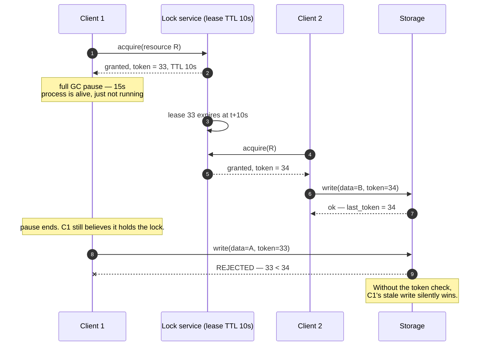
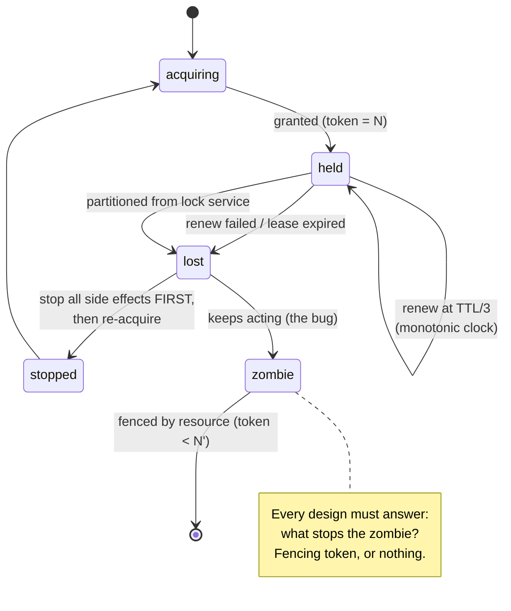

# Leases, locks and fencing

## Core concept

A distributed lock is not mutual exclusion. It is a **lease** — a claim that expires — plus,
optionally, a **fence** — a check performed by the resource being protected. Without the fence you
have a hint, not a guarantee, because no lock service can stop a holder from pausing (GC, VM
migration, disk stall, an unlucky scheduler) past its expiry and then acting as though it still
holds the lock. The lock service is not lying and the client is not buggy; the guarantee simply
does not exist unless the *resource* rejects stale writers.

So the design rule is short: **the token must be checked where the side effect happens.** If the
resource cannot perform that check — sending an email, calling a payment API, writing to a store
with no conditional write — then no lock design makes the operation safe, and the correct answer is
idempotency plus reconciliation, not a better lock.

## Mechanics & internals

### The zombie holder, in full



Everything above the rejection happens in every system that uses TTL locks. The only line that
makes it safe is the resource comparing `33 < 34`.

### What a fencing token requires

| Property | Why |
|---|---|
| **Monotonically increasing** | The resource's rule is `token > last_seen`. A random UUID (Redlock's value) cannot be compared |
| **Issued by the same authority that grants the lock** | Two issuers means two sequences and no ordering between them |
| **Carried on every mutation**, not just the first | The pause can happen at any point in the critical section |
| **Checked and persisted by the resource** | A check in the client is a check by the process that already lost the lock |

You rarely have to invent the counter. Consensus stores hand you one for free: **etcd's revision**
(`mod_revision` / the key's create revision), **ZooKeeper's `zxid` or the sequence number of a
sequential znode**, a Postgres row version, a DynamoDB conditional-write attribute. Chubby shipped
this in 2006 under the name **sequencer** — a lock holder gets an opaque sequencer, passes it to the
storage server, and the server validates it. Chubby also offered `lock-delay`: after an abnormal
lease loss the lock stays unavailable for a configurable period, so a resource that *cannot*
validate sequencers at least gets a window in which the previous holder has surely noticed.

### Leases depend on clock *rate*, not clock time

A common misreading is that leases require synchronised clocks. They do not — they require bounded
**drift rate** between the granter's and the holder's clocks, plus a safety margin. The holder must
self-expire strictly before the granter would grant to anyone else:

```
holder_expiry = grant_time + TTL·(1 − ε)   measured on the holder's monotonic clock
granter_grants_again_at = grant_time + TTL + margin
```

Which is why every correct implementation uses a **monotonic clock** for lease timing. Using
wall-clock time means an NTP step (or a leap-second smear, or a VM resuming from snapshot) can
expire a live lease or extend a dead one. This is a real class of bug, not a theoretical one.



### Efficiency locks vs correctness locks

The distinction that resolves most arguments:

| | Efficiency lock | Correctness lock |
|---|---|---|
| Purpose | Avoid doing duplicate work | Prevent a violated invariant |
| Cost of double execution | Wasted CPU, a duplicate email at worst | Corruption, double spend, lost data |
| Acceptable implementation | A TTL key in Redis, `SET NX PX` | Consensus store + fencing token, or no lock at all — restructure |
| What "usually correct" means | Fine | Not correct |

Kleppmann's charge against Redlock is precisely that it sits between the two: heavier than needed
for efficiency (five Redis nodes, clock assumptions) and insufficient for correctness (no
monotonic token; safety depends on bounded network delay, bounded pauses, and bounded clock error —
all violated in real systems). Antirez's response is that for the efficiency case — deduplicating a
cron run, suppressing a cache stampede — Redlock is fine and the alternative is often no lock at
all. Both are right about different columns of that table, and the staff-level answer names the
column before naming the technology.

## Numbers that matter

| Quantity | Value | Confidence |
|---|---|---|
| JVM stop-the-world full GC on a large heap | 100 ms – several seconds; multi-second is routine on 32 GB+ heaps without a low-pause collector | Order of magnitude |
| VM live migration / hypervisor stall | 100 ms – seconds | Order of magnitude; cloud instances do this without telling you |
| Container CPU throttling stall (CFS quota exhausted) | 10–100 ms per period, repeatedly | Common in Kubernetes with aggressive limits |
| NTP correction | ms normally; **seconds or a step change** when it has been broken and then fixed | Which is why leases use monotonic clocks |
| Typical lease TTL | 5–30 s | Shorter TTL = faster failover, more spurious loss under pauses |
| Renew interval | TTL / 3 | Survives one lost renewal without losing the lease |
| etcd default lease TTL for k8s leader election | `leaseDurationSeconds` 15 s, renew 10 s, retry 2 s | [Kubernetes leader election defaults](https://kubernetes.io/docs/concepts/architecture/leases/) |
| Failover time after a holder dies | ≈ TTL + detection + acquire ≈ TTL + a few hundred ms | The TTL *is* your unavailability window |

**The TTL trade, stated as arithmetic.** TTL is simultaneously (a) the worst-case unavailability
after a crash and (b) the pause length you can survive without a false expiry. A 5 s TTL means 5 s
of downtime on crash and false loss on any 5 s pause; a 60 s TTL means the opposite. Both ends are
bad, and the resolution is not tuning — it is **fencing**, which makes a false expiry harmless and
lets you choose a short TTL for fast failover. Systems that tune TTL instead of adding fencing are
trading availability against a correctness bug they never fixed.

## Failure modes

| Failure | Symptom | Mitigation |
|---|---|---|
| **Zombie holder** | Two workers act simultaneously; the older one's write lands last and wins | Fencing token checked at the resource |
| **Wall-clock lease timing** | Lease expires early or late after an NTP step; unexplained flapping | Monotonic clock for all lease arithmetic |
| **Lock service outage** | Every worker blocks and the whole pipeline stalls — the lock became a hard dependency | Decide in advance: block (safe) or proceed with idempotent writes (available). Write it down per job |
| **Lock held across a remote call** | The peer's p99 becomes your lock-hold time; queue builds; TTL expires mid-call | Never hold a lock across an external call; use a state machine with an `unknown` state |
| **Non-fenceable side effect** | Duplicate emails, double charges — no token can help | Idempotency key at the provider; reconciliation against the provider's record |
| **Thundering herd on release** | N waiters wake, one wins, N−1 retry immediately, repeat | Queue-style waiting (ZooKeeper sequential znodes, etcd `WithPrevKV` watch on the predecessor), jittered retries |
| **Lock granularity too coarse** | One global lock serialises unrelated work; throughput ceiling unrelated to hardware | Lock per entity key; better, partition so no lock is needed |
| **Renewal starvation** | The renewal thread is on the same starved event loop as the work, so pauses that stall work also stall renewal — the lease dies exactly when the process is busiest | Dedicated thread for renewal; treat missed renewal as immediate stop |

## Trade-offs vs alternatives

| Approach | Guarantee | Cost | Use when |
|---|---|---|---|
| **`SET NX PX` in Redis** | Best-effort, no ordering | Trivial, one node, ms | Efficiency locks only. Say it out loud |
| **Redlock (N Redis nodes)** | Still no monotonic token; adds clock and delay assumptions | Higher, more moving parts | Rarely the right answer — either drop to single-node Redis or go up to consensus |
| **Consensus lease (etcd, ZooKeeper, Chubby)** | Real mutual exclusion **when combined with fencing** | Consensus round trip per acquire and renew | Correctness locks; leader election |
| **Fencing token + conditional write** | Safe against arbitrary pauses | Requires resource support (`If-Match`, conditional update, version column) | Any correctness-critical write path |
| **Optimistic CAS on a version column** | No lock service at all; conflicts detected at write | Retries under contention | Single-store invariants — usually the simplest correct answer |
| **Partitioned single writer** (per-entity queue/actor) | Mutual exclusion by construction, no lock service | Requires a partitionable key and sticky routing | High throughput on independent entities — the answer that scales |
| **Idempotency + reconciliation** | Duplicate execution becomes harmless | Design work; needs a durable key and a comparison source | Non-fenceable side effects: payments, email, third-party APIs |

### Where staff engineers get this wrong

1. **Treating the lock as the guarantee.** The lock is a hint; the resource's conditional write is
   the guarantee. If you cannot name where the token is checked, there is no mutual exclusion.
2. **Tuning TTL to fix correctness.** No TTL is short enough to bound a pause and long enough to
   avoid false expiry. Add fencing and stop tuning.
3. **Using a cache as a lock service for correctness.** Redis is a cache with an eviction policy, a
   failover that can lose the key, and — with asynchronous replication — a promoted replica that
   never saw the lock. Two holders, no error anywhere.
4. **Holding the lock across a payment call.** The correct shape is: record intent with an
   idempotency key, call the provider, record outcome, reconcile the unknowns. See
   [../02-primitives/transactions-and-idempotency.md](../02-primitives/transactions-and-idempotency.md).
5. **Not deciding what happens when the lock service is down.** Every locked path needs a stated
   policy — stall or proceed — and the stall case needs a timeout and an alert, or it becomes an
   outage with no error message.
6. **Renewing on the busy thread.** The lease dies precisely when the process is under load, which
   is exactly when two workers running at once does the most damage.

## Real-world examples

- **Chubby (Google, OSDI 2006)** — advisory locks with **sequencers** (fencing tokens) validated by
  the storage server, plus `lock-delay` for servers that cannot validate. The paper is explicit
  that clients get this wrong and that lock-delay exists because of it.
- **GFS** — the master grants a 60 s **lease** to a primary chunkserver, extendable by piggyback;
  chunk **version numbers** fence stale replicas. Lease + version is the same pattern, from 2003.
- **HDFS** — write leases with soft (60 s) and hard (60 min) limits, plus a **generation stamp** on
  each block so a recovered writer's stale block is rejected. Textbook fencing.
- **Kubernetes leader election** — `coordination.k8s.io/Lease` objects, renewed against etcd; the
  `resourceVersion`/lease renewal is the ordering authority. Note that most controllers do *not*
  fence their outbound side effects, which is why controller idempotency matters so much.
- **etcd concurrency API** — sessions with keepalive; the key's revision provides the monotonic
  token, and the client library queues waiters on the preceding revision to avoid a herd.

## Staff-level follow-ups

1. A worker holds a Redis `SET NX PX` lock and writes to S3. Walk the exact interleaving in which
   two workers write, and then rebuild the design so it is safe — including which S3 feature does
   the fencing and what it costs.
2. Your lock service (etcd) has an availability SLO of 99.9%, and 40 jobs depend on it. Design the
   policy for what each job does during those 8.7 hours per year, and justify why the answer is not
   the same for all 40.
3. Why does a lease depend on bounded clock drift *rate* rather than synchronised clocks? Construct
   the failure that occurs if the implementation uses `System.currentTimeMillis()` instead of a
   monotonic source.
4. You need mutual exclusion over an operation that calls a third-party API with no idempotency
   support and no conditional write. State plainly what is achievable, what is not, and how you
   would bound the damage.
5. Compare a 5 s and a 60 s lease TTL for a job that takes 3 minutes, under an environment with
   occasional 10 s GC pauses. Then explain why the right fix removes the need to choose.

## See also

- [consensus-raft-paxos.md](./consensus-raft-paxos.md) — what grants the lease, and its own pause problem
- [consistency-models.md](./consistency-models.md) — lease reads and the clock assumption they hide
- [../02-primitives/transactions-and-idempotency.md](../02-primitives/transactions-and-idempotency.md) — the alternative when fencing is impossible
- [../02-primitives/reliability-patterns.md](../02-primitives/reliability-patterns.md) — timeouts around the critical section
- [../03-backend-cases/payments-ledger.md](../03-backend-cases/payments-ledger.md) — non-fenceable side effects in practice

## Referenced by

- [Consensus — Raft and Paxos](consensus-raft-paxos.md)
- [Consistency and consensus](../02-primitives/consistency-and-consensus.md)
- [Consistency models](consistency-models.md)
- [Fundamentals index](README.md)
- [Quorums and anti-entropy](quorums-and-anti-entropy.md)
- [Replication topologies](replication-topologies.md)
- [Topic manifest](../topics/manifest.md)
- [Transaction isolation levels](transaction-isolation-levels.md)

## Sources

- [Kleppmann — How to do distributed locking](https://martin.kleppmann.com/2016/02/08/how-to-do-distributed-locking.html) — the zombie-holder argument and fencing tokens
- [antirez — Is Redlock safe?](http://antirez.com/news/101) — the rebuttal; read both, they disagree about the use case, not the mechanism
- [Burrows — The Chubby lock service for loosely-coupled distributed systems, OSDI 2006](https://research.google/pubs/pub27897/) — sequencers and lock-delay
- [Ghemawat et al. — The Google File System, SOSP 2003](https://research.google/pubs/pub51/) — chunk leases and version numbers
- [Kubernetes — Leases](https://kubernetes.io/docs/concepts/architecture/leases/)
- [etcd — concurrency / sessions](https://etcd.io/docs/latest/dev-guide/api_concurrency_reference_v3/)
