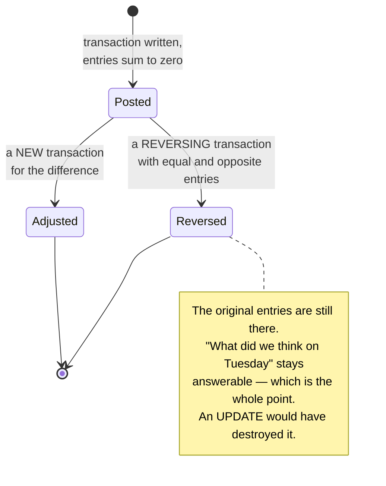

# Ledgers and double-entry

## Core concept

A ledger is an **append-only log of signed amounts against accounts, where every transaction's
entries sum to zero**. That constraint is the entire idea, and it is what makes a ledger different
from a `balances` table with an `UPDATE` statement.

Why it matters: a mutable balance column can be wrong and there is no way to find out. An
append-only ledger can also be wrong, but the error is a *row you can find*, the balance is a
function of the rows, and the invariant `SUM(amount) = 0 per transaction` is checkable
continuously, in production, against real data. You move from "we believe the balance is right"
to "we verify the balance is right, every minute, and alert when it is not".

The generalisation worth carrying past finance: **derive state from an immutable log rather than
mutating state in place** wherever being wrong is unacceptable and being slow is survivable.

## Mechanics & internals

### The shape

```sql
-- append-only. never UPDATE, never DELETE. this is enforced, not a convention.
entries(
  id            bigserial primary key,
  transaction_id uuid not null,
  account_id    uuid not null,
  amount_minor  bigint not null,      -- SIGNED. + credit, - debit
  currency      char(3) not null,
  entry_type    text not null,
  created_at    timestamptz not null default now()
)
accounts(id, type, owner_id, currency)   -- user, platform, fee, escrow, suspense
transactions(id, kind, external_ref, idempotency_key unique, created_at)
```

A £49.99 purchase with a £1.50 platform fee is **one transaction, three entries**:

| account | amount_minor |
|---|---|
| `customer_receivable` | −4999 |
| `seller_payable` | +4849 |
| `platform_fee_revenue` | +150 |
| **sum** | **0** |

### Why every amount is an integer in minor units

Never floating point. `0.1 + 0.2 != 0.3` in binary floating point, and in a ledger that
discrepancy accumulates into a reconciliation failure nobody can explain. Store `4999`, not
`49.99`. Currencies with other exponents (0 for JPY, 3 for KWD) mean the scale belongs to the
currency, not to the column — and **a transaction never mixes currencies**. An FX conversion is
*two* transactions joined by an explicit FX account, so the rate used is a row you can point at.

### Balances are derived, and materialised for speed

```
balance(account) = SUM(amount_minor) WHERE account_id = account
```

That is the definition, and it must stay the definition. For speed, materialise:

- **Snapshots**: `balance_snapshots(account_id, as_of_entry_id, balance_minor)`, written
  periodically. Current balance = snapshot + sum of entries after it.
- **Running balance column** on each entry, written in the same transaction. Fast reads, but it
  is a cache and must be provable against the sum.

**The materialised value is never the source of truth.** The test that keeps you honest: delete
every snapshot, recompute from entries, and get the same numbers. If you cannot do that, you have
a balances table with extra steps.

### Corrections are entries, not edits



An `UPDATE` on an entry destroys the audit trail and breaks any snapshot computed before it.
A `DELETE` does the same and additionally makes the ledger disagree with anything downstream that
already read it. Both should be impossible at the database level — a trigger, a grant, or an
append-only table type — not merely discouraged in a code review.

### The invariants you check continuously

These are cheap, and each has caught a real class of bug:

| Invariant | Catches |
|---|---|
| Every `transaction_id`'s entries sum to zero | A partially-written transaction, or a bug that posts one leg |
| Every entry's currency matches its account's currency | Cross-currency corruption |
| `SUM(all entries) = 0` across the whole ledger | Money created or destroyed system-wide |
| No user account is negative (where that is the rule) | Overdraft logic failure |
| Materialised balance equals recomputed sum | A drifting cache |
| Internal total matches the external provider's settlement file | Anything that happened outside your system |

**"I would run a job that asserts every transaction's entries sum to zero and alerts on any that
don't" is one of the highest-signal sentences available in this interview.** It demonstrates that
you understand the invariant is *the* feature.

### Writing atomically

All entries of a transaction commit together or not at all. Options, in the order you should
prefer them:

1. **One partition / one database transaction.** By far the simplest. Model so that a transaction's
   entries live together — usually by making the transaction id the partition key.
2. **A transactional API over multiple items** where the store offers one, with the limits it
   imposes (see below).
3. **A saga with compensating entries** only when a single commit is genuinely impossible — and
   note that compensation in a ledger is *itself* a reversing transaction, which is the correct
   shape anyway.

**Idempotency is mandatory at the boundary.** A `unique` idempotency key on `transactions` makes a
retried request a no-op rather than a duplicate posting. Without it, one network timeout doubles
someone's money. See [idempotency.md](idempotency.md).

## Numbers that matter

```
Storage: entries are small and immutable and kept for years.
  10M transactions/day × ~3 entries × ~150 B ≈ 4.5 GB/day ≈ 1.6 TB/year.
  Cheap, and it never gets updated — so compression and cold tiering work well.

Write amplification: one logical "payment" is 3-5 rows, plus an outbox row.
  Size the write path for entries per second, not payments per second.

Balance read: without snapshots, SUM over an account's lifetime. An account with
  1M entries is a 1M-row aggregate on every read. Snapshot every ~1,000 entries
  and the read becomes snapshot + a few rows.

Reconciliation window: providers settle on a T+1 or T+2 file. Your ledger is
  ahead of theirs by design, so a "mismatch" inside the window is expected and
  outside it is an incident. Encode the window; do not alert on the whole diff.

Invariant check cost: SUM over one day's entries grouped by transaction_id —
  seconds on any real database. There is no excuse for not running it every minute.
```

## Failure modes

| Failure | Looks like | Why |
|---|---|---|
| **Floating-point amounts** | Pennies that appear and vanish; reconciliation never balances | Binary floating point cannot represent decimal fractions exactly |
| **Mutable balance column as truth** | Balance disagrees with history and nobody can say which is right | No derivation, so no way to verify |
| **Partial transaction** | Ledger sums to a non-zero number | Entries written without a single atomic commit |
| **Duplicate posting** | A customer charged twice after a timeout | No idempotency key, or a key scoped too narrowly |
| **Correcting with UPDATE** | Old snapshots become wrong; the audit trail is gone | The append-only rule was a convention, not a constraint |
| **Currency mixing in one transaction** | Sums to zero numerically and is nonsense | No per-currency invariant |
| **Snapshot drift** | Fast reads are subtly wrong; slow reads are right | Snapshot written outside the transaction that wrote the entries |
| **Suspense account grows forever** | The "unknown" bucket quietly becomes material | Unmatched items parked and never worked |
| **Timezone in period boundaries** | Month-end totals differ between two reports | "Day" not defined in one timezone, consistently |

**The one to volunteer:** the ambiguous external outcome. A provider call times out and you do not
know whether money moved. You must not guess. Write the intent, mark the transaction pending,
reconcile against the provider by idempotency key, and only then post the entries. This is the
hard part of [../03-backend-cases/payments-ledger.md](../03-backend-cases/payments-ledger.md) and
it is not a ledger problem — it is a *boundary* problem that the ledger must not be asked to
absorb.

## Trade-offs vs alternatives

| Approach | Take when | Costs |
|---|---|---|
| **Double-entry ledger** | Money, credits, points, inventory value — anything auditable | Write amplification; more machinery than a counter |
| **Single-entry (a log of deltas)** | Non-financial counters where no second account exists | No sum-to-zero invariant, so errors are invisible |
| **Mutable balance column** | Nothing that matters | Unverifiable. The appeal is speed, which snapshots give you anyway |
| **Event sourcing generally** | You want the same property for non-financial state | Projections, replay, schema evolution over years — see [../patterns/event-sourcing.md](../patterns/event-sourcing.md) |
| **A ledger database product** | Regulatory tamper-evidence is required | Vendor coupling; verify the verification story before buying it |

**A ledger is not a blockchain.** Tamper-*evidence* (you can prove nothing changed) is separable
from decentralisation (no one party is trusted). Almost every business needs the first and almost
none needs the second; conflating them is how a payments feature acquires a consensus protocol.

## Real-world examples

- **Reversal rather than deletion** is standard accounting practice long predating databases, and
  the reason is the same one that applies to distributed systems: other parties have already read
  the number.
- **Suspense accounts** exist in every real ledger because reality produces money you cannot yet
  classify. The engineering discipline is the *ageing report* on that account, not its absence.
- **Continuous invariant checking** is what lets a payments team sleep. The invariant is trivial,
  the query is cheap, and it is the difference between finding a bug in minutes and finding it in
  a quarterly audit.

## On AWS and Azure

| | AWS | Azure |
|---|---|---|
| **The service** | Aurora PostgreSQL / RDS for a relational ledger (constraints, triggers, `SUM` checks); DynamoDB with `TransactWriteItems` where the ledger is key-value; S3 Object Lock for immutable digest/export storage | Azure SQL Database with **ledger tables** (updatable or append-only) for built-in tamper evidence; Cosmos DB for NoSQL with transactional batch; Azure Blob Storage immutability policies or Azure Confidential Ledger for digests |
| **What you configure** | The transaction boundary and partition key; `ClientRequestToken` on every transactional write; condition expressions that enforce the invariant at write time | Ledger table type per table, or a **ledger database** in which every table is a ledger table; digest generation and its storage location; partition key for Cosmos batches |
| **The default that bites** | **DynamoDB transactions are not supported across Regions in global tables** — a global-table ledger can be observed mid-transaction in another Region, so the sum-to-zero invariant is *not* true in replicas while a transaction propagates. A verification job run in a read Region will produce false alarms, or worse, false confidence. Also: a cancelled transaction still consumes the capacity it attempted | **A ledger database cannot be converted back to a regular database**, and in one every table is created as an updatable ledger table by default. That is the right default for a ledger and a surprise for anything else in the same database. Append-only ledger tables "block updates and deletions at the API level" — which is exactly what you want for entries, and will break any ORM that expects to update a row |
| **What it costs you** | `TransactWriteItems` spans **at most 100 actions and 4 MB**, performs **two underlying writes per item** (prepare and commit), and its `ClientRequestToken` idempotency window is **10 minutes** — so a large batch posting must be chunked, costs double, and needs your own idempotency key that outlives theirs | A Cosmos transactional batch requires **all operations to share one partition key** and is capped at **100 operations / 2 MB**, so `transaction_id` must be the partition key for a multi-entry posting to be atomic at all. SQL ledger's guarantee is *detection*, not prevention: it "can't prevent such attacks but guarantees that any tampering will be detected when the ledger data is verified" |

The useful contrast: AWS gives you atomicity primitives and leaves the tamper-evidence to you;
Azure SQL ships cryptographic tamper-evidence (Merkle-tree hashed blocks, digests stored in
immutable storage) and leaves the double-entry modelling to you. **Neither gives you the
invariant** — sum-to-zero is yours to write and yours to check.

## In an LLM deployment

Token accounting is a ledger, and teams keep rediscovering it the expensive way:

- **Per-tenant token spend is double-entry.** A completion debits a tenant's budget account and
  credits a provider-cost account. Sum-to-zero then catches the whole class of bug where usage is
  recorded but never billed, or billed twice on a retry — exactly the errors that surface as an
  unexplained margin gap at month end.
- **Streaming makes the amount unknown until the end.** You cannot post the entry when the
  request starts, because the token count does not exist yet. The shape is a *reservation* —
  hold an estimate, post the actual on completion, release the difference — which is the
  [saga](../patterns/saga-pattern.md) shape, and it needs the same idempotency key so a
  disconnected stream does not double-post.
- **A cancelled or failed generation still cost accelerator time.** Whether you charge for it is a
  product decision; whether you *record* it is not. An internal cost account keeps the ledger
  honest even when the customer account is not debited.
- **Never let a model compute a balance.** It has no constraint and no arithmetic guarantee. The
  ledger produces the number; the model may explain it.

## Staff-level follow-ups

1. Your ledger's total does not sum to zero. Walk me from that alert to a root cause, and say what
   you would *not* do first.
2. A customer says they were charged twice. What do you query, in what order, and what would the
   presence or absence of an idempotency key tell you?
3. Design the balance read path for an account with 10 million entries, and prove it stays correct
   when the snapshot job is down for a day.
4. FX: a user pays in EUR, the seller is paid in USD. Model it, and say where the rate lives and
   who can prove which rate was used.
5. Someone proposes an `UPDATE` to fix a mis-posted entry "just this once". Make the argument
   against it in terms of what breaks, not in terms of principle.

## See also

- [idempotency.md](idempotency.md) — the boundary property that stops duplicate postings
- [transaction-isolation-levels.md](transaction-isolation-levels.md) — what "atomically" actually
  guarantees for the multi-entry write
- [../patterns/event-sourcing.md](../patterns/event-sourcing.md) — the same idea generalised past
  money
- [../patterns/outbox-pattern.md](../patterns/outbox-pattern.md) — publishing a posting without a
  dual write
- [../03-backend-cases/payments-ledger.md](../03-backend-cases/payments-ledger.md) and
  [../03-backend-cases/digital-wallet.md](../03-backend-cases/digital-wallet.md) — the two cases
  that apply this

## Referenced by

- [Design a digital wallet](../03-backend-cases/digital-wallet.md)
- [Event sourcing](../patterns/event-sourcing.md)
- [Fundamentals index](README.md)
- [Topic manifest](../topics/manifest.md)

## Sources

- [AWS — DynamoDB transactions: how it works](https://docs.aws.amazon.com/amazondynamodb/latest/developerguide/transaction-apis.html) — `TransactWriteItems` limited to 100 actions and 4 MB aggregate, two underlying writes per item, capacity consumed even when cancelled, `ClientRequestToken` valid for 10 minutes, and transactions not supported across Regions in global tables
- [Azure — ledger overview (Azure SQL Database and SQL Server)](https://learn.microsoft.com/en-us/azure/azure-sql/database/ledger-overview) — updatable versus append-only ledger tables, append-only tables "block updates and deletions at the API level", SHA-256 Merkle-tree hashing into blocks and database digests stored in immutable storage or Azure Confidential Ledger, a ledger database cannot be converted back to a regular database, and ledger "can't prevent such attacks but guarantees that any tampering will be detected when the ledger data is verified"
- [Azure — Cosmos DB service quotas and default limits](https://learn.microsoft.com/en-us/azure/cosmos-db/concepts-limits) — 100 operations and 2 MB per transactional batch, all operations sharing one partition key
