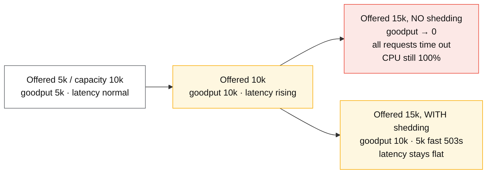
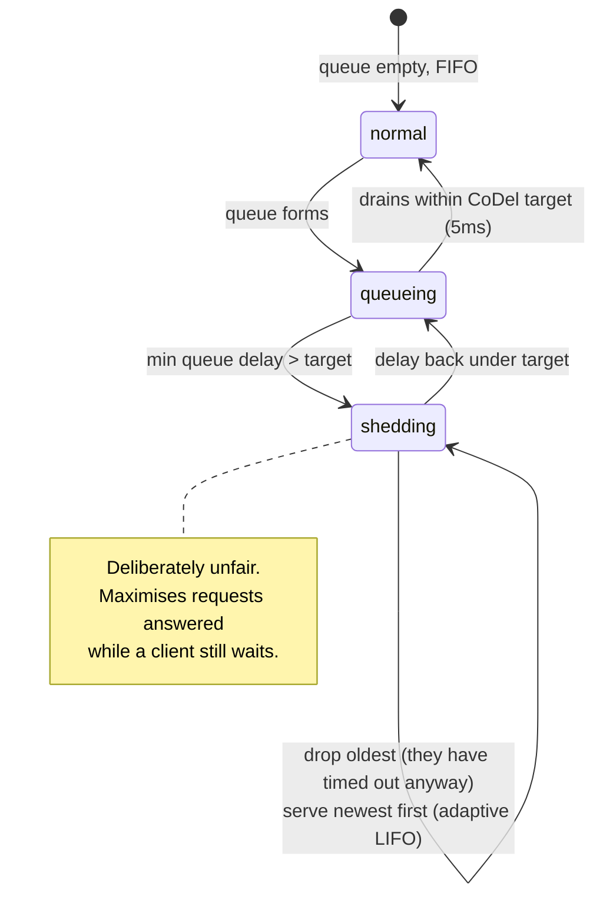

# Load shedding and admission control

## Core concept

An overloaded system must serve fewer requests. The only question is **whether you choose which
ones** — by shedding deliberately — or let the system choose by timing out uniformly, which
degrades every request instead of some, and does so *after* paying the full cost of each.

The arithmetic is the argument. A service that can serve 10 000 rps receiving 15 000 rps has two
options: serve 10 000 and reject 5 000 in microseconds, or accept all 15 000, queue them, and
deliver 15 000 timeouts having spent CPU on every one. The second is strictly worse — **goodput
collapses to zero while resource consumption stays at 100%** — and it is what happens by default.

Two rules follow: **shed as early and as cheaply as possible**, and **shed by priority, not
randomly**, because your health check, your auth refresh and your checkout are not interchangeable.

## Mechanics & internals

### Goodput, and the collapse

The collapse in the third box is not gradual. Past the utilisation knee, queues grow, every
request's latency exceeds the client's timeout, and the server spends 100% of its resources
producing responses nobody is waiting for. **Work completed after the client gave up is
indistinguishable from work not done at all**, except that it consumed capacity.

### Where to shed: earlier is exponentially cheaper

| Layer | Cost per rejected request | Notes |
|---|---|---|
| **Client-side throttling** | ~0 | Nothing leaves the machine. Google's adaptive throttling; see [timeouts-retries-backoff.md](./timeouts-retries-backoff.md) |
| **Edge / CDN / WAF** | Microseconds | Absorbs volumetric abuse before it reaches your network |
| **Load balancer / proxy** | Microseconds | Concurrency caps, queue limits, per-tenant quotas |
| **Service entry middleware** | ~100 µs | Cheapest place with request context (identity, priority) |
| **After auth and parsing** | 1–10 ms | Already paid most of the cost of the request |
| **In the database** | 10 ms+ | The most expensive possible place, and it is where unshed load ends up |

The rule: **reject before you allocate**. A rejection that has already done a database lookup to
determine the tenant's quota is not shedding, it is extra work with an error attached.

### Criticality: shed by class, not by chance

Random shedding at 30% means 30% of health checks, 30% of login refreshes, and 30% of checkouts
fail. Priority classes make degradation a product decision:

| Class | Examples | Shed order |
|---|---|---|
| `CRITICAL_PLUS` | Health checks, control plane, auth refresh | Last — shedding these deepens the outage |
| `CRITICAL` | Checkout, payment, core reads | Fourth |
| `SHEDDABLE_PLUS` | Recommendations, personalisation, related items | Second |
| `SHEDDABLE` | Prefetch, analytics beacons, background sync, batch | **First** |

Google's SRE practice propagates criticality with the request, so a downstream service sheds
consistently with the upstream's intent rather than guessing from its own load. Two supporting
rules: **retries inherit the criticality of the original** (so low-priority retries are dropped
first), and **a shed request must not be retried at the same priority**, or shedding just moves the
load in time.

### CoDel and adaptive LIFO: shedding by queue age

Facebook's *Fail at Scale* contributes the two mechanisms most worth copying, both borrowed from
network bufferbloat research:

- **CoDel** — instead of a fixed queue-length limit, measure how long the *oldest* item has been
  queued. If the minimum queueing delay over a window exceeds a target (e.g. 5 ms), start dropping
  the requests at the front. Queue length is the wrong signal because it depends on service time;
  **queue age directly measures whether you are meeting deadlines**.
- **Adaptive LIFO** — under normal conditions serve FIFO; **once a queue forms, switch to LIFO**.
  The newest request has the best chance of still having a waiting client, while the oldest has
  probably already timed out. It is deliberately unfair, and it maximises the number of requests
  answered usefully.

The two compose: CoDel bounds how long anything waits, adaptive LIFO makes sure the ones you do
serve are the ones still worth serving.

### Concurrency limits over rate limits

A rate limit (rps) is a guess that becomes wrong the moment service time changes: a limit tuned for
50 ms responses admits far too much when the dependency slows to 500 ms. A **concurrency limit**
(in-flight requests) is self-correcting, because `L = λW` means a slower `W` fills the limit at a
lower `λ` automatically.

Adaptive limiters (Netflix `concurrency-limits`, Vegas-style gradient algorithms) estimate the
minimum observed latency as the no-load baseline and shrink the limit as current latency rises
above it — congestion control applied to services. This is the single highest-leverage overload
control for a service that calls other services.

Rate limits remain the right tool for **fairness and quotas** — per-tenant, per-API-key — which is
a different problem from overload. Use both, for their own purposes.

### What a 429 promises

Shedding is a contract with the client:

- **429 / 503 with `Retry-After`** — "come back then". Clients that ignore it convert your
  graceful shedding into a retry storm, so the header is not decoration.
- **Fail fast, not slow.** A rejection at 200 ms is nearly as harmful as a timeout; reject in
  microseconds.
- **Shed responses must be cheap to produce and cheap to log.** A shedding path that writes a
  structured error log per rejection has a second outage waiting in it.

## Numbers that matter

| Quantity | Value | Confidence |
|---|---|---|
| Goodput without shedding past capacity | Trends to **zero** while utilisation stays at 100% | The core argument |
| CoDel target queueing delay | ~5 ms (Facebook's setting), interval ~100 ms | [Fail at Scale](https://queue.acm.org/detail.cfm?id=2839461) |
| Cost of rejection at the edge vs at the database | ~microseconds vs ~10 ms+ — **3–4 orders of magnitude** | Order of magnitude |
| Utilisation to shed at | Start shedding *before* the knee, ~80% of the binding resource | See [queueing-theory-basics.md](./queueing-theory-basics.md) |
| Google adaptive throttling | Client rejects at `max(0, (requests − 2×accepts)/(requests+1))` | [SRE Book](https://sre.google/sre-book/handling-overload/) |
| Autoscaling reaction time | Minutes (instance start, warm-up, registration) | Far slower than the seconds in which overload arrives |
| Priority classes in practice | 3–4 is enough; more than that nobody assigns correctly | Convention |
| Queue bound | Set from `capacity × acceptable_wait`, e.g. 10 k rps × 100 ms = **1 000** slots | Arithmetic — never "unbounded" |

**The queue-sizing calculation.** A service handling 10 000 rps with a 100 ms latency target should
hold at most `10 000 × 0.1 = 1 000` requests in flight or queued. Anything beyond that is
guaranteed to breach the target before it is served, so admitting it is a decision to do work that
will be wasted. Little's law gives you the bound; CoDel enforces it dynamically when service time
changes.

## Failure modes

| Failure | Symptom | Mitigation |
|---|---|---|
| **No shedding at all** | Goodput collapses to zero at 100% utilisation; every request times out | Any admission control is better than none; start with a concurrency limit |
| **Shedding too late** | Rejection happens after auth, parsing and a database lookup — the expensive part is already paid | Reject at the edge or in entry middleware |
| **Shedding randomly** | Health checks and auth fail at the same rate as prefetch, deepening the outage | Criticality classes, propagated |
| **Expensive rejections** | The error path allocates, logs and serialises; shedding itself becomes the bottleneck | Pre-built static responses; sampled logging on the shed path |
| **Clients ignore `Retry-After`** | Shed load returns immediately; shedding achieves nothing | Retry budgets and client-side throttling; treat non-compliant clients as an abuse problem |
| **Unbounded queue in front of the limiter** | The proxy buffers what the service refused to admit; latency grows anyway | Bound every queue in the path, including the proxy's |
| **Autoscaling as the overload plan** | Instances arrive minutes after the collapse | Shed first, scale second; they solve different time scales |
| **Shedding without a metric** | Nobody knows how much was shed or which class | Emit shed counts by class; a shed spike is an incident signal, not noise |
| **Retries at the same priority** | Shed work returns immediately as retries | Retries inherit criticality and consume a budget |

**Documented practice.** Facebook's *Fail at Scale* reports that many of their worst latency
incidents were queueing problems — huge numbers of requests waiting for processing — and that the
fix came from bufferbloat research rather than from adding capacity. **CoDel** keeps queues short
by dropping work whose queueing delay exceeds a target; **adaptive LIFO** flips the queue order
once a backlog forms so the freshest request is served first. Their reasoning is worth quoting in
design reviews: *the first-in request has often been waiting so long that the user has already
abandoned it, so processing it first spends resources on the request least likely to benefit
anyone.*
([Fail at Scale](https://queue.acm.org/detail.cfm?id=2839461),
[Controlling Queue Delay](https://queue.acm.org/detail.cfm?id=2209336))

## Trade-offs vs alternatives

| Control | Bounds | Adapts to slowdowns? | Complexity | Use when |
|---|---|---|---|---|
| **Adaptive concurrency limit** | In-flight work | **Yes** — automatically | Medium | The default control for a service. Highest leverage |
| **Static concurrency limit** | In-flight work | Yes, if tuned | Low | Simple services with stable service times |
| **Rate limit (rps)** | Request rate | **No** — a fixed guess | Low | Per-tenant fairness and quotas, not overload |
| **CoDel (queue age)** | Waiting time | Yes | Medium | Any service with a request queue |
| **Adaptive LIFO** | Nothing by itself — reorders | — | Low | Pairs with CoDel under backlog |
| **Criticality classes** | Which requests survive | — | Medium (org-wide agreement) | Any system with mixed request importance |
| **Circuit breaker** | Calls to a dead dependency | Partly | Low | Outbound protection, not inbound admission |
| **Autoscaling** | Capacity | Minutes late | Medium | Growth, never overload |
| **Bigger queue** | Nothing useful | — | Low | Short bursts only; otherwise it converts fast failures into slow ones |

### Where staff engineers get this wrong

1. **Treating shedding as failure.** A fast 503 that keeps 10 000 rps healthy is a success. An
   uncontrolled timeout for all 15 000 is the failure.
2. **Rate limits as overload protection.** They are tuned for a latency that no longer applies the
   moment you are overloaded. Concurrency limits self-correct.
3. **Shedding after the expensive work.** Rejecting post-auth, post-query is a rounding error away
   from not shedding at all.
4. **Uniform shedding.** Dropping health checks and control-plane traffic at the same rate as
   prefetch turns a degradation into an outage.
5. **Forgetting the shed path's own cost.** Structured logs and allocations per rejection have
   caused second outages during the first.
6. **Assuming autoscaling covers it.** Overload arrives in seconds; instances arrive in minutes.
   Shed now, scale later.
7. **Not testing it.** Untested shedding usually turns out to be either never triggered or
   triggered constantly. It needs load tests and game days like any other failure path.

## Real-world examples

- **Facebook / HHVM** — CoDel plus adaptive LIFO in the request queue; the reference production
  implementation of queue-age-based shedding.
- **Google SRE** — criticality labels propagated with requests, client-side adaptive throttling,
  and the explicit position that a service must have a shedding plan before it needs one.
- **Netflix `concurrency-limits`** — adaptive concurrency derived from TCP congestion control,
  applied per dependency so one slow downstream cannot consume the whole pool.
- **Envoy** — connection and request concurrency limits, adaptive concurrency filter, and per-route
  circuit breakers, applied at the proxy so every service inherits the behaviour.
- **CDN / WAF rate limiting** — the outermost and cheapest shed point, and the only one that helps
  against volumetric abuse.

## Staff-level follow-ups

1. Your service handles 10 000 rps and receives 25 000. Describe the behaviour with no shedding,
   with random shedding, and with criticality-based shedding — including what the user sees in
   each case.
2. Design admission control for a service whose dependency's latency varies 10× through the day.
   Choose between rate and concurrency limits and justify it with `L = λW`.
3. Where exactly would you reject in your stack, and what is the cost of a rejection at each
   candidate point? Pick one and defend it.
4. Explain CoDel and adaptive LIFO to a team that considers LIFO unfair, and give the argument in
   terms of requests answered while a client is still waiting.
5. Design the criticality taxonomy for a product you know, including how a request's class is set,
   how it propagates, and what stops every team from labelling their traffic `CRITICAL`.

## See also

- [queueing-theory-basics.md](./queueing-theory-basics.md) — the knee you are shedding to stay left of
- [timeouts-retries-backoff.md](./timeouts-retries-backoff.md) — the load that shedding must survive
- [cascading-and-metastable-failures.md](./cascading-and-metastable-failures.md) — what happens without any of this
- [tail-latency.md](./tail-latency.md) — shedding as a tail-bounding mechanism
- [../02-primitives/reliability-patterns.md](../02-primitives/reliability-patterns.md) — breakers, bulkheads and degraded modes

## Referenced by

- [Cascading and metastable failures](cascading-and-metastable-failures.md)
- [Fundamentals index](README.md)
- [Queueing theory basics](queueing-theory-basics.md)
- [Reliability patterns](../02-primitives/reliability-patterns.md)
- [Tail latency](tail-latency.md)
- [Timeouts, retries and backoff](timeouts-retries-backoff.md)
- [Topic manifest](../topics/manifest.md)

## Sources

- [Facebook — Fail at Scale (ACM Queue 2015)](https://queue.acm.org/detail.cfm?id=2839461) — CoDel and adaptive LIFO in production
- [Nichols & Jacobson — Controlling Queue Delay (CoDel, ACM Queue 2012)](https://queue.acm.org/detail.cfm?id=2209336)
- [Google SRE Book — Handling Overload](https://sre.google/sre-book/handling-overload/) — criticality, adaptive throttling, goodput
- [Netflix — Performance under load: adaptive concurrency limits](https://netflixtechblog.medium.com/performance-under-load-3e6fa9a60581)
- [Envoy — adaptive concurrency and circuit breaking](https://www.envoyproxy.io/docs/envoy/latest/configuration/http/http_filters/adaptive_concurrency_filter)
