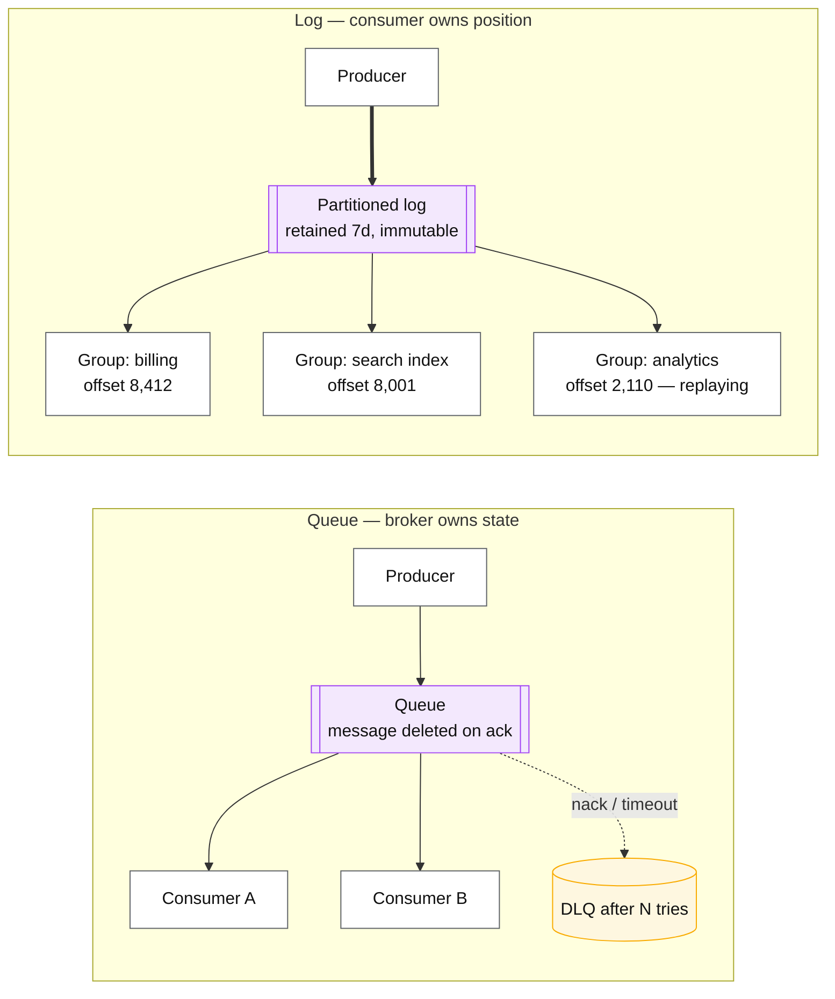
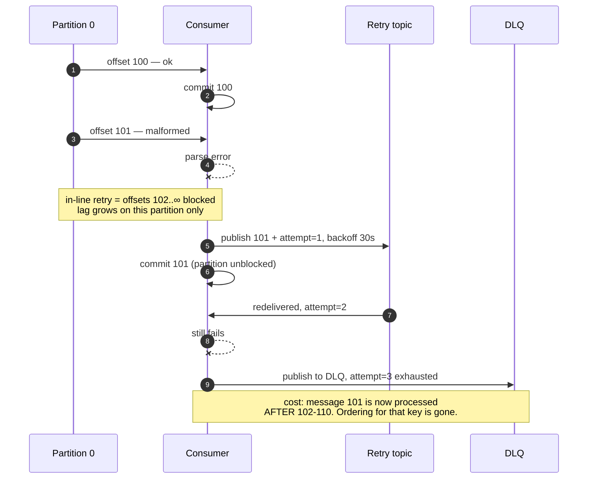

# Log vs queue

## Core concept

A queue hands each message to one consumer and **forgets it on acknowledgement**. A log is an
ordered, retained sequence that many independent consumers read at their own positions, and
reading changes nothing. That single difference — who owns the read position, and whether the
data survives being read — decides replay, fan-out, ordering, operational burden, and what
happens when a consumer has a bug.

The staff-level point is that **the log is not the upgrade**. A log buys replay and fan-out and
charges you partition-count decisions, consumer-group rebalances, retention sizing and offset
management. When there is one consumer, no replay requirement, and per-message ack semantics with
visibility timeouts, a queue is the correct smaller answer and picking Kafka is architecture
astronautics with an on-call rotation attached.

## Mechanics & internals

### The structural difference

| Property | Queue (SQS, RabbitMQ) | Log (Kafka, Pulsar, Kinesis) |
|---|---|---|
| Read semantics | Destructive — ack deletes | Non-destructive — offset advances |
| Position owned by | The **broker** | The **consumer group** |
| Fan-out to a new consumer | Needs a new queue and a copy of the traffic | Free: new group, start at offset 0 |
| Replay | Impossible once acked | Reset the offset |
| Ordering | Per-queue, and lost the moment you add a second consumer (SQS FIFO gives per-message-group ordering) | Total order **per partition**, always |
| Per-message retry | Native: visibility timeout, redelivery count, DLQ | Manual: the offset is per-partition, so one bad message blocks its partition |
| Scaling consumers | Add consumers freely; broker distributes | Bounded by **partition count**; extra consumers idle |
| Backlog | Broker-side, invisible depth | Explicit: `log_end_offset − committed_offset` |
| Ops burden | Managed SQS is near-zero | Partitions, retention, rebalances, ISR |

### Why per-message retry is the queue's real advantage

This is the part that gets glossed over. In a queue, message 5 failing does not stop message 6: it
goes back on the queue with a visibility timeout, a delivery count, and a DLQ after N attempts —
all broker-side, all free.

In a log, the consumer commits **one offset per partition**. A message that cannot be processed
leaves three choices, and every Kafka shop eventually implements the third:

1. **Block** — retry forever, halting that partition and every message behind it.
2. **Skip** — commit past it, silently losing the message.
3. **Divert** — publish it to a retry or dead-letter topic and commit. This is the standard answer
   and it is **your code**, not the broker's; you own the retry delay, the attempt counter and the
   ordering violation you just introduced by reordering that message after its successors.

If a design's dominant requirement is per-message retry with different fates per message, the
queue was the right primitive.

### Consumer groups and rebalancing

A partition is assigned to exactly one consumer in a group, which gives per-key ordering and caps
parallelism at the partition count. Every membership change triggers a **rebalance**:

- **Eager rebalancing** (the old default) stops the world: every consumer revokes every partition,
  then reassigns. A rolling deploy of 20 consumers means 20 stop-the-world pauses.
- **Cooperative incremental rebalancing** (`CooperativeStickyAssignor`) revokes only the
  partitions that must move — the reason a modern Kafka deployment can deploy consumers without a
  latency spike.
- **Static membership** (`group.instance.id`) plus `session.timeout.ms` avoids rebalancing on
  restarts entirely: a returning consumer reclaims its partitions.

A consumer that exceeds `max.poll.interval.ms` (default 5 minutes) between polls is declared dead
and its partitions reassigned — the classic incident where slow processing causes a rebalance,
which slows processing further, which causes another rebalance.

### Retention is a design decision, not a config default

The log's retention window is the replay window, the disaster-recovery window, and the
bootstrap-a-new-consumer window all at once. It is also a storage bill:

- **Time-based** (`retention.ms`, default 7 days) — the usual choice.
- **Size-based** (`retention.bytes`) — a hard cap per partition.
- **Compaction** (`cleanup.policy=compact`) — keep the latest value per key forever. This turns a
  topic into a **replayable table**, which is how CDC streams, config distribution, and Kafka's own
  `__consumer_offsets` work.
- **Tiered storage** — offload old segments to object storage, decoupling retention from broker
  disk. This is what makes 90-day or infinite retention affordable and it changes the calculus for
  "the log is the source of truth" designs.

## Numbers that matter

| Quantity | Value | Confidence |
|---|---|---|
| Kafka throughput per broker | 100 MB/s–1 GB/s, order of magnitude, sequential IO bound | Measure; depends on batching, compression, disk |
| Kafka end-to-end latency | 5–50 ms typical; single-digit ms with `linger.ms=0` and small batches | Order of magnitude |
| SQS standard throughput | Effectively unlimited; ~20–100 ms latency | [AWS docs](https://docs.aws.amazon.com/AWSSimpleQueueService/latest/SQSDeveloperGuide/welcome.html) |
| SQS FIFO throughput | 300 msg/s per message group without batching, 3 000 with; higher with high-throughput mode | AWS-documented limit — the number that kills naive FIFO designs |
| SQS retention | 4 days default, **14 days maximum** | AWS-documented — bounds your recovery window |
| Kafka default retention | 7 days | Broker default; retention is your replay window |
| `max.poll.interval.ms` | 5 minutes default | Exceed it and you are ejected mid-batch |
| Practical partitions per cluster | Thousands to hundreds of thousands under KRaft | Order of magnitude; each partition is files, memory and rebalance work |
| Consumer parallelism ceiling | = partition count | Structural — adding consumers past it does nothing |

**Sizing arithmetic to say out loud.** 50 k msg/s × 2 KB = 100 MB/s ingest. At RF=3 that is
300 MB/s of cluster write and **~25 TB/day** of disk; 7-day retention is ~180 TB. That number
decides tiered storage, retention, and whether "we'll just replay from the beginning" is a real
recovery plan or a sentence. Partition count follows from per-partition throughput: at ~10 MB/s
per partition consumed comfortably, 100 MB/s needs ≥ 10 partitions for throughput alone, more for
consumer parallelism headroom.

## Failure modes

| Failure | Symptom | Mitigation |
|---|---|---|
| **Poison message blocks a partition** | Lag grows on one partition only; the same offset retries forever | Retry/DLQ topic with attempt counts; never infinite in-line retry |
| **Rebalance storm** | Consumers repeatedly revoke and rejoin; throughput collapses; often self-sustaining | Cooperative assignor, static membership, raise `max.poll.interval.ms`, shrink `max.poll.records` |
| **Partition count too low** | Adding consumers changes nothing; lag grows with traffic | Choose generously at creation — **increasing partitions rehashes keys and breaks per-key ordering for existing keys** |
| **Retention expiry beats the consumer** | Consumer down over a weekend, resumes, gets `OffsetOutOfRange` and silently skips to latest — **data loss without an error** | Alert on lag *approaching* retention; set `auto.offset.reset=none` and fail loudly |
| **Offset reset in production** | A deploy resets to earliest; downstream replays weeks of side effects — duplicate emails, double charges | Idempotent consumers; treat offset resets as a change-controlled operation |
| **Consumer lag as the only health signal** | Lag looks fine because the consumer is committing without doing the work | Measure *processing* completion, not commit position |
| **SQS FIFO group too coarse** | Everything shares one `MessageGroupId`; throughput capped at 300/s | Group per entity, not per topic |
| **Using a log where a queue fits** | Rebalances, partition maths and retention tuning for one consumer with no replay need | Choose the smaller primitive |

**Documented pattern.** Kafka's own `__consumer_offsets` is a compacted topic — the system stores
consumer positions in the log itself, which is the cleanest illustration of the log-as-table idea.
When that topic misbehaves (under-replicated, or its partitions leaderless during a broker
failure), consumers cannot commit and the entire cluster's consumption stalls even though data
partitions are healthy. The general lesson repeats one from
[consensus-raft-paxos.md](./consensus-raft-paxos.md): **coordination metadata is a separate
failure domain with a much larger blast radius than the data it coordinates.**

## Trade-offs vs alternatives

| Option | Best at | Weak at | Choose when |
|---|---|---|---|
| **SQS / managed queue** | Zero ops, per-message retry, DLQ, unlimited scaling | No replay, no ordering (standard), no fan-out | One consumer, work-queue semantics, no replay requirement |
| **RabbitMQ** | Routing topologies, priorities, per-message TTL, mature ack semantics | Throughput at extreme scale; queues as durable storage | Complex routing, moderate volume, request/reply patterns |
| **Kafka** | Replay, fan-out, per-partition order, retention as a feature, ecosystem | Ops burden, per-message retry, partition count as a one-way door | Multiple independent consumers, replay, stream processing |
| **Pulsar** | Queue **and** log semantics in one system; tiered storage native; multi-tenancy | Smaller ecosystem, more moving parts (BookKeeper + brokers + ZK/etcd) | You genuinely need both models and can afford the operational surface |
| **Kinesis** | Managed log on AWS, no brokers to run | Shard-level limits and resharding friction; 1 MB/s per shard | AWS-native, moderate scale, want managed |
| **Database table as a queue** | Transactional with your data — no dual write | Polling load, lock contention, does not scale far | Low volume, and the transactional guarantee matters more than throughput |
| **Direct call** | Simplest thing that works | No buffering, no retry, coupled availability | The receiver is fast, reliable, and the caller can wait |

### Where staff engineers get this wrong

1. **Defaulting to Kafka.** "We might need replay later" is speculative; the rebalance tuning,
   partition sizing and retention bill are immediate. Justify the log with a named second consumer
   or a named replay requirement.
2. **Treating partition count as tunable.** Increasing it rehashes keys, so per-key ordering
   breaks for existing keys and stateful consumers see keys move mid-stream. It is schema.
3. **Assuming lag is the health metric.** A consumer committing offsets without completing work has
   zero lag and is losing data. Measure completion.
4. **Rebuilding per-message retry badly.** A retry topic without attempt counts and a terminal DLQ
   becomes an infinite loop that looks like steady traffic.
5. **Ignoring retention as a recovery bound.** If the consumer can be down longer than retention,
   the design has a silent data-loss path — and `auto.offset.reset=latest` makes it silent by
   default.
6. **One topic per event type, forever.** Thousands of low-volume topics cost more in metadata,
   rebalance time and file handles than a smaller number of keyed topics with a type field.

## Real-world examples

- **Kafka's `__consumer_offsets`** — a compacted topic holding consumer positions: the log used as
  a table, by the log itself.
- **CDC pipelines** — a compacted topic keyed by primary key *is* the table, which is why Debezium
  streams can bootstrap a new consumer from the log alone. See
  [../05-data-cases/cdc-pipeline.md](../05-data-cases/cdc-pipeline.md).
- **SQS + Lambda** — the archetypal work queue: visibility timeout, redrive policy, DLQ after N
  receives, zero brokers to operate. Most "we need a message bus" requirements end here correctly.
- **Kafka tiered storage (KIP-405) / Confluent, Redpanda, WarpStream** — offloading segments to
  object storage, which changes retention from a disk-capacity question to a cost question.
- **Pulsar at Yahoo** — the system built explicitly because queue and log workloads were both
  needed and running two systems was worse.

## Staff-level follow-ups

1. A team wants Kafka for a single consumer processing 200 msg/s with no replay requirement.
   Make the case for SQS, then state the two facts that would change your mind.
2. Your consumer has been down for 9 days with 7-day retention. Walk through exactly what happens
   on restart under each `auto.offset.reset` setting, and design the alert that would have caught
   it on day two.
3. Design per-message retry on Kafka with attempt limits, backoff, and a DLQ. State precisely
   which ordering guarantee you gave up and how you would explain that to a downstream team.
4. Compute cluster storage for 50 k msg/s of 2 KB messages at RF=3 with 7-day retention, then
   decide between tiered storage, shorter retention, and compaction — and justify it.
5. You must increase a topic from 12 to 200 partitions. Describe what breaks for existing keys,
   for a stateful consumer, and for downstream ordering assumptions — then give the migration.

## See also

- [kafka-internals.md](./kafka-internals.md) — ISR, acks, rebalance protocols, compaction
- [delivery-semantics.md](./delivery-semantics.md) — what "at least once" costs the consumer
- [idempotency.md](./idempotency.md) — the property that makes at-least-once safe
- [stream-processing-semantics.md](./stream-processing-semantics.md) — when consumers are stateful
- [../02-primitives/messaging-and-streams.md](../02-primitives/messaging-and-streams.md) — the bundled note being split

## Referenced by

- [Backfill and reprocessing](../patterns/backfill-and-reprocessing.md)
- [Batch vs streaming](../comparisons/batch-vs-streaming.md)
- [Delivery semantics](delivery-semantics.md)
- [Fundamentals index](README.md)
- [Kafka internals](kafka-internals.md)
- [Messaging and streams](../02-primitives/messaging-and-streams.md)
- [Messaging matrix](../comparisons/messaging-matrix.md)
- [Stream processing semantics](stream-processing-semantics.md)
- [Topic manifest](../topics/manifest.md)

## Sources

- [Jay Kreps — The Log: What every software engineer should know about real-time data's unifying abstraction](https://engineering.linkedin.com/distributed-systems/log-what-every-software-engineer-should-know-about-real-time-datas-unifying)
- [Apache Kafka — design and consumer group protocol](https://kafka.apache.org/documentation/#design)
- [Kafka KIP-429 — incremental cooperative rebalancing](https://cwiki.apache.org/confluence/display/KAFKA/KIP-429%3A+Kafka+Consumer+Incremental+Rebalance+Protocol)
- [AWS — SQS FIFO throughput quotas](https://docs.aws.amazon.com/AWSSimpleQueueService/latest/SQSDeveloperGuide/FIFO-high-throughput.html)
- [Kafka KIP-405 — tiered storage](https://cwiki.apache.org/confluence/display/KAFKA/KIP-405%3A+Kafka+Tiered+Storage)
- Local book: `DE/System-Design/Designing Data Intensive Applications.pdf` ch.11
