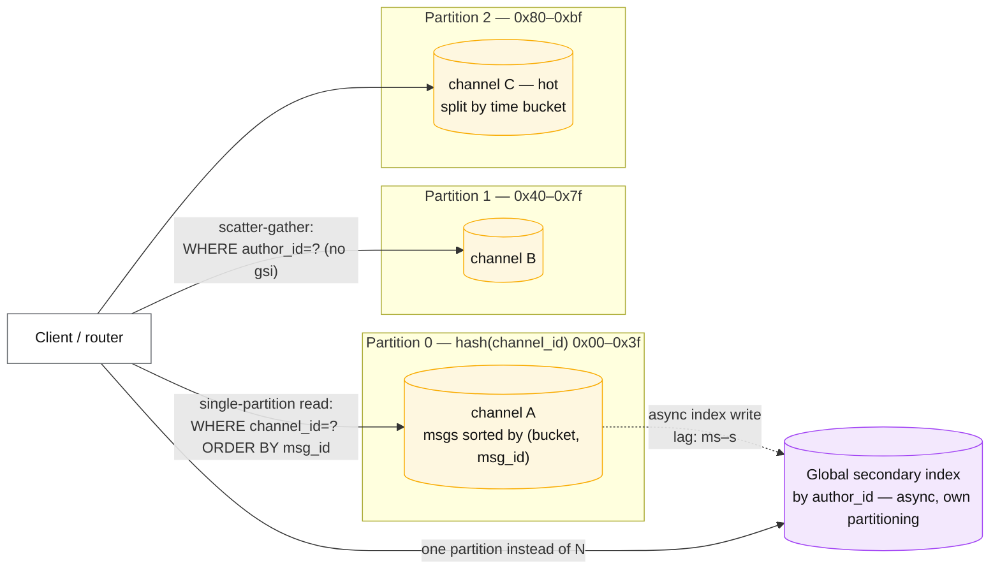
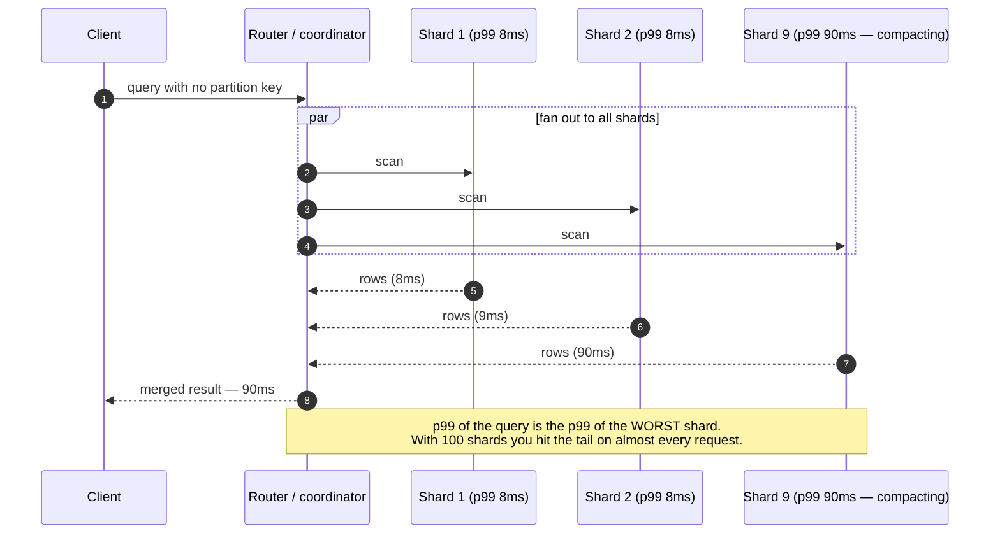

# Partitioning strategies

## Core concept

Partitioning splits *data*, not copies of it, and the only decision that matters is the key.
Everything downstream — query latency, rebalancing cost, whether a transaction is single-shard,
whether a hot user can take you down — is a consequence of a choice usually made in an afternoon
and lived with for years. Changing a partition key later is a data migration of the entire
dataset with a dual-write window, which is why the key is the highest-leverage line in a design
review.

The framing that separates a staff answer: partitioning is not "how do I spread load", it is
**"which queries am I willing to make expensive?"** Every key colocates one access pattern and
scatters all the others.

## Mechanics & internals

### The strategies, and what each one actually costs

| Strategy | Placement | Cheap | Expensive | Rebalance |
|---|---|---|---|---|
| **Range** | Ordered key ranges | Range scans, ordered pagination | Sequential keys pile onto the last shard | Split a range in two — trivial |
| **Hash** | `hash(key)` → slot | Even write spread | Any range scan becomes scatter-gather | Move whole slots; never re-mod |
| **Hash + local sort key** | `hash(pk)` for placement, ordered `sk` within | Both, *within one partition* | Cross-partition ordering | Same as hash |
| **Directory / lookup** | Explicit key → shard map | Total freedom, per-tenant moves | The map is a hot path and a new failure domain | Update the map, move the data |
| **Geo / tenant** | Region or customer | Residency, blast-radius isolation | Whale tenants; cross-tenant queries | Per-tenant, manual |

The row that carries most production systems is the third: **hash for placement, ordered sort key
within the partition**. DynamoDB and Cassandra both make this the primitive because it answers
"spread the writes" and "make my one important query a single-partition scan" simultaneously.

### The three tests a partition key must pass

1. **Does it spread writes?** Any key with a time prefix fails — `created_at`, an
   auto-increment ID, a ULID prefix, a monotonic sequence. All of today's writes land on one
   shard while the rest of the cluster idles.
2. **Does it colocate what one query needs?** If the common query cannot name the partition key,
   every read is a scatter-gather and your p99 becomes the slowest of N shards.
3. **Is any single value unboundedly large or hot?** The celebrity account, the whale tenant, the
   `null` bucket, the `default` org. Design for it before it exists — see
   [hot-shard-mitigation.md](./hot-shard-mitigation.md).

| Bad key | Failure | Better |
|---|---|---|
| `created_at` | One shard takes 100% of writes | `hash(entity_id)` + time as sort key |
| `country` | Nigeria and Vatican City get equal shards | `hash(user_id)`; keep country as an attribute |
| `tenant_id` alone | One whale melts one shard forever | `(tenant_id, bucket)` with bucket count scaled to tenant size |
| Auto-increment PK | Hot tail on write, and index page contention on the same leaf | Hash it, or use a scattered ID scheme |
| `status` (low cardinality) | 5 possible values means at most 5 useful shards | Never partition on an enum |

### Slots, not modulo

`hash(key) % N` is the classic mistake: changing `N` remaps almost every key. Real systems insert
a level of indirection — a **fixed, large number of logical partitions** mapped to physical nodes:

- Redis Cluster: **16 384 hash slots**, assigned to nodes; a resharding moves slots.
- Kafka: partitions per topic fixed at creation; adding partitions **changes key→partition
  mapping** and breaks per-key ordering for existing keys, which is why partition count is a
  one-way door.
- Elasticsearch: primary shard count fixed at index creation; growth = new index + reindex.
- Vitess / Citus: shard ranges over a keyspace ID, moved with online workflows.

Pick the logical partition count once, generously (1024 is a common default), and let physical
capacity change underneath it.

### Secondary indexes: the part that decides the architecture

| Approach | Write cost | Read cost | Consistency |
|---|---|---|---|
| **Local index** (per partition) | Cheap — same partition, same transaction | Scatter-gather across all partitions | Consistent with base data |
| **Global index** (own partitioning) | Extra write, usually async | Single-partition lookup | **Eventually** consistent — DynamoDB GSIs can lag, and a GSI write that is throttled is dropped from the base table's perspective |

The staff-level observation: a global secondary index is a **separately partitioned copy of your
data**, so it has its own hot-key problem, its own capacity, and its own lag. Teams add one to fix
a scatter-gather and are surprised to have acquired a second database.

### Cross-partition operations, in order of pain

The arithmetic behind that note: if each shard independently exceeds its p99 latency 1% of the
time, a fan-out to 100 shards exceeds it with probability `1 − 0.99^100 ≈ 63%`. Scatter-gather
converts a rare tail into the common case — this is the same amplification described in
[../02-primitives/reliability-patterns.md](../02-primitives/reliability-patterns.md), and the
reason "just query all shards" is not a plan.

## Numbers that matter

| Quantity | Value | Confidence |
|---|---|---|
| Practical partition size | 10–100 GB | Order of magnitude — bounded by how long a rebalance/rebuild takes |
| DynamoDB partition throughput ceiling | **3 000 RCU / 1 000 WCU per partition** | [AWS docs](https://docs.aws.amazon.com/amazondynamodb/latest/developerguide/throttling-key-range-limit-exceeded-mitigation.html) — a hard per-partition limit regardless of table capacity |
| DynamoDB partition size ceiling | 10 GB per partition; item collections with an LSI cannot exceed it | [AWS docs](https://docs.aws.amazon.com/amazondynamodb/latest/developerguide/burst-adaptive-capacity.html) — an LSI **blocks** split-for-heat |
| Redis Cluster hash slots | 16 384, fixed | [Redis Cluster spec](https://redis.io/docs/latest/operate/oss_and_stack/reference/cluster-spec/) |
| Logical partitions to start with | 1024 (or 256 for small systems) | Convention; the cost of too many is metadata, the cost of too few is a migration |
| Rebalance throughput budget | ≤ 10–25% of node IO | Order of magnitude; unthrottled rebalancing causes the outage it was preventing |
| Fan-out tail amplification | 100 shards × 1% slow ⇒ ~63% of queries hit a slow shard | `1 − 0.99^100` |

**Capacity arithmetic that decides shard count.** 40 k writes/s at 1 KB, RF=3, retained 90 days:
storage is `40 000 × 1 KB × 86 400 × 90 × 3 ≈ 933 TB`. At a 50 GB target partition that is ~18 700
partitions, so the logical partition count must be well above the node count from day one. Doing
this arithmetic out loud is what separates "we'll shard by user" from a design.

## Failure modes

| Failure | Symptom | Mitigation |
|---|---|---|
| **Hot partition** | One shard at 100% while the cluster is at 20%; throttling or timeouts on a subset of keys | Salting, split, dedicated shard, cache — see [hot-shard-mitigation.md](./hot-shard-mitigation.md) |
| **Sequential key** | Write throughput plateaus and never improves with more nodes | Hash the placement component; keep order in the sort key |
| **Scatter-gather p99** | Query latency tracks the worst shard, degrades as you add shards | Denormalised global index, or a key that colocates the query |
| **Partition count is a one-way door** | Adding Kafka partitions silently breaks per-key ordering for existing keys | Choose generously at creation; treat it as schema |
| **Cross-shard transaction** | 2PC blocking windows, or sagas with compensation nobody tested | Design the key so the transaction is single-partition; that is the real fix |
| **Cross-shard uniqueness** | Duplicate usernames appear under concurrency | A single-partition registry keyed by the unique value, written first |
| **Rebalance storm** | "Routine" scaling causes a latency incident | Rate-limit moves, one node at a time, off-peak, and never automatic during an incident |
| **Whale tenant** | One customer's growth becomes an availability problem for everyone on that shard | Per-tenant bucket counts, or dedicated shards for the top N |

**Documented incident.** Discord's move from Cassandra to ScyllaDB (2023) was driven substantially
by **hot partitions**: high traffic to a single partition produced cascading latency across the
cluster, because in an LSM store a read may have to consult the memtable plus multiple SSTables,
so a hot read partition costs far more than a hot write partition. The messages table was
partitioned by `(channel_id, bucket)` — the bucket being a static time window — precisely so that
a single very active channel could not become a single unbounded partition. Two details worth
carrying: their migration stalled at **99.9999% complete** on token ranges dense with tombstones
(deletes are data), and they placed a Rust "data services" layer in front of the database to
**coalesce concurrent identical requests**, so a hot key produces one database query rather than
thousands. ([Discord engineering](https://discord.com/blog/how-discord-stores-trillions-of-messages))

## Trade-offs vs alternatives

### Partition, or don't

Before choosing a strategy, price the alternative honestly. A single Postgres instance on modern
hardware handles tens of thousands of writes/s and terabytes of data. Partitioning costs you
cross-shard joins, cross-shard transactions, cross-shard uniqueness, a rebalancing operation, and
a new class of incident. The order of escalation:

1. **Vertical scale.** Boring, instant, buys years for most products.
2. **Read replicas.** If the pressure is reads — see
   [replication-topologies.md](./replication-topologies.md).
3. **Functional partitioning** (separate services own separate tables). Keeps every table
   single-node while removing the biggest tables from the hot instance.
4. **Row-level partitioning**, i.e. actual sharding. Last, because it is the only one you cannot
   undo cheaply.

### Where staff engineers get this wrong

1. **Choosing the key for write distribution alone.** An evenly spread key that no query can name
   turns every read into a fan-out. Both tests must pass.
2. **Assuming a global secondary index is free.** It is a second partitioned dataset with its own
   heat, lag, and capacity. On DynamoDB, a throttled GSI write can throttle the base table write.
3. **Treating partition count as tunable.** In Kafka and Elasticsearch it is effectively schema.
   Say "one-way door" out loud when you pick the number.
4. **Sharding to solve a hot-key problem.** More shards do not help when one *key* is hot; the
   key still lands on one partition. Salting or caching is the answer.
5. **Forgetting the router.** A directory-based scheme introduces a lookup service on the hot
   path — cache it aggressively, replicate it, and have a plan for what happens when it is stale
   during a move.
6. **Ignoring deletes.** In LSM stores, deletes are tombstones with a lifetime; a partition
   holding a queue-like workload can become unreadable long before it is "large".

## Real-world examples

- **Discord** — `(channel_id, bucket)` composite partition key on ScyllaDB; static buckets bound
  partition size, and a request-coalescing service layer absorbs hot reads.
- **DynamoDB** — hash partition key + sort key as the only primitive; hard per-partition limits
  (3 000 RCU / 1 000 WCU) and automatic split-for-heat, which an LSI disables.
- **Vitess (YouTube, Slack)** — directory-style sharding over keyspace IDs with online resharding
  workflows; the canonical example of "the map is a first-class component".
- **Citus / Postgres** — distributed tables by a distribution column, with *reference tables*
  replicated everywhere so joins stay local. A clean illustration that the fix for cross-shard
  joins is usually duplication.
- **Elasticsearch** — primary shard count fixed at index creation; the community's standard
  advice is "shard for rebuild time, not for size", which is the same 10–100 GB heuristic.

## Staff-level follow-ups

1. You are asked to shard a messages table. Give the key, then state which query you have just
   made expensive and how you will serve it anyway. Now do it again for a different key.
2. A table is partitioned by `hash(user_id)` and a new product requirement needs "all orders in
   the last hour, across users, sorted by time". Enumerate your options and the cost of each,
   including doing nothing.
3. Your Kafka topic has 12 partitions and needs 200. Walk through what changes for existing keys,
   for consumer ordering guarantees, and for the downstream state stores — then propose the
   migration.
4. Compute the shard count for 40 k writes/s of 1 KB records at RF=3 retained 90 days, then
   explain why the logical partition count should differ from the physical node count.
5. Defend the choice *not* to shard for a system doing 8 k writes/s on 2 TB, against a team that
   wants to shard now "before it's too late". What would change your mind?

## See also

- [hot-shard-mitigation.md](./hot-shard-mitigation.md) — when one key breaks an even scheme
- [consistent-hashing.md](./consistent-hashing.md) — the placement algorithm and its bounded-load variant
- [replication-topologies.md](./replication-topologies.md) — the other axis: copies, not splits
- [../02-primitives/storage-and-databases.md](../02-primitives/storage-and-databases.md) — LSM vs B-tree, and why hot reads cost more on LSM
- [../03-backend-cases/chat-messaging.md](../03-backend-cases/chat-messaging.md) — the composite-key argument in a real design

## Referenced by

- [Consistent hashing](consistent-hashing.md)
- [Distributed transactions](../patterns/distributed-transactions.md)
- [Fundamentals index](README.md)
- [Hot shard mitigation](hot-shard-mitigation.md)
- [Indexing and query planning](indexing-and-query-planning.md)
- [Replication and partitioning](../02-primitives/replication-and-partitioning.md)
- [Replication topologies](replication-topologies.md)
- [SQL vs NoSQL vs NewSQL](../comparisons/sql-vs-nosql-vs-newsql.md)
- [Storage engines — B-tree vs LSM](storage-engines.md)
- [Topic manifest](../topics/manifest.md)

## Sources

- [Discord — How Discord stores trillions of messages](https://discord.com/blog/how-discord-stores-trillions-of-messages) — hot partitions, `(channel_id, bucket)`, request coalescing
- [AWS — key range throughput exceeded (hot partitions)](https://docs.aws.amazon.com/amazondynamodb/latest/developerguide/throttling-key-range-limit-exceeded-mitigation.html) and [burst & adaptive capacity](https://docs.aws.amazon.com/amazondynamodb/latest/developerguide/burst-adaptive-capacity.html)
- [Redis Cluster specification](https://redis.io/docs/latest/operate/oss_and_stack/reference/cluster-spec/) — 16 384 hash slots
- [Vitess — resharding](https://vitess.io/docs/user-guides/configuration-advanced/resharding/)
- Local book: `DE/System-Design/Designing Data Intensive Applications.pdf` ch.6
