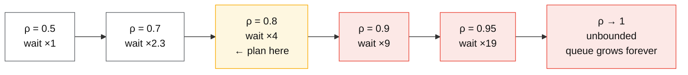
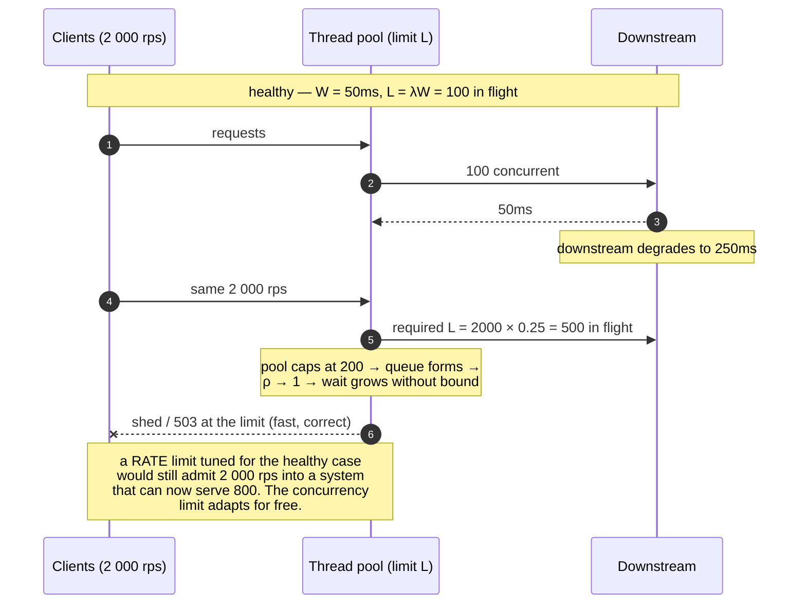

# Queueing theory basics

## Core concept

Three formulas explain most production latency behaviour, and the second one explains why
capacity planning by CPU utilisation is wrong:

- **Little's law**: `L = λW` — concurrency equals arrival rate times residence time. Exact, no
  assumptions about distributions, always true in steady state.
- **The utilisation curve**: for a single queue, wait time scales as `ρ / (1 − ρ)`. At 80%
  utilisation you have **4× the queueing** of 50%; at 95% you have **19×**. Latency does not
  degrade linearly with load — it has a knee, and past the knee small traffic increases produce
  enormous latency increases.
- **Kingman's approximation**: `W ≈ (ρ / (1−ρ)) × ((C_a² + C_s²) / 2) × τ` — **variability**
  multiplies the utilisation term. Two systems at identical utilisation have wildly different
  latency if one has bursty arrivals or variable service times.

The staff-level consequence: **"the servers are only at 60% CPU" is not evidence of headroom.**
Utilisation targets exist because of the curve, not because of superstition, and the variability
term is why a system that was fine at 70% falls over at 72% after a change that made service times
more variable.

## Mechanics & internals

### Little's law, and the three ways to use it

`L = λW`, where `L` = items in the system, `λ` = arrival rate, `W` = time in system. It holds for
any stable system — a thread pool, a queue, a database, an entire service, a warehouse.

| You know | You want | Compute |
|---|---|---|
| 2 000 req/s, 50 ms average latency | Required concurrency | `L = 2000 × 0.05 = 100` concurrent requests. A 50-thread pool cannot serve this, regardless of CPU |
| Pool of 200 connections, 20 ms per query | Throughput ceiling | `λ = 200 / 0.02 = 10 000 qps` — the pool is the ceiling, not the database |
| Queue depth 5 000, drain rate 500/s | Recovery time | `W = 5000 / 500 = 10 s` before the backlog clears — *if* arrivals stop |

That third row is the one on-call needs at 3am: **backlog ÷ spare drain rate = recovery time**,
and if arrivals have not dropped below the drain rate, the answer is infinity.

### The utilisation knee

For an M/M/1 queue, mean wait `W_q = ρ / (μ(1 − ρ))`, so the *queueing* component blows up as
`1/(1−ρ)`:

| Utilisation ρ | Queueing multiplier `ρ/(1−ρ)` | Interpretation |
|---|---|---|
| 50% | 1.0 | Wait ≈ one service time |
| 70% | 2.3 | Still comfortable |
| **80%** | **4.0** | The usual practical ceiling |
| 90% | 9.0 | Every incident starts here |
| 95% | 19.0 | One retry storm from collapse |
| 99% | 99.0 | Effectively unbounded |

Two corrections that make this usable rather than academic:

- **More servers move the knee.** An M/M/c queue with many servers tolerates higher utilisation
  than a single server, which is why a 100-node fleet can run hotter than one box. The shape is
  the same; the knee is further right.
- **Utilisation of *what*?** CPU is rarely the binding resource. The queue that matters is usually
  the connection pool, the thread pool, a lock, or a downstream dependency — and those are often
  at 95% while CPU reads 40%. Find the actual constrained resource before quoting a number.

### Variability is the multiplier nobody budgets for

Kingman's formula makes variability a first-class term: `W ≈ (ρ/(1−ρ)) × ((C_a² + C_s²)/2) × τ`,
where `C_a` and `C_s` are the coefficients of variation of arrivals and service times.

Consequences worth stating in a design review:

- **Deterministic service times halve the wait** relative to exponential ones at the same
  utilisation. This is why capping request size, timing out slow work, and splitting mixed
  workloads into separate pools *reduce latency without adding capacity*.
- **A single slow-request class poisons a shared pool.** Ten percent of requests taking 2 s among
  50 ms requests raises `C_s²` enormously; isolating them into their own pool is often a bigger
  win than doubling the fleet — the bulkhead argument, with arithmetic behind it.
- **Bursty arrivals** (cron alignment, retry synchronisation, client-side timers) raise `C_a²`.
  Jitter is not politeness; it is a latency optimisation.

### Concurrency limits beat rate limits

Little's law gives the practical control: bound `L` (in-flight requests), not `λ` (requests per
second). A concurrency limit automatically adapts as service time changes — if the downstream
slows, in-flight requests hit the ceiling and you shed *immediately*, whereas a rate limit tuned
for the healthy case happily admits load the system can no longer serve.

This is exactly what adaptive concurrency limiters (Netflix's `concurrency-limits`, TCP Vegas-style
gradient algorithms) implement: estimate the no-load latency, watch current latency, and shrink the
limit when the ratio rises. It is Little's law used as a control loop.

### Amdahl and the Universal Scalability Law

Adding capacity does not scale linearly, and the USL says why: throughput is limited by a
**serial fraction** (contention, α) *and* by **coherency cost** (crosstalk between workers, β).
Contention flattens the curve; coherency makes it **turn downward** — past a point, adding workers
*reduces* throughput. Every engineer has seen this as "we added nodes and it got slower", usually
caused by a shared lock, a coordination round trip, or a database that now sees more connections.

## Numbers that matter

| Quantity | Value | Confidence |
|---|---|---|
| Practical utilisation ceiling, single queue | **~80%** (`ρ/(1−ρ) = 4`) | The standard planning target, and the arithmetic behind it |
| Utilisation ceiling, large homogeneous fleet | 85–90% achievable | M/M/c moves the knee right; verify with load tests |
| Latency multiplier at 95% | ~19× the queueing at 50% | `ρ/(1−ρ)` |
| Little's law | `L = λW` — exact, distribution-free | Definitional |
| Concurrency for 2 000 rps at 50 ms | 100 in flight | `L = λW` |
| Recovery from a 5 000-item backlog draining at 500/s | 10 s **if arrivals stop** | `W = L/λ`; with arrivals it may never drain |
| Effect of halving service-time variability | Roughly halves queueing delay at fixed ρ | Kingman's `(C_a² + C_s²)/2` term |
| Headroom for N+1 failover | Run at `ρ × N/(N−1)` after one node dies — a fleet at 80% with 5 nodes hits **100%** on one loss | Arithmetic; the reason 80% is already aggressive at small N |

**The capacity calculation to do out loud.** 5 nodes at 80% utilisation lose one node: the
remaining 4 must absorb 5/4 of the load, so they run at 100% — collapse, not degradation. At 3
nodes, one loss puts you at 120% of capacity. **Utilisation targets must be set from the
post-failure state**, which for a 3-node fleet means ~60%, not 80%. Teams size for steady state
and are surprised by the failover.

## Failure modes

| Failure | Symptom | Mitigation |
|---|---|---|
| **Operating past the knee** | Latency doubles from a 5% traffic increase; nothing "changed" | Target ≤ 80% on the binding resource; alert on utilisation trend, not just saturation |
| **Wrong resource measured** | CPU at 40% while the connection pool is at 100% | Instrument queue depth and wait time per pool, not just CPU |
| **Unbounded queue** | Memory grows, latency grows, everything eventually times out — work done for clients who left | Bound every queue; drop or shed at the bound |
| **Mixed workload in one pool** | p99 destroyed by a small slow class | Separate pools per class (bulkhead); the variability term is the justification |
| **Synchronised arrivals** | Cron-aligned or retry-aligned bursts overwhelm a fleet that is fine on average | Jitter everything periodic |
| **Sized for steady state, not failover** | One node loss cascades the fleet | Set targets from `N−1` capacity |
| **Coherency collapse (USL β)** | Adding nodes reduces throughput | Find the shared serialising resource; scale that, or partition |
| **Backlog treated as a queue to drain** | "It'll catch up" — arrivals never drop below drain rate | Shed at the front so the drain rate exceeds arrivals; see [load-shedding-and-admission-control.md](./load-shedding-and-admission-control.md) |

**Documented pattern.** Facebook's *Fail at Scale* (ACM Queue, 2015) reports that many of their
worst latency incidents came down to **large numbers of requests sitting in queues awaiting
processing** — a queueing problem, not a capacity problem. Their response was borrowed from
network bufferbloat research: **CoDel** to keep queues short by timing out work whose queueing
delay exceeds a target, and **adaptive LIFO** so that during a backlog the *newest* request is
served first, because the oldest one probably belongs to a user who has already given up. Under
normal conditions the queue stays FIFO; only when a queue forms does it flip.

Both ideas fall directly out of the arithmetic above: a long queue means the system is past the
knee, and once past it, **completing work quickly for someone who is still waiting beats completing
work in order for someone who left.**
([Fail at Scale](https://queue.acm.org/detail.cfm?id=2839461))

## Trade-offs vs alternatives

| Approach to capacity | Buys | Costs | Use when |
|---|---|---|---|
| **Utilisation target ≤ 80%** | Predictable latency, failover headroom | Idle hardware you pay for | Default for anything latency-sensitive |
| **Run hot (90%+)** | Cost efficiency | Latency cliff, no failure headroom | Batch and throughput-bound work where queueing is fine |
| **Autoscaling** | Follows demand | Scaling lag (minutes) is longer than the collapse (seconds) | Predictable diurnal load — never as your only overload defence |
| **Concurrency limit** | Adapts automatically to service-time changes | Needs a tuned or adaptive limit | The correct primary control for a service |
| **Rate limit (rps)** | Simple, easy to reason about, good for fairness | Wrong ceiling the moment latency changes | Per-tenant quotas and abuse control |
| **Bigger queue** | Absorbs bursts | Converts a fast failure into a slow one; work completed for departed users | Short, bounded bursts only |
| **Separate pools per class** | Removes variability from the shared queue | More capacity fragmentation | Mixed fast/slow workloads — usually worth it |

### Where staff engineers get this wrong

1. **Quoting CPU as headroom.** The binding resource is usually a pool, a lock, or a dependency.
   Measure queue wait time where the work actually waits.
2. **Sizing for steady state.** Utilisation targets must hold *after* the failure you are supposed
   to survive. With 3 nodes, 80% steady state is 120% post-failure.
3. **Ignoring variability.** Two services at 70% utilisation can differ by an order of magnitude in
   p99 purely from service-time variance. Splitting the slow class out is free capacity.
4. **Growing the queue to fix latency.** A bigger buffer increases latency by construction. The
   fix for a persistently full queue is less work in or more work out, never more room to wait.
5. **Trusting autoscaling as the overload control.** Instance start-up is minutes; the knee is
   crossed in seconds. Autoscaling handles growth; shedding handles overload.
6. **Assuming linear scaling.** The USL's coherency term means capacity can *decrease* with more
   workers. If adding nodes stopped helping, find the shared serialising resource.

## Real-world examples

- **Facebook (Fail at Scale)** — CoDel plus adaptive LIFO in HHVM: keep queues short, and serve
  the newest request first once a queue forms.
- **Netflix `concurrency-limits`** — an adaptive concurrency limiter derived from TCP congestion
  control: infer the no-load latency, shrink the in-flight limit as latency rises. Little's law as
  a feedback loop.
- **Google SRE** — utilisation targets and the explicit position that a service running near
  saturation has no capacity to absorb variance; the overload chapter is built on this arithmetic.
- **Envoy / gRPC concurrency and queue limits** — bounded pending-request queues at the proxy so a
  slow upstream produces fast failures rather than unbounded buffering.
- **Database connection pools** — the most common place `L = λW` is violated in practice: a pool of
  20 cannot serve 2 000 rps at 50 ms no matter how large the database is.

## Staff-level follow-ups

1. Your service is at 45% CPU and p99 has tripled. Give three queueing explanations and the metric
   that distinguishes them.
2. Compute the concurrency needed for 8 000 rps at 25 ms, then say what happens to that number
   when a downstream dependency slows to 250 ms — and which control catches it first, a rate limit
   or a concurrency limit.
3. Set a utilisation target for a 4-node fleet that must survive one node failure without latency
   degradation. Show the arithmetic, then argue whether autoscaling changes your answer.
4. A shared thread pool serves 90% of requests at 20 ms and 10% at 2 s. Using the variability term,
   argue for splitting the pool, and estimate the p99 improvement without adding hardware.
5. You add 30% more nodes and throughput improves 5%. Name the two USL terms that could explain it,
   and the experiment that distinguishes them.

## See also

- [tail-latency.md](./tail-latency.md) — what the knee does to a fan-out request
- [load-shedding-and-admission-control.md](./load-shedding-and-admission-control.md) — the control loop that keeps you left of the knee
- [timeouts-retries-backoff.md](./timeouts-retries-backoff.md) — how retries multiply λ exactly when ρ is highest
- [cascading-and-metastable-failures.md](./cascading-and-metastable-failures.md) — what happens past the knee when the load is self-generated
- [../01-numbers.md](../01-numbers.md) — the latency and capacity anchors these calculations use

## Referenced by

- [Cascading and metastable failures](cascading-and-metastable-failures.md)
- [Fundamentals index](README.md)
- [Load shedding and admission control](load-shedding-and-admission-control.md)
- [Reliability patterns](../02-primitives/reliability-patterns.md)
- [Tail latency](tail-latency.md)
- [Timeouts, retries and backoff](timeouts-retries-backoff.md)
- [Topic manifest](../topics/manifest.md)

## Sources

- [Little, J.D.C. — A proof for the queuing formula L = λW (1961)](https://www.jstor.org/stable/167570)
- [Facebook — Fail at Scale (ACM Queue, 2015)](https://queue.acm.org/detail.cfm?id=2839461) — CoDel and adaptive LIFO in production
- [Nichols & Jacobson — Controlling Queue Delay (CoDel, ACM Queue 2012)](https://queue.acm.org/detail.cfm?id=2209336)
- [Neil Gunther — Universal Scalability Law](https://www.perfdynamics.com/Manifesto/USLscalability.html)
- [Google SRE Book — Handling Overload](https://sre.google/sre-book/handling-overload/)
- [Netflix — performance under load / adaptive concurrency limits](https://netflixtechblog.medium.com/performance-under-load-3e6fa9a60581)
