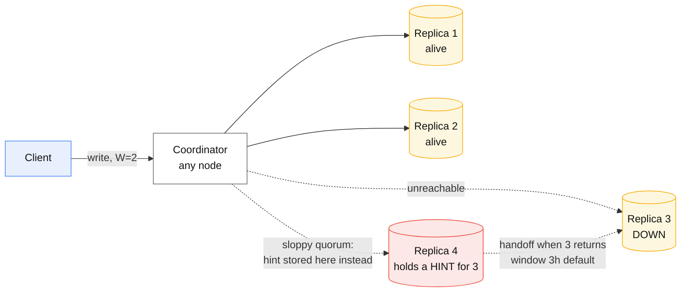
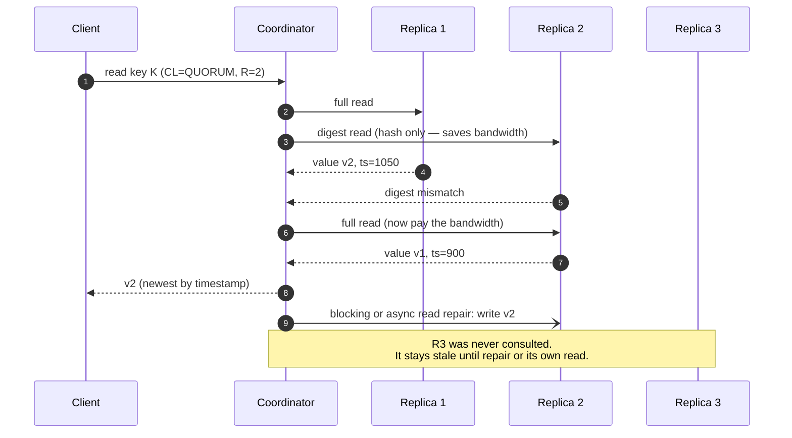

# Quorums and anti-entropy

## Core concept

Quorum replication is the data-plane answer to consensus: no leader, no log, no election — write to
`W` replicas, read from `R`, and if `R + W > N` the read set intersects the write set, so a read
sees at least one copy of the latest acknowledged write. That intersection argument is true and it
is much weaker than it sounds. It says a *fresh copy is present*, not that the reader can identify
it, and it evaporates entirely under the availability features that make Dynamo-style systems
attractive in the first place: sloppy quorums, hinted handoff, and concurrent writes with no
ordering between them.

The honest description is **"usually fresh, converges eventually, and never blocks"**. Anti-entropy
— read repair, hinted handoff, Merkle-tree repair — is the machinery that makes "eventually" a
finite number. Skipping it does not leave you with a slightly staler system; it leaves you with one
that resurrects deleted data.

## Mechanics & internals

### The quorum, and the four ways `R + W > N` fails to mean "strong"

| Why the guarantee leaks | Mechanism |
|---|---|
| **Sloppy quorum** | The `W` acks may come from nodes that are not in the key's replica set at all — the write is durable *somewhere*, but a later read of the "real" replicas can miss it entirely until handoff completes |
| **Concurrent writes** | Two writers, no leader, no order. The system stores both (siblings) or picks one by timestamp. `R + W > N` says nothing about which value is "latest" |
| **Partial write failure** | A write that reaches 1 of 3 and then fails is **not rolled back**. It stays. A later read may or may not surface it — the failed write can still win eventually |
| **Read during repair** | Read repair is often asynchronous. Two sequential reads can see new, then old — monotonic reads violated on a system advertised as `R + W > N` |

Kleppmann's summary is worth memorising because it wins arguments: quorums give you a *probability*
of freshness, not linearizability. If you need linearizability from a Dynamo-style store, you need
its consensus path — Cassandra's lightweight transactions (Paxos, ~4 round trips) — not tuned
`R`/`W`.

### Read repair, digests, and why reads carry the repair load

Two properties fall out of that diagram and both are load-bearing:

- **Only keys that are read get repaired this way.** Cold data drifts forever. That is exactly what
  scheduled Merkle-tree repair exists to fix, and why "we rely on read repair" is a plan that fails
  on the archive.
- **Digest reads make the common case cheap and the divergent case expensive.** A cluster with
  widespread divergence flips every read into two rounds — a self-reinforcing latency problem
  during and after an incident.

### Hinted handoff

When a replica is down, the coordinator stores a **hint** — the write plus its destination — and
replays it when the node returns. In Cassandra the window is `max_hint_window_in_ms`, **default 3
hours**; beyond that hints are dropped and the only remaining path to convergence is repair. Hints
buy availability during short failures and create two hazards: the hint store is extra write load
and disk on the coordinator (a long outage of one node degrades the *healthy* nodes), and a node
returning after the window expires is silently stale.

### Merkle-tree anti-entropy, and overstreaming

Repair compares replicas by exchanging Merkle trees — a binary hash tree over the token range,
leaves hashing row values, so a comparison of two large datasets costs `O(log n)` exchanges rather
than a full scan.

The production reality is coarser than the theory. Cassandra's tree is depth-limited (**2^15 = 32 768
leaves** per range in the classic implementation), so each leaf covers a wide token span — often
thousands of rows, gigabytes of data. **A single differing row causes the entire leaf's range to be
streamed.** That is *overstreaming*: repair transfers orders of magnitude more data than diverged,
saturating disks and network. Building the trees is itself expensive: every row of every SSTable in
range must be read and hashed, stressing CPU, page cache and disk at once.

Mitigations in practice: **subrange repair** (repair narrow token ranges so each tree covers less
data), **incremental repair** (mark repaired SSTables so they are skipped next time — historically
bug-prone, improved in Cassandra 4.x), and orchestration tools (Reaper) that spread repair over
time so it never coincides with peak traffic.

### Gossip

Membership, liveness and schema propagate by gossip: each node picks a few peers per interval
(Cassandra: every 1 s) and exchanges state. Convergence is `O(log N)` rounds — seconds for
hundreds of nodes — with no coordinator to lose. The cost is that **there is no instant of
agreement**: during propagation, different nodes have different views of who is up, which is the
root of "the coordinator routed to a node everyone else already marked down".

## Numbers that matter

| Quantity | Value | Confidence |
|---|---|---|
| Standard config | N=3, R=2, W=2 (`QUORUM`) | Ubiquitous default |
| Multi-region config | N=6 (3+3), `LOCAL_QUORUM` = 2 in-region | Avoids a cross-region RTT per operation; **gives up cross-region freshness** |
| `QUORUM` across two regions 70 ms apart | ≥ 70 ms per read *and* per write | The reason `LOCAL_QUORUM` is the default answer |
| Cassandra lightweight transaction (Paxos) | ~4 round trips; commonly cited as an order of magnitude slower than a normal write | Use for the 1% of operations that need it, never the hot path |
| `max_hint_window_in_ms` | 3 hours (default) | [Cassandra docs](https://cassandra.apache.org/doc/latest/cassandra/configuration/cass_yaml_file.html) — beyond it, only repair converges the node |
| `gc_grace_seconds` | 10 days (default) | The deadline for repair. See the failure below |
| Merkle tree leaves per range | 2^15 = 32 768 | Source of overstreaming |
| Tombstone read thresholds | warn at 1 000, fail the query at 100 000 per read | Cassandra defaults; a query that trips these is a data-model bug |
| Gossip round | 1 s; convergence `O(log N)` rounds | Cassandra default |
| Repair cadence | Must complete for every range within `gc_grace_seconds` | Not a preference — a correctness deadline |

**The arithmetic that decides `R` and `W`.** With N=3: `W=3, R=1` gives fast reads and a write that
fails whenever any replica is down — bad availability. `W=1, R=3` gives fast writes and reads that
fail on any node loss. `W=2, R=2` is the only choice that tolerates one node loss on both paths,
which is why it is everyone's default. The interesting move is per-operation: `W=2, R=1` for a
write-heavy telemetry table where staleness is harmless costs one fewer replica on the read path
and gives up the intersection guarantee **deliberately**.

## Failure modes

| Failure | Symptom | Mitigation |
|---|---|---|
| **Zombie data (tombstone resurrection)** | Deleted rows reappear. A replica missed the delete; the tombstone was garbage-collected after `gc_grace_seconds` on the others; anti-entropy now sees the *old row* as the newer state and spreads it back | Repair every range within `gc_grace_seconds`, always. Alert when the oldest successful repair approaches it |
| **Overstreaming** | Repair transfers TB for MB of divergence; disks saturate; latency spikes cluster-wide | Subrange repair, incremental repair, Reaper scheduling, smaller ranges per node |
| **Repair during peak** | Repair and traffic contend for the same disks; p99 doubles; on-call blames the app | Schedule off-peak, rate-limit streaming, never repair during an incident |
| **Hint pile-up** | One node down for hours; healthy coordinators accumulate hint volume and slow down | Monitor hint queue size; accept the node is beyond the window and repair instead |
| **Sloppy-quorum stale read** | A write acked at `QUORUM` is not visible to a read at `QUORUM` moments later | Understand that acks may be hints; if this is unacceptable, you need a leader or LWTs |
| **Clock-skew LWW loss** | Last-write-wins by wall clock; a skewed node's write silently wins and a good write vanishes | Monitor NTP drift; prefer conflict-free structures or application merges for anything valuable |
| **Tombstone-heavy reads** | Queries time out reading a partition full of deletes | Model to avoid queue-like partitions; TTLs; the fix is the data model, not tuning |
| **Silent divergence in cold data** | Two replicas disagree for months; nobody notices because nobody reads it | Scheduled full repair; validate with checksum/diff jobs |

**The one to remember.** Tombstone resurrection is the failure mode unique to this family and the
one candidates almost never mention. It is not a bug in Cassandra — it is the documented, arithmetic
consequence of `gc_grace_seconds` elapsing without a successful repair. Deleted user data coming
back is a privacy incident (deletion requests, right to erasure), not just a data-quality issue.

## Trade-offs vs alternatives

| Approach | Consistency | Availability under partition | Ops burden | Fits |
|---|---|---|---|---|
| **Quorum replication (Dynamo-style)** | Tunable, never linearizable without LWTs | Excellent — any live replica takes writes | Repair scheduling is a permanent operational job | Write-heavy, partition-tolerant, conflict-tolerant data |
| **Single-leader replication** | Strong on the leader; lag on replicas | Writes stop during failover | Failover automation, lag monitoring | Most OLTP |
| **Consensus per shard (Raft/Paxos)** | Linearizable | Minority loss survivable; majority loss = unavailable | Quorum placement; group-count management | Metadata, and data where correctness dominates |
| **Quorum + LWT for the 1%** | Strong exactly where it is bought | Good | Both burdens at once | The pragmatic middle: cheap writes plus a few `IF NOT EXISTS` guards |
| **CRDT-backed store** | Convergent by construction, no repair semantics to get wrong | Excellent | Metadata growth, tombstone GC | Counters, sets, collaborative state |

### Where staff engineers get this wrong

1. **"`R + W > N` means strongly consistent."** It means the read set intersects the write set,
   under assumptions that hinted handoff deliberately breaks. Say "no lost acknowledged write on
   the strict path", not "linearizable".
2. **Treating repair as optional maintenance.** Repair within `gc_grace_seconds` is a correctness
   requirement with a deadline. A cluster that has not completed a repair cycle is accumulating a
   dated liability.
3. **Choosing `QUORUM` across regions.** It works, and it puts a cross-region RTT on every request.
   `LOCAL_QUORUM` plus an explicit statement of what cross-region staleness means for the product
   is the design; `QUORUM` is usually an accident.
4. **Relying on read repair for convergence.** It only repairs what is read. The data that hurts
   you is the data nobody reads.
5. **Using last-write-wins without saying so.** LWW is a decision to discard data during
   conflicts. Fine for presence and caches; indefensible for a shopping cart, which is exactly the
   example the Dynamo paper used to argue for siblings.
6. **Assuming DynamoDB is the Dynamo paper.** It is not. Amazon's DynamoDB uses **leader-based
   replication groups with Paxos for leader election** — a design deliberately different from the
   2007 leaderless paper, because operating sloppy quorums and conflict reconciliation at customer
   scale was worse than operating leaders. That evolution is itself the strongest available
   argument about when leaderless quorums are and are not worth it.

## Real-world examples

- **Amazon Dynamo (SOSP 2007)** — the origin: consistent hashing, sloppy quorums, hinted handoff,
  vector clocks, Merkle-tree anti-entropy, and the shopping-cart argument for keeping siblings
  rather than dropping a write.
- **Amazon DynamoDB (USENIX ATC 2022)** — the service, ten years on: leader per replication group,
  Paxos for election, and explicit discussion of why the operational model changed. Read both
  papers in sequence; the delta is the lesson.
- **Apache Cassandra / ScyllaDB** — tunable consistency per query, `LOCAL_QUORUM` as the
  multi-region default, incremental and subrange repair, Reaper for orchestration.
- **Riak** — the most faithful Dynamo implementation; sibling resolution exposed to the application
  and CRDT data types added later precisely because LWW kept losing data.
- **Voldemort, Cassandra at scale** — public write-ups repeatedly identify repair scheduling, not
  the read/write path, as the dominant operational cost of running these systems.

## Staff-level follow-ups

1. A customer reports that a record they deleted three weeks ago is back. Walk the exact sequence —
   including which node missed what, and which timer expired — and state the two independent
   controls that would have prevented it.
2. You run N=6 across two regions. Compare `QUORUM` and `LOCAL_QUORUM` on latency, on what a region
   failure does to reads and writes, and on what the product must tolerate for you to choose the
   cheaper one.
3. Repair takes 40 hours per cycle and `gc_grace_seconds` is 10 days. Growth doubles the dataset.
   Show the arithmetic that tells you when this becomes an incident, and list the levers in the
   order you would pull them.
4. Explain overstreaming precisely — why a single changed row can move gigabytes — and describe
   two independent ways to reduce it without weakening convergence.
5. When would you choose quorum replication over a per-shard Raft group, given that DynamoDB moved
   in the opposite direction? Name the workload properties that make leaderless the better answer.

## See also

- [consistency-models.md](./consistency-models.md) — why quorum reads are not linearizable
- [consensus-raft-paxos.md](./consensus-raft-paxos.md) — the leader-based alternative and its cost
- [leases-locks-and-fencing.md](./leases-locks-and-fencing.md) — mutual exclusion when there is no leader
- [../02-primitives/replication-and-partitioning.md](../02-primitives/replication-and-partitioning.md) — consistent hashing and replica placement
- [../04-frontend-cases/collaborative-editor.md](../04-frontend-cases/collaborative-editor.md) — convergence when conflicts are the normal case

## Referenced by

- [Consensus — Raft and Paxos](consensus-raft-paxos.md)
- [Consistency and consensus](../02-primitives/consistency-and-consensus.md)
- [Consistency model matrix](../comparisons/consistency-model-matrix.md)
- [Consistency models](consistency-models.md)
- [Consistent hashing](consistent-hashing.md)
- [Fundamentals index](README.md)
- [Kafka internals](kafka-internals.md)
- [OLTP database matrix](../comparisons/oltp-database-matrix.md)
- [Replication topologies](replication-topologies.md)
- [Storage engines — B-tree vs LSM](storage-engines.md)
- [Topic manifest](../topics/manifest.md)

## Sources

- [DeCandia et al. — Dynamo: Amazon's Highly Available Key-value Store, SOSP 2007](https://www.allthingsdistributed.com/files/amazon-dynamo-sosp2007.pdf)
- [Elhemali et al. — Amazon DynamoDB: A Scalable, Predictably Performant, and Fully Managed NoSQL Database Service, USENIX ATC 2022](https://www.usenix.org/conference/atc22/presentation/elhemali)
- [Cassandra — repair and anti-entropy documentation](https://cassandra.apache.org/doc/latest/cassandra/operating/repair.html)
- [DataStax — manual repair: anti-entropy repair](https://docs.datastax.com/en/cassandra-oss/3.x/cassandra/operations/opsRepairNodesManualRepair.html) — Merkle tree depth and overstreaming
- [Pythian — more effective anti-entropy repair in Cassandra](https://blog.pythian.com/effective-anti-entropy-repair-cassandra/)
- Local book: `DE/System-Design/Designing Data Intensive Applications.pdf` ch.5 — "limitations of quorum consistency"
