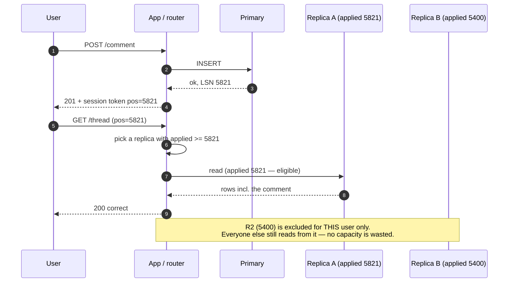
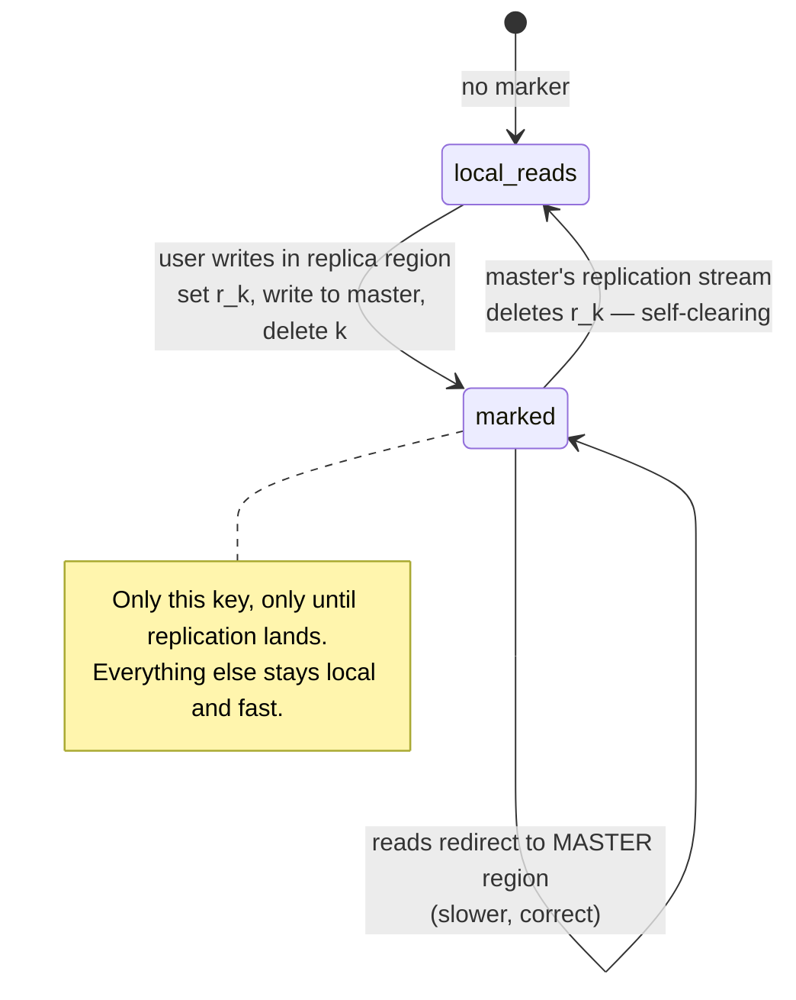

# Replication lag and session guarantees

## Core concept

"Send reads to replicas" is the most common scaling move in the industry and the most common
source of bugs that users report as **data loss**. The replica is not stale in an abstract sense —
it is stale relative to a specific write that a specific user just made, and the product breaks in
three named ways: they cannot see their own write, they see a value that then disappears, and they
see an effect before its cause.

These are not exotic distributed-systems anomalies. They are the default behaviour of every
read-replica deployment that routes by round robin, and each has a cheap, well-understood fix that
costs a token rather than a coordination round trip. The fix is routing, not consensus — which is
why session guarantees are the best value in the whole consistency ladder.

## Mechanics & internals

### The three anomalies, with the mechanism that causes each

| Anomaly | What the user sees | Mechanism | Fix |
|---|---|---|---|
| **Read-your-writes** violated | Posts a comment, refreshes, it is gone | The read went to a replica that has not applied the write | Route to a replica whose applied position ≥ the write's position, else the primary |
| **Monotonic reads** violated | Sees the comment, refreshes, it disappears | Two consecutive reads hit replicas at *different* positions | Pin the session to one replica (hash the user ID), or carry a position token |
| **Consistent prefix** violated | Sees the reply before the question | Causally related writes went to different partitions replicating independently | Route causally related writes to one partition, or track dependencies explicitly |
| **Writes-follow-reads** violated | Replies to a comment; the reply lands on a replica that never saw the comment | The reply's causal dependency was not carried with it | Carry the read position into the subsequent write |

The fourth is the one people forget and it is the nastiest in distributed products: it produces
orphaned replies and out-of-order threads that no amount of "just refresh" repairs.

### The token: what to thread through

Every engine exposes a monotonically increasing position. The pattern is identical everywhere:

| Engine | Position | How you get it | How you compare |
|---|---|---|---|
| PostgreSQL | LSN | `pg_current_wal_lsn()` after commit | `pg_last_wal_replay_lsn() >= token` |
| MySQL | GTID set | `@@SESSION.gtid_executed` after commit | `WAIT_FOR_EXECUTED_GTID_SET(token, timeout)` — **blocks until caught up**, the cleanest primitive in the family |
| MongoDB | operation/cluster time | `clusterTime` from the session | causally consistent sessions, `afterClusterTime` |
| DynamoDB | — | no token; `ConsistentRead=true` reads the leader | binary choice, 2× cost |
| Kafka-derived read models | offset | producer's returned offset | consumer position ≥ offset |

The property that makes this cheap: the exclusion is **per session, per position**. A replica that
is 400 ms behind is unusable for the 0.1% of users who just wrote, and perfectly good for the
other 99.9%. Sticky-to-primary-for-N-seconds throws that away by sending every recent writer to
the primary regardless of whether any replica had already caught up.

### The three implementations, in ascending quality

1. **Sticky window.** After a write, route that user's reads to the primary for N seconds
   (typically 5–10). One line of code, no tokens. Costs primary capacity proportional to your
   write rate, and is wrong at both ends: too short during a lag spike, wasteful the rest of the
   time.
2. **Position token.** Carry the LSN/GTID in the session or a cookie; the router picks an eligible
   replica or falls back to the primary. Correct, cheap, and requires the router to know each
   replica's applied position (a 1 Hz poll is enough).
3. **Blocking wait.** `WAIT_FOR_EXECUTED_GTID_SET` on the replica, with a short timeout and
   primary fallback. Strongest, adds latency exactly and only when needed. This is what
   ProxySQL and Vitess implement.

### Cross-region: Facebook's remote markers

Read-your-writes across regions is harder because the write must cross an ocean before the local
replica can show it. "Scaling Memcache at Facebook" (NSDI 2013) solves it with a **remote marker**:
when a web server in a replica region wants to modify data for key `k`, it (1) sets a marker `r_k`
in the local region, (2) sends the write to the master region, having the SQL statement carry an
instruction to delete `r_k` after the write lands, and (3) deletes `k` from the local cache.
A subsequent read that finds `r_k` present knows the local replica may be stale and is **redirected
to the master region**; once replication catches up, the marker is gone and reads are local again.

The generalisable idea: **mark the keys that are known-stale for this user, rather than degrading
every read**. It converts a global consistency problem into a small, self-clearing set of
exceptions, and it costs one cache key per in-flight cross-region write.

### Measuring lag honestly

Three metrics, and you need all three:

- **Time lag** — how old is the newest applied write. The user-facing number.
- **Byte/position lag** — how far behind in WAL bytes or GTID count. Predicts recovery time and
  catches a stalled apply that time-lag smooths over.
- **Heartbeat lag** — the primary writes `now()` into a heartbeat row every second; the replica
  reports the delta. This is the only one that is honest when the replica is *idle*.

MySQL's `Seconds_Behind_Master` deserves specific suspicion: it is derived from the SQL thread's
current event timestamp, so if the **IO thread** has stopped fetching, it can report **0 while the
replica is hours behind**. A heartbeat row is not optional monitoring hygiene; it is the only
correct measurement.

## Numbers that matter

| Quantity | Value | Confidence |
|---|---|---|
| Healthy async lag, same region | p50 5–50 ms, p99 200 ms–1 s | Order of magnitude — measure |
| Lag during bulk write / schema change / replica restart | Seconds to **minutes** | Routine, not exceptional |
| Aurora replica lag (shared storage) | Tens of ms typical | Vendor-documented as ~20 ms; verify for your workload |
| Cross-region replication delay | ≥ RTT (60–90 ms) plus apply | The floor is physics |
| Sticky-to-primary window in practice | 5–10 s | Convention; should exceed p99 lag with margin |
| Fraction of reads needing the guarantee | Typically **< 1%** | Only sessions with a recent write — which is why token routing beats a global downgrade |
| Router's replica-position poll interval | 200 ms–1 s | Cheap; staleness of the position estimate must be smaller than your lag tolerance |

**The capacity argument, as arithmetic.** 50 k reads/s, 2 k writes/s, and a 10 s sticky window
means roughly `2 000 × 10 = 20 000` sessions are pinned to the primary at any moment. If those
sessions read at the average rate, you have quietly moved ~40% of read traffic back to the primary
— defeating the reason you added replicas. Position-token routing moves only the reads that
genuinely cannot be served yet, typically under 1%.

## Failure modes

| Failure | Symptom | Mitigation |
|---|---|---|
| **Round-robin replica routing** | Intermittent "my data vanished" reports that never reproduce for the on-call engineer | Token routing or session pinning |
| **Health check ignores lag** | A replica 40 minutes behind stays in rotation because its port is open | Health check asserts `lag < threshold`; eject and alert |
| **`Seconds_Behind_Master` = 0 while stalled** | Monitoring green, users seeing old data | Heartbeat table; alert on IO thread state too |
| **Failover to a lagging replica** | Committed writes disappear permanently — not staleness, loss | Promote by applied position; see [replication-topologies.md](./replication-topologies.md) |
| **Cache in front of the replica** | Staleness = replica lag **+** cache TTL, and the cache hides the recovery | Treat cache and replica as one staleness budget; invalidate on write, don't rely on TTL alone |
| **Analytics replica shared with product reads** | A 20-minute report blocks apply (or triggers conflict cancellation), lag spikes for users | Separate replica for analytics; `max_standby_streaming_delay` tuned deliberately |
| **Token lost across devices** | Read-your-writes holds on the laptop, fails on the phone | The token belongs to the *user*, not the browser session, if the product implies cross-device immediacy |
| **Writes-follow-reads ignored** | Reply appears before the comment it replies to, or is orphaned | Carry the read position into the write; keep a thread on one partition |

**Documented failure pattern.** GitLab's 2017 outage began as an unattended lag problem: the
replica had fallen so far behind that replication effectively stopped, which is what put an
engineer on the console at midnight running destructive commands against production. Lag is rarely
the incident by itself; it is the condition that produces the incident.
([GitLab postmortem](https://about.gitlab.com/blog/postmortem-of-database-outage-of-january-31/))

## Trade-offs vs alternatives

| Approach | Correctness | Primary load | Complexity | Fits |
|---|---|---|---|---|
| **All reads from primary** | Perfect | 100% | None | Small systems; stop here until you must move |
| **Round-robin replicas** | Broken for recent writers | Low | None | Nothing that shows a user their own writes |
| **Sticky to primary N seconds** | Good enough | Proportional to write rate — can be large | Trivial | The pragmatic first step |
| **Position-token routing** | Correct, per session | Minimal | Router must track replica positions | The right answer for read-heavy products |
| **Blocking wait on replica** | Correct, no primary load | None on primary; latency when behind | Needs engine support (`WAIT_FOR_EXECUTED_GTID_SET`) | High read/write ratio with strict UX |
| **Strongly consistent reads** (DynamoDB `ConsistentRead`, `readConcern: linearizable`) | Correct | Full cost, 2× or worse | Trivial to enable | The few operations that genuinely need it |
| **Client-side echo (optimistic UI)** | Perceived correctness only | None | Frontend work | Complements the above; does not replace it |

### Where staff engineers get this wrong

1. **Treating lag as an ops metric rather than a product input.** The question is never "is lag
   low?" It is "which product surfaces break at p99 lag, and what do they do then?"
2. **Fixing it globally instead of per session.** Sending all reads to the primary "for safety"
   throws away the replicas you built; fewer than 1% of reads need the guarantee.
3. **Trusting the vendor's lag metric.** `Seconds_Behind_Master` can read zero on a stalled
   replica. Heartbeat rows or nothing.
4. **Forgetting the cache.** A correct replica-routing scheme in front of a 60 s TTL cache
   delivers 60 s staleness. The weakest component on the path defines the guarantee.
5. **Assuming optimistic UI solves it.** Echoing the user's own write locally hides the problem
   for one screen and leaves every other surface — notifications, search, another device —
   inconsistent.
6. **Not deciding what to do when no replica is eligible.** Fall back to the primary, or wait?
   Under a lag spike those two choices produce a thundering herd or a latency spike respectively,
   and the answer should be picked before the incident.

## Real-world examples

- **Facebook (memcache, NSDI 2013)** — remote markers for cross-region read-after-write;
  invalidation rather than update, on the argument that deletes are idempotent and commutative.
- **Vitess / ProxySQL** — GTID-aware routing: the proxy knows each replica's executed GTID set and
  can wait or reroute per query. This is position-token routing productised.
- **MongoDB** — causally consistent sessions with `afterClusterTime`; a direct implementation of
  the session-guarantee family from Terry et al.'s Bayou work.
- **Amazon Aurora** — shared storage compresses lag to tens of milliseconds, which reduces the
  problem's *size* without changing its shape; read-your-writes still needs handling.
- **DynamoDB** — no token, no session guarantees: per-request `ConsistentRead` at 2× cost. A clean
  illustration that the alternative to routing is paying full price on every read.

## On AWS and Azure

| | AWS | Azure |
|---|---|---|
| **Read-your-writes, bought** | Aurora MySQL **local write forwarding** with `aurora_replica_read_consistency = SESSION`: the reader waits for your own forwarded writes to land before it answers. `GLOBAL` waits for everyone's | Cosmos DB **Session** consistency plus the **session token** — the real thing from Terry et al., productised and exposed |
| **The token** | There isn't one you can carry. Aurora makes the *reader* wait; RDS and Aurora PostgreSQL offer neither, so read-your-writes there is your router's problem | `x-ms-session-token`, returned on every write. Session tokens are **partition-bound**, so you flow the token for the partition you wrote |
| **The brute-force alternative** | DynamoDB `ConsistentRead: true`, at 2× the RCUs, per read | Azure SQL: none. "Applications that require guaranteed data consistency across sessions... should use the primary replica" |
| **The lag metric** | `AuroraReplicaLag` (ms) and RDS `ReplicaLag` in CloudWatch | `physical_replication_delay_in_seconds` on PostgreSQL flexible server; `replication_lag_sec` in `sys.dm_geo_replication_link_status`; `redo_queue_size` / `redo_rate` on an Azure SQL read replica |
| **Typical lag, as documented** | Aurora Global Database replicates cross-Region "with latency typically under a second" | Azure SQL read replicas: "tens of milliseconds to single-digit seconds. However, there is no fixed upper bound". PostgreSQL flexible server: "a few seconds to minutes, and in some heavy workload or high-latency scenarios, this delay could extend to hours" |
| **The default that bites** | `aurora_replica_read_consistency` defaults to `''`, and AWS says plainly: "Always set [it]... If you don't, then Aurora doesn't forward writes." You can enable write forwarding on the cluster, see it `enabled` in the console, and still get eventual reads on every session | A Cosmos client with **no cached session token for a partition** reads at **Eventual** — "reads to that physical partition behave as reads with Eventual Consistency" — and so does a client that has just been recreated. A fresh process, a restarted pod or a cold Lambda loses read-your-writes on a Session account, silently and with no error |

That Azure row is the single most useful thing on this page for a chat or upload backend: behind a round-robin load balancer with no session affinity, the read can land on a node whose client never saw the write, and the guarantee you paid for is gone unless you flow the token yourself — through a cookie, a header, or the conversation record.

## In an LLM deployment

The user-visible failure is always the same sequence: upload a document, immediately ask a question about it, get "I don't have that information". It is read-your-writes with two extra hops, and the extra hops dominate. The blob write commits, the row commits, and the chunk still has to be embedded and indexed before the retriever can find it. If the index is refreshed on a schedule, the floor is the schedule: an Azure AI Search indexer's smallest interval is **5 minutes**, so no consistency level anywhere in the stack gets that first question answered. The fix is architectural — push the chunks to the index on the upload request and only then acknowledge to the user — and Microsoft's own docs say so: "If you have strict indexer execution requirements that are time-sensitive, consider using the push API model."

Conversation state is the other half, and it is the classic monotonic-reads bug wearing a new hat. A chat backend behind a load balancer writes turn *n* through one pod and reads the thread through another; on a lagging replica the user watches their own last message disappear and the model answer a question that is now missing its context. Carry the position token — a Cosmos session token, a GTID, a commit LSN — **in the conversation record**, so that every turn's read is bounded by the previous turn's write, and treat sticky sessions as a latency optimisation rather than as the correctness mechanism.

## Staff-level follow-ups

1. Name every surface in a product you have built where a user could observe their own write, and
   state the guarantee each needs. Which ones are you currently getting wrong?
2. Design position-token routing end to end: where the token lives, how the router learns replica
   positions, what happens when no replica is eligible, and what happens when the token is from a
   primary that has since failed over.
3. Your replicas are healthy, lag is reported as 0, and users report vanishing data. Give your
   diagnosis order and the specific query that would confirm each hypothesis.
4. Compute the primary read load added by a 10 s sticky window at 3 k writes/s and 60 k reads/s,
   then argue whether token routing is worth the engineering.
5. Explain the remote-marker technique and then adapt it to a system where the "master region" for
   a key can change during a regional failover. What breaks, and what would you add?

## See also

- [replication-topologies.md](./replication-topologies.md) — what produces the lag
- [consistency-models.md](./consistency-models.md) — where session guarantees sit on the ladder
- [../02-primitives/caching.md](../02-primitives/caching.md) — the other source of staleness on the same path
- [hot-shard-mitigation.md](./hot-shard-mitigation.md) — when the lag is caused by one hot partition
- [../03-backend-cases/news-feed.md](../03-backend-cases/news-feed.md) — a product where all four anomalies are visible

## Referenced by

- [Cache invalidation](cache-invalidation.md)
- [Caching strategies](caching-strategies.md)
- [Consistency model matrix](../comparisons/consistency-model-matrix.md)
- [Expand–contract migration](../patterns/expand-contract-migration.md)
- [Fundamentals index](README.md)
- [Materialized views and derived data](../patterns/materialized-views-and-derived-data.md)
- [Replication and partitioning](../02-primitives/replication-and-partitioning.md)
- [Replication topologies](replication-topologies.md)
- [Topic manifest](../topics/manifest.md)

## Sources

- [Nishtala et al. — Scaling Memcache at Facebook, NSDI 2013](https://www.usenix.org/system/files/conference/nsdi13/nsdi13-final170_update.pdf) — remote markers, invalidation-over-update
- [Terry et al. — Session guarantees for weakly consistent replicated data](https://dl.acm.org/doi/10.5555/645792.668302) — the four guarantees, named
- [MySQL — `WAIT_FOR_EXECUTED_GTID_SET`](https://dev.mysql.com/doc/refman/8.0/en/gtid-functions.html)
- [PostgreSQL — monitoring streaming replication](https://www.postgresql.org/docs/current/monitoring-stats.html)
- [GitLab — postmortem of the database outage of January 31, 2017](https://about.gitlab.com/blog/postmortem-of-database-outage-of-january-31/)
- Local book: `DE/System-Design/Designing Data Intensive Applications.pdf` ch.5 — "problems with replication lag"
- [Aurora — local write forwarding](https://docs.aws.amazon.com/AmazonRDS/latest/AuroraUserGuide/aurora-mysql-write-forwarding.html) and [read consistency for write forwarding](https://docs.aws.amazon.com/AmazonRDS/latest/AuroraUserGuide/aurora-mysql-write-forwarding-consistency.html) — `EVENTUAL` / `SESSION` / `GLOBAL`, and the empty default that disables forwarding; verified 2026-09-20
- [Azure Cosmos DB — manage consistency](https://learn.microsoft.com/en-us/azure/cosmos-db/how-to-manage-consistency) — session tokens across web tiers behind a round-robin load balancer
- [Azure Cosmos DB — consistency levels](https://learn.microsoft.com/en-us/azure/cosmos-db/consistency-levels) — session tokens are partition-bound; no token means eventual reads
- [Azure SQL — read queries on replicas](https://learn.microsoft.com/en-us/azure/azure-sql/database/read-scale-out) — propagation latency with no fixed upper bound; use the primary when consistency is required
- [Azure Database for PostgreSQL flexible server — read replicas](https://learn.microsoft.com/en-us/azure/postgresql/flexible-server/concepts-read-replicas) — asynchronous, lag from seconds to hours, the lag metrics
- [Amazon Aurora global databases](https://docs.aws.amazon.com/AmazonRDS/latest/AuroraUserGuide/aurora-global-database.html) — cross-Region latency typically under a second
- [Azure AI Search — schedule indexer execution](https://learn.microsoft.com/en-us/azure/search/search-howto-schedule-indexers) — 5-minute minimum interval; push API for time-sensitive indexing
