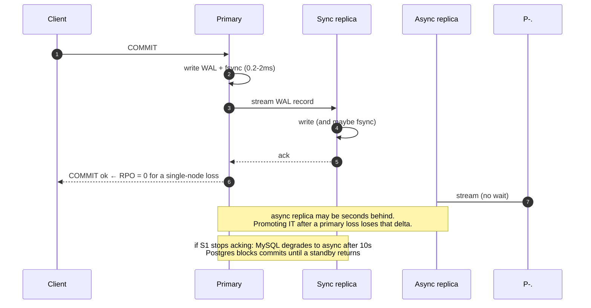
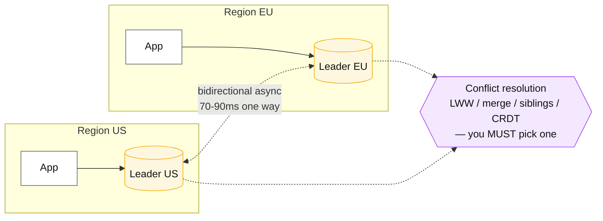

# Replication topologies

## Core concept

Replication is copies of the same data on different machines, and the topology decides three
things that are usually discussed separately: **how much data a failover loses (RPO)**, **how long
it takes (RTO)**, and **whether write conflicts are possible at all**. Single-leader has no
conflicts and a failover event; multi-leader has no failover event and mandatory conflict
resolution; leaderless has neither but gives up ordering.

The distinction that gets lost: "we have replicas" is a statement about read scaling. "We lose up
to 400 ms of committed writes if the primary dies" is a statement about replication, and it is the
one the business cares about. Most teams can name their replica count and cannot name their RPO.

## Mechanics & internals

### What actually ships between nodes

| Method | Ships | Consequence |
|---|---|---|
| **Physical / WAL** (Postgres streaming, Aurora) | Byte-level changes to data pages | Replica is an exact copy; cannot differ in version or platform; cheap to apply |
| **Logical row-based** (MySQL ROW binlog, Postgres logical replication) | Row before/after images | Cross-version and cross-engine possible; foundation of CDC |
| **Statement-based** (MySQL legacy) | The SQL text | Non-deterministic functions (`NOW()`, `RAND()`, triggers) diverge replicas. Effectively deprecated |
| **Trigger / application** | Whatever you write | Full control, worst performance and consistency story |

The reason ROW-based logical replication won is not replication at all — it is that the same
stream feeds search indexes, caches, lakehouses and event streams via CDC. Choosing it is choosing
a future integration surface.

### The durability dial, precisely

Both major engines expose the same trade in different words. This table is worth memorising
because "synchronous replication" means at least four different things:

| Postgres `synchronous_commit` | MySQL equivalent | Commit returns after | RPO on primary loss |
|---|---|---|---|
| `off` | `sync_binlog=0`, `innodb_flush_log_at_trx_commit=2` | Written to OS, not fsynced | Up to seconds of **local** commits lost |
| `local` | `sync_binlog=1` + `innodb_flush_log_at_trx_commit=1` | Local fsync | Everything not yet replicated |
| `remote_write` | semi-sync `AFTER_SYNC` (relay log written) | Replica received and wrote (not fsynced) | Lost only if primary *and* replica fail together |
| `on` | semi-sync with replica fsync | Replica fsynced | ~0 for single-node failure |
| `remote_apply` | — (no clean analogue) | Replica **applied and visible** | ~0, and read-your-writes on that replica is guaranteed |

`remote_apply` is the interesting rung: it is the only setting that makes a replica read safe
immediately after commit, and it costs a full replica apply on every commit. Almost nobody runs
it; almost everybody assumes its guarantee.

**Semi-synchronous is the practical default at scale.** One replica must acknowledge; the rest are
async. The trap is the timeout: MySQL's semi-sync falls back to asynchronous after
`rpl_semi_sync_master_timeout` (default **10 s**), silently. Your RPO guarantee is suspended
exactly when the network is unhealthy — that is, exactly when you were going to need it. Postgres
behaves differently and arguably worse by default: with `synchronous_standby_names` set and the
standby gone, commits **block** rather than degrade. Both behaviours are defensible; neither is
what people assume, and you must say which one you have chosen.

### Failover is a distributed decision, not a switch

The mechanics that decide whether a failover is clean:

1. **Detect.** Health checks that test the port find a hung primary healthy. Deep checks
   (write a heartbeat row, read it back) find real failures — and cause false positives under load.
2. **Choose.** The new primary must be the replica with the highest applied position, or you have
   consciously chosen data loss. This is why the election needs the replication state, not just
   liveness.
3. **Fence the old primary.** A primary that was merely slow will return and, unless fenced,
   accept writes. See [leases-locks-and-fencing.md](./leases-locks-and-fencing.md).
4. **Redirect clients.** DNS TTLs, connection pools with cached endpoints, and long-lived
   connections all extend RTO well past the promotion itself.
5. **Rebuild the old primary.** It has diverged writes; it is not a replica until reseeded or
   rewound (`pg_rewind`).

Steps 3 and 5 are where the incidents live. A failover that gets 1–2 right and 3 wrong is a split
brain — the mechanism behind GitHub's 2018 outage described in
[consistency-models.md](./consistency-models.md).

### Multi-leader and the conflicts it guarantees

Multi-leader buys local write latency and survival of a region isolation event. It costs you the
guarantee that a write, once accepted, is final. Every multi-leader design must answer: what
happens when the same row is written in both regions within the replication window? The honest
answers are last-write-wins (silently discards data), application merge (works when semantics
allow), siblings shown to the user (Dropbox-style conflicted copies), or CRDTs (converge by
construction). "It won't happen because users are sticky to a region" is not an answer; it is an
assumption that fails during a failover, exactly when the system is already degraded.

## Numbers that matter

| Quantity | Value | Confidence |
|---|---|---|
| Local WAL fsync | 0.2–2 ms on NVMe, 5–15 ms on network storage | Order of magnitude — measure |
| Same-AZ semi-sync commit penalty | +0.5–2 ms | Order of magnitude |
| Cross-region synchronous commit penalty | +60–90 ms per commit | The RTT; unavoidable |
| Typical async replica lag | ms–seconds; **minutes** during bulk writes, long transactions, or replica restart | Order of magnitude; it is a distribution with a fat tail |
| MySQL `rpl_semi_sync_master_timeout` | 10 000 ms default, then **silent fallback to async** | [MySQL docs](https://dev.mysql.com/doc/refman/8.0/en/replication-semisync.html) |
| DNS/connection-pool contribution to RTO | 10–60 s if TTLs and pools are not tuned | Common; often larger than the promotion itself |
| Replication factor | 3 (RF=2 tolerates zero failures during maintenance) | Convention with arithmetic behind it |

**RPO arithmetic.** RPO is not a config value; it is `lag × write rate` at the moment of failure.
At 5 000 writes/s and a p99 lag of 800 ms, an async failover loses up to ~4 000 committed writes.
Say that number in a design review and the conversation about semi-sync becomes short.

**RTO arithmetic.** `detect (5–30 s) + elect (1–5 s) + promote (1–10 s) + client redirect
(5–60 s)`. The bound is usually the last term, which no database vendor controls. A team that
tunes failover detection from 30 s to 10 s and leaves a 60 s connection-pool refresh has improved
RTO by nothing.

## Failure modes

| Failure | Symptom | Mitigation |
|---|---|---|
| **Silent semi-sync degradation** | Believed RPO=0; actually async since the last network blip | Alert on the semi-sync status variable itself, not on replica count |
| **Split brain after failover** | Two primaries accept writes; reconciliation is manual and lossy | Fencing (STONITH, VIP revocation, quorum-gated promotion) |
| **Failover to a lagging replica** | Promotion succeeds, minutes of writes vanish | Promotion must compare applied positions; never promote by hostname order |
| **Replication stops silently** | Lag grows unbounded; nobody notices because the port is open | Alert on lag in **both** seconds and bytes; heartbeat table |
| **`Seconds_Behind_Master` lies** | Reports 0 while genuinely behind — it measures the SQL thread, so an IO thread that is not fetching shows healthy | Use a heartbeat row written by the primary, or GTID position diff |
| **Long transaction blocks apply** | Single-threaded apply stalls; lag spikes with no CPU load | Parallel replication (`replica_parallel_workers`), and keep transactions small |
| **Backup and replication confused for each other** | A DELETE replicates to every replica in milliseconds | Replicas are availability. Backups are recovery. They solve different failures |
| **Read-only replica used for writes after failover** | App silently errors or writes to the wrong node | Route through a proxy that knows the topology (ProxySQL, pgpool, Vitess, RDS endpoints) |

**Documented incident.** GitLab, 31 January 2017. A spam-driven write spike destabilised the
primary; **replication had fallen far enough behind that it effectively stopped**, and an engineer
attempting to re-seed the replica ran `rm -rf` against the data directory of the **primary**,
removing ~300 GB. Then the recovery story unravelled: of five documented backup/replication
mechanisms, none worked when needed — the `pg_dump` cron was silently failing because it ran the
PostgreSQL **9.2** client against a **9.6** server and exited with a version error nobody was
alerted on; Azure disk snapshots were not enabled for the database servers; LVM snapshots were
taken only every 24 h. Recovery came from a six-hour-old staging copy: roughly **18 hours of
downtime** and permanent loss of data written between 17:20 and 00:00 UTC — about 5 000 projects,
5 000 comments and 700 new accounts.
([GitLab postmortem](https://about.gitlab.com/blog/postmortem-of-database-outage-of-january-31/))

Three lessons that transfer directly: replication lag was the *first* symptom and was treated as a
nuisance rather than an incident; **an untested backup is not a backup** — the failure was a silent
non-zero exit, not a corrupt file; and the recovery path had never been exercised end to end, so
its five independent mechanisms failed together for five independent reasons.

## Trade-offs vs alternatives

| Topology | Write conflicts | Failover | Read scaling | Fits |
|---|---|---|---|---|
| **Single leader, async replicas** | Impossible | Required; RPO > 0 | Excellent, with lag | The default for OLTP; be explicit about RPO |
| **Single leader, semi-sync** | Impossible | Required; RPO ≈ 0 for one failure | Same | Anything where losing a committed write is unacceptable |
| **Consensus-replicated (Raft/Paxos per shard)** | Impossible | Automatic, seconds | Follower reads with a read index | Systems that want failover to be a non-event — see [consensus-raft-paxos.md](./consensus-raft-paxos.md) |
| **Multi-leader** | **Guaranteed** | No failover step | Local everywhere | Multi-region writes, offline clients, collaborative editing |
| **Leaderless quorum** | Concurrent writes, no order | None | Tunable | Dynamo-style stores — see [quorums-and-anti-entropy.md](./quorums-and-anti-entropy.md) |
| **Shared-storage (Aurora, Neon)** | Impossible | Fast — no data to copy | Very good; replicas read the same storage | Cloud-native OLTP where you accept the vendor's storage layer |

### Where staff engineers get this wrong

1. **Quoting replica count instead of RPO.** "Three replicas" says nothing. `lag × write rate`
   says everything, and it changes hourly.
2. **Believing semi-sync is a guarantee.** It is a guarantee with a timeout that disables it under
   exactly the conditions that would have triggered it.
3. **Treating replicas as backups.** Replication faithfully copies your `DROP TABLE`. GitLab had
   replication *and* five backup mechanisms and still lost data.
4. **Ignoring the client in RTO.** Promotion is fast; connection pools, DNS caches and long-lived
   WebSocket connections are not.
5. **Choosing multi-leader without naming the conflict policy.** If the design review cannot state
   what happens to a concurrent double-write, the policy is "last writer silently wins" whether or
   not anyone chose it.
6. **Sending all reads to replicas.** It works until the lag tail, then it produces bugs that
   look like data loss to users — see
   [replication-lag-and-session-guarantees.md](./replication-lag-and-session-guarantees.md).

## Real-world examples

- **PostgreSQL** — streaming physical replication with five `synchronous_commit` levels; logical
  replication and `pg_rewind` for reattaching a diverged former primary.
- **MySQL / InnoDB** — ROW binlog as the industry's CDC substrate; semi-sync with `AFTER_SYNC`
  as the lossless wait point; GTIDs to make failover position-independent.
- **Amazon Aurora** — decouples the log from compute: replicas share storage, so replica lag is
  typically tens of milliseconds and failover copies no data. A good example of changing the
  trade rather than tuning it.
- **MongoDB** — replica sets with a documented `w: majority` write concern and automatic election;
  the write concern and read concern are separate dials, and defaults have changed across major
  versions.
- **CockroachDB / Spanner** — replication *is* consensus, so there is no separate failover
  procedure and RPO is zero by construction; the cost is a quorum round trip per write.

## Staff-level follow-ups

1. State your system's RPO and RTO as numbers, then show the arithmetic. Which term dominates,
   and what is the cheapest change that halves it?
2. Semi-sync has been silently asynchronous for three weeks because a replica was slow. Which
   metric would have caught it, why is replica lag insufficient, and what do you alert on?
3. Your primary is unreachable but might be alive. Walk through the promotion decision including
   fencing, and state exactly what you do if the old primary returns mid-procedure.
4. Argue for and against `synchronous_commit = remote_apply` for a payments service, with the
   latency number attached to each side.
5. A team wants multi-leader across two regions "so writes are local". Give the three concrete
   conflict scenarios they must resolve and the design change that would let you avoid multi-leader
   entirely while keeping most of the latency benefit.

## See also

- [replication-lag-and-session-guarantees.md](./replication-lag-and-session-guarantees.md) — what the lag does to your product
- [consensus-raft-paxos.md](./consensus-raft-paxos.md) — replication where failover is not an event
- [partitioning-strategies.md](./partitioning-strategies.md) — the other axis
- [quorums-and-anti-entropy.md](./quorums-and-anti-entropy.md) — leaderless replication in full
- [../02-primitives/reliability-patterns.md](../02-primitives/reliability-patterns.md) — DR strategy ladder around all of this

## Referenced by

- [Fundamentals index](README.md)
- [Kafka internals](kafka-internals.md)
- [Partitioning strategies](partitioning-strategies.md)
- [Replication and partitioning](../02-primitives/replication-and-partitioning.md)
- [Replication lag and session guarantees](replication-lag-and-session-guarantees.md)
- [Topic manifest](../topics/manifest.md)

## Sources

- [GitLab — postmortem of the database outage of January 31, 2017](https://about.gitlab.com/blog/postmortem-of-database-outage-of-january-31/) and the [live incident doc](https://about.gitlab.com/blog/gitlab-dot-com-database-incident/)
- [PostgreSQL — synchronous_commit and streaming replication](https://www.postgresql.org/docs/current/runtime-config-wal.html)
- [MySQL — semisynchronous replication](https://dev.mysql.com/doc/refman/8.0/en/replication-semisync.html)
- [Amazon Aurora — storage and replication architecture (SIGMOD 2017)](https://www.amazon.science/publications/amazon-aurora-design-considerations-for-high-throughput-cloud-native-relational-databases)
- Local book: `DE/System-Design/Designing Data Intensive Applications.pdf` ch.5
