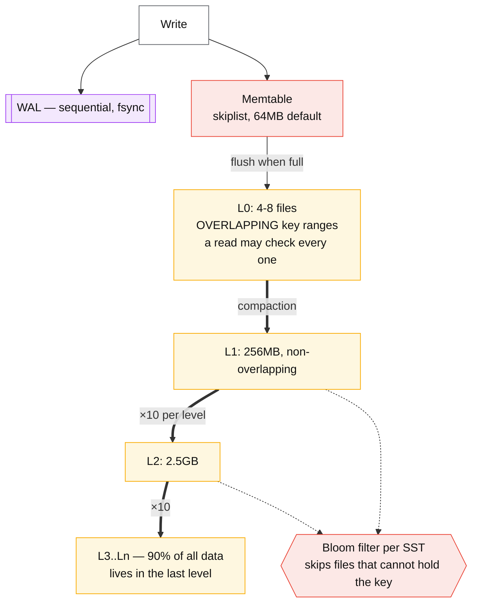
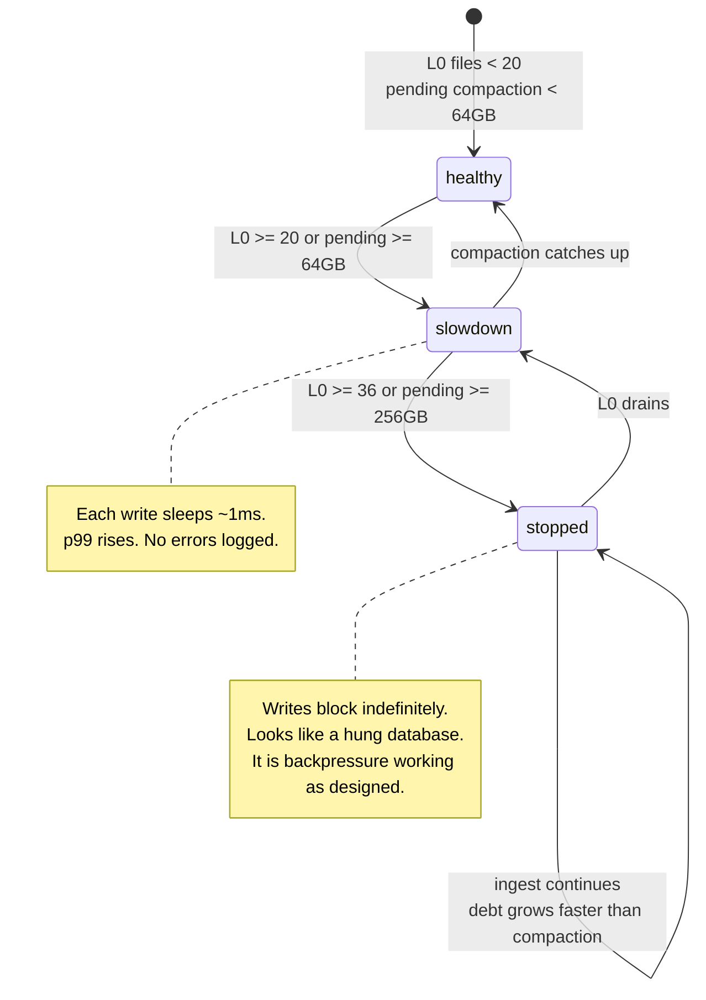

# Storage engines — B-tree vs LSM

## Core concept

Every storage engine spends the same three currencies — **read amplification, write
amplification, space amplification** — and the RUM conjecture says you can optimise two at the
cost of the third. A B-tree updates in place: one read finds the page, one write dirties it, space
is bounded by fill factor. An LSM tree never updates in place: writes go to a memtable and become
immutable sorted files, so writes are sequential and cheap, and the debt is repaid later by
**compaction**, which is where all the interesting failures live.

The staff-level framing is not "LSM is write-optimised". It is that **an LSM engine defers work,
and deferred work arrives at a time you do not choose.** A benchmark shows you the deferral; only
production shows you the repayment.

## Mechanics & internals

### B-tree: update in place

Fixed-size pages (InnoDB 16 KB, Postgres 8 KB) in a balanced tree, 3–4 levels deep for almost any
real table. A point lookup is `O(log n)` page reads, nearly all cached. A write must be durable
before it is applied, so every engine writes twice: once to a log, once to the page.

- **InnoDB** writes to the redo log *and* the **doublewrite buffer** — protection against torn
  pages, since a 16 KB page write is not atomic against a 4 KB device sector.
- **PostgreSQL** writes **full page images** to the WAL for the first modification of each page
  after a checkpoint (`full_page_writes`), for the same reason. This is why WAL volume spikes
  immediately after every checkpoint and why checkpoint tuning is a real lever.

Page splits are the B-tree's structural cost: an insert into a full page splits it, which under
random-key inserts (UUIDv4 primary keys) fragments the tree and inflates writes. Sequential keys
avoid splits but concentrate contention on the rightmost leaf. **This is the same trade as
partition-key choice, one layer down.**

### LSM: never update in place

Two properties explain most LSM behaviour:

- **L0 files overlap.** Everywhere below L0, key ranges within a level are disjoint, so a read
  checks at most one file per level. In L0 it may check *all* of them. That is why L0 file count
  is the number RocksDB throttles on.
- **The last level holds ~90% of the data**, because each level is ~10× the one above. Any
  operation that rewrites the last level (a full compaction, a schema-wide TTL sweep) moves nearly
  the entire dataset.

**Compaction strategies** are the actual choice:

| Strategy | Write amp | Read amp | Space amp | Use |
|---|---|---|---|---|
| **Leveled** (RocksDB default, Cassandra LCS) | High — ~10–30× | Low, one file per level | Low, ~1.1× | Read-heavy, space-constrained |
| **Tiered / universal** (Cassandra STCS, RocksDB universal) | Low — ~4–10× | High, many overlapping files | **High — up to 2×** | Write-heavy, space is cheap |
| **Tiered + leveled hybrid** | Between | Between | Between | What most tuned systems converge on |
| **Time-window (TWCS)** | Low | Low *for time-range reads* | Low | Time-series with TTL — whole SSTables expire together |

Universal compaction "always increases space amplification" in RocksDB's own words: you may need
**2× the dataset size in free disk** for a full compaction to complete. Running an LSM at 70% disk
is not conservative, it is required.

### Write stalls — the failure that defines LSM operations

RocksDB does not fail when compaction falls behind. It **slows your writes down on purpose**, and
then stops them:

| Trigger | Effect |
|---|---|
| `level0_slowdown_writes_trigger` (default 20) | Each write sleeps ~1 ms — a soft brake |
| `level0_stop_writes_trigger` (default 36) | **Writes block indefinitely** until L0→L1 compaction catches up |
| `soft_pending_compaction_bytes` (64 GB) | Slowdown |
| `hard_pending_compaction_bytes` (256 GB) | Full stop |

The symptom in production is unmistakable and routinely misdiagnosed: **write latency goes from
1 ms to seconds with no change in traffic, no CPU saturation, and no error in the logs.** The
database is healthy and deliberately braking. The fix is never "retry harder" — it is more
compaction threads, a bigger memtable, a different compaction strategy, or less write volume.

### Bloom filters and the read path

An LSM point read consults the memtable, then each candidate SST. Bloom filters make most of those
checks free: a filter says "definitely not here" or "maybe here", so only files that might contain
the key are opened. At the standard 10 bits/key the false-positive rate is ~1%, which means ~1% of
files are opened unnecessarily.

The important limitation: **bloom filters do not help range scans.** A range query must open a
file per level regardless, which is why LSM range performance is far more sensitive to compaction
health than point-lookup performance is.

### Deletes are writes

In an LSM, a delete inserts a **tombstone**. The row is not gone until every SST containing it has
been compacted away, and until then reads must scan past every tombstone in range. A
queue-shaped table — insert, read, delete, repeat over the same key range — becomes progressively
unreadable, which is Cassandra's most common self-inflicted outage and why its documentation warns
about tombstone thresholds. See [quorums-and-anti-entropy.md](./quorums-and-anti-entropy.md) for
the correctness half of the same story (tombstone resurrection).

## Numbers that matter

| Quantity | Value | Confidence |
|---|---|---|
| B-tree page size | InnoDB 16 KB, Postgres 8 KB | Vendor defaults |
| B-tree depth for 100 M rows | 3–4 levels | Arithmetic: fan-out ~100–500 per page |
| B-tree write amplification | ~2–3× (log + page, plus full-page images / doublewrite) | Order of magnitude |
| LSM write amplification, leveled | 10–30× | [RocksDB wiki](https://github.com/facebook/rocksdb/wiki/Leveled-Compaction); depends on level multiplier |
| LSM write amplification, universal/tiered | 4–10× | Lower writes, higher space and read cost |
| LSM space amplification, universal | Up to **2×** during compaction | RocksDB wiki — plan disk accordingly |
| `level0_stop_writes_trigger` | 36 files (default) → writes block | [RocksDB write stalls](https://github.com/facebook/rocksdb/wiki/Write-Stalls) |
| Bloom filter | 10 bits/key ⇒ ~1% false positive | Standard configuration |
| Fraction of data in the last level | ~90% | Consequence of a 10× level multiplier |
| Compaction share of IO on a write-heavy LSM | Often **majority** of total device writes | Order of magnitude; measure `compaction_write_bytes` vs user writes |

**The arithmetic that decides the engine.** 20 k writes/s × 1 KB = 20 MB/s of user writes. On a
leveled LSM at 20× amplification that is **400 MB/s of device writes**, sustained — beyond a
single consumer NVMe drive's sustained write endurance budget and well into the range where SSD
wear becomes a line item. On a B-tree at 3× it is 60 MB/s. Write amplification is not an academic
metric; it is the number that sizes your disks and predicts when they die.

## Failure modes

| Failure | Symptom | Mitigation |
|---|---|---|
| **Write stall** | p99 write latency jumps 1 ms → seconds; CPU and traffic unchanged; no errors | More compaction threads, larger memtable, different strategy; alert on L0 file count and pending compaction bytes **before** the stop trigger |
| **Compaction debt spiral** | Compaction never catches up; stalls become permanent | Rate-limit ingest; the only real fix is reducing write volume or adding nodes |
| **Disk full during compaction** | Universal compaction needs up to 2× dataset size and cannot proceed | Keep 30–50% headroom on tiered strategies |
| **Tombstone accumulation** | Reads on a key range time out; the data is "deleted" | Model away from queue-shaped partitions; TWCS for time-series; monitor tombstone-per-read |
| **B-tree page splits under random keys** | Write throughput degrades as the table grows; fragmentation | Sequential-ish primary keys (ULID, snowflake), or accept and rebuild periodically |
| **Checkpoint storm (Postgres)** | Periodic IO spikes and WAL volume jumps after every checkpoint | Tune `checkpoint_completion_target`, spread checkpoints; know that full-page writes cause it |
| **Bloom filters absent on range-heavy workload** | Reads scale with file count and nobody understands why | Bloom filters do not help ranges — the fix is compaction health or a different key layout |
| **Benchmark measures the deferral** | Excellent load-test numbers, terrible week-two production | Benchmark past the point where compaction reaches steady state, not for 10 minutes |

**Documented case.** Uber's 2016 migration from Postgres to MySQL is the best-published account of
storage-engine internals driving an architecture decision. Their core complaint was **write
amplification from secondary indexes**: Postgres index entries point at the physical tuple
location (`ctid`), so an update that creates a new tuple version must add entries to **every**
index, even for columns that did not change. InnoDB's secondary indexes store the **primary key**
instead, so only indexes on modified columns are touched. Worse, Postgres replicates the physical
WAL, so index write amplification became **replication amplification** — a verbose stream
saturating cross-datacentre bandwidth.

Two caveats a staff engineer should attach when citing it, because the article is often quoted
uncritically: Postgres's HOT (heap-only tuple) updates avoid the index churn when no indexed
column changes and the page has room, and much of the pain was version-specific. The transferable
lesson is not "Postgres is bad" — it is that **the physical-vs-logical pointer choice in secondary
indexes is a first-order performance decision**, and that replication inherits whatever
amplification the storage layer creates.
([Uber engineering](https://www.uber.com/en-US/blog/postgres-to-mysql-migration/),
[Robert Haas's response](https://rhaas.blogspot.com/2016/08/ubers-move-away-from-postgresql.html))

## Trade-offs vs alternatives

| | B-tree | LSM |
|---|---|---|
| Point read | Predictable, ~1 page read | Memtable + bloom-filtered SSTs; more variable |
| Range scan | Excellent, ordered leaves | Good, but degrades with compaction debt |
| Write | Random IO, in-place, 2–3× amp | Sequential, 4–30× amp, **deferred** |
| Space | Fragmentation, ~1.3× | 1.1× (leveled) to 2× (tiered) |
| Latency shape | Steady | Steady **until** a stall |
| Concurrency | Latches, page contention on hot leaves | Fewer write conflicts; compaction competes for IO |
| Operational surface | Vacuum/checkpoint tuning | Compaction strategy, stall triggers, disk headroom |

### Where staff engineers get this wrong

1. **"LSM is faster for writes."** LSM makes writes *cheaper at the moment of the write* and more
   expensive in total. On a device where sequential and random writes cost nearly the same, that
   trade is far weaker than the folklore assumes.
2. **Ignoring space amplification when picking tiered compaction.** Needing 2× the dataset in free
   space is a capacity decision, not a tuning detail.
3. **Treating write stalls as a bug.** They are the engine's designed backpressure. Alert on the
   leading indicators (L0 file count, pending compaction bytes) rather than on the symptom.
4. **Benchmarking before steady state.** A 10-minute test measures the memtable and never sees
   compaction. Run until compaction bandwidth stabilises, or the number is fiction.
5. **Forgetting deletes cost reads.** In an LSM, `DELETE` is an insert. Queue-shaped access
   patterns punish this specifically.
6. **Choosing the engine before the access pattern.** Range-scan-heavy analytics on an LSM tuned
   for writes, or write-heavy ingest on a B-tree with six secondary indexes — both are the same
   mistake in opposite directions.

## Real-world examples

- **RocksDB** — the LSM everyone actually runs: embedded in TiKV, CockroachDB, Kafka Streams,
  MyRocks, Flink state backends. Its wiki is the canonical documentation of write stalls,
  compaction styles and their amplification numbers.
- **InnoDB** — B+tree with clustered primary key, secondary indexes storing the PK, redo log plus
  doublewrite buffer, change buffer for deferred secondary index maintenance.
- **PostgreSQL heap + B-tree** — non-clustered heap with `ctid`-pointing indexes, MVCC versions in
  the heap, HOT updates as the mitigation, and full-page writes after checkpoints.
- **Cassandra / ScyllaDB** — pluggable compaction (STCS, LCS, TWCS); the choice is the single
  biggest operational lever and TWCS exists specifically because time-series deletes wholesale.
- **Aurora / Neon** — the third answer: keep a B-tree engine and push the log to a distributed
  storage layer, so replication and durability stop being the engine's problem.

## Staff-level follow-ups

1. Your write p99 jumped from 2 ms to 4 s on an LSM store, with unchanged traffic and 30% CPU.
   Give your diagnosis order, the exact metrics you would read, and the two mitigations you would
   apply in the first ten minutes.
2. Compute device write throughput for 20 k writes/s of 1 KB records under leveled and universal
   compaction, then use the result to argue for a specific instance type and disk size.
3. Explain why the same table can be fine on a B-tree and pathological on an LSM, using a
   queue-shaped access pattern. Then design around it without changing engines.
4. Uber's `ctid` argument: state the mechanism precisely, then state two conditions under which it
   does not apply. Would you migrate a database over it today?
5. A team wants to store 10 TB of time-series with a 30-day TTL. Choose a compaction strategy,
   justify it against the alternatives, and say what breaks if the retention becomes 30 days for
   most rows and 3 years for a few.

## See also

- [indexing-and-query-planning.md](./indexing-and-query-planning.md) — what the engine's index layout costs at query time
- [quorums-and-anti-entropy.md](./quorums-and-anti-entropy.md) — tombstones as a correctness problem
- [partitioning-strategies.md](./partitioning-strategies.md) — key choice one layer up, same trade
- [../02-primitives/storage-and-databases.md](../02-primitives/storage-and-databases.md) — the bundled note being split
- [../05-data-cases/clickstream-lakehouse.md](../05-data-cases/clickstream-lakehouse.md) — columnar storage for the analytics half

## Referenced by

- [Fundamentals index](README.md)
- [Indexing and query planning](indexing-and-query-planning.md)
- [Storage and databases](../02-primitives/storage-and-databases.md)
- [Topic manifest](../topics/manifest.md)

## Sources

- [RocksDB wiki — Write Stalls](https://github.com/facebook/rocksdb/wiki/Write-Stalls), [Leveled Compaction](https://github.com/facebook/rocksdb/wiki/Leveled-Compaction), [Universal Compaction](https://github.com/facebook/rocksdb/wiki/Universal-Compaction)
- [Uber — Why Uber Engineering switched from Postgres to MySQL](https://www.uber.com/en-US/blog/postgres-to-mysql-migration/) and [Robert Haas's rebuttal](https://rhaas.blogspot.com/2016/08/ubers-move-away-from-postgresql.html)
- [Athanassoulis et al. — Designing Access Methods: The RUM Conjecture (EDBT 2016)](https://stratos.seas.harvard.edu/files/stratos/files/rum.pdf)
- [PostgreSQL — WAL configuration and full page writes](https://www.postgresql.org/docs/current/wal-configuration.html)
- [Cassandra — compaction strategies](https://cassandra.apache.org/doc/latest/cassandra/operating/compaction/index.html)
- Local book: `DE/System-Design/Designing Data Intensive Applications.pdf` ch.3
