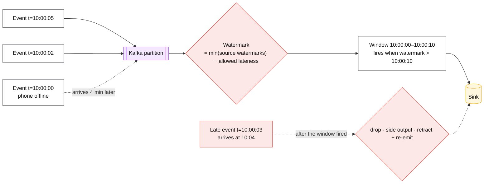
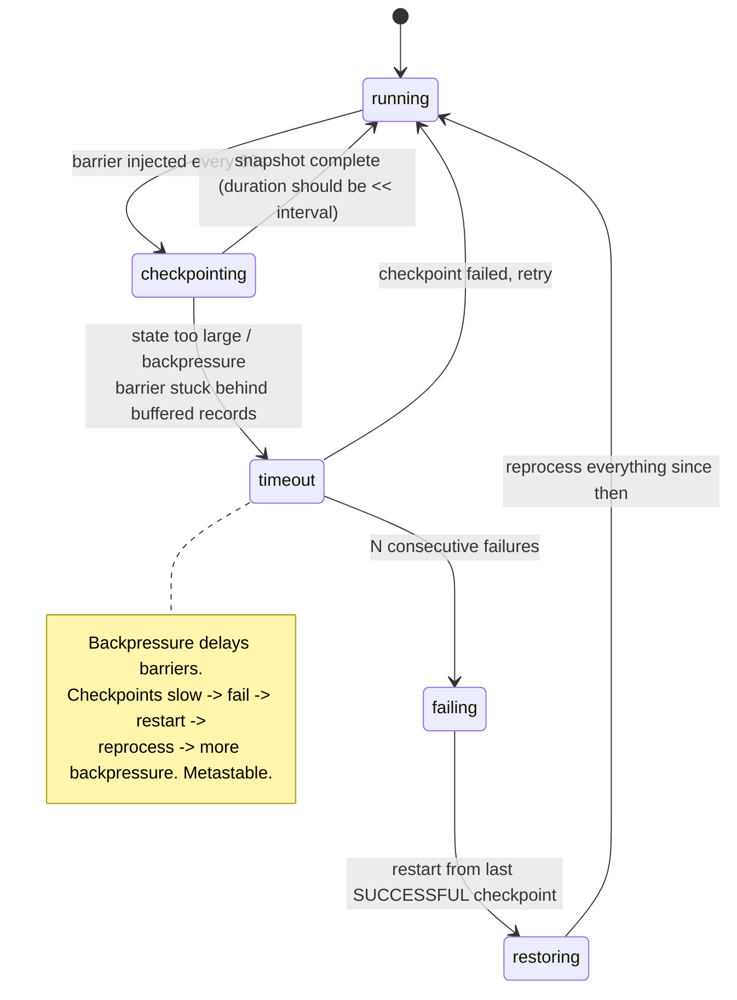

# Stream processing semantics

## Core concept

Batch processing gets to see all the data before it answers. Streaming never does, so every
streaming system must answer one question continuously: **"have I seen enough of this time window
to emit a result?"** The answer is a **watermark** — an assertion that no event older than time
`T` will arrive — and it is always a guess. Set it aggressively and you emit results that later
data contradicts; set it conservatively and every result is delayed by your worst-case straggler.

Two consequences follow that separate a staff answer from a tutorial:

1. **Event time is a property of the data; processing time is a property of your infrastructure.**
   Any aggregate defined in processing time changes its answer when you replay it, which makes it
   unreproducible and therefore unverifiable.
2. **The watermark is only as fast as your slowest source partition.** One idle or lagging
   partition holds back the watermark for the entire job, so windows across every key stop firing
   while throughput and CPU look perfectly healthy.

## Mechanics & internals

### Event time, processing time, and the skew between them

A watermark of `T` claims all events with timestamp `< T` have arrived. It is generated per source
partition — usually `max_seen_timestamp − allowed_out_of_orderness` — and the operator's watermark
is the **minimum across its inputs**. That minimum is where the pain lives:

- **An idle partition emits no events, so its watermark never advances**, and the job's watermark
  freezes. Flink's fix is `withIdleness(...)`, marking a source idle so it stops holding the
  minimum back. Forgetting it is one of the most common "my windows stopped firing" incidents.
- **A lagging partition** (rebalance, slow consumer, backfill) has the same effect while looking
  like healthy consumption elsewhere.

Late data — arriving after its window fired — has exactly three dispositions, and the design must
name one: **drop** (fast, lossy, and the silent default in many APIs), **side output** (route to a
dead-letter stream for reconciliation), or **retract and re-emit** (correct, and requires every
downstream consumer to handle updates, which usually means an upsert sink).

### Windows

| Window | Shape | Cost | Use |
|---|---|---|---|
| **Tumbling** | Fixed, non-overlapping | One window per key alive | Per-minute counts, billing periods |
| **Sliding / hopping** | Fixed, overlapping | **size ÷ slide** windows alive per key simultaneously | Moving averages — a 1 h window sliding every 1 min keeps 60 copies of state per key |
| **Session** | Gap-based, dynamic | Windows merge as events arrive; unbounded until the gap closes | User sessions, engagement |
| **Global + custom trigger** | You decide | You own correctness | Custom emission policies |

The sliding-window arithmetic is the one that surprises teams: a 1-hour window sliding every
minute means **60× the state** of the equivalent tumbling window. Budget it before choosing.

### Checkpointing: how state survives a crash

Flink uses asynchronous barrier snapshotting (a variant of Chandy–Lamport): the job manager injects
a barrier into the sources; each operator, on receiving barriers from all inputs, snapshots its
state and forwards the barrier; when all operators complete, the checkpoint is durable. Recovery
rewinds sources to the checkpoint's offsets and restores state — which is why **exactly-once here
means exactly-once state updates**, not exactly-once side effects.

The feedback loop in that note is the classic Flink outage: backpressure delays barriers,
checkpoints time out, the job restarts, restarting replays everything since the last successful
checkpoint, that replay creates more backpressure. **Rising checkpoint duration is the leading
indicator** — alert on the trend, not on failures.

Unaligned checkpoints (Flink 1.11+) let barriers overtake buffered in-flight records, decoupling
checkpoint duration from backpressure. They cost more state (the in-flight buffers are snapshotted)
and are the standard mitigation for exactly this loop.

### State is the real operational object

Streaming state (RocksDB-backed, keyed by the partitioning key) is a database you did not plan to
run:

- **Size** grows with key cardinality × retention. Session windows over user IDs with no TTL grow
  without bound; state TTL is not optional.
- **Restore time** scales with state size — a 500 GB state restore is tens of minutes of downtime
  after a crash, which is your real RTO.
- **Rescaling** redistributes keyed state across new parallelism, so changing parallelism is a
  stop-restore-redistribute operation, not a scaling event.
- **Schema evolution** of state is the same problem as database migration, with fewer tools.

## Numbers that matter

| Quantity | Value | Confidence |
|---|---|---|
| Checkpoint interval | 10 s–5 min; **duration should be well under the interval** | Convention; rising duration is the leading indicator |
| Allowed out-of-orderness | Seconds to minutes; mobile clients justify minutes | Product decision — it is a latency/completeness dial |
| Late-data window | Minutes to hours if a side output exists | Design decision; state it |
| Sliding-window state multiplier | `size ÷ slide` — 1 h / 1 min = **60×** | Arithmetic |
| State restore time | ~minutes per 100 GB, order of magnitude | Depends on storage and parallelism; **this is your RTO** |
| End-to-end latency, event-time pipeline | `watermark delay + window size + checkpoint alignment` | Not the framework's per-record latency — that is the number vendors quote |
| Watermark lag alert | Alert when it exceeds allowed out-of-orderness by a wide margin | The `currentInputWatermark` metric is the first thing to check |

**The latency arithmetic nobody quotes.** With 30 s of allowed out-of-orderness, 5-minute tumbling
windows and 60 s checkpoints, end-to-end latency for a *complete* result is ~5.5 minutes, not the
sub-second per-record figure in the benchmark. If the product needs sub-minute answers, the window
size is the constraint — no amount of tuning changes it.

## Failure modes

| Failure | Symptom | Mitigation |
|---|---|---|
| **Idle partition stalls the watermark** | Windows stop firing across the whole job; throughput and CPU look normal | `withIdleness(...)` on sources; alert on `currentInputWatermark` per source |
| **Checkpoint/backpressure death spiral** | Checkpoint duration climbs, then timeouts, then restarts, then more backpressure | Unaligned checkpoints, larger interval, fix the actual bottleneck, scale the sink |
| **Unbounded state** | Job memory/disk grows for weeks then fails; restore takes hours | State TTL; bound key cardinality; session-window gap limits |
| **Late data silently dropped** | Aggregates quietly under-count; nobody notices for months | Side output plus a metric on dropped-late-record count. **Always emit the metric** |
| **Processing-time aggregation** | Replaying the job produces different numbers; results are unverifiable | Event time for anything that must reconcile with batch |
| **Clock skew at the producer** | Events timestamped in the future push the watermark forward and prematurely close windows | Clamp future timestamps at ingestion; alert on them |
| **Rescaling surprise** | Changing parallelism requires a savepoint, stop and restore — minutes of downtime | Plan parallelism changes as maintenance; use adaptive scheduling knowingly |
| **Sink not idempotent** | Restart from checkpoint re-emits results; downstream double-counts | Upsert sinks keyed by window+key; two-phase-commit sinks where supported |

**Documented case.** Pinterest's Flink platform hit exactly the watermark-driven version of this:
event-time pipelines suffered **slowed watermark progression in an inner-join operator**, which
produced backpressure and then checkpoint failures — made worse because a high-volume topic
consumed bandwidth and starved the backfill of a second topic, holding the join's watermark back.
Their fix was **per-topic rate limiting** so one source could not starve another, plus dedicated
observability for backpressure, checkpoint duration and watermark lag.

Two lessons transfer directly: a join's watermark is the minimum of its inputs, so **the slowest
input sets the latency of the whole operator**; and the leading indicators are watermark lag and
checkpoint duration, not CPU or throughput, which stay healthy while the job silently stops
producing results.
([Pinterest engineering](https://medium.com/pinterest-engineering/unified-flink-source-at-pinterest-streaming-data-processing-c9d4e89f2ed6))

## Trade-offs vs alternatives

| Approach | Freshness | Correctness | Complexity | Choose when |
|---|---|---|---|---|
| **Batch (hourly/daily)** | Hours | Complete; trivially reproducible | Low | Freshness need is hours; the default until proven otherwise |
| **Micro-batch (Spark Structured Streaming)** | Seconds–minutes | Good; batch mental model | Medium | Existing Spark investment; minute-level freshness |
| **True streaming (Flink)** | Sub-second–seconds | Event-time correct with watermarks | **High** — state, checkpoints, rescaling, watermarks | Freshness is a product requirement, not a preference |
| **Streaming SQL (Materialize, RisingWave, ksqlDB)** | Seconds | Incremental view maintenance | Medium | The transformation is expressible as SQL over a few streams |
| **Lambda (batch + streaming)** | Both | Batch reconciles the stream | **Highest** — two implementations of every rule | Regulatory need for a reconciled batch answer |
| **Kappa (stream only, replay to fix)** | Seconds | One code path, replay corrects | Medium-high | Retention supports replay; one implementation is worth a lot |

### Where staff engineers get this wrong

1. **Quoting per-record latency as end-to-end latency.** Watermark delay plus window size plus
   checkpoint alignment is the real number, and it is often minutes.
2. **Forgetting idle sources.** A partition with no traffic freezes the whole job's watermark. This
   costs a full day of debugging the first time.
3. **Choosing sliding windows without the state multiplier.** `size ÷ slide` copies of state per
   key is a capacity decision made by a one-line API call.
4. **Dropping late data silently.** If there is no metric for late records, the aggregate is
   unverifiably wrong. Emit the count even if you drop the data.
5. **Using processing time because it is easier.** It is, and the result cannot be reproduced,
   backfilled or reconciled — which usually surfaces during an audit.
6. **Treating state as ephemeral.** It is a database with restore times, migrations, backups
   (savepoints) and a growth curve. Restore time is your recovery objective.
7. **Streaming when batch would do.** Most "real-time" requirements are satisfied by five-minute
   micro-batches at a fraction of the operational cost. Make someone name the decision that needs
   sub-minute freshness.

## Real-world examples

- **Google Dataflow model (VLDB 2015)** — the paper that gave the field *what/where/when/how*:
  what is computed, where in event time, when in processing time results are emitted, and how
  refinements relate. Everything since is an implementation of this vocabulary.
- **Apache Flink** — asynchronous barrier snapshots, RocksDB keyed state, savepoints, unaligned
  checkpoints; the reference implementation for event-time correctness.
- **Pinterest** — per-topic rate limiting after watermark starvation in a join caused checkpoint
  failures; a purpose-built observability suite for watermark lag and checkpoint duration.
- **Netflix** — dedicated Flink observability with per-task backpressure and checkpoint dashboards,
  because the framework's default metrics do not surface the leading indicators.
- **Kafka Streams** — the lighter alternative: state in RocksDB backed by changelog *topics*, so
  recovery replays the changelog rather than restoring a snapshot. Different trade, same problems.

## Staff-level follow-ups

1. Your windows stopped firing at 03:00 with no errors, healthy CPU and normal throughput. Give the
   diagnosis order and the exact metric that confirms it.
2. Compute end-to-end latency for a pipeline with 30 s allowed lateness, 5-minute tumbling windows
   and 60 s checkpoints — then redesign it for a 1-minute freshness requirement, saying what
   correctness you gave up.
3. A team wants a 24-hour sliding window updated every minute, keyed by user, over 40 M users.
   Compute the state implications and propose an alternative that answers the same product
   question.
4. Late events arrive up to 6 hours after their event time, for 0.1% of traffic. Design the
   handling end to end, including what downstream consumers must support and what you tell the
   business about numbers that change after the fact.
5. Argue for replacing a Flink job with an hourly batch job. What would you measure to make the
   case, and what would make the argument fail?

## See also

- [kafka-internals.md](./kafka-internals.md) — the source these jobs consume, and its rebalance behaviour
- [delivery-semantics.md](./delivery-semantics.md) — exactly-once state versus exactly-once effects
- [log-vs-queue.md](./log-vs-queue.md) — why replay is the property that makes streaming recoverable
- [../05-data-cases/realtime-analytics.md](../05-data-cases/realtime-analytics.md) — a full design built on these primitives
- [../02-primitives/messaging-and-streams.md](../02-primitives/messaging-and-streams.md) — the bundled note being split

## Referenced by

- [Fundamentals index](README.md)
- [Kafka internals](kafka-internals.md)
- [Log vs queue](log-vs-queue.md)
- [Messaging and streams](../02-primitives/messaging-and-streams.md)
- [Topic manifest](../topics/manifest.md)

## Sources

- [Akidau et al. — The Dataflow Model (VLDB 2015)](https://research.google/pubs/pub43864/) — event time, watermarks, triggers, accumulation
- [Apache Flink — event time, watermarks and idleness](https://nightlies.apache.org/flink/flink-docs-stable/docs/concepts/time/)
- [Apache Flink — checkpointing and unaligned checkpoints](https://nightlies.apache.org/flink/flink-docs-stable/docs/ops/state/checkpoints/)
- [Pinterest — Unified Flink Source at Pinterest](https://medium.com/pinterest-engineering/unified-flink-source-at-pinterest-streaming-data-processing-c9d4e89f2ed6) and [Tuning Flink clusters for stability and efficiency](https://medium.com/pinterest-engineering/tuning-flink-clusters-for-stability-and-efficiency-50d3d50384ed)
- [Chandy & Lamport — Distributed snapshots (1985)](https://lamport.azurewebsites.net/pubs/chandy.pdf)
- Local book: `DE/System-Design/Designing Data Intensive Applications.pdf` ch.11
