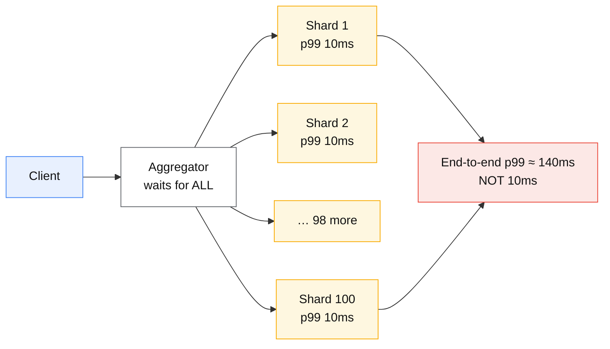
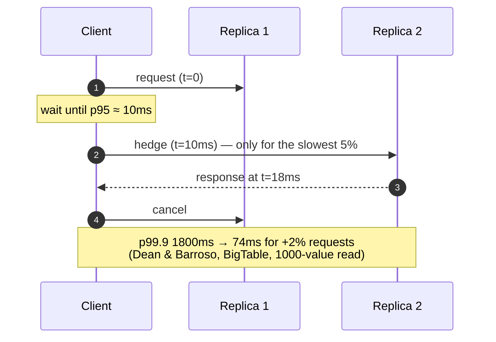

# Tail latency

## Core concept

At scale, the tail is not an edge case — it is **the common case**, because fan-out multiplies it.
Dean and Barroso's arithmetic is the one number every staff engineer should have memorised: a
service whose per-server p99 is 1 second, called on 100 servers per user request, produces a
user-visible p99 of **63%** — nearly two thirds of requests wait a second or more, from a service
that is "fast 99% of the time".

`P(at least one slow) = 1 − 0.99^100 ≈ 63%`

Two consequences follow. First, **averages are worse than useless** — they hide exactly the
behaviour that determines user experience and system stability. Second, **you cannot fix the tail
by making the average faster**; you fix it by removing variance, by not waiting for the slowest
component, or by not fanning out.

## Mechanics & internals

### Where the tail comes from

Variability is not a bug to be found and removed; it is structural, and the sources are mostly not
your code:

| Source | Typical magnitude | Note |
|---|---|---|
| **Queueing** | Unbounded past the utilisation knee | The dominant cause — see [queueing-theory-basics.md](./queueing-theory-basics.md) |
| **GC / runtime pause** | 10 ms–seconds | JVM, Go STW phases, CLR |
| **Background daemons** | 10–100 ms | Compaction, log rotation, backups, anti-virus, monitoring agents |
| **Shared resource contention** | Variable | Noisy neighbours on CPU, memory bandwidth, network, disk |
| **Energy/thermal management** | 10s of ms | CPU frequency transitions, C-state exit |
| **Retries and timeouts** | Multiples of the timeout | A retry after 1 s adds 1 s to that request's tail by construction |
| **Cache misses / cold starts** | 10–1000× the hit path | The miss path *is* the tail — see [caching-strategies.md](./caching-strategies.md) |

### Fan-out amplification, as arithmetic

| Fan-out N | P(at least one > per-server p99) | Effective percentile you must design for |
|---|---|---|
| 1 | 1% | p99 |
| 10 | 9.6% | ~p99.9 per server |
| 100 | **63%** | ~p99.99 per server |
| 1 000 | 99.996% | p99.999 per server |

The rule that falls out: **to hold an end-to-end p99 with a fan-out of N, each backend must meet
roughly the `1 − (0.01/N)` percentile.** At N=100 you are designing against per-server p99.99, not
p99. This is why "our service is fast" and "the product is slow" coexist so often.

### The techniques that actually work

**1. Hedged requests.** Send the request; if it has not returned by roughly the 95th-percentile
latency, send a duplicate to another replica and take the first response. The paper's measured
result is the reason this is worth building: in a BigTable benchmark reading 1 000 values,
hedging after a **10 ms** delay cut the p99.9 from **1 800 ms to 74 ms** while issuing only
**2% more requests**. Waiting until p95 is what makes the extra load tiny — you only duplicate the
slowest 5%.

**2. Tied requests.** Send to two replicas *simultaneously*, each told about the other; whichever
dequeues the work first sends a cancellation to the twin. This attacks the dominant source —
queue position — rather than waiting for a timeout to reveal it, at the cost of a small window
where both may start.

**3. Micro-partitioning and selective replication.** Cut data into far more partitions than
machines, so a slow machine's share can be redistributed quickly and hot partitions can be
replicated more heavily. Load balancing becomes continuous rather than a rebuild.

**4. Latency-induced probation.** Temporarily remove a slow replica from rotation while still
shadowing traffic to it, and return it when it recovers. Slow nodes hurt more than dead ones,
because a dead node is routed around and a slow node is not.

**5. Return incomplete results.** With a deadline, return what you have. Web search does this
routinely: a slightly worse result set now beats a perfect one after the user has left. This
requires the product to define what "good enough" means — an engineering decision that has to be
made by the product.

### Measuring the tail without lying to yourself

- **Percentiles do not average and do not add.** The mean of per-host p99s is not the fleet p99.
  Aggregate raw histograms (HDR histogram, t-digest, Prometheus native histograms), never the
  summaries.
- **Coordinated omission** is the standard measurement bug: a load generator that waits for a
  response before sending the next request stops sending during a stall, so the stall is never
  measured. The result systematically under-reports the tail, often by an order of magnitude.
  Use a generator that sends on a schedule (`wrk2`, and Gil Tene's argument for why).
- **Measure at the edge**, where the user is, including DNS, TLS, queueing and retries. A p99
  measured inside the service excludes exactly the parts that dominate the user's experience.
- **Watch p99.9 and max.** For a system with fan-out, p99.9 per backend is what sets the
  user-visible p99.

## Numbers that matter

| Quantity | Value | Confidence |
|---|---|---|
| Fan-out 100, per-server p99 | **63%** of requests hit at least one slow backend | `1 − 0.99^100` |
| Fan-out 100, per-server p99 = 10 ms | End-to-end p99 ≈ 140 ms | [Dean & Barroso](https://www.barroso.org/publications/TheTailAtScale.pdf) |
| Hedged request, 10 ms delay (BigTable, 1 000 values) | p99.9 **1 800 ms → 74 ms**, **+2%** requests | Dean & Barroso — the number that justifies hedging |
| Hedge threshold | ~p95 of the operation | Keeps duplicate load ≈ 5%, usually far less |
| GC pause, tuned modern collector | 1–10 ms; **100 ms–seconds** on large heaps without one | Order of magnitude |
| Percentile needed per backend for end-to-end p99 at fan-out N | `1 − 0.01/N` — p99.99 at N=100 | Arithmetic |
| Coordinated-omission error | Often **10×** understatement of the tail | Order of magnitude; depends on stall duration |

**The design arithmetic.** A request touching 20 services sequentially with each at p99 = 20 ms
does not have a 20 ms p99 — it has roughly `1 − 0.99^20 = 18%` chance of hitting at least one slow
hop. Reducing hops is a tail-latency strategy, and it is usually cheaper than optimising any single
hop. This is a concrete argument against chatty service decomposition that does not depend on
anyone's opinion about microservices.

## Failure modes

| Failure | Symptom | Mitigation |
|---|---|---|
| **Averages in the dashboard** | Everything looks healthy while users complain | Percentiles and histograms; delete the mean-latency graph |
| **Averaged percentiles** | Fleet p99 computed as the mean of host p99s — wrong and always optimistic | Aggregate histograms, not summaries |
| **Coordinated omission** | Load tests show a great tail; production does not | Constant-rate load generators |
| **Fan-out without a deadline** | One slow shard holds the whole response; timeouts stack | Per-fan-out deadline, return partial results, hedge |
| **Slow node still in rotation** | A degraded node poisons every request that touches it | Latency-based health checks and probation, not just liveness |
| **Retry as the tail fix** | Retries add load precisely when the system is slow, deepening the tail | Hedge (bounded, ~2%) instead of retry storms — see [timeouts-retries-backoff.md](./timeouts-retries-backoff.md) |
| **Hedging everything** | Duplicate load doubles capacity requirements and can trigger overload | Hedge only past ~p95, cap hedge rate, disable under load shedding |
| **Tail hidden by client-side timeout** | The tail becomes an error rate instead of a latency graph, and dashboards look fine | Track timeouts as latency outcomes, not just failures |

**Documented analysis.** *The Tail at Scale* remains the reference because it reframes variability
as a **systems property to be managed rather than an anomaly to be eliminated**. Its central
observation: as fan-out grows, the probability that at least one component is slow approaches
certainty, so the only durable strategies are **tolerating** variability (hedging, tied requests,
partial results) rather than trying to remove it. Google's own numbers show why the tolerance
approach wins — a 10 ms hedge delay removed 96% of the p99.9 latency for 2% more work, which no
amount of per-server tuning would have achieved.
([Dean & Barroso, CACM 2013](https://www.barroso.org/publications/TheTailAtScale.pdf))

## Trade-offs vs alternatives

| Technique | Tail reduction | Extra load | Complexity | Use when |
|---|---|---|---|---|
| **Hedged requests** | Large (measured 96% of p99.9) | ~2–5% | Low — client-side | Idempotent reads with replicas. The best value in the list |
| **Tied requests** | Larger; attacks queueing directly | Small window of duplicate work | Medium — needs server cooperation | Same-datacentre replicas with a fast cancel path |
| **Micro-partitioning** | Structural | None | Medium — more partitions to manage | Slow-node redistribution and hot-partition replication |
| **Latency probation** | Removes the worst offenders | None | Low | Fleets where slow nodes are common |
| **Partial results** | Bounds the tail absolutely | None | Product decision required | Search, feeds, recommendations |
| **Reduce fan-out** | Best possible | None | Architectural | When the fan-out was accidental — denormalise, batch, or cache |
| **Just optimise p50** | Little | None | — | Almost never the answer for a fan-out system |

### Where staff engineers get this wrong

1. **Optimising the average.** The p50 improvement is invisible to the user whose request touched
   the one slow shard. Design against the percentile the fan-out implies.
2. **Treating the tail as bad luck.** It is queueing, GC, background work and contention — all
   structural, all predictable, none of which disappear with better code.
3. **Retrying to fix latency.** A retry is a hedge with terrible timing: it fires *after* a
   timeout, adding load when the system is already slow. Hedging at p95 is the disciplined version.
4. **Hedging without a cap.** Unbounded hedging under load doubles traffic during an incident.
   Cap the hedge rate and disable it when shedding.
5. **Averaging percentiles across hosts.** Mathematically meaningless and always flattering.
6. **Believing the load test.** Coordinated omission means most home-grown benchmarks under-report
   the tail by an order of magnitude.
7. **Accepting fan-out as given.** Reducing the number of hops is usually the largest and cheapest
   tail win available.

## Real-world examples

- **Google (BigTable, web search)** — hedged and tied requests in production, partial results under
  deadline, latency-induced probation; the source of every number in this page.
- **Netflix** — adaptive concurrency limits and per-dependency isolation so one slow dependency
  cannot consume the shared thread pool and widen everyone's tail.
- **Facebook** — CoDel plus adaptive LIFO: bound the queueing that causes the tail, and serve the
  freshest request first when a queue forms (see [queueing-theory-basics.md](./queueing-theory-basics.md)).
- **Envoy / gRPC** — hedging and retry policies with budgets built into the proxy layer, so the
  behaviour is uniform across languages rather than reimplemented per service.
- **HdrHistogram / t-digest / Prometheus native histograms** — the measurement infrastructure that
  makes tail claims verifiable rather than rhetorical.

## Staff-level follow-ups

1. Your service has p99 = 15 ms and a request touches 40 of them. Compute the user-visible p99,
   then give three interventions ranked by cost-effectiveness.
2. Design hedging for a read path: threshold, cap, interaction with retries and load shedding, and
   what you do when the hedge also times out.
3. Explain coordinated omission to a team whose load test reports a 30 ms p99 while production
   reports 400 ms, and describe the experiment that settles it.
4. Which is worse for tail latency — a node that is dead or a node that is 10× slow? Justify it,
   then design the health check that catches the second case.
5. A product manager asks to cut average latency by 20%. Reframe the request in tail terms and say
   what you would actually measure and change.

## See also

- [queueing-theory-basics.md](./queueing-theory-basics.md) — why the tail exists at all
- [timeouts-retries-backoff.md](./timeouts-retries-backoff.md) — deadlines, and why retries are the wrong hedge
- [load-shedding-and-admission-control.md](./load-shedding-and-admission-control.md) — bounding the tail by refusing work
- [cache-failure-modes.md](./cache-failure-modes.md) — the miss path as a tail generator
- [../02-primitives/observability-and-delivery.md](../02-primitives/observability-and-delivery.md) — measuring percentiles honestly

## Referenced by

- [Fundamentals index](README.md)
- [Load shedding and admission control](load-shedding-and-admission-control.md)
- [Queueing theory basics](queueing-theory-basics.md)
- [Reliability patterns](../02-primitives/reliability-patterns.md)
- [Timeouts, retries and backoff](timeouts-retries-backoff.md)
- [Topic manifest](../topics/manifest.md)

## Sources

- [Dean & Barroso — The Tail at Scale (CACM 2013)](https://www.barroso.org/publications/TheTailAtScale.pdf) — fan-out arithmetic, hedged and tied requests, the BigTable measurements
- [Google SRE Book — Addressing cascading failures / handling overload](https://sre.google/sre-book/addressing-cascading-failures/)
- [Gil Tene — How NOT to measure latency (coordinated omission)](https://www.infoq.com/presentations/latency-response-time/)
- [Facebook — Fail at Scale (ACM Queue 2015)](https://queue.acm.org/detail.cfm?id=2839461)
- [Envoy — request hedging and retry policies](https://www.envoyproxy.io/docs/envoy/latest/configuration/http/http_filters/router_filter)
