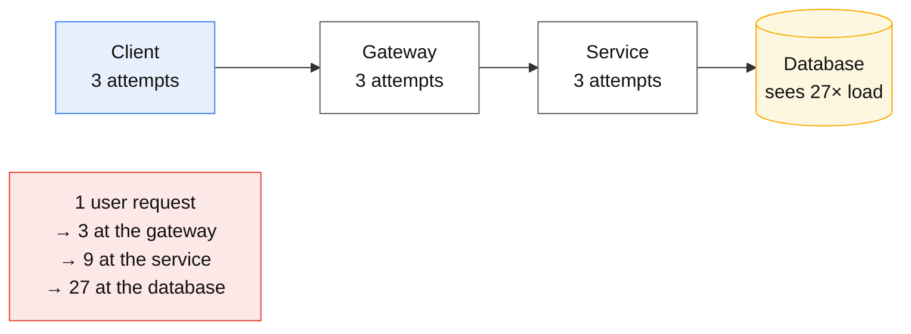
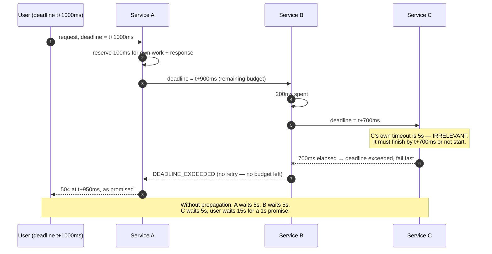

# Timeouts, retries and backoff

## Core concept

Retries are the most dangerous reliability feature in common use, because they are **positive
feedback applied at exactly the moment the system is least able to absorb it**. A dependency slows
down; every caller retries; offered load multiplies; the dependency slows further. The mechanism
that was supposed to hide a transient failure is what converts it into an outage.

Three rules contain it, and all three are frequently missing:

1. **A deadline, propagated end to end** — not a per-hop timeout, which stacks.
2. **A retry budget** — a global cap on the *fraction* of traffic that is retries, so retry load is
   bounded no matter how many callers decide to retry.
3. **Retries at one layer only** — because layered retries multiply, and three layers of three
   attempts is a **27×** load amplifier.

The staff-level framing: a timeout is a **guess about someone else's latency distribution**, and a
retry is a **decision to spend more of a resource that is already scarce**. Both should be
justified with numbers, not defaults.

## Mechanics & internals

### Retry amplification, as arithmetic



Each layer multiplies rather than adds. The rule is simple and rarely followed: **retry at exactly
one layer** — usually the one that knows the request is idempotent and owns the deadline — and
make every other layer fail fast. If a layer cannot know whether a retry is safe, it must not
retry.

### Timeouts stack; deadlines do not

A per-hop timeout is a local guess, and a chain of them produces a worst case that is the *sum* of
the chain — a user waiting 30 s for a request everyone believed had a 5 s timeout. A **deadline**
is an absolute point in time, passed with the request; each hop computes its remaining budget and
refuses to start work it cannot finish.



Deadline propagation also removes the most wasteful behaviour in distributed systems: **work
performed for a caller who has already given up**. gRPC propagates deadlines natively; HTTP has no
standard for it, so most stacks pass an explicit header (`X-Request-Deadline`, or an OpenTelemetry
baggage entry) and enforce it in middleware.

### Backoff and jitter

Exponential backoff alone does not solve synchronisation: clients that failed together retry
together, forever, in waves. **Jitter is what breaks the wave**, and the standard formulation is
*full jitter*:

```
sleep = random_between(0, min(cap, base × 2^attempt))
```

AWS's published comparison found full jitter both reduces total work and shortens completion time
versus plain exponential backoff or "equal jitter" variants. It is one line of code and it is the
difference between a recovering system and a system that re-collapses on every retry wave.

Two additional rules that matter as much as the formula:

- **Cap the backoff** (`cap`), or a long outage produces retries an hour apart and recovery looks
  like a hang.
- **Retry the *right* errors.** Retrying a 400 or a validation failure is guaranteed waste;
  retrying a 429 or 503 without honouring `Retry-After` is antisocial. Timeouts are the ambiguous
  case: the request may have succeeded, so retrying requires idempotency — see
  [idempotency.md](./idempotency.md).

### Retry budgets: the control that actually bounds load

Per-request retry limits ("3 attempts") bound the *individual* request and not the *system*. If
every request fails, offered load still triples. A **retry budget** caps retries as a fraction of
successful traffic — typically **10%** — using a token bucket: successes add tokens, retries spend
them. Under a broad outage the budget empties and retries stop, so the dependency sees roughly
normal load plus 10% instead of 3×.

Google's SRE practice adds **client-side adaptive throttling**: each client tracks `requests` and
`accepts` over a window and rejects locally with probability

```
max(0, (requests − K × accepts) / (requests + 1))     with K = 2
```

so a client that is being refused stops generating load *before* it reaches the server. That is the
key property — the cheapest place to reject a request is the client, and the second cheapest is
your own edge.

### Circuit breakers are the coarse version

A breaker trips when the error rate crosses a threshold, fails fast for a cooldown, then admits a
trickle of probes. It is complementary rather than alternative: budgets shape steady-state retry
load, breakers stop a dead dependency from consuming resources at all. The classic mistake is a
breaker with **no fallback** — tripping it converts a slow dependency into a hard failure with no
degraded path, which is sometimes worse than the timeout it replaced.

## Numbers that matter

| Quantity | Value | Confidence |
|---|---|---|
| Layered retries, 3 layers × 3 attempts | **27×** amplification | Arithmetic — the number to quote in review |
| Retry budget | **10%** of successful request rate | Common default (gRPC `retryThrottling`, Envoy budgets, Google SRE) |
| Google SRE adaptive throttling | Reject with `max(0, (requests − 2×accepts)/(requests+1))` | [SRE Book, Handling Overload](https://sre.google/sre-book/handling-overload/) |
| Backoff base / cap | base 10–100 ms, cap 1–30 s | Convention; the cap matters as much as the base |
| Full jitter | `random(0, min(cap, base × 2^n))` | [AWS Architecture Blog](https://aws.amazon.com/blogs/architecture/exponential-backoff-and-jitter/) — least work, fastest completion |
| Timeout target | ~p99.9 of the healthy dependency, **not** a round number | If you cannot name the p99.9, you cannot justify the timeout |
| Attempts | 2–3 total, then fail | Beyond 3, you are hiding a dependency problem from yourself |
| Connect vs request timeout | Connect 100–500 ms; request from the deadline budget | Connect failures are fast and safe to retry; request timeouts are ambiguous |

**The number that ends the argument.** A dependency at 5 000 rps that starts failing, with clients
retrying 3× and no budget, offers **15 000 rps** to a system that has just proven it cannot serve
5 000. With a 10% budget it offers 5 500. The difference between those two numbers is whether the
dependency recovers on its own or requires you to turn traffic off — see
[cascading-and-metastable-failures.md](./cascading-and-metastable-failures.md).

## Failure modes

| Failure | Symptom | Mitigation |
|---|---|---|
| **Retry storm** | Load multiplies exactly when the dependency is degraded; recovery never happens | Retry budgets, adaptive throttling, retry at one layer |
| **Layered retries** | 27× amplification nobody designed | Retry at one layer; make others fail fast and say so in the API contract |
| **Stacked timeouts** | User waits 15 s for a "1 s" request | Deadline propagation with remaining-budget arithmetic |
| **No jitter** | Synchronised retry waves; the system recovers and re-collapses on a period | Full jitter on every backoff |
| **Retrying non-idempotent writes** | Duplicate charges, duplicate messages | Idempotency keys; only retry when safety is established |
| **Timeout longer than the caller's deadline** | Work completed for a caller who left; resources burned for nothing | Deadline propagation; refuse work you cannot finish in budget |
| **Timeout set to a round number** | 30 s "because that's the default" — 300× the p99.9, so failures take forever to detect | Derive from the measured distribution |
| **Breaker with no fallback** | Trip converts slow into hard-down with no degraded mode | Name the degraded behaviour per dependency before adding the breaker |
| **Retrying on 4xx** | Guaranteed-useless load, plus rate-limit escalation | Classify errors: retryable (429/503/timeouts) vs not |

**Documented incident.** AWS Kinesis, 25 November 2020, us-east-1 — a **17-hour** disruption
triggered by a routine capacity addition. Every front-end server in the Kinesis fleet connects to
every other and dedicates a **thread per connection**; the added capacity pushed the fleet past the
operating system's maximum thread count. The front-end fleet failed, and because many AWS services
depend on Kinesis, the failure propagated into CloudWatch, Cognito, EventBridge and others within
an hour.

The retry-relevant lesson is in the recovery: the fleet could not simply be restarted, because
bringing servers back caused each to rebuild full-mesh state, and doing it too quickly would have
re-triggered the failure. Recovery had to proceed **slowly and deliberately** for hours. This is
the signature of a system whose failure state generates its own load: adding capacity or
restarting fast makes it worse, which is exactly the situation retries create at smaller scale.
([AWS post-event summary](https://aws.amazon.com/message/11201/))

## Trade-offs vs alternatives

| Control | Bounds | Cost | Use when |
|---|---|---|---|
| **Per-request attempt limit** | One request's cost | None | Always — but it does not bound system load |
| **Retry budget (token bucket)** | **System-wide** retry load | A little bookkeeping | Always, in any service that retries |
| **Adaptive client throttling** | Load before it leaves the client | Client-side state | High fan-in services with many clients |
| **Circuit breaker** | Resource use against a dead dependency | Needs a fallback and tuning; can flap | Dependencies that fail hard rather than slow |
| **Hedging** | *Latency*, not failures | ~2–5% extra load | Idempotent reads; see [tail-latency.md](./tail-latency.md) |
| **Fail fast, no retry** | Everything | Transient errors reach the user | Non-idempotent writes; deep layers that do not own the deadline |
| **Queue and retry later (async)** | Bounded synchronous load | Latency; a queue to operate | Work that does not need an immediate answer |

### Where staff engineers get this wrong

1. **Believing an attempt limit bounds load.** It bounds one request. The budget bounds the system.
2. **Retrying at every layer.** Each layer independently reasonable, jointly a 27× amplifier. Pick
   the layer, document it, make the others fail fast.
3. **Timeouts as round numbers.** A 30 s default on a 20 ms dependency means failures take 30 s to
   detect and threads are held for 1 500× the normal time. Derive from p99.9.
4. **Backoff without jitter.** The retry wave stays synchronised and the system re-collapses on a
   period, which looks mysterious in dashboards.
5. **Retrying ambiguous writes without idempotency.** The timeout case is precisely the one where
   the request may have succeeded.
6. **Adding a breaker without a fallback.** You have chosen a hard failure over a slow one; make
   sure that is what you wanted.
7. **Ignoring `Retry-After`.** The server told you when to come back; ignoring it converts
   graceful shedding into a retry storm.

## Real-world examples

- **AWS SDKs** — full jitter backoff by default, adaptive retry mode with a client-side token
  bucket; the published comparison of jitter strategies is the reference.
- **gRPC** — deadlines are first-class and propagate through the call chain; `retryThrottling`
  implements a token-bucket retry budget in the client library.
- **Envoy** — retry policies with budgets (`retry_budget`), per-try timeouts, and hedging, applied
  uniformly at the proxy so every language gets the same behaviour.
- **Google SRE** — client-side adaptive throttling with the `K=2` accept-rate formula, plus
  criticality labels so retries of low-criticality work are dropped first.
- **AWS Kinesis 2020** — the cautionary tale for recovery: systems whose failure mode generates
  load cannot be restarted quickly.

## Staff-level follow-ups

1. Compute the load your dependency sees when it starts failing, with and without a 10% retry
   budget, at 5 000 rps and 3 attempts. Then decide where the budget is enforced and why.
2. Design deadline propagation across four services including the arithmetic each hop performs and
   the behaviour when the remaining budget is smaller than the expected work.
3. Your dependency's p99.9 is 240 ms and its timeout is 30 s. Explain what that costs you during a
   partial failure, then choose a timeout and defend it.
4. Which errors do you retry, which do you not, and what is your rule for the ambiguous ones? Give
   the mechanism that makes the ambiguous case safe.
5. A team proposes retries at the client, the gateway and the service "for defence in depth".
   Explain the arithmetic and propose the alternative that gives them what they actually want.

## See also

- [cascading-and-metastable-failures.md](./cascading-and-metastable-failures.md) — what a retry storm becomes
- [load-shedding-and-admission-control.md](./load-shedding-and-admission-control.md) — the other side of the same control loop
- [queueing-theory-basics.md](./queueing-theory-basics.md) — why extra load past the knee is so expensive
- [idempotency.md](./idempotency.md) — what makes a retry safe at all
- [tail-latency.md](./tail-latency.md) — hedging as the disciplined alternative to retrying for latency

## Referenced by

- [Cascading and metastable failures](cascading-and-metastable-failures.md)
- [Fundamentals index](README.md)
- [Load shedding and admission control](load-shedding-and-admission-control.md)
- [Queueing theory basics](queueing-theory-basics.md)
- [Reliability patterns](../02-primitives/reliability-patterns.md)
- [Tail latency](tail-latency.md)
- [Topic manifest](../topics/manifest.md)

## Sources

- [AWS Architecture Blog — Exponential backoff and jitter](https://aws.amazon.com/blogs/architecture/exponential-backoff-and-jitter/) — full jitter, measured against alternatives
- [AWS — Timeouts, retries and backoff with jitter (Builders' Library)](https://aws.amazon.com/builders-library/timeouts-retries-and-backoff-with-jitter/)
- [Google SRE Book — Handling Overload](https://sre.google/sre-book/handling-overload/) — retry budgets, client-side adaptive throttling
- [AWS — summary of the Kinesis event in us-east-1 (25 November 2020)](https://aws.amazon.com/message/11201/)
- [gRPC — retry design and throttling](https://github.com/grpc/proposal/blob/master/A6-client-retries.md)
- [Envoy — retry budgets and per-try timeouts](https://www.envoyproxy.io/docs/envoy/latest/intro/arch_overview/http/http_connection_management)
