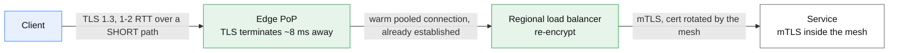

# TLS and connection setup

## Core concept

Before a single byte of your response exists, the client has already spent round trips: DNS, then
TCP, then TLS. On a cross-ocean path at 120 ms RTT that is **360 ms of nothing happening** with
TLS 1.2, and the only three levers are *fewer round trips*, *shorter round trips*, or *don't set
up the connection again*.

The staff-level content is the **RTT ladder** — knowing exactly how many round trips each option
costs and what each one gives up — plus one security decision that gets waved through in most
designs: 0-RTT data is **replayable**, and treating it as ordinary request data is a correctness
bug with a security consequence.

## Mechanics & internals

### The RTT ladder

```
TCP + TLS 1.2, new connection      1 (TCP) + 2 (TLS) = 3 RTT before the request
TCP + TLS 1.3, new connection      1 (TCP) + 1 (TLS) = 2 RTT
TCP + TLS 1.3, resumed (PSK)       1 (TCP) + 1 (TLS) = 2 RTT   ← TCP still costs one
TCP + TLS 1.3, resumed + 0-RTT     1 (TCP) + 0       = 1 RTT   ← request rides the first flight
QUIC, new connection               1 RTT total (transport + crypto are one handshake)
QUIC, resumed + 0-RTT              0 RTT — request in the very first packet
Reused warm connection             0 RTT — always the cheapest, and the one people forget
```

At 120 ms RTT that is 360 ms → 240 ms → 120 ms → 0 ms. The single biggest win is not a protocol
upgrade at all: it is **connection reuse**, which costs nothing and is defeated by a client that
opens a fresh connection per request.

### What TLS 1.3 actually changed

- **One round trip** for a full handshake: the client guesses the key-share group and sends it in
  the `ClientHello`, so the server can reply with its own share and `Finished` together. If the
  guess is wrong the server sends `HelloRetryRequest` and you are back to two round trips — which
  is why the group your fleet offers by default matters.
- **The cipher list collapsed** to a handful of AEAD suites. The sprawling negotiation matrix of
  1.2, and the downgrade attacks it enabled, is gone.
- **Almost everything after `ServerHello` is encrypted**, including the certificate. The SNI
  value is not, by default — Encrypted Client Hello exists to close that, and adoption is partial.
- **Session resumption is a PSK**, established by a `NewSessionTicket` the server sends after the
  handshake, not the 1.2 session-ID/ticket mechanism.

### 0-RTT, and the thing people skip

0-RTT lets a resumed client send application data in its first flight. The cost is precise: **an
attacker who captures that flight can replay it**, and the server has no handshake state yet with
which to detect the duplicate.

So the rule is not "0-RTT is unsafe", it is:

> 0-RTT data must be **idempotent and non-state-changing**. `GET` of a public asset, yes.
> Anything that mutates, moves money, or consumes a one-time token, no.

The practical implementation is that the terminator restricts early data to safe methods, or the
application enforces [idempotency](idempotency.md) keys anyway — which, if you have done the work
in that page, you already have.

### Termination placement



**This is the whole reason an edge tier helps uncacheable traffic.** The expensive handshake
happens over 8 ms instead of 120 ms, and the long-haul leg rides a connection that is already
open. A CDN in front of a pure API with a 0% hit rate still removes hundreds of milliseconds.

Three placements, three different security postures:

| Where TLS ends | Buys | Costs |
|---|---|---|
| **Edge** | Shortest handshake path, connection reuse to origin | Plaintext inside your network unless you re-encrypt |
| **Load balancer** | Central cert management, offload from services | Same |
| **Service (end-to-end)** | Strongest posture, per-service identity | Handshake cost per hop, cert rotation everywhere — this is what a mesh automates |

### Certificates at scale

SNI is what allows many certificates on one IP: the client names the host in the clear in the
`ClientHello`, and the terminator picks the matching certificate. Before SNI, each certificate
needed its own IP address — which is still offered by some providers at a price, and is worth
knowing about only because the quota for it is tiny.

Automated issuance and renewal is not optional past a few dozen domains: 90-day certificates mean
continuous renewal, and **certificate expiry remains one of the most common causes of
self-inflicted total outages** precisely because it is a silent countdown with no load signal.

## Numbers that matter

```
Handshake CPU:  an RSA-2048 signature is roughly an order of magnitude more
                server work than ECDSA P-256. On a handshake-heavy tier this is
                the difference between one machine and several.
Session tickets: cut CPU AND a round trip. A fleet that cannot share ticket keys
                across terminators resumes only when the client lands on the same
                machine — so a naive load balancer silently disables resumption.
Record size:    TLS records are up to 16 KB. A too-large first record delays
                first paint because the whole record must arrive to decrypt.
Cert renewal:   90-day certs = renewal every ~60 days = continuous automation.
                50,000 domains ≈ 700+ issuances/day.
Expiry alerting: 30 / 14 / 7 days, and a hard page at 3. The failure is total,
                sudden, and affects every client at once.
```

## Failure modes

| Failure | What it looks like | Why |
|---|---|---|
| **Certificate expiry** | Everything fails at once, at a precise second | No gradual signal. The only defence is automation plus runway alerting |
| **No connection reuse** | p99 latency is ~3 RTT worse than p50 and nobody knows why | Client library opens a connection per request, or the pool is smaller than the concurrency |
| **Session resumption silently off** | Handshake CPU high, latency worse than the docs promise | Ticket keys not shared across the terminator fleet |
| **`HelloRetryRequest` on every handshake** | TLS 1.3 costs 2 RTT instead of 1 | Client's offered key-share group is not one the server accepts |
| **0-RTT replay** | A duplicate side effect nobody can explain | Early data allowed for a non-idempotent request |
| **Clock skew** | Handshake failures on a subset of clients | Certificate validity is time-bound; a device with a wrong clock cannot connect |
| **Mixed cert chain** | Works in browsers, fails in older clients and some SDKs | Intermediate not served, or a cross-signed path the client cannot build |
| **QUIC blocked** | Silent fallback to TCP, no error | UDP/443 dropped by a corporate or mobile network — design for the fallback existing |

## Trade-offs vs alternatives

| Choice | Take it when | Give up |
|---|---|---|
| **TLS 1.3 only** | You control the clients, or the long tail is negligible | Ancient clients — measure the tail before deciding, do not assume |
| **Allow TLS 1.2** | Public internet, broad device mix | A larger cipher surface and a slower handshake |
| **0-RTT on** | Read-heavy public traffic | Replay safety unless restricted to idempotent requests |
| **QUIC/HTTP3** | Mobile-heavy, lossy networks, connection migration matters | UDP is blocked in places; more CPU per byte than TCP in many stacks |
| **Terminate at edge** | Latency is the priority | Plaintext hop unless you re-encrypt |
| **End-to-end mTLS** | Zero-trust or regulated | Handshake per hop, and a rotation system you must operate |

## Real-world examples

- **QUIC's connection migration** — a connection ID rather than the 4-tuple identifies the
  connection, so a phone moving from Wi-Fi to cellular keeps it. TCP cannot do this, and on
  mobile it is the difference between a stall and nothing visible.
- **Head-of-line blocking** was the argument for QUIC: one lost TCP segment stalls every HTTP/2
  stream on that connection, because TCP must deliver bytes in order. QUIC moves loss recovery
  per-stream. See [application-protocols.md](application-protocols.md).
- **Expiry outages** are so routine at large companies that "who owns the certificate for X" is a
  standard incident-review question, and the answer is usually "nobody knew".

## On AWS and Azure

| | AWS | Azure |
|---|---|---|
| **The service** | CloudFront and ALB terminate viewer TLS; ACM issues and auto-renews certificates; ACM Private CA for internal mTLS | Azure Front Door and Application Gateway terminate; App Service Managed Certificates or Key Vault certificates; Azure Traffic Manager health probes ride HTTPS |
| **What you configure** | The **security policy** on the distribution, which sets the minimum protocol *and* the cipher list together — not two separate knobs; certificate source (ACM in `us-east-1` for CloudFront); SNI vs dedicated IP | Minimum TLS version on the front end, certificate source (managed or Key Vault), origin re-encryption settings |
| **The default that bites** | CloudFront's security policies are **named by vintage** — `TLSv1.2_2019`, `TLSv1.2_2021`, `TLSv1.2_2025`, `TLSv1.3_2025` — and the *year matters*, because each one drops ciphers the previous allowed. Pinning `TLSv1_2016` because "it works" quietly keeps `DES-CBC3-SHA` and `TLSv1` enabled years later. Note also that **TLS 1.3 is supported under every policy**, so the minimum version is the only thing you are choosing | **Traffic Manager's support for TLS 1.0 and 1.1 ended on 28 February 2025** — a health-probe path, not a data path, which is exactly the kind of dependency that is not in anyone's TLS inventory. Its HTTPS probing also "doesn't verify whether your TLS/SSL certificate is valid, it only checks that the certificate is present", so an expired certificate passes the health check |
| **What it costs you** | Serving HTTPS with **dedicated IP addresses is quota-limited to 2 certificates per account** (there is no quota when using SNI), and **1 certificate per distribution** — so the answer is SNI, and any design assuming dedicated IPs per tenant is dead on arrival. Quantum-safe key exchanges (`X25519MLKEM768`, `SecP256r1MLKEM768`) are **TLS 1.3 only** | Certificate lifecycle is the operational cost: a probe that cannot see expiry plus a renewal you did not automate is the classic total outage, and nothing in the platform will warn you from the traffic side |

The lesson both make concrete: **the thing that takes you down is not the protocol version, it is
the certificate.** Spend the design effort on automated renewal and expiry runway alerting, and
pick the newest security policy your measured client tail can accept.

## In an LLM deployment

- **Time-to-first-token is dominated by setup on a cold connection.** Two to three round trips at
  120 ms is 240–360 ms before the model is even asked. Terminating TLS at an edge near the user
  reclaims most of it, and it applies to every request because completions are uncacheable.
- **Streaming makes connection reuse worth more than usual.** A client that holds a warm pooled
  connection pays 0 RTT; one that reconnects per completion pays the ladder every time, and the
  user sees it directly as a slower first token.
- **Never enable 0-RTT for an inference endpoint.** A replayed completion request is a duplicated
  charge and, for anything agentic, a duplicated *action*. The replay window is small and the
  blast radius is not.
- **mTLS between a gateway and model servers** is the usual internal posture, and the handshake
  cost is irrelevant there — those connections are long-lived and pooled, which is exactly the
  case where end-to-end encryption is nearly free.

## Staff-level follow-ups

1. Your API's p99 is 400 ms worse than p50 for a subset of clients. Walk me from that symptom to
   connection setup, and say what you would measure to confirm it.
2. A team wants 0-RTT enabled globally for latency. What is your answer, and what would have to be
   true for it to become yes?
3. Where do you terminate TLS for a regulated workload, and how do you defend the plaintext hop
   if there is one?
4. You have 50,000 customer domains on 90-day certificates. Design the issuance and renewal
   pipeline, including what pages you at 3am and what does not.
5. QUIC is blocked for 4% of your users. How do you find that out, and what does the fallback cost
   them?

## See also

- [dns-and-anycast.md](dns-and-anycast.md) — the round trips that happen *before* these
- [application-protocols.md](application-protocols.md) — what runs on top once the handshake ends
- [cdn-and-edge-caching.md](cdn-and-edge-caching.md) — why terminating near the user is the single
  biggest latency win for uncacheable traffic
- [idempotency.md](idempotency.md) — the property that makes 0-RTT safe, for the same reason it
  makes retries safe

## Referenced by

- [Application protocols](application-protocols.md)
- [CDN and edge caching](cdn-and-edge-caching.md)
- [Design a CDN](../03-backend-cases/cdn.md)
- [DNS and anycast](dns-and-anycast.md)
- [Fundamentals index](README.md)
- [Topic manifest](../topics/manifest.md)

## Sources

- [AWS — supported protocols and ciphers between viewers and CloudFront](https://docs.aws.amazon.com/AmazonCloudFront/latest/DeveloperGuide/secure-connections-supported-viewer-protocols-ciphers.html) — security policy names and vintages (`TLSv1_2016` through `TLSv1.3_2025`), TLS 1.3 supported under every policy, `DES-CBC3-SHA` and `RC4-MD5` present only in the oldest policies, and quantum-safe key exchanges (`X25519MLKEM768`, `SecP256r1MLKEM768`) supported only with TLS 1.3
- [AWS — CloudFront quotas](https://docs.aws.amazon.com/AmazonCloudFront/latest/DeveloperGuide/cloudfront-limits.html) — 2 SSL certificates per account when serving HTTPS with dedicated IP addresses (no quota with SNI), 1 certificate per distribution
- [Azure — Traffic Manager endpoint monitoring](https://learn.microsoft.com/en-us/azure/traffic-manager/traffic-manager-monitoring) — TLS 1.0 and 1.1 support ended 28 February 2025; HTTPS monitoring checks only that a certificate is present, not that it is valid
- RFC 8446 (TLS 1.3, including early data and replay), RFC 9000 / 9001 (QUIC and its TLS binding)
