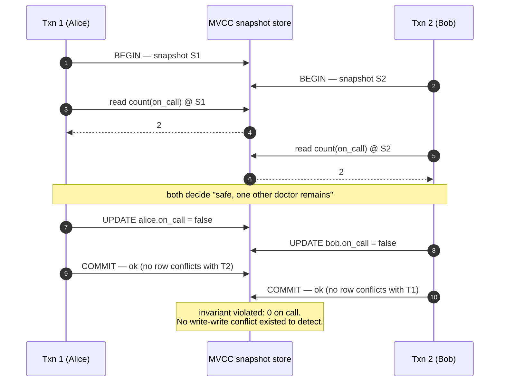
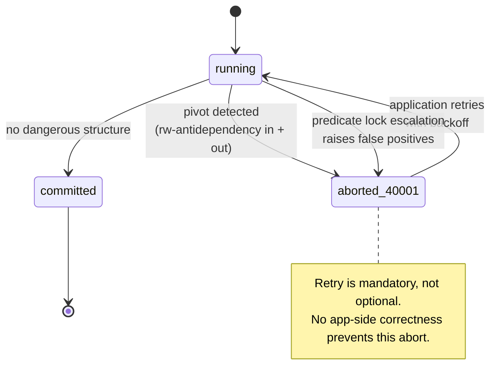

# Transaction isolation levels

## Core concept

The ANSI SQL levels are defined by the anomalies they forbid, and that definition has been known to
be broken since 1995: the phenomena are stated ambiguously enough that snapshot isolation — which
forbids none of the three named anomalies in the way ANSI intended and permits one they never named
— can call itself `REPEATABLE READ` and be standards-compliant. Adya's formalisation (G0 write
cycles, G1a/b/c dirty reads, G2-item and G2 anti-dependency cycles) is the vocabulary that actually
distinguishes engines, and it is the vocabulary a staff-level answer uses.

Practical consequence: **the level name tells you almost nothing across engines.** Postgres
`REPEATABLE READ` is snapshot isolation. MySQL InnoDB `REPEATABLE READ` is snapshot isolation for
plain reads plus next-key locking for locking reads — a different set of guarantees under the same
name. `SERIALIZABLE` in Postgres is SSI (optimistic, aborts); in MySQL it is `REPEATABLE READ` with
implicit shared locks on every read (pessimistic, blocks). Portable code that relies on the level
name is relying on nothing.

## Mechanics & internals

### MVCC: what a snapshot physically is

In Postgres every tuple carries `xmin` (creating transaction) and `xmax` (deleting/updating
transaction). A snapshot is a triple — the lowest still-running XID, the next-unassigned XID, and
the list of in-progress XIDs — and visibility is a pure function of that triple against the tuple
header. An `UPDATE` is an insert of a new tuple version plus setting `xmax` on the old one; nothing
is overwritten in place, which is why readers never block writers and writers never block readers.

Two consequences that dominate production behaviour:

- **Old versions must be reclaimed.** `VACUUM` can only remove a dead tuple once no snapshot can
  see it. One long-running or `idle in transaction` session holds the global xmin down and every
  dead tuple in the database becomes unreclaimable — the table and its indexes grow without bound
  while the workload looks unchanged. In MySQL the same pathology appears as an unbounded *history
  list length* in the undo log, with the extra sting that reading an old version means walking the
  undo chain, so reads get slower the longer the offender runs.
- **The snapshot is taken at the first statement** in `READ COMMITTED`, and at the first statement
  of the *transaction* in `REPEATABLE READ`. That difference is the whole reason a read-committed
  report can produce internally inconsistent totals.

### The levels, by what they actually permit

| Level | Dirty read | Non-repeatable read | Phantom | Lost update | Write skew (G2-item) |
|---|---|---|---|---|---|
| Read uncommitted | allowed (not in PG — same as RC) | allowed | allowed | allowed | allowed |
| Read committed | no | **allowed** | allowed | **allowed** | allowed |
| Snapshot isolation (`PG REPEATABLE READ`) | no | no | no (for the snapshot) | no — first-committer-wins aborts the loser | **allowed** |
| MySQL InnoDB `REPEATABLE READ` | no | no | prevented for locking reads via next-key locks | **allowed via read-then-write in app code** | allowed |
| Serializable (PG SSI) | no | no | no | no | no |
| Serializable (MySQL, RR + shared locks) | no | no | no | no | no — by blocking |

### Write skew, shown as an interleaving

The anomaly snapshot isolation cannot prevent, and the reason "we use repeatable read" is not an
answer to "how do you protect that invariant".

Invariant: at least one doctor must remain on call.

```sql
-- T1                                      -- T2
BEGIN ISOLATION LEVEL REPEATABLE READ;     BEGIN ISOLATION LEVEL REPEATABLE READ;
SELECT count(*) FROM oncall
  WHERE shift=42 AND on_call;              -- 2
                                           SELECT count(*) FROM oncall
                                             WHERE shift=42 AND on_call;   -- 2
UPDATE oncall SET on_call=false
  WHERE shift=42 AND doctor='alice';
                                           UPDATE oncall SET on_call=false
                                             WHERE shift=42 AND doctor='bob';
COMMIT;                                    COMMIT;
-- both succeed. zero doctors on call.
```



There is no write-write conflict — the two transactions touch **different rows** — so
first-committer-wins never fires. Each read a state that the other invalidated. The dependency
graph contains a cycle with two read-write anti-dependencies, which is exactly Adya's G2-item.

Four fixes, in ascending cost:

| Fix | Mechanism | Cost |
|---|---|---|
| Materialise the conflict | `SELECT ... FOR UPDATE` on a row that represents the shift | One lock, contention on that row |
| A constraint the database can enforce | `CHECK`, exclusion constraint, or a counter column with `CHECK (n > 0)` | Free at runtime; only works if the invariant is expressible |
| Promote to `SERIALIZABLE` | SSI detects the cycle and aborts one | Abort + retry loop, throughput cost under contention |
| Serialise in the application | Single-threaded actor / partitioned queue per shift | Architecture change; buys the strongest ordering |

### SSI: how Postgres detects a cycle without locking reads

Postgres tracks **SIREAD** predicate locks — records of what a transaction read — and looks for the
*dangerous structure*: a transaction with both an incoming and an outgoing rw-antidependency (a
pivot). When one is found, some transaction in the pattern is aborted with `40001
serialization_failure`. This is conservative: the dangerous structure is necessary but not
sufficient for a real cycle, so **some aborts are false positives** and no amount of application
correctness prevents them. Any code path running at `SERIALIZABLE` must have a retry loop or it is
incorrect.

Predicate locks are held in shared memory sized by `max_pred_locks_per_transaction`. When a
transaction exceeds its budget, Postgres **escalates granularity** — row locks become page locks,
page locks become relation locks — and false-positive abort rates rise sharply. A serializable
workload that suddenly starts aborting after a data-volume increase is usually predicate-lock
escalation, not a new application bug.



### The lost update that survives `REPEATABLE READ` in MySQL

```
T1: SELECT balance FROM acct WHERE id=1;      -- 100 (snapshot read, no lock)
T2: SELECT balance FROM acct WHERE id=1;      -- 100
T1: UPDATE acct SET balance=90 WHERE id=1;    -- current-read, takes the lock
T2: UPDATE acct SET balance=80 WHERE id=1;    -- blocks, then applies to the *current* row
-- final balance 80; T1's deduction is gone.
```

Postgres under `REPEATABLE READ` aborts T2 here with a serialization failure (first-updater-wins).
MySQL InnoDB does not: the blocking `UPDATE` re-reads the latest committed row rather than the
snapshot, so it silently proceeds. The portable fix is not an isolation level — it is
`UPDATE ... SET balance = balance - 10` (a single atomic statement), `SELECT ... FOR UPDATE`, or a
version-column compare-and-set.

## Numbers that matter

| Quantity | Value | Confidence |
|---|---|---|
| SSI overhead vs snapshot isolation, low contention | ~few % throughput | [Ports & Grittner, VLDB 2012](https://drkp.net/papers/ssi-vldb12.pdf) reports SSI within a few percent of SI on read-mostly benchmarks |
| SSI abort rate, high contention on a hot key | Tens of percent — retries dominate | Workload-dependent; **measure `pg_stat_database.xact_rollback`**, do not assume |
| Retry budget | 3 attempts with exponential backoff + jitter | Beyond that you have contention, not a transient conflict |
| Cost of one `40001` retry | The whole transaction re-executed — round trips *and* the work | Which is why long transactions at SERIALIZABLE are pathological |
| Bloat from one forgotten open transaction | Unbounded; dead tuples cannot be vacuumed while its snapshot lives | Alert on `idle in transaction` > 60 s, and on `max(xact_start)` age |
| `idle_in_transaction_session_timeout` | Default `0` (disabled) in Postgres | Set it. This default has caused more incidents than any isolation subtlety |
| Long-transaction impact in MySQL | Undo history list grows; old-version reads walk the chain, so read latency degrades with offender age | Monitor `Innodb_history_list_length` |

**Contention arithmetic.** A row updated by every transaction serialises the whole workload: with a
20 ms transaction and a single hot row, the ceiling is 50 transactions/s regardless of hardware, at
any isolation level. Isolation level determines *how* you find out — blocking (2PL), aborts (SSI),
or silent corruption (read committed). Sharding the counter is the only fix that raises the ceiling.

## Failure modes

| Failure | Symptom | Mitigation |
|---|---|---|
| **No retry loop at SERIALIZABLE** | Sporadic 500s under load, unreproducible in staging | Wrap every serializable transaction; treat `40001`/`40P01` as retryable |
| **Retry storm** | Aborts trigger immediate retries which cause more aborts; throughput collapses and stays collapsed | Exponential backoff **with jitter**; cap attempts; shed load |
| **Predicate lock escalation** | Abort rate jumps after a data growth or a plan change | Raise `max_pred_locks_per_transaction`; narrow the read set; index so the scan touches fewer pages |
| **Long-running transaction** | Table and index bloat, autovacuum "running" but reclaiming nothing, disk fills | `idle_in_transaction_session_timeout`; never hold a transaction across an external API call |
| **Read-committed report** | Totals that do not tie out, irreproducibly | Run analytics at `REPEATABLE READ` — a stable snapshot costs nothing extra in MVCC |
| **Isolation assumed, not asserted** | ORM opens `READ COMMITTED` by default and the invariant argument in the design doc never applied | Assert the level in the transaction, and test the anomaly |

**Documented incident.** Jepsen's PostgreSQL 12.3 analysis (June 2020) found genuine **G2-item under
`SERIALIZABLE`**: with three concurrent transactions, the conflict detector could attribute a
tuple's original *and* updated versions to the same XID rather than to the transaction that created
the original, missing the conflict. The observed anomalies were literally examples 1 and 2 —
"Simple Write Skew" and "Batch Processing" — from the SSI paper the implementation is based on. The
bug spanned 9.5.22 through 13 and had been present, untouched, since SSI shipped in 2011; the fix
landed in the August 2020 minor release.
([Jepsen: PostgreSQL 12.3](https://jepsen.io/analyses/postgresql-12.3))

The staff-level reading is not "Postgres is unsafe". It is that **a safety property nobody tests is
a safety property nobody has** — nine years of production use did not surface this, a targeted
consistency checker surfaced it in days.

## Trade-offs vs alternatives

| Approach | Concurrency | Failure style | Fits |
|---|---|---|---|
| **Read committed + explicit locks** | Highest | Deadlocks, and skew wherever you forgot a lock | High-throughput OLTP with a small number of well-understood invariants |
| **Snapshot isolation** | High | Silent write skew | Read-heavy workloads; reports; anything without cross-row invariants |
| **SSI (Postgres serializable)** | High until contention | Aborts — visible, retryable, safe | Correctness-critical paths where the conflict rate is genuinely low |
| **2PL serializable (MySQL, SQL Server default)** | Lower | Blocking, then deadlock detection | Short transactions, low fan-out, predictable access order |
| **Deterministic / partitioned execution (Calvin, VoltDB, actor-per-entity)** | Very high *if* partitionable | Cross-partition transactions are the cliff | Workloads with a natural entity key — the ceiling-raising answer |

### Where staff engineers get this wrong

1. **Naming the level instead of the anomaly.** "We use repeatable read" answers nothing. "Write
   skew on this invariant is prevented by an exclusion constraint" answers everything.
2. **Assuming `SERIALIZABLE` is portable.** Postgres aborts; MySQL blocks. The same code has
   different failure modes, different tail latency, and different retry requirements on each.
3. **Believing serializable removes the need to think about ordering.** It gives *a* serial order,
   not the real-time one. Anything observable outside the database (a webhook, a queue message)
   can still see an order that disagrees — see [consistency-models.md](./consistency-models.md).
4. **Solving contention with isolation.** A hot row is a data-model problem. Raising the isolation
   level converts silent corruption into visible aborts, which is progress, but it does not raise
   the throughput ceiling.
5. **Holding a transaction open across a network call.** Every remote call inside a transaction
   converts a peer's p99 into your lock-hold time and your bloat. This is the single most common
   cause of "the database got slow" that is not the database.

## Real-world examples

- **PostgreSQL** — the reference SSI implementation (Ports & Grittner, VLDB 2012); `REPEATABLE READ`
  is snapshot isolation and the docs do not use that phrase, which Jepsen called out as a
  documentation defect.
- **MySQL / InnoDB** — `REPEATABLE READ` default, next-key locks to suppress phantoms on locking
  reads, and the read-then-write lost update above. Gap locking is also the cause of a large share
  of production deadlocks on secondary-index range updates.
- **CockroachDB** — serializable-only for years (no weaker level offered) on the argument that
  weaker isolation is a footgun; read-committed was added later under customer pressure for
  migration compatibility. A useful data point on the real-world cost of serializable-by-default.
- **Oracle** — `SERIALIZABLE` is snapshot isolation, not serializability, and has been since before
  the 1995 critique named the problem. Anyone migrating from Oracle inherits write-skew exposure
  they were never told about.
- **Spanner / FoundationDB** — strict serializability by construction; the cost moves to commit
  latency and to abort rates on contended keys rather than to correctness reasoning.

## Staff-level follow-ups

1. Give an invariant in a system you have built that snapshot isolation cannot protect, then defend
   your choice between a constraint, `SELECT FOR UPDATE`, SSI, and partitioned single-writer
   execution — including what each costs at 10× the current write rate.
2. Your service runs at `SERIALIZABLE` and the abort rate jumps from 0.1% to 12% after a release
   that changed no transaction logic. List the causes you would check, in order, and the query or
   metric that confirms each.
3. Explain why MySQL and Postgres produce different outcomes for the read-then-write lost update,
   at the level of what each engine does with the row version at `UPDATE` time. Which behaviour
   would you rather have, and why?
4. A report at `READ COMMITTED` produces totals that do not reconcile. Explain the mechanism
   precisely, then explain why moving it to `REPEATABLE READ` costs nothing in an MVCC engine but
   would be expensive under 2PL.
5. You must hold a lock across a call to a third-party payment provider. Argue for the design that
   does *not* hold a database transaction open, and name the state machine it needs instead.

## See also

- [consistency-models.md](./consistency-models.md) — why serializable is not linearizable
- [leases-locks-and-fencing.md](./leases-locks-and-fencing.md) — when the invariant crosses process boundaries
- [../02-primitives/transactions-and-idempotency.md](../02-primitives/transactions-and-idempotency.md) — retry safety around the transaction
- [../02-primitives/storage-and-databases.md](../02-primitives/storage-and-databases.md) — MVCC's storage cost and vacuum
- [../03-backend-cases/payments-ledger.md](../03-backend-cases/payments-ledger.md) — invariants that must not bend

## Referenced by

- [Cache invalidation](cache-invalidation.md)
- [Consistency and consensus](../02-primitives/consistency-and-consensus.md)
- [Consistency models](consistency-models.md)
- [Fundamentals index](README.md)
- [Indexing and query planning](indexing-and-query-planning.md)
- [Topic manifest](../topics/manifest.md)

## Sources

- [Jepsen: PostgreSQL 12.3](https://jepsen.io/analyses/postgresql-12.3) — G2-item under SERIALIZABLE, root cause and fix
- [Ports & Grittner — Serializable Snapshot Isolation in PostgreSQL, VLDB 2012](https://drkp.net/papers/ssi-vldb12.pdf) — SIREAD locks, dangerous structures, measured overhead
- [Berenson et al. — A Critique of ANSI SQL Isolation Levels (1995)](https://arxiv.org/abs/cs/0701157)
- [Adya — Weak Consistency: A Generalized Theory (1999)](https://pmg.csail.mit.edu/papers/adya-phd.pdf) — the G0/G1/G2 vocabulary
- [PostgreSQL docs — Transaction Isolation](https://www.postgresql.org/docs/current/transaction-iso.html)
- [MySQL docs — InnoDB transaction isolation levels](https://dev.mysql.com/doc/refman/8.0/en/innodb-transaction-isolation-levels.html)
- Local book: `DE/System-Design/Designing Data Intensive Applications.pdf` ch.7
