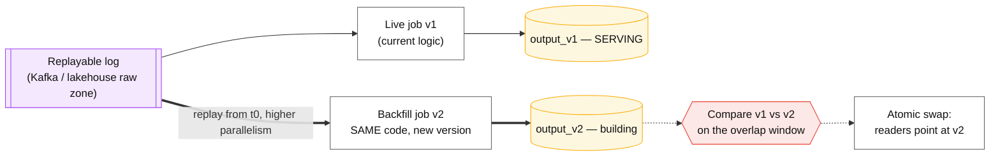
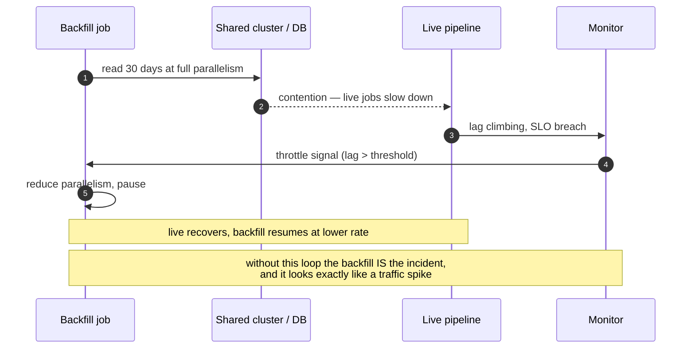

# Backfill and reprocessing

## Core concept

Every data system eventually has to recompute the past: a bug corrupted six weeks of a metric, a
definition changed, a new column must be populated, a model needs history. The naive version — a
one-off script that writes into the live tables — is how a data platform loses trust, because it
produces numbers that no code path can reproduce and that disagree with the streaming output at the
seam.

The discipline is short and it is the same one that appears in
[expand-contract-migration.md](./expand-contract-migration.md) and
[materialized-views-and-derived-data.md](./materialized-views-and-derived-data.md):

1. **Same code path as live.** The backfill runs the *production* transformation, not a
   reimplementation, or the historical rows differ from the live ones in ways nobody can explain.
2. **Write to a new output, then swap.** Never mutate the live table in place — build alongside,
   verify, switch, keep the old one long enough to switch back.
3. **Idempotent per partition.** A backfill will be interrupted. Re-running a day must produce
   exactly the same result, not duplicates.
4. **Throttled against the live workload.** The backfill shares storage, network and compute with
   production, and it is the classic self-inflicted incident.

**When it earns its complexity:** any correction to data others depend on. **What it costs if
adopted too early:** for a table nobody consumes, `DELETE` and re-run is fine, and building a
reprocessing framework for it is ceremony.

## Mechanics & internals

### Kreps's reprocessing recipe, and why it is the whole pattern

Jay Kreps's critique of the Lambda architecture argued against maintaining two implementations —
batch and streaming — of the same logic. Reprocessing does not need a separate batch path: **start
a second instance of the stream job from the beginning of retained history, write its output to a
new table, let it catch up, then switch readers to the new table.** Parallelism can be raised so
the catch-up finishes quickly, and the old output stays available until the new one is trusted.

That is the same build-alongside-verify-swap shape as a schema migration, and it dissolves the
usual "how do we merge backfilled data with live data?" problem — you never merge, you replace.

The comparison step is what makes the swap a decision rather than a hope: run both outputs over the
**same overlap window** and diff them. Differences are either the intended fix or a bug in the new
logic, and you must be able to say which before switching.

### Idempotent partitions: the property that makes restarts safe

A backfill is a long-running job on shared infrastructure; it *will* be interrupted. Idempotency at
partition granularity is what makes that survivable:

- **Overwrite whole partitions**, never append rows: `INSERT OVERWRITE` on a date partition, or
  Iceberg/Delta `replaceWhere`, so re-running a day yields exactly the same output.
- **Deterministic transformations** — no `now()`, no `random()`, no reliance on an external service
  whose state has since changed. Any non-determinism means the rerun differs from the first run and
  the diff becomes unusable.
- **Track completion per partition**, not by cursor. A control table of `(partition, status,
  attempt, checksum)` lets the job resume, retry a subset, and report progress honestly.
- **Late data**: decide whether the backfill window is closed or whether late arrivals reopen it.
  Both are valid; unstated is not — see
  [../fundamentals/stream-processing-semantics.md](../fundamentals/stream-processing-semantics.md).

### Restatement: the part that is a policy question, not an engineering one

When the numbers change, someone downstream already used the old ones — in a report, an invoice, a
model, a board slide. That makes restatement a **policy** with an engineering implementation:

| Policy | Meaning | Fits |
|---|---|---|
| **Immutable history** | Never change published numbers; corrections appear as adjustments in the current period | Finance, billing, anything audited |
| **Restate with versioning** | Publish a new version of the period, keep the old, announce the change | Analytics, metrics, experimentation |
| **Silent overwrite** | Replace the numbers, tell nobody | **Never.** Guarantees that two people quoting the same metric disagree |

Whichever is chosen, the mechanics are the same: **a version or `computed_at` column on the
output**, so any consumer can tell which computation produced the number they are holding. A
restatement without a version stamp is indistinguishable from a bug.

### Throttling: the backfill as an incident

The controls that make a backfill boring: run it in a **separate resource pool** or off-peak, cap
its parallelism, feed it a **live signal** (consumer lag, replication lag, p99) that pauses it, and
give it a kill switch anyone on call can use without a deploy. Reading history from cheap storage
(object store, replica, snapshot) rather than the production primary is better than throttling
where it is available — the same argument Stripe made for running the transformation offline.

## Numbers that matter

| Quantity | Value | Confidence |
|---|---|---|
| Reprocessing parallelism | Raise it so catch-up is fast — bounded by the sink, not the source | [Kreps](https://www.oreilly.com/radar/questioning-the-lambda-architecture/) |
| Backfill duration | `history ÷ throughput` — compute before scheduling | Arithmetic; usually days once throttled |
| Retention needed to replay | ≥ the history you must reprocess; tiered storage changes the economics | See [../fundamentals/log-vs-queue.md](../fundamentals/log-vs-queue.md) |
| Throttle signal | Consumer/replication lag; pause above 1–5 s | Convention |
| Resource share for backfill | ≤ 10–25% of the shared cluster during business hours | Order of magnitude |
| Partition granularity | Day is typical; hour for high-volume, month for small | Must match the overwrite unit |
| Overlap window for comparison | ≥ 1 full business cycle (weekly/monthly jobs live there) | Convention |
| Storage during a swap | **2× the output** while both versions exist | Arithmetic — budget it before starting |

**The arithmetic that sets the plan.** Reprocessing 90 days at 200 GB/day is 18 TB. At 500 MB/s of
sustained sink throughput that is ~10 hours flat out — but throttled to a quarter of the cluster it
is closer to two days, and you need **36 TB** of storage while both versions exist. Those two
numbers (duration and 2× storage) decide whether the backfill is a Tuesday or a project, and they
are the two nobody computes before starting.

## Failure modes

| Failure | Symptom | Mitigation |
|---|---|---|
| **Backfill takes out the live pipeline** | Consumer lag climbs, SLOs breach, looks like a traffic spike | Separate pool, capped parallelism, lag-driven throttle, kill switch |
| **Different code path** | Backfilled rows subtly differ from live rows at the seam | Run the production transformation; ban the one-off script |
| **Non-idempotent rerun** | Duplicates, or different results on retry | Overwrite whole partitions; deterministic logic only |
| **In-place mutation** | No way back; the old numbers are gone | Write to a new output and swap |
| **Silent restatement** | Two people quote the same metric and disagree | Version/`computed_at` stamps and an announced policy |
| **Non-determinism** (`now()`, external lookups) | The diff between old and new is meaningless | Pin inputs; pass the logical time in |
| **Log retention too short** | Cannot replay far enough; the recovery plan does not exist | Retention sized for the reprocessing window; tiered storage |
| **No comparison before the swap** | The fix ships with a new bug attached | Diff over an overlap window, including a full business cycle |
| **Forgetting downstream consumers** | Dashboards, models and exports still read the old table | Inventory consumers first; the swap is a coordination problem |
| **Backfill never finishes** | Runs for months at low priority, nobody owns it | Treat it as a project with an owner, progress metric and deadline |

**The failure with the longest tail** is silent restatement. A pipeline bug is a Tuesday; numbers
that changed without announcement destroy trust in the platform for months, because every future
disagreement gets attributed to "the data team changed something again". The engineering fix is
trivial — a version column and a changelog — and the reason it is skipped is that it feels like
process rather than code.

## Trade-offs vs alternatives

| Approach | Correctness | Cost | Risk | Use when |
|---|---|---|---|---|
| **Do nothing, fix forward** | Historical data stays wrong | None | Wrong numbers persist | The error is immaterial and documented |
| **In-place update script** | Fast | Low | **No revert, no reproducibility** | Never for shared data |
| **Replay to a new output + swap** | Reproducible, revertible | 2× storage, compute | Low | The default |
| **Lambda: separate batch path** | Batch reconciles the stream | **Two implementations of every rule** | Divergence between paths | Regulatory need for an independent batch computation |
| **Kappa: replay the stream job** | One implementation | Needs retention and replay throughput | Low | Modern default where the log retains enough history |
| **Incremental correction (adjustment rows)** | Immutable history preserved | Medium | Consumers must understand adjustments | Finance and billing |
| **Rebuild everything from raw** | Strongest guarantee | Highest | Long runtime | Corruption of unknown extent; raw zone intact |

### Where staff engineers get this wrong

1. **Writing a one-off script.** It diverges from production logic, and the seam between backfilled
   and live data becomes permanent, unexplainable noise.
2. **Mutating in place.** No revert, no comparison, no way to answer "what did this look like
   before?"
3. **Ignoring the shared cluster.** The backfill is the most common self-inflicted data incident,
   and it presents exactly like an organic load spike.
4. **Not computing duration and storage first.** 2× storage during the swap and a multi-day runtime
   change the plan from a task into a project.
5. **Restating silently.** The engineering is trivial; the trust damage is not.
6. **Assuming replay is possible.** It requires retention you may not have — check before promising
   a rebuild as the recovery plan.
7. **Forgetting consumers.** The swap is a coordination problem across dashboards, models and
   exports, not just a pointer change.

## Real-world examples

- **Kreps, *Questioning the Lambda Architecture*** — the reprocessing recipe: second job from the
  start of retained history, new output table, higher parallelism, switch when caught up. The
  argument that batch is a special case of streaming.
- **Kafka + tiered storage** — what makes long replay economically plausible; retention stops being
  bounded by broker disk (see [../fundamentals/kafka-internals.md](../fundamentals/kafka-internals.md)).
- **Iceberg / Delta Lake** — partition overwrite, snapshot isolation and time travel, so
  "build alongside and swap" is a table operation rather than a custom dance.
- **Airflow / dbt backfills** — `--full-refresh` and date-partitioned reruns as the everyday form of
  this pattern, with all the throttling problems attached.
- **Financial restatement practice** — immutable published periods plus adjustment entries in the
  current period; the pattern the analytics world usually reinvents badly.

## Staff-level follow-ups

1. A bug corrupted six weeks of a metric that three dashboards and one model consume. Walk the
   full plan: compute, verify, swap, communicate — and say what you tell the consumers.
2. Compute duration and storage for reprocessing 90 days at 200 GB/day with a quarter of the
   cluster. Decide whether it is a task or a project.
3. Design idempotency for a backfill that must be interrupted and resumed. What is the unit, what
   is tracked, and how do you prove a rerun is a no-op?
4. Your backfill is degrading the live pipeline. Give the throttling signal, the control loop, and
   the kill switch — and who is allowed to use it.
5. Argue for immutable history plus adjustments over restatement for a billing dataset, then say
   where that policy breaks down for product analytics.

## See also

- [expand-contract-migration.md](./expand-contract-migration.md) — the same build-verify-swap discipline for schemas
- [materialized-views-and-derived-data.md](./materialized-views-and-derived-data.md) — rebuild as a first-class operation
- [../fundamentals/stream-processing-semantics.md](../fundamentals/stream-processing-semantics.md) — event time, late data and watermarks during replay
- [../fundamentals/log-vs-queue.md](../fundamentals/log-vs-queue.md) — retention as the bound on what you can replay
- [../05-data-cases/clickstream-lakehouse.md](../05-data-cases/clickstream-lakehouse.md) — the pipeline this pattern operates on

## Referenced by

- [Design a clickstream ingestion pipeline into a lakehouse](../05-data-cases/clickstream-lakehouse.md)
- [Fan-out on write vs read](fanout-write-vs-read.md)
- [Patterns index](README.md)
- [Topic manifest](../topics/manifest.md)

## Sources

- [Kreps — Questioning the Lambda Architecture (O'Reilly Radar, 2014)](https://www.oreilly.com/radar/questioning-the-lambda-architecture/) — the reprocessing recipe
- [Apache Iceberg — snapshots, time travel and partition overwrite](https://iceberg.apache.org/docs/latest/reliability/)
- [Delta Lake — `replaceWhere` and time travel](https://docs.delta.io/latest/delta-batch.html)
- [Kafka KIP-405 — tiered storage](https://cwiki.apache.org/confluence/display/KAFKA/KIP-405%3A+Kafka+Tiered+Storage)
- Local book: `DE/System-Design/Designing Data Intensive Applications.pdf` ch.11 — reprocessing and derived data
