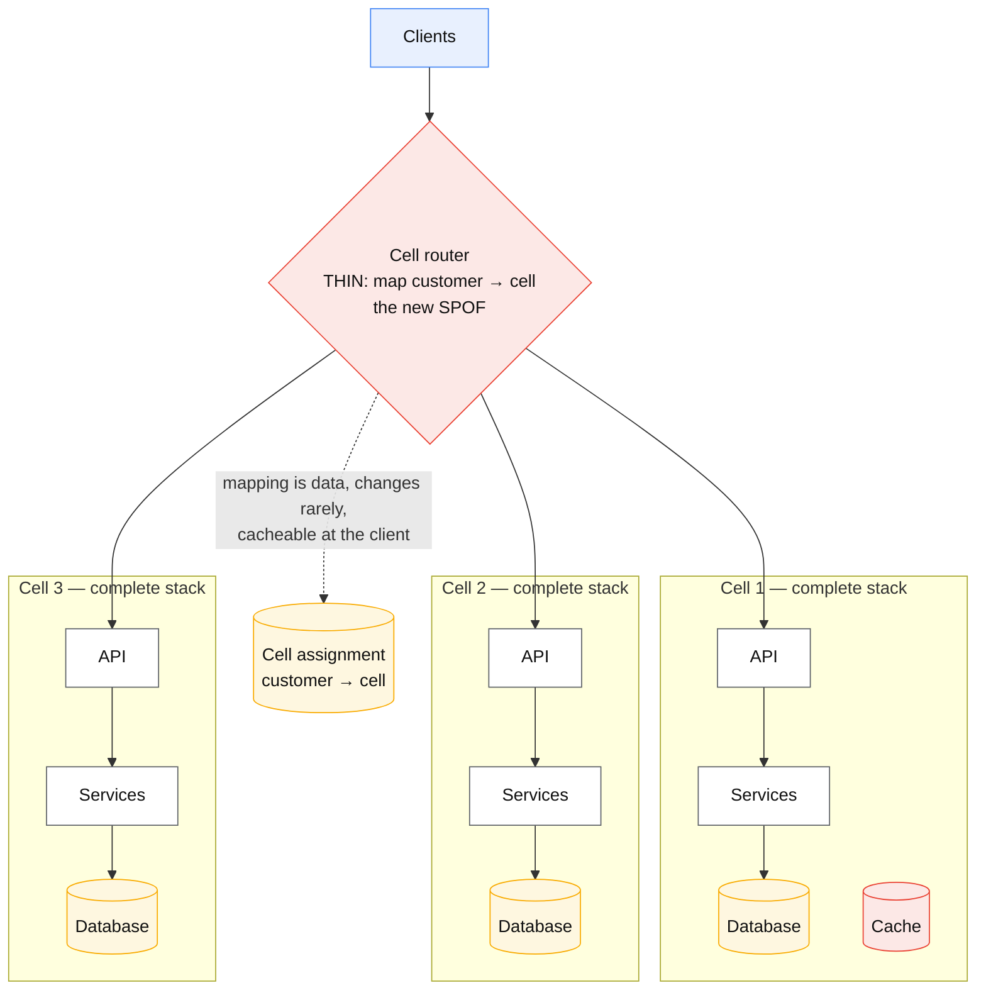
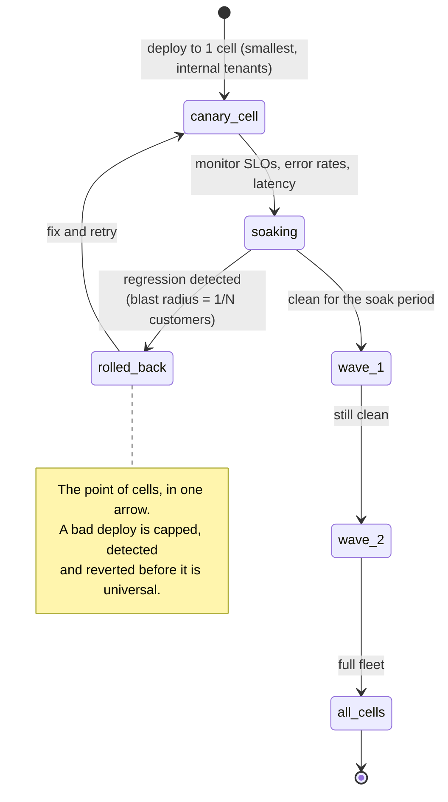

# Cell-based architecture

## Core concept

Every shared component is a shared failure. A cell-based architecture makes **blast radius a design
parameter** instead of an outcome: run N complete, independent copies of the stack — each with its
own compute, data and dependencies — and assign each customer to one. A failure that would have
been global is now `1/N` of customers, and a bad deploy can be tried on one cell before the rest.

Shuffle sharding is the same idea applied combinatorially. Instead of assigning each customer to
one cell, assign them to a **random subset** of cells. With 8 workers and 2 per customer there are
`C(8,2) = 28` distinct assignments, so two customers rarely share *both* — one abusive or poisonous
customer degrades only the customers holding an identical pair. AWS Route 53 takes this to its
conclusion: **2 048 virtual name servers, 4 per customer domain, ≈ 730 billion possible shuffle
shards** — effectively perfect isolation without 730 billion of anything.

**When it earns its complexity:** multi-tenant systems where one tenant can hurt others, or where a
global outage is existential. **What it costs if adopted too early:** N times the operational
surface, capacity fragmentation, a router that is now the thing that can take everything down, and
cross-cell operations (search, analytics, "move this customer") that were free in a single stack.

## Mechanics & internals

### The cell, and the router that replaces the SPOF you removed

The router is the design's central tension: you removed a shared failure domain and created a new
one. Every mature cell architecture applies the same three rules to it:

1. **Keep it trivially simple** — a mapping lookup and a proxy, no business logic. Complexity in
   the router is complexity in the one component that can fail globally.
2. **Make the mapping data, not code** — a small, slowly-changing table, replicated everywhere and
   cacheable by clients, so the router can serve from a stale copy when its own store is down.
3. **Prefer DNS or client-side routing where possible** — Route 53's approach pushes the assignment
   all the way to the client's resolver, so there is no request-path router at all.

### Shuffle sharding, and why the arithmetic is startling

With `N` workers and `k` assigned per customer, there are `C(N, k)` shards. The probability that
another specific customer shares **all** of your workers is `1 / C(N, k)`:

| N | k | `C(N,k)` | One bad customer fully overlaps |
|---|---|---|---|
| 8 | 2 | 28 | 1 in 28 customers |
| 16 | 2 | 120 | 1 in 120 |
| 32 | 4 | 35 960 | 1 in ~36 000 |
| 100 | 5 | 75 287 520 | 1 in 75 million |
| **2 048** | **4** | **≈ 7.3 × 10¹¹** | Route 53's actual configuration |

Two properties make this more than a party trick:

- **Partial overlap is survivable.** A customer sharing 1 of your 2 workers degrades you only if
  you cannot retry elsewhere. So shuffle sharding requires **clients that retry across their
  assigned shard** — without that, it buys much less than the arithmetic suggests.
- **It composes with cells.** Shuffle-shard at the request-routing layer *inside* a cell for noisy
  neighbours, and cell-partition at the top for deploy and failure isolation.

### What must be in a cell, and what breaks the model

A cell is only isolating if it is **complete**. The failure mode of half-hearted adoption is a cell
that shares a database, a cache, an auth service or a feature-flag backend — at which point the
architecture has the cost of cells and the blast radius of a monolith.

| Component | In-cell? | Note |
|---|---|---|
| Compute, services | Yes | Obviously |
| Primary database | **Yes** | The most commonly violated rule |
| Cache | Yes | Shared caches reintroduce noisy neighbours |
| Config / feature flags | Yes (replicated per cell) | A bad flag should stop at one cell |
| Auth / identity | Usually shared — **and it is then your real SPOF** | Cell it, or accept and harden it |
| Router / cell map | Shared by definition | Keep trivial; serve stale on failure |
| Billing, analytics, search across tenants | Shared, offline | Aggregate *from* cells; never let cells depend on them |

### Deployment: the practical reason teams adopt cells

Blast-radius reduction is the headline; **safe deploys are what makes it pay for itself weekly**.
With cells, a release is a sequence: one cell, soak, a few cells, soak, the rest. A bad deploy is
capped at `1/N` of customers and is detectable before it is universal — which is a far cheaper
safety property than any amount of pre-production testing.

### Sizing: how many cells, and how big

Cells must be **small enough to limit damage and large enough to be efficient**, and both bounds
are computable:

- **Upper bound on cell size** — the largest blast radius you can accept. "No incident may affect
  more than 5% of customers" implies ≥ 20 cells.
- **Lower bound** — the biggest single tenant must fit in one cell, with headroom. A whale that
  outgrows a cell forces either a bigger cell size for everyone or a dedicated cell for that tenant.
- **Fixed overhead per cell** — each cell carries a minimum footprint (control plane, replicas,
  monitoring). Twenty cells means twenty times that overhead, which is the real cost ceiling.
- **Cell capacity headroom** — cells cannot borrow capacity from each other, so each needs its own
  headroom. That is a genuine efficiency loss versus one large pool, and it is the honest
  counter-argument.

## Numbers that matter

| Quantity | Value | Confidence |
|---|---|---|
| Blast radius | `1/N` of customers per cell failure | Definitional |
| Cells for a 5% blast-radius target | ≥ 20 | Arithmetic |
| Shuffle shards, `C(8,2)` | 28 | Arithmetic |
| Shuffle shards, `C(100,5)` | ~75 million | Arithmetic |
| Route 53 configuration | **2 048 virtual name servers, 4 per domain ≈ 730 billion shards** | [AWS Builders' Library](https://aws.amazon.com/builders-library/workload-isolation-using-shuffle-sharding/) |
| Per-cell capacity headroom | Each cell needs its own — no borrowing | The main efficiency cost |
| Deploy waves | 1 → few → rest, with a soak at each | Convention; the soak length is the real parameter |
| Cell size upper bound | Largest tolerable blast radius | Product/contractual decision |
| Cell size lower bound | Largest single tenant + headroom | Whale-driven |

**The sizing arithmetic, made concrete.** 10 000 tenants, a contractual promise that no single
incident affects more than 2% of customers, and a largest tenant consuming 3% of total load. The
2% target implies ≥ 50 cells; the whale needs a cell able to hold 3% of total load, i.e. 1.5 cells'
worth at even distribution — so it needs a dedicated cell, and the remaining 49 hold the rest. That
tension between the blast-radius target and the largest tenant is the entire sizing conversation.

## Failure modes

| Failure | Symptom | Mitigation |
|---|---|---|
| **Shared dependency inside "isolated" cells** | A global outage in an architecture that was supposed to prevent one | Audit every dependency; a cell is complete or it is decoration |
| **Router becomes the SPOF** | Cells healthy, nobody can reach them | Trivial router, mapping as replicated data, serve stale, or push routing to DNS/client |
| **Cell map unavailable** | Requests cannot be routed even though the data plane is fine | Cache the map at the edge and in clients; treat a stale map as valid |
| **Whale outgrows a cell** | One tenant forces a larger cell size for everyone | Dedicated cell for the top N tenants; capacity policy per tenant |
| **Cross-cell feature added** | A "small" join across cells reintroduces coupling and a global failure path | Cross-cell aggregation happens **offline**, never on the request path |
| **Uneven cell load** | Some cells saturated while others idle | Rebalance by moving tenants; the move procedure must exist and be rehearsed |
| **Per-cell capacity waste** | N cells each holding headroom is expensive | Accept it as the cost, or reduce N; do not "share" a buffer pool |
| **Deploy to all cells at once** | The main benefit thrown away for a schedule | Enforce waves in the pipeline, not by convention |
| **No tenant-move procedure** | Rebalancing and whale isolation are impossible in practice | Build and test the migration path early — see [expand-contract-migration.md](./expand-contract-migration.md) |

**The recurring lesson from published incidents** is the first row. Systems described as cellular
have repeatedly failed globally through a component nobody counted as shared: a control plane, a
config service, a metadata store, a certificate authority, an internal DNS zone. The exercise that
catches it is unglamorous — enumerate every dependency of a cell and ask, for each, "if this fails,
how many cells go down?" Anything answering "all" is the real availability of the system, and no
amount of cell counting changes it.

## Trade-offs vs alternatives

| Approach | Blast radius | Cost | Complexity | Fits |
|---|---|---|---|---|
| **Single stack** | 100% | Lowest | Lowest | Early-stage, and more products than admit it |
| **Multi-AZ / multi-region** | Region or AZ | Medium | Medium | Infrastructure failure, **not** bad deploys or poison tenants |
| **Cells** | `1/N` of customers | N× fixed overhead + per-cell headroom | High | Multi-tenant platforms; deploy safety |
| **Shuffle sharding** | `1/C(N,k)` for full overlap | Low — a routing change | Medium — needs client retry across the shard | Noisy neighbours and poison requests |
| **Cells + shuffle sharding** | Both axes | Highest | Highest | Large multi-tenant infrastructure (AWS-scale) |
| **Dedicated single-tenant stacks** | 1 customer | Very high | Medium | Regulated or enterprise tiers; the limit case of cells |
| **Bulkheads inside one stack** | Per resource pool | Low | Low | Cheap first step — isolate pools before isolating stacks |

### Where staff engineers get this wrong

1. **Counting cells instead of auditing dependencies.** A cell sharing a database is not a cell.
   The architecture's real blast radius is its most-shared component.
2. **Putting logic in the router.** Every feature added there raises the probability of the one
   failure mode cells were built to prevent.
3. **Ignoring the retry requirement of shuffle sharding.** Without clients that retry across their
   assigned shard, partial overlap becomes full impact and the combinatorics buy little.
4. **Sizing cells only for blast radius.** The largest tenant sets the floor; ignoring it produces a
   design that cannot host its biggest customer.
5. **Forgetting the tenant-move procedure.** Rebalancing, whale isolation and cell retirement all
   need it, and it is much harder to add later.
6. **Adopting cells before bulkheads.** Isolating thread pools and connection pools inside one
   stack is cheap and often captures most of the benefit.
7. **Treating cells as a regional strategy.** Regions protect against infrastructure failure; cells
   protect against *your own* deploys and *your own* tenants. Different problems.

## Real-world examples

- **AWS Route 53** — 2 048 virtual name servers, 4 per customer domain, ~730 billion shuffle
  shards; routing pushed to DNS so there is no request-path router to fail.
- **AWS Builders' Library** — the canonical write-ups on shuffle sharding and on reducing scope of
  impact with cell-based architecture, including the combinatorics above.
- **Slack** — publicly described a move to cellular topology after incidents whose blast radius was
  a whole region, with traffic drained cell by cell.
- **Salesforce "pods" / Shopify "pods"** — long-running examples of tenant-partitioned complete
  stacks, including the operational reality of moving tenants between them.
- **Cortex / Loki shuffle sharding** — the same technique inside an open-source multi-tenant
  system, so the mechanics are readable rather than described.

## Staff-level follow-ups

1. Enumerate every dependency of one cell in a system you know and identify the ones shared across
   all cells. What is the architecture's real blast radius?
2. Size a cell fleet for 10 000 tenants with a 2% blast-radius target where the largest tenant is
   3% of load. Show the tension and resolve it.
3. Design the cell router so that its own datastore failing does not take the system down. What
   does it serve, and how stale may that be?
4. Compute the isolation benefit of shuffle sharding at `C(16,2)` versus `C(64,4)`, then state the
   client behaviour required for either number to be real.
5. A product manager asks for a cross-cell "global search". Explain what that costs and propose the
   design that keeps cells isolated.

## See also

- [graceful-degradation.md](./graceful-degradation.md) — what a cell does when a dependency is down
- [circuit-breaker.md](./circuit-breaker.md) — isolation inside a cell
- [../fundamentals/hot-shard-mitigation.md](../fundamentals/hot-shard-mitigation.md) — the noisy-neighbour problem shuffle sharding addresses
- [../fundamentals/cascading-and-metastable-failures.md](../fundamentals/cascading-and-metastable-failures.md) — why bounding blast radius bounds recovery time
- [../02-primitives/security-and-multitenancy.md](../02-primitives/security-and-multitenancy.md) — tenancy isolation more broadly

## Referenced by

- [Circuit breaker](circuit-breaker.md)
- [Graceful degradation](graceful-degradation.md)
- [Patterns index](README.md)
- [Topic manifest](../topics/manifest.md)

## Sources

- [AWS Builders' Library — Workload isolation using shuffle-sharding](https://aws.amazon.com/builders-library/workload-isolation-using-shuffle-sharding/) — Route 53's 2 048 virtual name servers and the combinatorics
- [AWS — Reducing the scope of impact with cell-based architecture (whitepaper)](https://docs.aws.amazon.com/wellarchitected/latest/reducing-scope-of-impact-with-cell-based-architecture/reducing-scope-of-impact-with-cell-based-architecture.html)
- [Slack engineering — cellular architecture](https://slack.engineering/slacks-migration-to-a-cellular-architecture/)
- [Cortex — shuffle sharding documentation](https://cortexmetrics.io/docs/guides/shuffle-sharding/)
