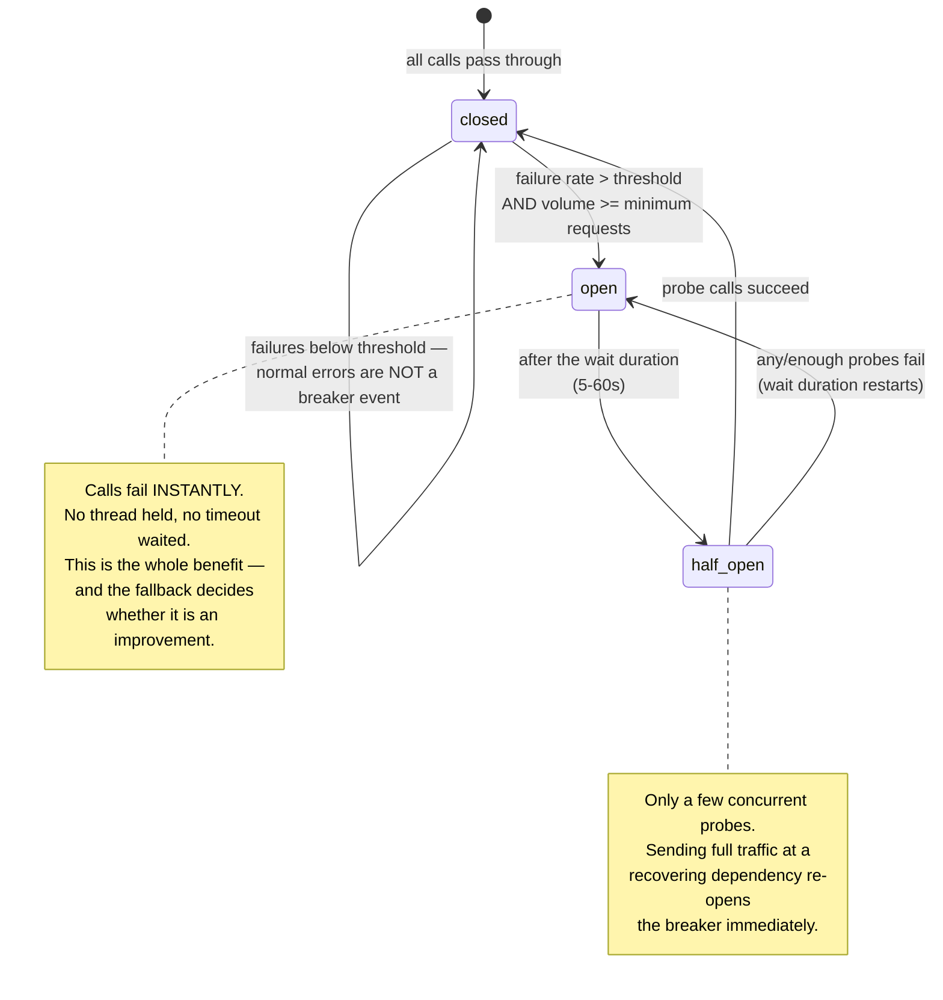
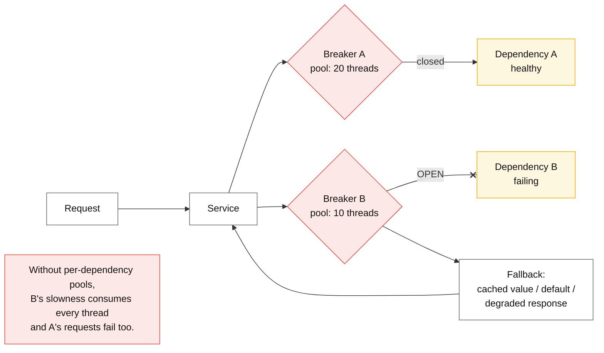

# Circuit breaker

## Core concept

A circuit breaker stops a caller from spending resources on a dependency that is already failing.
It watches the error rate, **opens** after a threshold, fails fast for a cooldown, then admits a
few probes to test recovery. The value is not that it prevents the failure — it cannot — but that
it prevents your service from being consumed by it: threads blocked on a dead dependency are
threads unavailable for the requests you *could* serve.

The thing to be precise about is what a breaker converts. **It turns a slow failure into a fast
one.** That is an improvement only if there is something useful to do with the fast failure — a
cached value, a default, a degraded response, a queued write. A breaker with no fallback converts
"the page loads in 8 seconds" into "the page returns 500 immediately", which is sometimes better
and often worse. That decision belongs to the product, not to the library's defaults.

**When it earns its complexity:** a dependency that fails hard and whose failure would otherwise
exhaust a shared resource. **What it costs if adopted too early:** a tuning surface nobody
maintains, flapping under partial failure, and a failure mode where the breaker itself causes the
outage by opening on a blip.

## Mechanics & internals

### The state machine, precisely

Three parameters do all the work, and two of them are routinely left at defaults that do not fit:

- **Minimum request volume before the breaker may open.** Without it, 2 failures out of 3 requests
  at 04:00 opens the breaker on a service that is fine. Hystrix's default is 20 requests in a
  10-second rolling window; resilience4j uses a sliding window of 100 calls.
- **Error-rate threshold** — commonly 50%. A threshold *this* high is deliberate: a breaker should
  trip on a dependency that is broken, not one that is merely returning some errors.
- **Wait duration before half-open** — Hystrix 5 s, resilience4j 60 s. Too short and you hammer a
  recovering dependency; too long and you stay degraded after it recovers.

**What counts as a failure is a design decision, not a default.** Timeouts and 5xx should count;
4xx should usually not — a validation error is your caller's problem, and counting it opens the
breaker on a bad client rather than a bad dependency. Getting this wrong produces the confusing
incident where one misbehaving client trips a breaker for everyone.

### Where the breaker lives, and what it protects

A breaker is **per dependency**, and it is most useful when paired with a **bulkhead** — a
separate resource pool per dependency. The breaker stops you calling a dead service; the bulkhead
stops a *slow* one from consuming every thread before the breaker notices. Hystrix shipped both
together for exactly this reason, and teams that adopt only the breaker still lose their thread
pool to a dependency that is slow rather than failing.

**Client-side vs server-side.** A breaker in each caller reacts fast and needs no coordination, but
each instance learns independently — 200 instances each need their own minimum volume before
reacting. A proxy-level implementation (Envoy's outlier detection, service-mesh circuit breaking)
pools observations across the fleet and ejects bad *hosts* rather than whole dependencies, which is
usually the better default for large fleets.

### Breakers, retries and budgets are three different controls

They are frequently conflated, and each covers a case the others do not:

| Control | Question it answers | Timescale |
|---|---|---|
| **Timeout** | How long may one call take? | Per call |
| **Retry + budget** | Should I try again, and how much total retry load is allowed? | Per call / per fleet |
| **Circuit breaker** | Should I stop calling entirely for a while? | Seconds to minutes |
| **Bulkhead** | How much of my capacity may this dependency consume? | Continuous |
| **Load shedding** | Should I stop accepting *inbound* work? | Continuous |

Retries handle the transient; breakers handle the sustained. Running retries without a breaker
turns a dead dependency into a retry storm; running a breaker without retries turns a single
packet loss into a user-visible error.

## Numbers that matter

| Quantity | Value | Confidence |
|---|---|---|
| Hystrix `requestVolumeThreshold` | **20 requests / 10 s rolling window** before the breaker may open | [Hystrix configuration](https://github.com/Netflix/Hystrix/wiki/Configuration) |
| Hystrix `errorThresholdPercentage` | **50%** | Same |
| Hystrix `sleepWindow` | **5 s** before half-open | Same |
| resilience4j defaults | sliding window 100 calls, failure rate 50%, wait 60 s, 10 permitted calls in half-open | [resilience4j docs](https://resilience4j.readme.io/docs/circuitbreaker) |
| Envoy outlier detection | Ejects a host after consecutive 5xx (default 5), base ejection 30 s, growing per ejection | [Envoy docs](https://www.envoyproxy.io/docs/envoy/latest/intro/arch_overview/upstream/outlier) |
| Half-open probe concurrency | A handful — never full traffic | Convention; full traffic at a recovering service re-opens it |
| Per-dependency pool size | `L = λW` from [../fundamentals/queueing-theory-basics.md](../fundamentals/queueing-theory-basics.md) | Arithmetic, not a guess |
| Breaker decision cost | Microseconds — a counter read | Negligible; never the reason not to use one |

**The arithmetic that shows why a breaker matters.** A service with 200 worker threads calls a
dependency whose latency degrades from 20 ms to a 10 s timeout. By Little's law, serving 2 000 rps
at 10 s requires 20 000 concurrent workers — so all 200 threads are consumed almost instantly and
**every other endpoint on the service stops working**. The breaker's job is to notice within a few
seconds and release those threads; the bulkhead's job is to have capped the damage at 20 threads
in the first place.

## Failure modes

| Failure | Symptom | Mitigation |
|---|---|---|
| **Breaker with no fallback** | Slow dependency becomes an instant 500; the user experience is worse than waiting | Name the degraded behaviour per dependency first — see [graceful-degradation.md](./graceful-degradation.md) |
| **Opens on low volume** | Breaker trips at 3am on 2 failed requests out of 3 | Minimum request volume before the breaker may open |
| **Counts 4xx as failures** | One bad client trips the breaker for everyone | Classify: timeouts and 5xx count; 4xx does not |
| **Flapping** | Breaker oscillates open/closed; behaviour is unpredictable and unreviewable | Longer windows, hysteresis, limited half-open probes |
| **Full traffic on half-open** | The recovering dependency is immediately re-killed | A handful of probes, then ramp |
| **No bulkhead** | A *slow* dependency exhausts the shared pool before the breaker reacts | Per-dependency pools; the breaker is not a substitute |
| **Breaker on a non-idempotent write** | Fast-fail leaves the caller unsure whether the write happened | Combine with idempotency keys — see [../fundamentals/idempotency.md](../fundamentals/idempotency.md) |
| **Fallback that calls another live dependency** | The fallback path fails during the same incident | Fallbacks must be *cheaper and more local* than the primary — cached or static |
| **Breaker hides a chronic problem** | Dependency has been half-broken for months; the breaker makes it invisible | Alert on breaker state transitions, not just on errors |
| **Untested fallback** | The degraded path is dead code until the day it runs | Exercise it in CI and in game days |

**The failure worth stating twice** is the last-but-one row: a fallback that itself depends on the
failing system, or on another live service, will fail during precisely the incident it exists for.
The rule is that a fallback must be **strictly less dependent** than the primary path — a cached
value, a static default, a locally computed approximation. If the fallback needs a network call,
ask what happens when that call is also affected.

## Trade-offs vs alternatives

| Control | Protects against | Cost | Use when |
|---|---|---|---|
| **Timeout only** | Unbounded waits | None | Always — the floor, not the answer |
| **Timeout + retry + budget** | Transient failures | Small | Always, for idempotent calls |
| **Bulkhead (per-dependency pool)** | One dependency consuming all capacity | Capacity fragmentation | **Before a breaker.** Cheaper and often sufficient |
| **Circuit breaker** | Sustained failure; wasted work on a dead dependency | Tuning surface; flapping risk | Dependencies that fail hard, with a real fallback |
| **Outlier detection (proxy)** | *Individual bad hosts* rather than whole dependencies | Mesh/proxy required | Large fleets; the better default there |
| **Adaptive concurrency limit** | Slow dependencies, continuously | Medium | Often supersedes a breaker — it degrades smoothly rather than in two states |
| **Nothing** | — | — | A dependency whose failure is already fatal to the request, with no fallback available. Say so explicitly |

### Where staff engineers get this wrong

1. **Adding the breaker before the fallback.** The breaker is a mechanism for *reaching* the
   fallback quickly. Without one you have chosen fast failure over slow failure, which may be worse.
2. **Leaving library defaults.** The minimum-volume and failure-classification settings decide
   whether the breaker helps or causes incidents. Neither default fits every dependency.
3. **Treating it as a substitute for a bulkhead.** A slow dependency exhausts your pool before the
   breaker reacts; the pool limit is what caps the damage.
4. **Counting client errors as dependency failures.** One misbehaving caller then degrades everyone.
5. **Sending full traffic at half-open.** The recovering dependency is re-killed and the outage
   extends.
6. **Fallbacks with dependencies.** A fallback that makes a network call fails in the same
   incident.
7. **Not alerting on breaker state.** An open breaker is a system-level fact; if it opens weekly and
   nobody knows, the breaker is hiding the problem rather than containing it.

## Real-world examples

- **Netflix Hystrix** — the implementation that popularised the pattern, bundling breaker,
  bulkhead (thread-pool isolation) and fallback in one API. Now in maintenance, and the reason its
  defaults (20 requests / 10 s, 50%, 5 s) are the numbers everyone quotes.
- **resilience4j** — the modern JVM successor: sliding-window breakers, bulkheads, rate limiters
  and retries as composable decorators rather than one framework.
- **Envoy outlier detection** — ejects individual failing *hosts* from the load-balancing pool,
  with growing ejection times. Usually a better fit than per-caller breakers at fleet scale.
- **AWS SDK / Google SRE practice** — client-side adaptive throttling as an alternative shape: a
  continuous probability of rejection rather than a two-state breaker.
- **Nygard, *Release It!*** — where the pattern was named, alongside bulkheads, timeouts and the
  broader stability-patterns vocabulary.

## Staff-level follow-ups

1. A dependency's p99 goes from 20 ms to a 10 s timeout. Using `L = λW`, show what happens to your
   thread pool, then say which control — breaker, bulkhead, or concurrency limit — helps first.
2. Choose breaker parameters for a dependency called 5 times per second and one called 5 000 times
   per second. Explain why the same settings cannot serve both.
3. Give three fallbacks for a recommendations service and rank them by how independent they are of
   the failing path.
4. Your breaker opens for 30 seconds every afternoon and nobody has noticed. What does that tell
   you, and what would you change first?
5. Argue that an adaptive concurrency limit is a better default than a circuit breaker for a
   particular dependency, then say where the breaker is still needed.

## See also

- [graceful-degradation.md](./graceful-degradation.md) — the fallback that makes a breaker worth having
- [../fundamentals/timeouts-retries-backoff.md](../fundamentals/timeouts-retries-backoff.md) — the control that handles transients
- [../fundamentals/load-shedding-and-admission-control.md](../fundamentals/load-shedding-and-admission-control.md) — the inbound counterpart
- [../fundamentals/queueing-theory-basics.md](../fundamentals/queueing-theory-basics.md) — why a slow dependency exhausts a pool so fast
- [cell-based-architecture.md](./cell-based-architecture.md) — isolation at the deployment level

## Referenced by

- [Cell-based architecture](cell-based-architecture.md)
- [Graceful degradation](graceful-degradation.md)
- [Patterns index](README.md)
- [Reliability patterns](../02-primitives/reliability-patterns.md)
- [Topic manifest](../topics/manifest.md)

## Sources

- [Netflix Hystrix — configuration and defaults](https://github.com/Netflix/Hystrix/wiki/Configuration)
- [resilience4j — circuit breaker documentation](https://resilience4j.readme.io/docs/circuitbreaker)
- [Envoy — outlier detection](https://www.envoyproxy.io/docs/envoy/latest/intro/arch_overview/upstream/outlier)
- [Michael Nygard — Release It! (stability patterns)](https://pragprog.com/titles/mnee2/release-it-second-edition/)
- [Martin Fowler — CircuitBreaker](https://martinfowler.com/bliki/CircuitBreaker.html)
