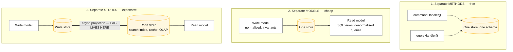

# CQRS

## Core concept

Command Query Responsibility Segregation means the model you **write** through and the model you
**read** through are different models, not one model used two ways. Commands validate invariants
and produce state changes; queries serve shapes optimised for display. In its full form they are
different *stores*, kept in sync asynchronously.

The reason to do it is that the two sides have genuinely different requirements and the
compromise between them is bad for both. Writes want normalisation, constraints and a small
transaction boundary. Reads want denormalised, pre-joined, pre-aggregated shapes that match a
screen. A single schema serving both ends up with fifteen-way joins on the read path and
triggers on the write path.

The reason **not** to do it — and the thing this folder exists to make you say out loud — is that
the moment the stores are separate and asynchronous, **you have imported replication lag into your
product**, and "the user does not see their own write" becomes a design problem on every screen.
For most CRUD applications a read replica and a few materialised views are the right answer and
CQRS is over-engineering.

> Ask: do the read and write models actually diverge, or am I about to build two copies of the
> same table and a synchronisation bug?

## Mechanics & internals

### The three levels, and only the third is expensive



Most teams that say "we did CQRS" did level 2, correctly, and stopped. Level 3 is the one with an
operational cost, and it should be justified per read model, not adopted wholesale.

### Getting to level 3 without a dual write

The read store is updated **from** the write store, never by the same code path writing twice.
Writing to both in application code is the [dual-write problem](outbox-pattern.md) and it will
diverge. The legitimate mechanisms:

| Mechanism | How | Note |
|---|---|---|
| **[Outbox](outbox-pattern.md)** | Event row in the same transaction, relayed after commit | The default answer for a relational write store |
| **[CDC](../05-data-cases/cdc-pipeline.md)** | Read the write store's log | No application change; events are row diffs, not intent |
| **[Event sourcing](event-sourcing.md)** | The log *is* the write store; projections fold it | The natural pairing, and not a prerequisite |
| Change feed / stream | Vendor-native subscription to the store | Simplest where available |

### Read-your-writes, which is the actual design work

The lag is small and the consequences are not. Options, in the order you should reach for them:

1. **Return the result from the command.** The user clicked Save; show them what was saved from
   the write side's response. Free, and it removes the problem for the most common case.
2. **Read the write model for that one screen.** The "my profile" page reads authoritatively; the
   "browse everyone" page reads the projection. Per-screen, not per-system.
3. **Version token / read-your-writes routing.** The command returns a position; the read waits
   for the projection to reach it. See
   [replication-lag-and-session-guarantees](../fundamentals/replication-lag-and-session-guarantees.md).
4. **Show the lag honestly.** "Updated a moment ago — this list refreshes every few seconds."
   Sometimes the right answer is product copy, not engineering.
5. Optimistic UI. Render the intended state locally. Fine, until it fails and you must un-render.

**Decide this per screen, before building.** A system that is silently eventually-consistent
everywhere produces a long tail of "it didn't save" bug reports that are not bugs.

### Rebuilding a read model

The read store must be **disposable**: delete it, replay, get it back. That property is what makes
CQRS safe to operate — a corrupt projection is fixed by rebuilding rather than by patching rows —
and it decays if never exercised. Keep the rebuild in a runbook, run it on a schedule in a
non-production environment, and know the wall-clock number.

If the read store cannot be rebuilt, it is not a projection; it is a second source of truth, and
you now own a reconciliation problem forever.

## Numbers that matter

```
Projection lag: single-digit ms to seconds in a healthy system. It is a product
  input, not an implementation detail — 200 ms is invisible, 5 s is a bug report.

Rebuild time: 1e8 events at 20k/s ≈ 1.4 hours. Measure it before you need it.
  "We can rebuild" is a claim with a number attached.

Read amplification: one write can fan into 3-6 projections (list view, search
  index, aggregate, cache, export). Size the projection tier for the SUM, not
  the write rate.

When it pays: read:write of 100:1 or more, with genuinely different shapes.
  At 2:1 with similar shapes, a read replica is the whole answer and costs
  nothing to operate.

Cost of not doing it: the 15-way join that takes 4 s and can never be indexed
  because the write model is normalised for correctness.
```

## Failure modes

| Failure | Looks like | Why |
|---|---|---|
| **"It didn't save"** | Users re-submit, creating duplicates | Read-your-writes not designed per screen |
| **Dual write** | Stores diverge with no error anywhere | Application wrote to both instead of projecting from one |
| **Projection silently stopped** | Data gets stale for hours; reads still succeed | Nothing alerts on *lag*, only on errors. Alert on lag |
| **Projection not idempotent** | Duplicates or double counts after a restart | No checkpoint, or checkpoint advanced before apply |
| **Read model not rebuildable** | A corruption becomes a manual data-fixing project | Something wrote to it directly, bypassing the projection |
| **Out-of-order apply** | Field reverts to an older value | Global ordering assumed where only per-entity ordering is guaranteed |
| **Poison event** | The entire projection stops on one bad row | No dead-letter path. One unprocessable event must not block the stream |
| **CQRS everywhere** | Enormous complexity, no benefit | Applied to CRUD that never needed it |

**The one to volunteer:** *alert on projection lag, not on projection errors.* A projection that
crashes is obvious. A projection that quietly falls an hour behind serves stale data with a 200
status code, and every dashboard is green.

## Trade-offs vs alternatives

| Option | Take it when | Costs |
|---|---|---|
| **Read replicas** | Read scaling, same shape | Still one schema; replica lag still exists but no new system |
| **Materialised views in the write DB** | Different shape, same store, refresh tolerable | Refresh cost on the write store; limited by that engine |
| **CQRS level 2** | Read and write models diverge, one store | Almost none. This is the sweet spot for most systems |
| **CQRS level 3** | Different store *technology* is needed — search, OLAP, graph, cache | A projection pipeline, lag, rebuild operations |
| **CQRS + event sourcing** | Both the history and the divergent reads matter | Everything above plus permanent event schemas |

**The honest recommendation:** adopt level 2 by default; promote an individual read model to level
3 when it needs a store the write side cannot be. "We are a CQRS shop" is not an architecture, it
is a slogan — the decision is per read model.

## Real-world examples

- **A search index is CQRS** and nobody calls it that. The write store is the database, the read
  model is the index, it is updated asynchronously, it is disposable and rebuildable, and it has
  lag the product has already decided how to present. Every team that has done this has done
  level-3 CQRS for one read model, correctly, without the vocabulary.
- **The reporting replica** is the other universal instance: OLAP shapes that the OLTP schema
  cannot serve, fed asynchronously, rebuilt when it breaks.
- **The recurring mistake** is applying it to an admin CRUD screen, where the write model and the
  read model are the same five fields and the only result is a synchronisation bug.

## On AWS and Azure

| | AWS | Azure |
|---|---|---|
| **The service** | Aurora/RDS as the write store with **DynamoDB Streams** or DMS/CDC feeding OpenSearch, DynamoDB or Redshift as read models; EventBridge or Kinesis as transport; Lambda or ECS for the projector | Azure SQL or Cosmos DB as the write store with the **Cosmos change feed**, or Debezium on PostgreSQL; Azure AI Search, Cosmos DB or Synapse as read models; Functions or Container Apps for the projector |
| **What you configure** | Stream view type (`NEW_AND_OLD_IMAGES` if the projector needs the before-state), iterator checkpointing, batch size, DLQ on the projector | Change-feed processor with a **lease container**, lease prefix per projection, start-from-beginning for rebuilds, DLQ |
| **The default that bites** | **A Kinesis shard iterator expires after 5 minutes**, and each shard serves only **five `GetRecords` transactions per second shared across classic consumers**. So a projector that pauses for a slow batch loses its place, and a *second* projection halves the first's throughput — the exact failure that makes "just add another read model" stop being free | **Event Hubs Standard allows only 5 non-epoch receivers per consumer group** and caps retention at **7 days**. A rebuild that needs to start from the beginning cannot, because the beginning was deleted — so the rebuildability that makes CQRS safe has to be backed by a durable store, not by the transport |
| **What it costs you** | Projection lag is not a first-class metric anywhere: you compute it yourself from `ApproximateAgeOfOldestRecord` or the event timestamp, and **if you do not build that alert nothing else will tell you the read model is stale** | One Cosmos **logical partition is capped at 10,000 RU/s**, and a projection that writes all its output under one partition key serialises there — a read model keyed by tenant with one large tenant hits the ceiling long before the container does |

Both stacks make the same point in their own way: the transport is not the history, and the lag is
yours to measure. **Build the lag metric and the rebuild runbook on day one**, because the
platform provides neither.

## In an LLM deployment

- **A vector index is a read model.** Documents are written to a normal store; embeddings are a
  projection produced asynchronously. Everything on this page applies unchanged — lag between a
  document being saved and being retrievable, rebuildability when you change embedding model, and
  a per-screen decision about whether a user can search for what they just uploaded.
- **Changing the embedding model is a full rebuild**, and it is the moment you find out whether
  your projection is actually rebuildable. The number to know in advance is the wall-clock time
  and the inference cost of re-embedding the corpus — this is not a `REINDEX` you run casually.
- **Read-your-writes has a concrete shape here:** a user uploads a document and immediately asks a
  question about it. The honest answers are the same three as above — read the write store
  directly for that document, wait for the projection with a position token, or tell the user it
  is still indexing. Pretending it is synchronous produces "the assistant can't see my file".
- **Do not project *through* a model into your source of truth.** A summary or extraction produced
  by a model is a read model derived from the document, and it must be regenerable and versioned
  by prompt and model id. Writing it back as authoritative data makes a non-deterministic function
  part of your write path.

## Staff-level follow-ups

1. Argue against CQRS for a typical admin CRUD service. Now give me the one screen in that service
   where you would introduce it anyway.
2. A user updates their profile and the list page still shows the old name for 2 seconds. Give me
   four fixes at four different layers, and say which you would ship.
3. Your projection has been stopped for six hours and nobody noticed. What monitoring was missing,
   and what do you do about the six hours of reads that were served stale?
4. How do you rebuild a read model with 200 million rows without downtime? Walk the cutover.
5. When does the read model stop being a projection and start being a second source of truth, and
   how would you detect that it has happened?

## See also

- [event-sourcing.md](event-sourcing.md) — the write side this is usually paired with, and why it
  is not a prerequisite
- [materialized-views-and-derived-data.md](materialized-views-and-derived-data.md) — the
  disposability property that makes a read model safe
- [outbox-pattern.md](outbox-pattern.md) — how the read store learns about a write without a dual
  write
- [../fundamentals/replication-lag-and-session-guarantees.md](../fundamentals/replication-lag-and-session-guarantees.md) — the read-your-writes toolkit this page depends on
- [pagination-patterns.md](pagination-patterns.md) — paging a read model whose contents shift
  under the reader

## Referenced by

- [Design a digital wallet](../03-backend-cases/digital-wallet.md)
- [Design a proximity service](../03-backend-cases/proximity-service.md)
- [Event sourcing](event-sourcing.md)
- [Pagination patterns](pagination-patterns.md)
- [Patterns index](README.md)
- [Topic manifest](../topics/manifest.md)

## Sources

- [AWS — Kinesis Data Streams quotas and limits](https://docs.aws.amazon.com/streams/latest/dev/service-sizes-and-limits.html) — shard iterator expires 5 minutes after it is returned, five `GetRecords` transactions per second per shard, 2 MB/s read per shard
- [Azure — Event Hubs quotas and limits](https://learn.microsoft.com/en-us/azure/event-hubs/event-hubs-quotas) — 5 non-epoch receivers per consumer group, 7-day maximum retention on Standard
- [Azure — Cosmos DB service quotas and default limits](https://learn.microsoft.com/en-us/azure/cosmos-db/concepts-limits) — 10,000 RU/s per logical partition
