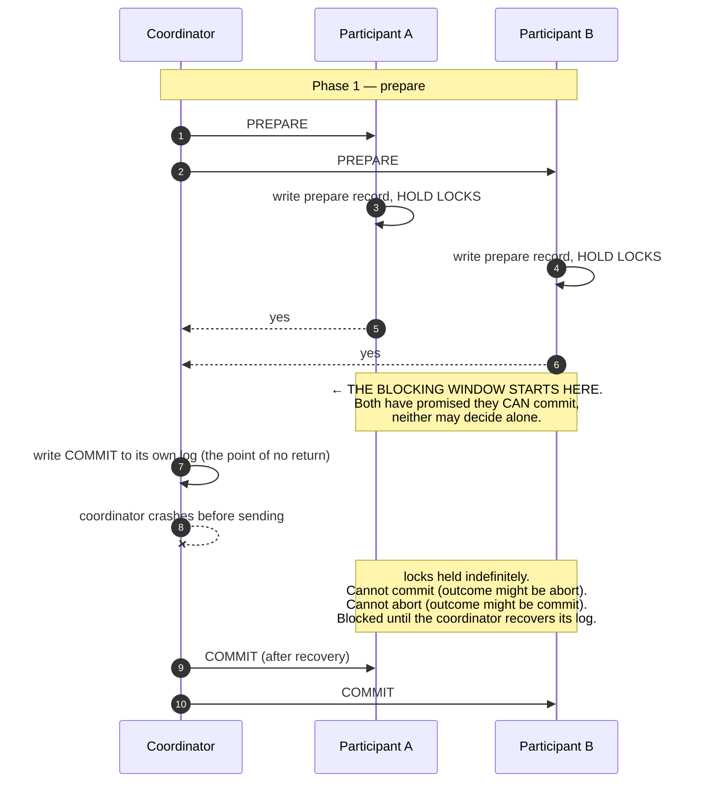
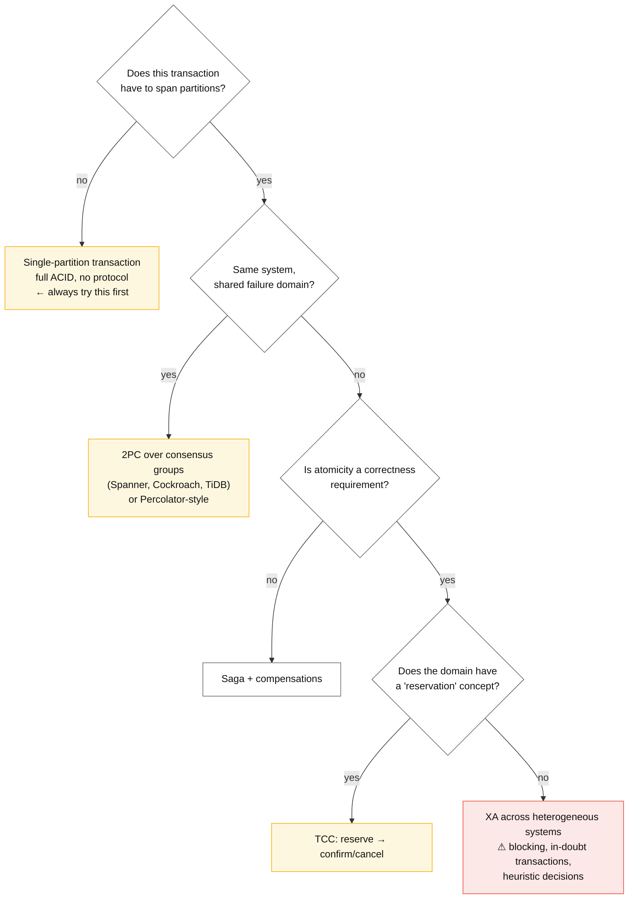

# Distributed transactions

## Core concept

Two-phase commit gives real atomicity across independent resources, and pays for it with a
**blocking window**: between a participant voting *yes* and learning the outcome, it holds locks
and cannot decide alone. If the coordinator dies in that window, participants are stuck —
they cannot commit (the outcome may be abort) and cannot abort (the outcome may be commit) — until
it returns. That is not an implementation weakness; it is a theorem. Any non-blocking atomic
commit protocol needs the additional machinery of consensus, which is what modern distributed
databases actually do.

So the design question is never "2PC or saga?" in the abstract. It is:

1. Can this be **one partition**? If yes, stop — a local transaction beats every distributed
   protocol on latency, availability, and the amount of code nobody has to write.
2. If not, is atomicity a *correctness* requirement or a *convenience*? Convenience gets a saga.
3. If correctness, can the participants share one commit protocol (one database cluster, or
   Spanner-style consensus underneath)? That is where 2PC belongs.
4. Only if none of those hold do you get XA across heterogeneous systems — and that is the option
   whose operational reputation is earned.

**When it earns its complexity:** cross-shard writes inside one system that already has consensus
and a shared failure domain. **What it costs if adopted too early:** locks held across a network
round trip, availability that is the *product* of every participant's availability, and an
operator paging on "in-doubt transactions" at 3am.

## Mechanics & internals

### 2PC, and exactly where it blocks

Three properties worth stating precisely, because they are what interviews probe:

- **The coordinator's log is the single point of truth.** Once it writes *commit*, the outcome is
  decided even if every participant is unreachable. Lose that log and no recovery is possible —
  which is why coordinators must be durable and, in serious systems, replicated by consensus.
- **A *yes* vote is a promise.** The participant has written a prepare record and must be able to
  honour commit after a crash and restart. This is why prepare is expensive: it is a durable write
  plus retained locks.
- **Heuristic decisions are corruption with a nicer name.** XA lets an operator force commit or
  abort on an in-doubt transaction. If the guess is wrong, participants diverge and the database
  will not tell you — reconciliation is a human job.

Availability is multiplicative: three participants at 99.9% give the transaction ~99.7%, and *any*
participant being down blocks the whole operation. Adding a participant strictly reduces
availability, which is the argument that most reliably ends a design debate.

### Making it non-blocking: replicate the coordinator

The fix used by every modern system is to stop treating the coordinator as one machine: run it as
a **consensus group**, so its log survives a node failure and a new leader can complete the
protocol. Spanner does exactly this — each participant is a Paxos group, and the coordinator's
decision is itself replicated — which is why "Spanner uses 2PC" and "Spanner is available" are both
true. **2PC over consensus-replicated participants is a fundamentally different availability story
from 2PC over single-node participants**, and conflating them is the most common error in this
topic.

### Alternatives that keep atomicity without classic 2PC

| Approach | Mechanism | Blocking? | Where it lives |
|---|---|---|---|
| **Single-partition** | Make the transaction local by data modelling | No | The answer whenever it is reachable |
| **2PC over Paxos/Raft groups** | Coordinator decision replicated | Effectively no | Spanner, CockroachDB, YugabyteDB, TiDB |
| **Percolator-style** | Client-driven 2PC with a primary lock row; readers clean up abandoned locks | No, lazily resolved | Google Percolator, TiDB |
| **Deterministic execution** | Order transactions first, execute deterministically; no commit vote needed | No | Calvin, FaunaDB |
| **TCC / reservations** | Domain-level reserve → confirm/cancel | No | Bookings, payments, inventory |
| **Saga** | Local transactions + compensations | No — and no isolation | Cross-service business processes |

**Percolator deserves the attention it rarely gets**: it does 2PC without a durable coordinator
service by writing the lock into the data itself. One row is designated primary; committing it
atomically commits the transaction, and secondary locks are cleaned up lazily by whoever encounters
them. A crashed client leaves locks behind, but any later reader can determine the outcome from the
primary and roll forward or back. **The coordinator's state lives in the database rather than in a
coordinator** — an idea worth stealing whenever a design seems to require a coordinator process.

### The three-phase commit dead end

3PC adds a pre-commit round to avoid blocking, and works only under a synchronous model with
bounded message delay and accurate failure detection. Real networks provide neither, so under a
partition it can produce **inconsistent commits** — worse than blocking. It appears in textbooks
and essentially never in production; being able to say why is a cheap way to show you have read
past the summary.

## Numbers that matter

| Quantity | Value | Confidence |
|---|---|---|
| Round trips, 2PC | **2 phases × 1 RTT** plus a durable write per participant per phase | Definitional |
| Latency, same-region 3-participant 2PC | 5–20 ms | Order of magnitude; fsync-dominated |
| Latency, cross-region participants | ≥ 2 × RTT — **140 ms+** for 70 ms links | Arithmetic |
| Availability, 3 participants at 99.9% each | ~99.7% — and any one down **blocks** | `0.999³` |
| Lock hold time | From prepare to commit — includes coordinator round trip and its fsync | The number that decides throughput on contended rows |
| Throughput on a contended row | `1 / lock_hold_time` — at 10 ms, **100 txn/s** regardless of hardware | Arithmetic; see [../fundamentals/queueing-theory-basics.md](../fundamentals/queueing-theory-basics.md) |
| In-doubt transaction resolution | Minutes to hours if it needs a human | Operational reality of XA |
| Spanner commit (multi-region, TrueTime) | Tens to low hundreds of ms | Vendor-documented; the cost is explicit |

**The arithmetic that kills most proposals.** A cross-shard 2PC holding locks for 10 ms caps a hot
row at 100 transactions/s — no hardware fixes it, because the ceiling is the lock hold time, not
the CPU. Put the participants in different regions and the hold time becomes 150 ms, giving ~7
transactions/s on that row. If the design needs thousands, the answer is not a faster network; it
is a data model where the transaction is single-partition.

## Failure modes

| Failure | Symptom | Mitigation |
|---|---|---|
| **Coordinator dies in the window** | Participants hold locks indefinitely; the shard appears hung | Consensus-replicated coordinator; short prepare timeouts; a recovery process that is tested |
| **In-doubt transactions after a crash** | `XA RECOVER` shows transactions nobody can resolve | Coordinator log durability; documented, rehearsed recovery |
| **Heuristic commit/abort guessed wrong** | Participants silently diverge; no error, no detection | Avoid heuristics; if forced, record and reconcile explicitly |
| **Lock hold under contention** | Throughput ceiling far below hardware capability | Reduce hold time, or remove the cross-partition write entirely |
| **Availability multiplied** | Each added participant lowers success rate and adds a blocking dependency | Fewer participants; single-partition redesign |
| **XA across heterogeneous systems** | Driver bugs, partial recovery support, mismatched timeouts | Do not span DB and broker with XA — use the [outbox](./outbox-pattern.md) |
| **"Transaction" that is not one** | Framework annotations spanning services do nothing; failures leave partial state | Know exactly which resource manager enforces atomicity |
| **Weak defaults inside the database** | The engine offers transactions but the default concerns do not deliver them | Set read and write concerns explicitly; **test the anomaly, don't trust the label** |

**Documented analysis.** Jepsen's **MongoDB 4.2.6** report (May 2020) is the most useful cautionary
tale here, because the failure is not in an exotic protocol but in the **defaults around one**.
Jepsen found violations of snapshot isolation even at the strongest read and write concerns, plus
"retrocausal" transactions in which a read observed the effect of a write that came later in the
same execution. Weak defaults allowed transactions to lose writes and to read stale data unless
concerns were set carefully — MongoDB's own documentation notes that `readConcern: snapshot`
guarantees nothing about majority-committed data if the commit does not use
`writeConcern: majority`. Jepsen's recommendation was that the marketing language should say
"snapshot isolated" rather than "ACID".

The transferable lesson is not about one vendor. It is that **a transaction is only as strong as
the concerns you set and the anomalies you have actually tested**, and that "the database supports
transactions" is a claim about a feature, not about your configuration. The same discipline appears
in [../fundamentals/transaction-isolation-levels.md](../fundamentals/transaction-isolation-levels.md)
— a safety property nobody tests is a safety property nobody has.
([Jepsen: MongoDB 4.2.6](https://jepsen.io/analyses/mongodb-4.2.6))

## Trade-offs vs alternatives

| Option | Atomicity | Isolation | Availability | Choose when |
|---|---|---|---|---|
| **Single-partition transaction** | Full | Full | Highest | Always, if the data model allows it |
| **2PC over consensus groups** | Full | Full | Good — survives node loss | Cross-shard writes in one distributed database |
| **Percolator-style** | Full | Snapshot | Good — no coordinator service | Client-driven distributed transactions over a KV store |
| **Deterministic (Calvin-style)** | Full | Serializable | Good | Workloads where the read/write set is known upfront |
| **TCC** | Business-level | Designed intermediate state | Good | Reservations exist in the domain |
| **Saga** | Eventual | **None** | Highest | Cross-service processes; see [saga-pattern.md](./saga-pattern.md) |
| **XA across heterogeneous systems** | Full, in theory | Full | **Worst** — blocking plus driver reality | Legacy integration you cannot avoid |

### Where staff engineers get this wrong

1. **Not trying single-partition first.** Most cross-shard transactions are an artefact of a
   partition key chosen for the wrong query. Changing the key removes the entire problem.
2. **Conflating 2PC-over-consensus with XA-over-two-databases.** Same protocol name, completely
   different availability. Spanner's use of 2PC is not an argument for XA.
3. **Ignoring lock hold time.** The throughput ceiling is `1 / hold_time` on contended rows, and
   cross-region participants make it brutal.
4. **Spanning a database and a message broker with XA.** This is the classic misuse, and the outbox
   pattern exists precisely to replace it.
5. **Trusting the word "ACID".** Set the concerns explicitly and test the anomaly you care about;
   Jepsen has found violations in shipping systems at the strongest advertised settings.
6. **Forgetting that adding a participant lowers availability.** Every extra resource manager is a
   multiplication, not an addition.
7. **Proposing 3PC.** It solves blocking only under assumptions real networks violate, and can
   commit inconsistently under partition.

## Real-world examples

- **Google Spanner** — 2PC where every participant is a Paxos group and the coordinator's decision
  is replicated; the canonical demonstration that 2PC's blocking problem is a *coordinator
  durability* problem.
- **Google Percolator** — client-driven 2PC with the primary-lock trick; distributed transactions
  over Bigtable with no coordinator service. TiDB's transaction model descends from it.
- **CockroachDB / YugabyteDB / TiDB** — production distributed SQL, all doing cross-shard atomic
  commit over consensus-replicated ranges, with explicit documentation of the latency cost.
- **X/Open XA + JTA** — the heterogeneous standard, its in-doubt transaction recovery, and its
  heuristic decisions. Worth knowing so you can decline it with specifics.
- **Jepsen: MongoDB 4.2.6** — the reminder that transaction guarantees are a function of
  configuration and testing, not of the feature's existence.

## Staff-level follow-ups

1. Show the exact interleaving where a coordinator crash leaves participants blocked, and state
   what each participant may and may not do while waiting.
2. Compute the throughput ceiling for a contended row under cross-region 2PC, then redesign the
   data model so the transaction is single-partition. What did you give up?
3. Explain why Spanner's use of 2PC is not an argument for XA between your Postgres and your
   Kafka cluster.
4. A team proposes XA across a database and a message broker. Give the failure they will hit and
   the pattern that replaces it.
5. Your database advertises ACID transactions. Design the test that tells you whether *your*
   configuration actually provides the isolation you assumed.

## See also

- [saga-pattern.md](./saga-pattern.md) — what you use when atomicity across services is unavailable
- [outbox-pattern.md](./outbox-pattern.md) — the replacement for DB-plus-broker XA
- [../fundamentals/consensus-raft-paxos.md](../fundamentals/consensus-raft-paxos.md) — what makes the coordinator survivable
- [../fundamentals/transaction-isolation-levels.md](../fundamentals/transaction-isolation-levels.md) — the local guarantees these protocols extend
- [../fundamentals/partitioning-strategies.md](../fundamentals/partitioning-strategies.md) — how to make the transaction single-partition

## Referenced by

- [Outbox pattern](outbox-pattern.md)
- [Patterns index](README.md)
- [Saga pattern](saga-pattern.md)
- [Topic manifest](../topics/manifest.md)
- [Transactions, sagas and idempotency](../02-primitives/transactions-and-idempotency.md)

## Sources

- [Jepsen: MongoDB 4.2.6](https://jepsen.io/analyses/mongodb-4.2.6) — snapshot-isolation violations and weak defaults
- [Peng & Dabek — Large-scale incremental processing using distributed transactions and notifications (Percolator, OSDI 2010)](https://research.google/pubs/pub36726/)
- [Corbett et al. — Spanner (OSDI 2012)](https://research.google/pubs/pub39966/) — 2PC over Paxos groups
- [Thomson et al. — Calvin: fast distributed transactions for partitioned database systems (SIGMOD 2012)](https://cs.yale.edu/homes/thomson/publications/calvin-sigmod12.pdf)
- [X/Open XA specification and JTA in-doubt recovery](https://pubs.opengroup.org/onlinepubs/009680699/toc.pdf)
- Local book: `DE/System-Design/Designing Data Intensive Applications.pdf` ch.9 — atomic commit and 2PC
