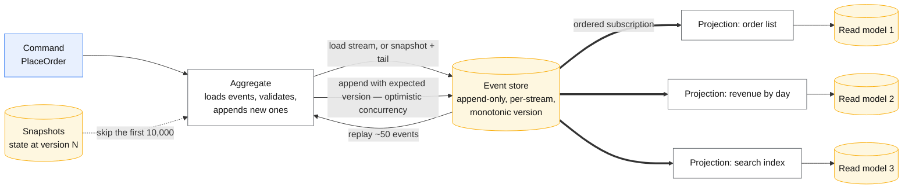

# Event sourcing

## Core concept

Store the **facts that happened**, not the state they produced. Current state is a fold over the
event log: `state = events.reduce(apply, empty)`. Nothing is ever updated in place, so the log is
both the source of truth and the audit trail, and any view of the data can be thrown away and
rebuilt.

What you actually buy is three things that are hard to get any other way: **a complete history you
can query as of any past moment**, **the freedom to add a new read model later over data you
already have**, and **debuggability** — you can replay the exact input sequence that produced a
bug.

What you pay is permanent, and the reason this pattern is adopted far more often than it is
justified: **your events become a schema you must support forever**. A row you wrote five years
ago must still be readable by today's code, and there is no migration that makes that go away.
Before reaching for it, ask the two questions this folder exists to force:

> Does this problem actually require the history, or does an audit log alongside a normal table
> give me 90% of it for 10% of the cost?

For most CRUD, the audit log wins. Event sourcing earns its keep where the *sequence* has meaning:
ledgers, order lifecycles, matching engines, anything where "how did we get here" is a question
someone genuinely asks.

## Mechanics & internals

### The shape



### Streams, versions and optimistic concurrency

Events belong to a **stream** — usually one aggregate: `order-1234`, `account-99`. Each append
carries an **expected version**; if the stream has moved on, the append is rejected and the
command is retried against fresh state. That single mechanism is the whole concurrency story, and
it is why an aggregate must be small enough that contention on one stream is rare.

**The aggregate boundary is the transaction boundary.** One command appends to one stream,
atomically. Needing to append to two streams atomically means the boundary is wrong — redraw it,
or accept a [saga](saga-pattern.md) across them.

### Snapshots

Replaying 500,000 events to answer one command is untenable, so periodically persist the folded
state with the version it represents. Load = latest snapshot + events after it.

**Snapshots are a cache and must be disposable.** If deleting every snapshot and rebuilding from
events produces different state, the snapshot is load-bearing and you no longer have event
sourcing — you have a state store with an expensive log next to it. Test exactly that, in CI.

### Schema evolution, which is the real cost

Events are immutable and permanent, so **you can never change an old event**. The techniques, in
order of preference:

| Technique | How | Note |
|---|---|---|
| **Additive only** | New optional fields; old events read with defaults | Always try this first |
| **Upcasting** | A function converts v1 events to v2 at read time | Every upcaster is permanent code. They accumulate |
| **New event type** | `OrderPlacedV2` alongside `OrderPlaced` | Honest; the handler must know both forever |
| **Copy-transform the stream** | Write a new stream from the old one | A migration with an outage-shaped risk. Rare, and a real decision |
| Mutate old events | — | **Not available.** This is the deal |

**Never put a raw serialised domain object in an event.** A refactor of that class silently
changes the event format for every event already written. Events get their own explicit,
versioned schema, separate from the domain model.

### Projections

A projection folds the log into a read model. Properties that matter:

- **Idempotent apply**, because it will see an event twice. Track the last-processed position and
  skip anything at or below it.
- **Ordered per stream** — global ordering is usually unnecessary and expensive; per-stream order
  is usually essential.
- **Rebuildable from zero.** This is the payoff: a new read model is built by replaying, and a
  broken projection is fixed by deleting it and replaying. That property has to be exercised
  regularly or it quietly stops being true.
- **Lag is user-visible.** A projection behind by 500 ms means a user does not see their own write.
  That is a product decision, not an implementation detail — see [cqrs.md](cqrs.md).

### What it is not

- **Not a message queue.** The event store is the system of record; a broker is transport. Events
  published for other services are a separate, deliberately-shaped contract — often via the
  [outbox pattern](outbox-pattern.md) — not your internal event types leaked outward.
- **Not CQRS.** They pair well and are independent. You can event-source with one read model, and
  you can do CQRS over a plain relational store.
- **Not a free audit log.** It is an audit log of *domain events*, which is not the same as an
  audit log of *who did what through which interface*. If you need the latter, write it.

## Numbers that matter

```
Stream length: keep aggregates small. A stream over ~10k events without snapshots
  is a slow command path. Snapshot every 100-1,000 events depending on event size.

Replay throughput: rebuilding a projection over 1e9 events at 50k events/s
  is ~5.5 hours. Measure it BEFORE you need it — "we can always replay" is a
  claim with a number attached, and the number is usually a surprise.

Storage: events are small and immutable. 1e9 events × 300 B ≈ 300 GB, never
  updated, highly compressible, and cold-tierable after the snapshot horizon.

Retention is the trap: if the log is the source of truth, retention is FOREVER.
  A broker default of 7 days is not an event store, and the mismatch is the
  single most common architectural error in this pattern.

Upcaster debt: one per breaking change, permanently. Five years at four changes
  a year is twenty functions on the read path of every old event.
```

## Failure modes

| Failure | Looks like | Why |
|---|---|---|
| **Broker used as the event store** | History silently disappears | Retention expired. A 7-day default on a system of record |
| **Snapshots load-bearing** | Rebuild produces different state | Snapshot written by different logic than the fold, or a projection wrote into it |
| **Events carry serialised domain objects** | A harmless refactor breaks reading five-year-old events | Format coupled to code |
| **Aggregate too large** | Constant optimistic-concurrency retries on one stream | Boundary drawn around too much |
| **Projection not idempotent** | Double counting after a replay or restart | No position tracking on apply |
| **Replay never exercised** | It does not work on the day you need it | The capability decayed unnoticed |
| **Personal data in immutable events** | Erasure request cannot be satisfied | "Append-only" collides with the legal right to erasure — see below |
| **Business rules replayed from old events** | Rebuild produces *today's* answer for *last year's* data | Projections must be pure over the event, not call current services or read current config |

**The one nobody plans for: GDPR erasure against an immutable log.** You cannot delete the event.
The standard answer is **crypto-shredding** — personal fields are encrypted with a per-subject
key, and erasure destroys the key, leaving the event structurally intact and permanently
unreadable. Decide this before the first event is written, because retrofitting it means the
copy-transform migration you were trying to avoid.

## Trade-offs vs alternatives

| Approach | Take it when | Costs |
|---|---|---|
| **Event sourcing** | The sequence has meaning; you need time travel, audit, or future read models | Permanent schema, replay operations, a real learning curve for the team |
| **State + audit log table** | You need "who changed what" and nothing more | No time travel of *derived* state, no new-projection-from-history |
| **[CDC](../05-data-cases/cdc-pipeline.md) from a normal store** | You want a stream without changing the write model | Events are row diffs, not domain facts — "balance changed" not "payment refunded" |
| **Temporal / system-versioned tables** | You need as-of queries on rows | Row history, not intent |
| **[Ledger](../fundamentals/ledgers-and-double-entry.md)** | The domain is money | Narrower, and enormously better understood in that domain |

**CDC versus event sourcing is the comparison to have ready.** CDC gives you a stream cheaply and
without touching the write model, but the events are *incidental* — they describe how rows
changed, and the intent is gone. Event sourcing makes intent first-class and charges you for it
everywhere. If what you want is "a stream for the analytics team", CDC is the right answer and
this pattern is not.

## Real-world examples

- **Double-entry accounting is event sourcing** and predates computing. Entries are immutable
  facts, balances are folds, corrections are new entries. That it survived centuries is the best
  argument for the pattern in the domains where it fits.
- **Version control** is the same shape: commits are events, working tree is a projection, a
  checkout is a fold, and `git gc` is snapshotting.
- **The recurring failure** is a team using Kafka with 7-day retention as "the event store", then
  discovering at the first rebuild that the history needed to rebuild does not exist.

## On AWS and Azure

| | AWS | Azure |
|---|---|---|
| **The service** | DynamoDB as the event store (partition key = stream id, sort key = version) with **DynamoDB Streams** for projections; Kinesis Data Streams or Amazon MSK for the subscription; S3 for cold event archive | Azure Cosmos DB for NoSQL as the event store with the **change feed** driving projections; Event Hubs or Service Bus for transport; Blob Storage for archive |
| **What you configure** | The `(stream_id, version)` key schema, a condition expression on `version` for optimistic concurrency, stream view type, projection checkpointing | Partition key = stream id, change-feed processor with a lease container, retention and archival |
| **The default that bites** | **Kinesis retention is 24 hours by default** (maximum 8,760 hours / 365 days), and **each shard supports only 5 `GetRecords` transactions per second shared across classic consumers** — so a second projection halves the first one's replay rate. Neither number is an event-store number: use Kinesis as transport and keep the durable log in DynamoDB or S3 | **Event Hubs Standard caps retention at 7 days** and partitions at 32 per event hub with no dynamic scale-out below Premium. Using it as the system of record means your history is deleted on a rolling weekly basis, silently and by design |
| **What it costs you** | A DynamoDB item is capped at **400 KB**, so a fat event must be split or offloaded to S3 with a pointer — and a pointer means the event is no longer self-contained, which undermines replay | A Cosmos **logical partition is capped at 20 GB and 10,000 RU/s**. One stream is one logical partition, so a long-lived aggregate hits the 20 GB ceiling and the answer is hierarchical partition keys or stream archival — decided up front, not when the writes start failing |

The shared lesson is blunt: **a broker is not an event store.** Both clouds' streaming products
default to days of retention because they were built for transport. The durable, unbounded,
replayable log belongs in a database or object storage, with the stream as a subscription
mechanism on top.

## In an LLM deployment

Agent systems are event-sourced whether their authors noticed or not:

- **A conversation is a stream** and the model's context is a fold over it. Summarisation is a
  snapshot — lossy, cached, and it must be reproducible from the events or your "resume this
  conversation" feature is not reliable.
- **Tool calls and their results are the events that matter.** Storing only the final assistant
  message discards exactly what you need to debug a bad answer, and it is the single most common
  observability gap in agent platforms.
- **Replay is how you evaluate a prompt change.** Take yesterday's events, run them through the
  new prompt, diff the outputs. This is the highest-value property event sourcing gives an LLM
  system, and it only works if you stored the *inputs*, not just the outputs.
- **But the fold is not deterministic.** Replaying with a model in the loop produces different
  results — different model version, temperature, or vendor-side change. So projections that must
  be reproducible have to store the model's *output* as an event, not recompute it. Recording "the
  classifier said fraud" is an event; "ask the classifier again" is not a projection.
- **Crypto-shredding applies with force.** Prompts contain whatever the user typed, which is the
  most personal data in the building, held in an immutable log. Encrypt per subject from the first
  event.

## Staff-level follow-ups

1. Talk me out of event sourcing for an e-commerce catalogue. Now talk me into it for the orders.
2. You must add a field to an event type written for three years. Give me the options and pick one.
3. Your projection is six hours behind after a bad deploy. What do users see, what do you tell
   them, and how do you catch up safely?
4. A user exercises their right to erasure and their data is in 40,000 immutable events. What did
   you have to build before today for this to be answerable?
5. How do you know, today, that replay still works? Describe the test and where it runs.

## See also

- [cqrs.md](cqrs.md) — the read-side pattern that event sourcing usually implies
- [materialized-views-and-derived-data.md](materialized-views-and-derived-data.md) — which stores
  you may delete and rebuild, of which projections are the purest case
- [../fundamentals/ledgers-and-double-entry.md](../fundamentals/ledgers-and-double-entry.md) — the
  oldest and best-understood instance of this pattern
- [cdc-pipeline.md](../05-data-cases/cdc-pipeline.md) — the cheaper alternative when you want a stream
  rather than a history
- [outbox-pattern.md](outbox-pattern.md) — publishing outward without leaking internal event types

## Referenced by

- [CQRS](cqrs.md)
- [Design a digital wallet](../03-backend-cases/digital-wallet.md)
- [Ledgers and double-entry](../fundamentals/ledgers-and-double-entry.md)
- [Patterns index](README.md)
- [Topic manifest](../topics/manifest.md)

## Sources

- [AWS — Kinesis Data Streams quotas and limits](https://docs.aws.amazon.com/streams/latest/dev/service-sizes-and-limits.html) — 24-hour minimum retention and 8,760-hour (365-day) maximum, five `GetRecords` transactions per second per shard shared across classic consumers, 20 registered enhanced fan-out consumers per stream
- [Azure — Event Hubs quotas and limits](https://learn.microsoft.com/en-us/azure/event-hubs/event-hubs-quotas) — 7-day maximum retention and 32 partitions per event hub on Standard, dynamic partition scale-out on Premium and Dedicated only
- [Azure — Cosmos DB service quotas and default limits](https://learn.microsoft.com/en-us/azure/cosmos-db/concepts-limits) — 20 GB and 10,000 RU/s per logical partition, 2 MB maximum item size
- [AWS — DynamoDB transactions: how it works](https://docs.aws.amazon.com/amazondynamodb/latest/developerguide/transaction-apis.html) — item size validation failure above 400 KB
