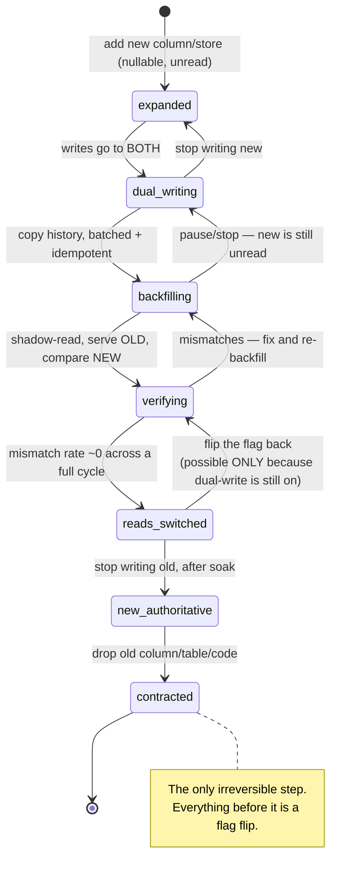
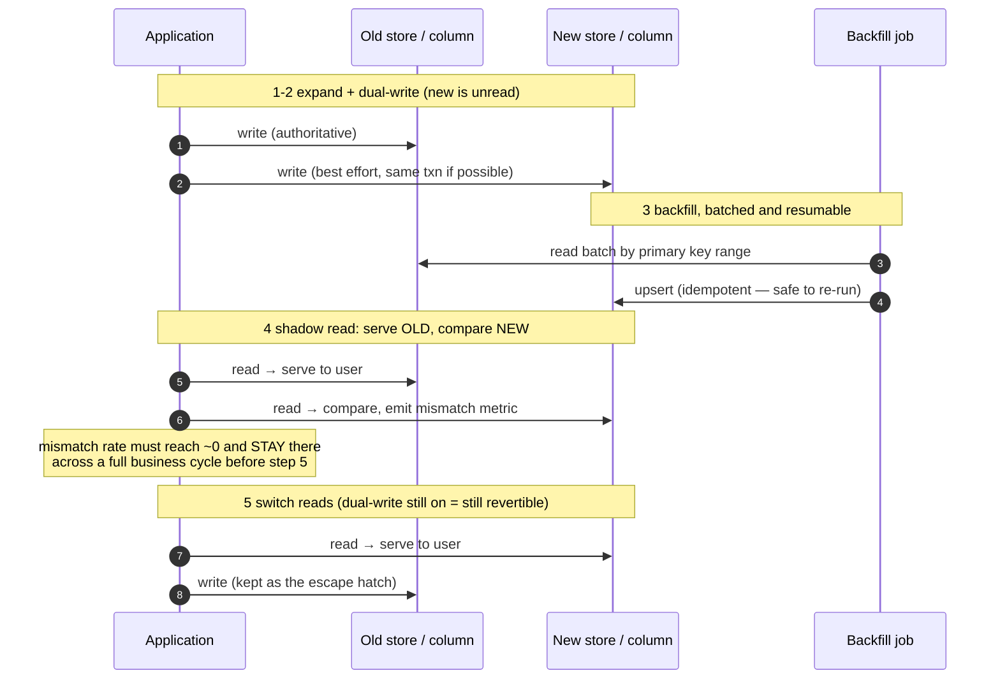

# Expand–contract migration

## Core concept

A migration is not a change; it is a **sequence of independently deployable, independently
revertible changes**, each of which leaves the system working with *both* the old and new shapes
present. That constraint — every intermediate state is a valid production state — is what makes a
migration safe, because during a rolling deploy old and new code run **simultaneously**, and
because you must be able to stop at any step and go backwards without data loss.

The shape is always the same, whether you are renaming a column or moving a hundred million objects
to a new datastore:

```
expand  →  backfill  →  dual-write  →  shadow-read + verify  →  switch reads  →  stop old writes  →  contract
```

The steps people skip are **verify** and **contract**, and skipping each has a signature failure:
skip verification and you discover the discrepancy from a customer; skip contraction and you carry
two schemas, two write paths and a dead backfill job forever, until someone deletes the "unused"
column that three services still read.

**When it earns its complexity:** any schema or store change on a system that cannot take
downtime. **What it costs if adopted too early:** for a table nobody reads yet, this is six deploys
where one would do — take the two-second lock and move on.

## Mechanics & internals

### The phases, and what makes each revertible

| # | Phase | Change | Revert |
|---|---|---|---|
| 1 | **Expand** | Add the new column/table/store, nullable, unused | Drop it — nothing reads it |
| 2 | **Dual-write** | Writes go to old **and** new; old is still authoritative | Stop writing new |
| 3 | **Backfill** | Copy historical rows in batches; **must be idempotent and resumable** | Stop; the new copy is still unread |
| 4 | **Shadow-read + verify** | Read both, serve **old**, compare and count mismatches | Stop comparing |
| 5 | **Switch reads** | Serve from new; still writing both | Flip the flag back — this is why dual-write stays on |
| 6 | **Stop old writes** | New is authoritative | Restore old writes and backfill the gap |
| 7 | **Contract** | Drop the old column/table/code | **Not revertible** — do it last, after a soak |

The ordering is not stylistic. Dual-write must precede backfill, or rows written during the
backfill are missed. Verification must precede the read switch, or you find out from users. And
dual-write must **outlive** the read switch, or step 5 has no revert.





### Backfill: the part that takes the longest and breaks production

Three properties are mandatory, and each corresponds to a common outage:

- **Batched by primary key range**, not `OFFSET` — deep offsets scan everything already skipped,
  and the job gets slower as it progresses until it never finishes.
- **Idempotent** (`INSERT … ON CONFLICT DO UPDATE`), so a crashed job resumes without duplicating.
- **Throttled, with a feedback signal** — pause when replication lag or database latency crosses a
  threshold. An unthrottled backfill is a self-inflicted incident that looks exactly like a traffic
  spike.

Stripe's account of migrating ~100 million subscription objects makes the strongest version of the
throttling point: they ran the transformation **offline in Hadoop/MapReduce** rather than issuing
expensive queries against the production database, then applied the results. **Moving the heavy
read off the primary is often better than throttling it.**

### Verification: shadow reads are the step that earns the whole exercise

During phase 4 the application reads **both** stores for every request, serves the old value, and
compares in the background. That gives:

- A **mismatch rate** — the number that decides whether you may proceed.
- A **sample of differences** for diagnosis, which almost always surfaces a genuine bug in the new
  write path, the backfill, or a type conversion.
- **Real production traffic** as the test corpus, including the shapes nobody wrote a test for.

Two disciplines make it work: compare **semantically**, not byte-wise (timestamps, ordering,
floating point and JSON key order produce false mismatches that hide real ones), and require the
mismatch rate to be ~0 **across a full business cycle** — a weekly job or month-end process will
otherwise find the difference after you have switched.

### Online DDL: the operations that lock, and the tools that avoid it

| Operation | Postgres | MySQL/InnoDB |
|---|---|---|
| Add nullable column, no default | Instant (metadata only) | Instant in 8.0 |
| Add column **with default** | Instant since PG 11 | Instant in 8.0 |
| Add index | `CREATE INDEX CONCURRENTLY` — no write lock, can fail leaving an **invalid** index | `ALGORITHM=INPLACE`, or gh-ost |
| Change column type | **Table rewrite + ACCESS EXCLUSIVE lock** | Rewrite; use gh-ost / pt-osc |
| Add `NOT NULL` | Lock, unless via a validated `CHECK` in two steps | Rewrite |
| Drop column | Fast (metadata) | Fast |

The trap that costs the most production time is not the lock itself — it is **lock queueing**. In
Postgres, a DDL statement waiting for an `ACCESS EXCLUSIVE` lock blocks every subsequent query on
that table behind it, so a migration waiting on one long-running `SELECT` stalls the entire table
within seconds. Always set `lock_timeout` (1–5 s) and retry, so a failed attempt is a no-op instead
of an outage.

For the operations that genuinely rewrite, **gh-ost** and **pt-online-schema-change** build a
shadow table, copy rows in batches while applying live changes, and cut over with a brief rename —
the same expand-contract shape, implemented inside a tool.

### Application-side compatibility

Because both versions run during a rollout, code must satisfy: **new code reads old data**, and
**old code tolerates new data**. Concretely — new columns nullable with sensible defaults, readers
that ignore unknown fields, and no enum value emitted before every reader can parse it. That last
one is the classic: deploy a writer that emits `status = 'archived'` and the not-yet-deployed
readers throw on every affected row.

## Numbers that matter

| Quantity | Value | Confidence |
|---|---|---|
| Backfill batch size | 1 k–10 k rows per transaction | Convention; small enough to avoid long locks and lag spikes |
| Backfill throughput | 1 k–50 k rows/s, throttled by replication lag | Order of magnitude — measure against *your* lag budget |
| Backfill duration, 100 M rows at 5 k/s | ~5.5 hours of continuous run | Arithmetic; usually spread over days at lower priority |
| `lock_timeout` for DDL | **1–5 s**, then retry | The single most valuable line in a Postgres migration script |
| Shadow-read overhead | 2× reads on the affected path | Budget it, or sample (1–10%) if the path is hot |
| Mismatch rate before switching | ~0, sustained over a **full business cycle** | Weekly and month-end jobs are where late mismatches live |
| Soak before contract | Days to weeks, and at least one full cycle | Contraction is the irreversible step |
| Replication-lag pause threshold | Backfill pauses above ~1–5 s of lag | Prevents the migration from becoming the incident |

**The arithmetic that sets the schedule.** 100 M rows at 5 k rows/s is ~5.5 hours at full tilt —
but throttled to protect replication lag it is realistically a multi-day job. That means dual-write
must be stable for days, the backfill must survive deploys and restarts, and "we'll migrate on
Tuesday" is not a plan. Compute this before committing to a date.

## Failure modes

| Failure | Symptom | Mitigation |
|---|---|---|
| **Backfill before dual-write** | Rows written during the backfill are missing from the new store | Order the phases correctly; a final reconciliation sweep as a backstop |
| **Unthrottled backfill** | Replication lag spikes, read replicas serve stale data, user-visible latency | Throttle on lag; batch; run offline where possible |
| **`OFFSET`-based batching** | Job slows quadratically and never completes | Key-range batching |
| **DDL lock queue** | One long `SELECT` blocks the migration, which blocks **everything else** on the table | `lock_timeout` + retry loop |
| **Failed `CREATE INDEX CONCURRENTLY`** | Leaves an **invalid** index that is not used but is still maintained on writes | Check `pg_index.indisvalid`; drop and retry |
| **No verification** | Discrepancy found by a customer after the switch | Shadow reads with a mismatch metric |
| **Byte-wise comparison** | False mismatch flood hides the real ones | Compare semantically; normalise before diffing |
| **Switching reads before dual-write is stable** | No revert path when the new store is wrong | Keep dual-write through the switch and the soak |
| **Never contracting** | Two schemas, two write paths, a dead backfill job, and a trap for the next engineer | Schedule contraction as work, with a date and an owner |
| **Contracting too early** | The revert path is gone the moment you need it | Soak across a full business cycle first |
| **New enum/field emitted before readers deploy** | Old instances throw on every affected row mid-rollout | Deploy readers first, writers second — always |

**Documented case.** Stripe's *Online migrations at scale* (2017) describes moving ~100 million
subscription objects with no downtime, using a four-phase strategy that is the canonical statement
of this pattern: **dual-write** to old and new, **backfill** the historical data, **move reads** to
the new store, then **stop writing** the old one. The details worth stealing are in how they
de-risked the middle: the transformation ran **offline in Hadoop** rather than as expensive queries
against production, and during the read-migration phase the application **fetched from both stores
on every request**, served the old value to the user, and compared the new one in the background —
so the switch was made on measured evidence rather than confidence.
([Stripe engineering](https://stripe.com/blog/online-migrations))

## Trade-offs vs alternatives

| Approach | Downtime | Risk | Complexity | Choose when |
|---|---|---|---|---|
| **Big-bang migration in a window** | Minutes to hours | High — no incremental verification, revert = restore a backup | Lowest | Small tables, internal tools, genuinely acceptable downtime |
| **Expand–contract** | None | Low — every step revertible, verified with real traffic | **Highest** — 5–7 deploys | Anything user-facing at scale |
| **gh-ost / pt-online-schema-change** | None | Low | Medium — a tool to learn and operate | Single-table rewrites in MySQL |
| **New table + view/alias indirection** | None | Medium | Medium | When reads can be redirected behind a view |
| **Blue-green at the database level** | Cutover window | Medium — data divergence during the switch | High | Whole-datastore moves with a planned cutover |
| **Don't migrate; add alongside** | None | Lowest | Low | The old shape can simply be left in place and deprecated |

### Where staff engineers get this wrong

1. **Treating it as one change.** It is five to seven deploys, each revertible. Planning it as a
   single ticket guarantees the middle steps are skipped.
2. **Skipping verification.** Shadow reads are the step that converts hope into a number, and they
   nearly always find a real bug before users do.
3. **Backfilling before dual-write.** Silent gaps for every row written during the copy.
4. **Forgetting `lock_timeout`.** A DDL waiting on a lock queues every other query on the table —
   the migration becomes the outage.
5. **Never contracting.** The system carries both shapes indefinitely, and the next engineer
   inherits a booby trap.
6. **Deploying writers before readers.** Old instances see data they cannot parse for the length of
   the rollout.
7. **Not computing the backfill duration.** It sets the schedule, and it is usually days, not
   hours.

## Real-world examples

- **Stripe** — the four-phase migration of ~100 M subscription objects with dual reads and offline
  transformation; the reference write-up for this pattern.
- **GitHub's gh-ost** — triggerless online schema change for MySQL: shadow table, binlog-driven
  catch-up, pausable, throttled on replication lag, with a brief atomic cutover.
- **Percona `pt-online-schema-change`** — the trigger-based predecessor; useful to know for the
  contrast in failure modes (triggers add write overhead and can deadlock).
- **PostgreSQL `CREATE INDEX CONCURRENTLY`** — the standard non-blocking index build, and the
  invalid-index failure that follows a cancellation.
- **Expand–contract in API versioning** — the same discipline applied to contracts rather than
  schemas: add the new field, populate both, migrate clients, remove the old — see
  [../02-primitives/storage-and-databases.md](../02-primitives/storage-and-databases.md).

## On AWS and Azure

| | AWS | Azure |
|---|---|---|
| **Expand–contract as a managed product** | **Amazon RDS Blue/Green Deployments** (RDS for MariaDB, MySQL and PostgreSQL; Aurora has its own). RDS copies the production *topology* — replicas, storage config, Multi-AZ — replicates blue→green, and switches over "typically under a minute" with no data loss and no application change | **No engine-level equivalent.** Azure Database Migration Service does online (minimal-downtime) migration, but its current scope is SQL only: **Azure SQL Managed Instance** and **SQL Server on Azure VMs** online, **Azure SQL Database offline only**. Reaching for DMS to move PostgreSQL or MySQL is reaching for a service that no longer covers it |
| **Non-blocking index build** | PostgreSQL `CREATE INDEX CONCURRENTLY`; gh-ost or pt-online-schema-change for MySQL rewrites | Azure SQL / SQL MI `WITH (ONLINE = ON)` on `CREATE INDEX`, `ALTER INDEX`, `DROP INDEX`, and on `ALTER TABLE` adding or dropping a UNIQUE or PRIMARY KEY constraint. **Resumable** index operations require online |
| **The read-switch flag** | AWS AppConfig feature flag, with automatic rollback when a CloudWatch alarm fires — the flip and its revert are the same mechanism | Azure App Configuration feature flag; immutable **snapshots** give a last-known-good to redeploy |
| **Throttling the backfill** | Read history from a replica or snapshot rather than the writer; watch replica lag before raising parallelism | ADF tumbling window `maxConcurrency` (1–50) to bound a batched copy; read replicas for the heavy scan |
| **The default that bites** | The green environment is **read-only by default**, and that is protection, not friction: enabling writes "can result in replication conflicts" and "unintended data in the production databases after switchover", and on RDS for PostgreSQL with physical replication "you can't enable write operations on the green environment" at all. The other surprise is the contract step — after switchover the old environment is **renamed `mydb1-old1`, not deleted**, and keeps billing until you delete it | `ONLINE = ON` is not lock-free. The docs warn that "index rebuild commands might hold exclusive locks on clustered indexes after a large object column is dropped from a table, even when performed online", and online index operations "aren't available in every edition of SQL Server" — so a script that runs clean against Azure SQL may block hard against the on-prem source you are migrating away from |

Neither cloud helps with **contract**, which is the step teams skip. Both give you an irreversible switchover and
nothing that nags about the old column, the second write path or the dead backfill job. That remains a scheduled
piece of work with a date and an owner.

## In an LLM deployment

The expand–contract shape survives intact when the thing being migrated is a model or a prompt, and it is the
only safe way to do it: expand (deploy the new model behind a flag) → dual-write (send a sample of live traffic
to both) → shadow-read (serve the old answer, score the new one offline) → switch reads → contract. What breaks
is **verify**. There is no mismatch rate, because two models given the same prompt produce different text and
both can be correct — so this page's warning about comparing *semantically* rather than byte-wise stops being a
footnote and becomes the entire step. "Mismatch ~0 across a full business cycle" becomes "no regression on a
graded eval set, plus a live A/B", and the soak is still measured in business cycles.

Two schema-shaped traps carry over literally. **Embeddings are a schema**: changing the embedding model
invalidates every stored vector, so the change is a full rebuild of the index plus a dual-write window, not a
config edit — and a half-migrated index of old and new vectors does not error, it returns confidently wrong
neighbours, which is the silent-corruption failure this page exists to prevent. And **a prompt is a wire
format**: add a field to a structured output and every reader that has not deployed yet breaks on it, which is
the same rule as the last row of the Failure modes table — **deploy readers first, writers second**.

## Staff-level follow-ups

1. Order the phases of a column-type migration and explain what breaks if dual-write and backfill
   are swapped.
2. Design the verification step for a store migration: what you compare, how you avoid false
   mismatches, what rate lets you proceed, and how long you wait.
3. Your `ALTER TABLE` has been waiting on a lock for 40 seconds and the table is now unusable.
   Explain the mechanism and give the two-line fix.
4. Compute the backfill duration for 100 M rows with a replication-lag budget of 2 seconds, then
   design the throttling loop.
5. A migration has been stuck at "dual-write plus backfill" for eight months. Make the case for
   finishing it, including what the half-migrated state is costing.

## See also

- [materialized-views-and-derived-data.md](./materialized-views-and-derived-data.md) — the same build-verify-swap shape for whole stores
- [../fundamentals/replication-lag-and-session-guarantees.md](../fundamentals/replication-lag-and-session-guarantees.md) — the lag budget the backfill must respect
- [../fundamentals/indexing-and-query-planning.md](../fundamentals/indexing-and-query-planning.md) — online index builds and their failure mode
- [../fundamentals/idempotency.md](../fundamentals/idempotency.md) — why the backfill must be re-runnable
- [../02-primitives/storage-and-databases.md](../02-primitives/storage-and-databases.md) — schema evolution and encoding compatibility

## Referenced by

- [Backfill and reprocessing](backfill-and-reprocessing.md)
- [Cell-based architecture](cell-based-architecture.md)
- [Design a hotel reservation system](../03-backend-cases/hotel-reservation.md)
- [Materialized views and derived data](materialized-views-and-derived-data.md)
- [Patterns index](README.md)
- [SQL vs NoSQL vs NewSQL](../comparisons/sql-vs-nosql-vs-newsql.md)
- [Storage and databases](../02-primitives/storage-and-databases.md)
- [Topic manifest](../topics/manifest.md)

## Sources

- [Stripe — Online migrations at scale (2017)](https://stripe.com/blog/online-migrations) — the four-phase strategy, dual reads, offline transformation
- [GitHub — gh-ost: triggerless online schema migration for MySQL](https://github.blog/2016-08-01-gh-ost-github-s-online-migration-tool-for-mysql/)
- [Percona — pt-online-schema-change](https://docs.percona.com/percona-toolkit/pt-online-schema-change.html)
- [PostgreSQL — `CREATE INDEX CONCURRENTLY` and lock levels](https://www.postgresql.org/docs/current/sql-createindex.html)
- [Martin Fowler — ParallelChange (expand/contract)](https://martinfowler.com/bliki/ParallelChange.html)

Cloud handles (§ *On AWS and Azure*), all verified 2026-09-20:

- [Amazon RDS — overview of blue/green deployments](https://docs.aws.amazon.com/AmazonRDS/latest/UserGuide/blue-green-deployments-overview.html) — supported engines, read-only green, switchover under a minute, the `-old1` rename
- [What is AWS AppConfig?](https://docs.aws.amazon.com/appconfig/latest/userguide/what-is-appconfig.html) — feature flags and CloudWatch-alarm rollback
- [What is Azure Database Migration Service?](https://learn.microsoft.com/en-us/azure/dms/dms-overview) — current online/offline scenario support
- [SQL Server / Azure SQL — perform index operations online](https://learn.microsoft.com/en-us/sql/relational-databases/indexes/perform-index-operations-online) — `ONLINE = ON`, resumable operations, the clustered-index lock caveat
- [Azure App Configuration — best practices](https://learn.microsoft.com/en-us/azure/azure-app-configuration/howto-best-practices) — snapshots as last-known-good
- [Azure Data Factory — create a tumbling window trigger](https://learn.microsoft.com/en-us/azure/data-factory/how-to-create-tumbling-window-trigger) — `maxConcurrency`
