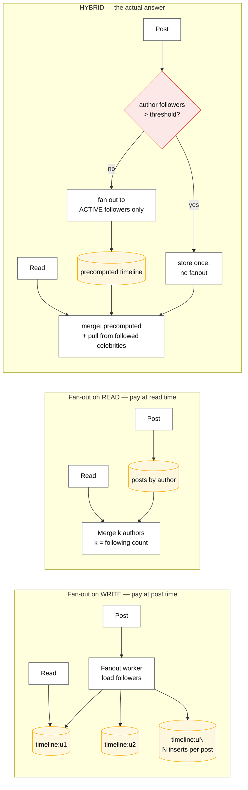
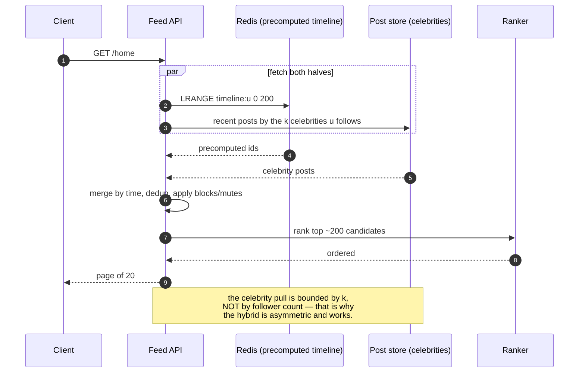

# Fan-out on write vs read

## Core concept

A feed is a join between "who I follow" and "what they posted", and the only real decision is
**when you pay for it**. Fan-out on write precomputes each follower's timeline at post time — reads
become a single list fetch, writes multiply by the follower count. Fan-out on read stores posts
once and merges at request time — writes are trivial, reads become a scatter-gather over everyone
you follow.

Both break at the extremes, in mirror-image ways: fan-out on write dies on the account with 100 M
followers (one post, 100 M inserts), fan-out on read dies on the user who follows 5 000 accounts
and refreshes constantly. **The answer at scale is always a hybrid**, and the interesting part is
the threshold — where it sits, who is above it, and what the merge costs.

**When it earns its complexity:** read-heavy feeds with skewed follower distributions, which is
every social product. **What it costs if adopted too early:** a precomputed store to keep
consistent, a fanout worker fleet, and a backfill path for every timeline when the ranking changes.
Below a few thousand active users, a `SELECT … WHERE author IN (…) ORDER BY time LIMIT 50` with a
good index is the whole feature.

## Mechanics & internals

### The two shapes, and the hybrid

Twitter's published design is the reference: Redis lists hold the materialised home timeline
(capped at ~**800** tweets — a product decision, not a technical one), most users are fanned out on
write because their follower counts are small, and high-follower accounts are **not** fanned out.
At read time the service fetches the precomputed timeline and the recent posts of the celebrities
you follow **in parallel**, merges by timestamp, and returns the top page.

### The three thresholds that actually matter

Most discussions name one threshold. There are three, and the second is the one that saves the most
work:

1. **Follower-count threshold** — above it, do not fan out. Where it sits depends on your write
   cost, not on a famous number: if a fanout insert costs 50 µs, a 100 k-follower account costs 5
   seconds of worker time per post.
2. **Active-follower filter** — fan out only to followers who have opened the app recently
   (7–30 days). On a mature social graph, **the majority of accounts are inactive**, so this
   routinely removes most of the work with no user-visible effect. Inactive users' timelines are
   rebuilt on demand when they return.
3. **Timeline length cap** — a materialised timeline is a bounded list (hundreds, not thousands).
   Older entries are recomputed on demand if anyone scrolls that far, which almost nobody does.

### The read path at the merge

The merge is where the product rules live: blocks, mutes, "seen" state, ads, and ranking. That is
also why a **pure** fan-out-on-write design ages badly — every ranking change would require
rewriting every materialised timeline, so mature systems fan out *candidate ids* and rank at read
time.

### Storage and the write-amplification arithmetic

Fan-out on write is a materialised view of a join, so it costs storage proportional to
`users × timeline_length`, and write IO proportional to `posts × average_follower_count`. Both are
computable in a design review, and both decide the architecture:

- 300 M users × 800 entries × 16 B per id ≈ **3.8 TB** of Redis just for ids. Storing whole posts
  instead of ids multiplies that by 50–100× and is the most common junior mistake.
- 5 k posts/s × 200 average followers = **1 M timeline inserts/s** — a fleet of workers, not a
  background job.

## Numbers that matter

| Quantity | Value | Confidence |
|---|---|---|
| Twitter materialised timeline length | ~**800** entries, Redis lists | [Krikorian, Timelines at Scale](https://www.slideshare.net/chrisbolman1/twitter-raffi-krikoriantimelinesatscale) — a product decision |
| Timeline delivery rate (Twitter, 2013 era) | ~**300 k** deliveries/s sustained | Same source; order of magnitude today |
| Store ids, not posts | 16 B vs 1–2 KB per entry — **~100×** | Arithmetic |
| Storage, 300 M users × 800 ids | ~3.8 TB | Arithmetic |
| Fanout write cost | 1 M inserts/s at 5 k posts/s × 200 followers | Arithmetic; the number that sizes the worker fleet |
| Celebrity threshold | 10 k–1 M followers, workload-dependent | Order of magnitude — derive it from your insert cost |
| Active-follower filter | Fan out to 7–30 day actives only; typically removes **most** of the work | Order of magnitude; measure your active ratio |
| Read fan-out (pull side) | Bounded by `k` = celebrities followed, typically < 50 | Structural — this is why the hybrid works |
| Cost per post, 100 k-follower account at 50 µs/insert | **5 seconds** of worker time per post | Arithmetic; the reason the threshold exists |

**The asymmetry that makes the hybrid correct.** Fan-out on write scales with *follower* count,
which has a power-law tail — a few accounts have tens of millions. Fan-out on read scales with
*following* count, which is bounded by human attention — almost nobody follows more than a few
thousand, and the *celebrity subset* is far smaller. So you precompute the bounded side and merge
the unbounded side at read time. Saying that sentence is the whole design.

## Failure modes

| Failure | Symptom | Mitigation |
|---|---|---|
| **Celebrity post stalls the fanout queue** | One post backs up delivery for every user; timelines go stale globally | Threshold + no-fanout for high-follower accounts |
| **Storing posts instead of ids** | Cache memory 100× over budget; every edit must rewrite N copies | Store ids; hydrate at read |
| **Fanning out to inactive users** | Most of the write cost buys timelines nobody opens | Active-follower filter with on-demand rebuild |
| **Unbounded timeline growth** | Redis memory climbs forever; eviction hits hot users | Cap the list; recompute deep pages on demand |
| **Ranking change requires a full rewrite** | Every experiment becomes a multi-day backfill | Fan out candidates, rank at read time |
| **Merge ignores blocks/mutes** | Users see content from accounts they blocked — a trust bug, not a bug | Apply the policy filter at read, never bake it into the materialised list |
| **Returning user has no timeline** | Cold user waits seconds on first open | On-demand rebuild with a bounded query; show cached-or-empty fast |
| **Deletes and edits** | Deleted post remains in N materialised timelines | Ids + hydrate means the deleted post disappears naturally — another argument for ids |
| **Fanout worker retries duplicate entries** | Duplicate items in the timeline | Idempotent inserts (sorted set keyed by post id) — see [../fundamentals/idempotency.md](../fundamentals/idempotency.md) |

**The delete case is worth stating plainly**, because it is the cleanest argument for storing ids:
with ids plus hydration, a deleted or edited post is corrected everywhere at read time for free.
With denormalised copies, every delete becomes its own fan-out — and a privacy-relevant one, since
"delete my post" must actually remove it from every materialised timeline within a defensible
window.

## Trade-offs vs alternatives

| Approach | Write cost | Read cost | Storage | Fits |
|---|---|---|---|---|
| **Fan-out on read (query on demand)** | ~0 | `O(following)` scatter-gather | None extra | Small graphs; the correct starting point |
| **Fan-out on write** | `O(followers)` | `O(1)` list fetch | `users × cap` | Read-heavy, bounded follower counts |
| **Hybrid with a threshold** | Bounded by the threshold | 1 fetch + small merge | Same as write-fanout for non-celebrities | **Every large social product** |
| **Hybrid + active filter** | Much lower | Same + occasional rebuild | Lower | Mature graphs with many dormant accounts |
| **Pull with aggressive caching** | ~0 | Cached merge | Cache only | Feeds with low read amplification per post |
| **Chronological only, no ranking** | Lowest | Lowest | Lowest | When the product genuinely does not rank — increasingly rare |

### Where staff engineers get this wrong

1. **Presenting fan-out on write as "the scalable one".** It is the read-optimised one. Its write
   cost is unbounded on the tail of the follower distribution.
2. **Naming one threshold.** The active-follower filter usually saves more work than the celebrity
   threshold, and almost nobody mentions it.
3. **Storing posts in the timeline.** 100× the memory, and every edit or delete becomes a fan-out.
4. **Baking ranking into the materialised list.** Every future ranking experiment becomes a
   backfill of every user's timeline.
5. **Forgetting the returning-user path.** With an active filter, dormant users have no timeline —
   that path must be designed, not discovered.
6. **Assuming the celebrity case is rare enough to ignore.** It is the case that decides the
   architecture; design it before it exists.

## Real-world examples

- **Twitter** — the canonical hybrid: Redis-materialised home timelines capped at ~800, celebrity
  accounts excluded from fanout and merged at read; ~300 k deliveries/s in the 2013-era talk.
- **Facebook / Instagram feeds** — ranked rather than chronological, so candidates are precomputed
  and ranking happens at read; the ranking-at-read argument in its strongest form.
- **Email newsletters / notification fan-out** — same pattern, different latency budget: fan-out on
  write with a queue, no read-time merge, because there is no "timeline" to rank.
- **Activity feeds in B2B products** — usually pure fan-out on read, because per-tenant graphs are
  small and the write amplification would buy nothing.
- **Redis sorted sets** — the standard implementation primitive: `ZADD` with the timestamp as score
  gives ordered, deduplicated, trimmable timelines in one structure.

## Staff-level follow-ups

1. Derive the celebrity threshold for a system doing 5 k posts/s with a 50 µs insert cost and a
   1-second delivery SLO. Show the arithmetic, then say what you would measure to tune it.
2. Design the returning-dormant-user path under an active-follower filter, including its latency
   budget and what the user sees while it runs.
3. A ranking change requires re-scoring every timeline. Explain why your design does or does not
   need a backfill, and redesign it so it does not.
4. Compute Redis memory for 300 M users at an 800-entry cap, then do it again storing full posts.
   Use the difference to make a design argument.
5. How does the design change if posts can be edited or deleted, with a legal requirement that
   deletions propagate within 60 seconds?

## See also

- [materialized-views-and-derived-data.md](./materialized-views-and-derived-data.md) — a timeline is a materialised view of a join
- [../fundamentals/hot-shard-mitigation.md](../fundamentals/hot-shard-mitigation.md) — the celebrity problem at the storage layer
- [../fundamentals/caching-strategies.md](../fundamentals/caching-strategies.md) — hydration and the read path
- [backfill-and-reprocessing.md](./backfill-and-reprocessing.md) — rebuilding timelines when the model changes
- [../03-backend-cases/news-feed.md](../03-backend-cases/news-feed.md) — the full design this pattern sits inside

## Referenced by

- [Design a news feed](../03-backend-cases/news-feed.md)
- [Patterns index](README.md)
- [Topic manifest](../topics/manifest.md)

## Sources

- [Krikorian — Timelines at Scale (Twitter)](https://www.slideshare.net/chrisbolman1/twitter-raffi-krikoriantimelinesatscale) — Redis timelines, ~800 cap, celebrity merge at read
- [High Scalability — How Twitter uses Redis to scale](http://highscalability.com/blog/2014/9/8/how-twitter-uses-redis-to-scale-105tb-ram-39mm-qps-10000-ins)
- [Redis — sorted sets as timeline structures](https://redis.io/docs/latest/develop/data-types/sorted-sets/)
- Local book: `DE/System-Design/Designing Data Intensive Applications.pdf` ch.1 — the Twitter timeline example
