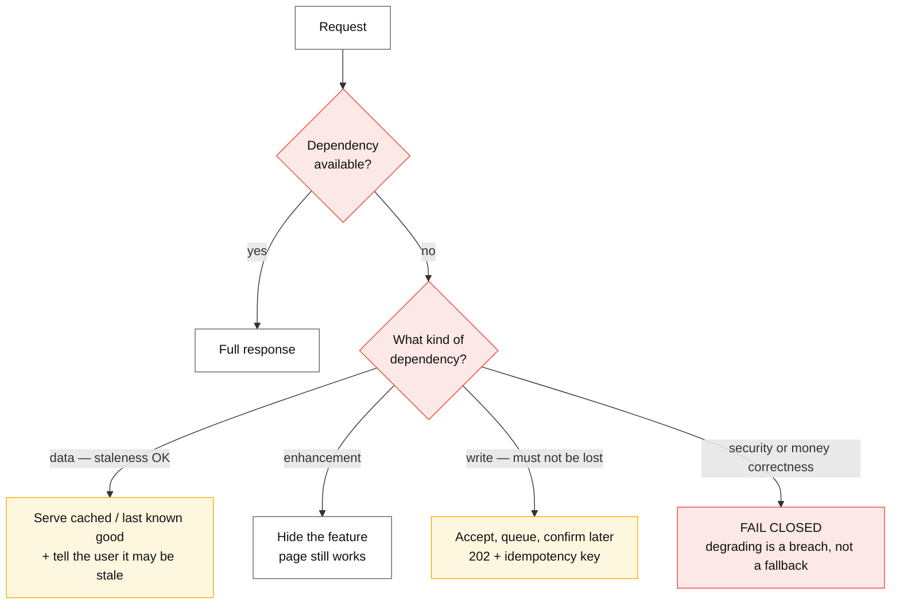
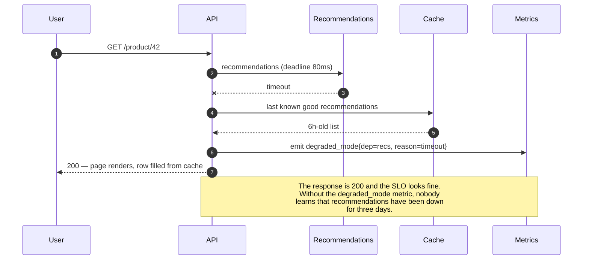

# Graceful degradation

## Core concept

Availability is not binary, and treating it as binary is what turns a dependency failure into an
outage. Graceful degradation is the discipline of deciding, **per dependency and in advance**, what
the product does when that dependency is unavailable: serve a cached value, serve a default, hide
the feature, queue the write, or fail — and *which* of those is a product decision that must be
made before the incident, not improvised during it.

The test for whether a team has actually done this is blunt: **for each dependency, can someone
state the degraded behaviour in one sentence?** "Recommendations fall back to editorially curated
lists." "Search falls back to the last successful index." "Analytics events are dropped, and we
accept the gap." A dependency with no answer is not degrading gracefully; it is a hard dependency
that nobody has admitted to.

**When it earns its complexity:** any dependency whose failure would otherwise fail the whole
request, where a partial answer has real value. **What it costs if adopted too early:** fallback
paths that are never exercised, stale data served silently, and a system whose true behaviour under
failure nobody can predict because it has five layers of quiet fallbacks.

## Mechanics & internals

### Classify every dependency first

The design work is a table, and it is worth more than any code:

| Dependency | Criticality | Degraded behaviour | Staleness allowed |
|---|---|---|---|
| Auth | **Critical** — fail closed | Reject; never guess an identity | None |
| Payment provider | Critical | Queue with idempotency key; confirm asynchronously | Minutes |
| Product catalogue | Important | Serve cached; show "prices may be out of date" | Hours |
| Recommendations | Optional | Curated static list, or hide the row | Days |
| Analytics beacons | Optional | Drop silently | N/A |
| Feature flags | **Critical-adjacent** | **Serve last known good from local disk** | Hours |

Two rows carry most of the lesson. **Auth fails closed** — degrading a security control is not
degradation, it is a breach. And the **feature-flag service is the one everybody forgets**: a
config dependency that fails closed takes the product down, so its client must cache the last good
values on local disk and start from them, which is the pattern AWS calls *static stability* —
continuing to operate on the last known state without needing the control plane.

### The three shapes of degraded behaviour

- **Serve stale** — the most common and most useful. Requires that something *keeps* the last good
  value: a cache with `stale-if-error`, a local snapshot, a replica. It also requires an honest UI
  signal when staleness is user-relevant (prices, balances, availability).
- **Hide the feature** — for enhancements. The page renders without the recommendations row; the
  user notices nothing or almost nothing. Cheapest possible degradation, and the one product teams
  under-use because "the row must always be there".
- **Queue the write** — accept, return `202`, complete asynchronously. Only safe with idempotency
  and a way to tell the user the outcome later; otherwise you have promised something you may not
  deliver.

### Static stability: the strongest version

The most robust degraded mode is one where the failing component was never on the request path to
begin with. AWS's *static stability* principle: a system should keep working on **pre-existing
state** when its control plane is unavailable — instances keep running when the EC2 control plane
is degraded, load balancers keep routing to the targets they already know.

Applied to ordinary services, it means: **cache the control-plane answer locally, and make the
local copy sufficient.** Feature flags on disk, service discovery results cached with a long
fallback TTL, auth public keys cached for their full validity window, config baked into the
deployment. The design question is "what does this process need to keep serving if it can reach
nothing but its own disk?"

### Where degradation is decided, and the honesty problem

That note is the failure mode nobody plans for: **successful degradation is invisible**. The
request succeeded, the latency was good, the error rate is zero — and a dependency has been dead
for a week. Every fallback must emit a metric, and sustained degradation must alert, or the
mechanism that protects you also hides the thing it is protecting you from.

## Numbers that matter

| Quantity | Value | Confidence |
|---|---|---|
| Fallback latency | Must be **much faster** than the primary — cached or local, not another network call | Design rule |
| Staleness budget per dependency | Seconds (prices) to days (recommendations) — **a product decision, written down** | Design decision |
| `stale-if-error` window | Minutes to hours; longer than the expected outage | HTTP standard; free at the CDN layer |
| Flag/config local cache | Last known good on **disk**, valid for hours | Static stability |
| Degraded-mode alert | Any dependency degraded > 5 minutes; page if it is important-tier | Convention |
| Fallback exercise cadence | Every release (CI) and quarterly (game day) | Untested fallbacks do not work |
| AWS S3, 28 Feb 2017 | ~3 hours in us-east-1; **the status dashboard itself depended on S3** | [AWS post-event summary](https://aws.amazon.com/message/41926/) |

**The arithmetic that justifies degrading at all.** A page composed of 6 services, each 99.9%
available, is `0.999⁶ ≈ 99.4%` available if every one is required — about **3.6 hours of downtime a
month**. Make four of them optional with fallbacks and the page's availability is governed by the
two critical ones: `0.999² ≈ 99.8%`, roughly 86 minutes. **Degradation is not a nicety; it is the
difference between two availability numbers you can compute in a design review.**

## Failure modes

| Failure | Symptom | Mitigation |
|---|---|---|
| **No degraded mode defined** | Any dependency failure fails the request; availability is the product of everything | The dependency table above, filled in per dependency |
| **Silent degradation** | Dependency dead for days, dashboards green, users quietly getting worse results | Emit `degraded_mode` metrics; alert on sustained degradation |
| **Fallback depends on the failing system** | The fallback fails in exactly the incident it exists for | Fallbacks must be strictly more local: cache, disk, static |
| **Fallback is slower than failing** | Degraded mode makes latency worse and spreads the outage | Fallback must be fast by construction |
| **Fail-open on a security control** | Degrading auth or rate limits = breach or abuse | Security and money paths **fail closed**, always |
| **Stale data served without a signal** | Users act on old prices or balances; trust damage exceeds the outage | Surface staleness where it changes a decision |
| **Config service is a hard dependency** | Flags unavailable → service will not start or serves defaults that differ from production | Last known good on local disk; static stability |
| **Untested fallback path** | Dead code that throws on first execution | Exercise in CI; force-fail dependencies in game days |
| **Degradation cascades** | Fallbacks generate extra load on other dependencies, spreading the failure | Fallbacks must be cheaper than the primary, never more expensive |
| **Monitoring depends on the degraded system** | You cannot see or communicate during the incident | Independent path for observability and status comms |

**Documented incident.** AWS S3, **28 February 2017**, us-east-1. An authorised operator running an
established playbook mistyped an input, removing far more servers than intended — including
capacity supporting the **index subsystem** (metadata and location for every object in the region)
and the placement subsystem. Both required a full restart, which had not been exercised at that
scale for years and took hours. S3 was unavailable in the region for roughly three hours, and
because a very large number of AWS services depend on S3, the impact spread far beyond object
storage.

The detail that belongs in this page: **the AWS Service Health Dashboard could not be updated,
because it was itself hosted on S3 in the affected region.** During the outage, status
communication moved to Twitter. AWS subsequently moved the dashboard to run across multiple
regions. Two lessons generalise well past AWS — **your status and observability path must not
depend on the system it reports on**, and **a restart procedure that has not been exercised at
current scale is an unknown-duration recovery**, not a known one.
([AWS post-event summary](https://aws.amazon.com/message/41926/))

## Trade-offs vs alternatives

| Approach | User experience | Complexity | Risk | Use when |
|---|---|---|---|---|
| **Fail the request** | Error page | None | Availability = product of all dependencies | Security, money correctness, or no meaningful partial answer |
| **Serve stale** | Slightly wrong, usually fine | Low — needs a cache with a fallback window | Users act on old data | Data whose staleness is tolerable and can be signalled |
| **Hide the feature** | Slightly less rich | Lowest | Users may not notice at all | Enhancements: recommendations, related items, badges |
| **Static default** | Generic but functional | Low | Loss of personalisation | Ranking, personalisation, config |
| **Queue the write** | "We got it, we'll confirm" | Medium — idempotency + async confirmation | Promise you might not keep | Writes that must not be lost and can be delayed |
| **Static stability** (pre-existing state) | Unaffected | Medium — design the local snapshot | Divergence from the control plane | Control-plane dependencies: flags, discovery, config |
| **Read-only mode** | Browsing works, writing does not | Medium | Partial product | Database primary lost, failover in progress |

### Where staff engineers get this wrong

1. **Treating availability as binary.** The interesting design space is the middle, and it is where
   most of the achievable availability lives — the `0.999⁶` versus `0.999²` arithmetic.
2. **Fallbacks that are not more local.** If the fallback makes a network call, it will fail during
   the incident it was built for.
3. **Degrading a security control.** Fail closed on auth, authorisation and abuse limits. Always.
4. **Silent fallbacks.** A degraded mode with no metric hides the outage from the people paid to
   fix it.
5. **Forgetting the config/flag dependency.** It is on the startup path of everything and is
   routinely the least redundant component in the system.
6. **Never exercising the path.** Untested fallbacks are dead code that runs for the first time
   during an incident.
7. **Status and monitoring inside the blast radius.** S3 2017 and Roblox 2021 are the same lesson
   twice — see [../fundamentals/consensus-raft-paxos.md](../fundamentals/consensus-raft-paxos.md).

## Real-world examples

- **AWS S3, Feb 2017** — the status dashboard hosted on the system it reported on; also the
  clearest published example of an unexercised restart procedure setting the recovery time.
- **AWS static stability** — the Builders' Library principle that data-plane operations continue on
  pre-existing state when the control plane is unavailable. The strongest form of degradation.
- **Netflix** — layered fallbacks for personalisation: personalised → popular-in-region → static
  curated list, each cheaper and more local than the last.
- **HTTP `stale-if-error` / `stale-while-revalidate`** — degradation standardised at the CDN layer:
  serve the stale copy rather than an error, for a bounded window.
- **Read-only mode during failover** — the standard degraded mode for a lost database primary:
  browsing works, writes are refused with a clear message rather than timing out.

## Staff-level follow-ups

1. Write the dependency table for a service you know: criticality, degraded behaviour, staleness
   budget. Which row is empty, and what does that tell you about your real availability?
2. Compute the availability of a page composed of six 99.9% services, then again after making four
   of them optional. Use the difference to justify the engineering.
3. Design the degraded mode for your feature-flag service, including what happens on a cold start
   with the flag service unreachable.
4. Give three fallbacks for a personalisation service ranked by independence from the failing path,
   and say which one you would ship first.
5. Your fallbacks are working and nobody knows a dependency has been down for a week. What is
   missing, and what would you alert on?

## See also

- [circuit-breaker.md](./circuit-breaker.md) — the mechanism that reaches the fallback quickly
- [cell-based-architecture.md](./cell-based-architecture.md) — bounding how many users see degradation
- [../fundamentals/load-shedding-and-admission-control.md](../fundamentals/load-shedding-and-admission-control.md) — degrading by refusing work
- [../fundamentals/caching-strategies.md](../fundamentals/caching-strategies.md) — the cache that makes "serve stale" possible
- [../02-primitives/reliability-patterns.md](../02-primitives/reliability-patterns.md) — bulkheads and DR around all of this

## Referenced by

- [Cell-based architecture](cell-based-architecture.md)
- [Circuit breaker](circuit-breaker.md)
- [Patterns index](README.md)
- [Reliability patterns](../02-primitives/reliability-patterns.md)
- [Topic manifest](../topics/manifest.md)

## Sources

- [AWS — Summary of the Amazon S3 service disruption in us-east-1 (28 February 2017)](https://aws.amazon.com/message/41926/)
- [AWS Builders' Library — Static stability using Availability Zones](https://aws.amazon.com/builders-library/static-stability-using-availability-zones/)
- [Google SRE Book — Addressing cascading failures (degraded modes)](https://sre.google/sre-book/addressing-cascading-failures/)
- [MDN — `Cache-Control: stale-if-error`](https://developer.mozilla.org/en-US/docs/Web/HTTP/Headers/Cache-Control)
- [Netflix — fallbacks and resilience engineering](https://netflixtechblog.com/fault-tolerance-in-a-high-volume-distributed-system-91ab4faae74a)
