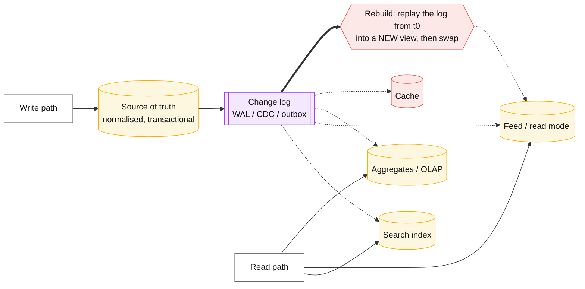
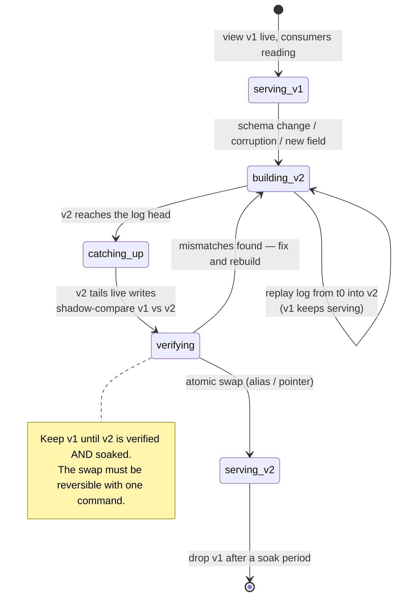

# Materialized views and derived data

## Core concept

Split every store into two categories and most architectural arguments resolve themselves:

- **Source of truth** — the only place a fact is *created*. Losing it is data loss.
- **Derived data** — anything computable from the source: search indexes, caches, feeds,
  aggregates, read models, analytics tables. Losing it is an **outage**, not data loss, because it
  can be rebuilt.

That distinction is worth more than the pattern itself. It tells you where transactions and backups
matter, where correctness bugs are recoverable, and which stores you are allowed to blow away and
regenerate at 3am. A team that cannot say which of its stores are derived will treat a corrupted
search index as an emergency instead of a rebuild.

**When it earns its complexity:** when the read pattern cannot be served efficiently from the write
model — fan-out reads, aggregates over large ranges, joins across services, full-text search.
**What it costs if adopted too early:** a second store to operate, a staleness contract to explain
to users, a pipeline that can fall behind, and a rebuild path that is only discovered to be broken
when you need it.

## Mechanics & internals

### The shape

Every derived store hangs off **one** ordered change log. That single constraint gives three
properties that ad-hoc dual writes never provide: consumers cannot disagree about order, a new
consumer can bootstrap from the beginning, and a corrupted view can be rebuilt without touching the
source.

### Maintenance strategies, and what each costs

| Strategy | Freshness | Write cost | Read cost | Fits |
|---|---|---|---|---|
| **Compute on read** (no view) | Perfect | None | Full query every time | Low traffic; the honest default until measured |
| **Cache on read** | TTL-bounded | None | Fast on hit | Repeated identical reads — [../fundamentals/caching-strategies.md](../fundamentals/caching-strategies.md) |
| **Periodic full refresh** | Refresh interval | Batch | Fast | Small views; `REFRESH MATERIALIZED VIEW` |
| **Incremental view maintenance** | Seconds | Per-write delta | Fast | Aggregates and joins that change often |
| **Fan-out on write** | Immediate | **Very high** for high-fan-out keys | Fastest | Feeds — with a celebrity exception |
| **Hybrid (precompute + merge at read)** | Immediate | Bounded | Moderate | Feeds at scale; the standard answer |

The interesting row is incremental maintenance, because the cost is not obvious: a join's delta can
be far more expensive than the write that triggered it. Adding one row to a table joined against a
million-row table can require re-evaluating a large slice of the view. **Incremental does not mean
cheap; it means amortised**, and the amortised cost is workload-dependent.

### Partial state: the idea worth stealing

Noria (OSDI 2018) makes the observation that materialising *everything* is wasteful because
applications read a small subset of their key space. Its operators keep **partially-stateful**
views: state can be **evicted** like a cache, and writes to evicted state are simply **discarded**
rather than maintained — because nobody is reading it, and if it is ever read again the value is
recomputed on demand ("upquery") and re-materialised.

This dissolves the usual dichotomy. A cache is a materialised view with eviction; a materialised
view is a cache that is maintained on write. Partial state lets one system be both, and the paper
reports scaling to tens of millions of reads and millions of writes per second — outperforming a
streaming dataflow system by keeping the working set materialised rather than everything.

The transferable design lever: **for a hot-key-skewed workload, maintaining views only for hot keys
and computing cold keys on demand is often strictly better than maintaining everything.**

### The staleness contract

A derived store is stale by design, so the contract must be explicit and, ideally, visible:

- **The bound**: "search reflects writes within 2 seconds, p99." Not "eventually".
- **The measurement**: end-to-end lag from source commit to view visibility — not the consumer's
  offset lag, which stops moving when the consumer stalls.
- **The product behaviour on breach**: show a staleness indicator, fall back to the source for the
  user's own records, or fail closed. Silence is a decision too — usually the wrong one.
- **Read-your-writes**: the user's own write must be visible to them, or the product feels broken.
  Route their read to the source, or carry a position token — see
  [../fundamentals/replication-lag-and-session-guarantees.md](../fundamentals/replication-lag-and-session-guarantees.md).

### Rebuild is a first-class operation

The whole justification for calling a store "derived" is that you can regenerate it. That claim is
only true if you have **run** the rebuild recently.

Three rules make this routine rather than heroic: **build alongside, never in place**; **verify by
comparison before switching**, not after; and **keep the old view long enough to switch back**. The
same shape as [expand-contract-migration.md](./expand-contract-migration.md), applied to a whole
store rather than a column.

## Numbers that matter

| Quantity | Value | Confidence |
|---|---|---|
| Derived-store lag, healthy CDC pipeline | 100 ms–2 s end to end | Order of magnitude; measure source-commit → view-visible |
| Rebuild time | `dataset ÷ replay throughput` — **hours for TB-scale** | Compute it before you need it; it is your recovery time |
| Replay throughput | 10 k–500 k events/s depending on the sink | Order of magnitude; the sink is usually the bottleneck |
| Fan-out on write, 1 M followers | 1 M writes per post — infeasible; hybrid threshold required | Arithmetic; see [../03-backend-cases/news-feed.md](../03-backend-cases/news-feed.md) |
| Incremental join maintenance | Delta cost can exceed the triggering write by orders of magnitude | Workload-dependent — measure on real cardinality |
| Storage overhead | Each view is a full copy of its slice; 3 views ≈ 3× that data | Arithmetic |
| Staleness SLO to publish | p99 < 2 s for user-facing views; minutes for analytics | Product decision — but publish a number |
| Rebuild cadence | Exercise **at least quarterly**, in production | An untested rebuild is not a capability |

**The rebuild arithmetic is the number that matters most.** A 2 TB search index replayed at
50 MB/s takes ~11 hours. If the plan for corruption is "rebuild it", the incident is 11 hours long
— so either that is acceptable and documented, or the design needs parallel rebuild, a warm
standby view, or smaller shards. Teams discover this number during the incident.

## Failure modes

| Failure | Symptom | Mitigation |
|---|---|---|
| **Rebuild never tested** | "We can regenerate it" turns out to be false at the worst moment | Rebuild on a schedule; treat it as a drill |
| **Views drift from the source** | Search shows deleted items; counts disagree; nobody knows which is right | Periodic reconciliation that *compares*, plus a drift metric |
| **Lag measured at the consumer** | Offset lag looks fine while the view is hours stale | Measure source-commit → view-visible, end to end |
| **No staleness contract** | Users see inconsistent numbers across screens and file bugs forever | Publish the bound; surface it in the UI where it matters |
| **Read-your-writes broken** | The user's own action does not appear; reads as data loss | Route the writer's read to the source, or use a position token |
| **Fan-out on write meets a celebrity** | One post causes millions of writes; the pipeline stalls | Hybrid threshold: precompute for most, merge at read for the few |
| **Derived store treated as source of truth** | Someone writes directly to the view; the rebuild now destroys data | Enforce write-path ownership; make views read-only to the application |
| **Schema change requires a rebuild nobody planned** | A new field means replaying everything, during business hours | Build-alongside-and-swap; keep replay throughput known |
| **Unbounded view growth** | Views retain what the source deleted | Propagate deletes explicitly; tombstones in the log |

**The failure with the widest blast radius** is the third-last one: a derived store that has quietly
accumulated writes nobody replays. The moment someone writes a field directly into the search index
or the read model, it stops being derived — and the rebuild, which is your recovery plan for
everything else, becomes a data-loss event. Enforce this in code, not convention: the view's
credentials should not permit application writes.

## Trade-offs vs alternatives

| Approach | Freshness | Complexity | Recovery | Choose when |
|---|---|---|---|---|
| **Query the source directly** | Perfect | None | N/A | Until measurement says otherwise. The default |
| **Index / replica of the source** | Lag-bounded | Low | Rebuild from the source | Read scaling with the same query shape |
| **Cache** | TTL | Low | Refills itself | Repeated identical reads |
| **Materialized view, periodic refresh** | Interval | Low | Re-refresh | Small, slow-changing aggregates |
| **Incremental view maintenance** | Seconds | Medium | Replay | Aggregates and joins that change constantly |
| **Streaming read model (CQRS-ish)** | Seconds | High — a pipeline to own | Replay from the log | Read and write models genuinely differ |
| **Event sourcing** | Immediate on the log | **Highest** | The log *is* the truth | Audit requirements, temporal queries; rarely justified otherwise |

### Where staff engineers get this wrong

1. **Not naming which stores are derived.** This one distinction decides backup policy, incident
   severity and where transactions matter.
2. **Never running a rebuild.** The property that makes derived data safe is untested in most
   systems, and the rebuild time is unknown until it is urgent.
3. **Publishing no staleness bound.** "Eventually consistent" is not a contract; p99 < 2 s is.
4. **Measuring consumer lag instead of end-to-end lag.** A stalled consumer reports zero lag once it
   stops committing.
5. **Writing to a derived store.** It silently stops being rebuildable, and nobody notices until
   the rebuild.
6. **Materialising everything.** Partial state — maintain hot keys, compute cold ones — is often
   cheaper on both write cost and storage.
7. **Fan-out on write without a threshold.** The celebrity case is not an edge case; it is the case
   that decides the architecture.

## Real-world examples

- **Noria (OSDI 2018)** — partially-stateful dataflow: views that evict like caches and discard
  writes to evicted state, scaling to tens of millions of reads/s. The clearest statement that
  caches and materialized views are the same object with different policies.
- **Materialize / RisingWave / Flink SQL** — incremental view maintenance as a product: define the
  view in SQL, the engine maintains it from a change stream.
- **Elasticsearch as a derived index** — the canonical derived store: never the source of truth,
  always rebuildable from the database, and the rebuild time is the number nobody measures.
- **Feed read models** — precomputed timelines with a read-time merge for high-fan-out accounts;
  see [../03-backend-cases/news-feed.md](../03-backend-cases/news-feed.md).
- **Postgres materialized views** — the simple end: full refresh, or `REFRESH … CONCURRENTLY` to
  avoid blocking readers, with the trade-off that it rebuilds rather than increments.

## Staff-level follow-ups

1. List every store in a system you have built and classify each as source of truth or derived.
   Which classification surprises the team, and what does it change about backups and paging?
2. Compute the rebuild time for a 2 TB derived index at your pipeline's replay throughput, then
   design a recovery that does not take that long.
3. Design the staleness contract for a search index behind a user-facing product: the bound, the
   measurement, the UI behaviour on breach, and read-your-writes.
4. When is fan-out on write wrong? Give the threshold arithmetic and the hybrid design.
5. Argue for partial materialisation over full materialisation for a skewed workload, with the
   storage and write-cost numbers that support it.

## See also

- [outbox-pattern.md](./outbox-pattern.md) — how changes reach the log reliably
- [expand-contract-migration.md](./expand-contract-migration.md) — the same build-verify-swap discipline for schemas
- [../fundamentals/caching-strategies.md](../fundamentals/caching-strategies.md) — a derived store with eviction
- [../fundamentals/replication-lag-and-session-guarantees.md](../fundamentals/replication-lag-and-session-guarantees.md) — read-your-writes across a stale view
- [../05-data-cases/cdc-pipeline.md](../05-data-cases/cdc-pipeline.md) — the pipeline that feeds these views

## Referenced by

- [Backfill and reprocessing](backfill-and-reprocessing.md)
- [Backlog — ideas not scheduled](../../docs/BACKLOG.md)
- [Batch vs streaming](../comparisons/batch-vs-streaming.md)
- [Expand–contract migration](expand-contract-migration.md)
- [Fan-out on write vs read](fanout-write-vs-read.md)
- [Patterns index](README.md)
- [Topic manifest](../topics/manifest.md)

## Sources

- [Gjengset et al. — Noria: dynamic, partially-stateful data-flow for high-performance web applications (OSDI 2018)](https://www.usenix.org/system/files/osdi18-gjengset.pdf)
- [Kleppmann — Turning the database inside out](https://www.confluent.io/blog/turning-the-database-inside-out-with-apache-samza/) — derived data as a first-class idea
- [Materialize — incremental view maintenance](https://materialize.com/docs/overview/key-concepts/)
- [PostgreSQL — materialized views and `REFRESH … CONCURRENTLY`](https://www.postgresql.org/docs/current/sql-creatematerializedview.html)
- Local book: `DE/System-Design/Designing Data Intensive Applications.pdf` ch.12 — derived data and the unbundled database
