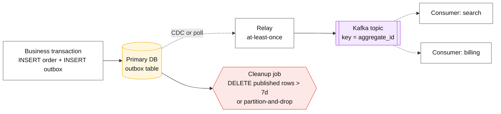

# Outbox pattern

## Core concept

Writing to your database **and** publishing an event are two writes to two systems with no
atomicity between them. Whichever order you choose, a crash in the middle leaves the system
inconsistent: publish-then-commit can emit an event for a transaction that rolled back;
commit-then-publish can lose the event for a transaction that succeeded. There is no ordering
that fixes it, which is why "we'll just add a try/catch" is not a design.

The outbox pattern removes the second system from the critical path: the event is written **as a
row, in the same transaction, in the same database**. A separate relay reads that table and
publishes. Atomicity is now a local database property — the thing databases are actually good at —
and publishing becomes a retryable background job.

**When it earns its complexity:** when a state change and its notification must both happen or
neither, and the consumer is another service. **What it costs if adopted too early:** a table that
grows forever, a relay to operate and monitor, an extra hop of latency, and downstream consumers
that must be idempotent because the relay is at-least-once. If you have exactly one consumer inside
the same database, a transactional job table read by the same application is the smaller answer —
that *is* an outbox, without the pipeline.

## Mechanics & internals

### The dual-write problem, and why ordering does not save you

```mermaid
sequenceDiagram
    autonumber
    participant A as Service
    participant D as Database
    participant K as Broker

    rect rgb(255,240,240)
    Note over A,K: commit-then-publish — loses events
    A->>D: COMMIT order
    D-->>A: ok
    A--xA: crash / broker unavailable
    Note over K: event never published.<br/>Order exists, nobody downstream knows.
    end

    rect rgb(255,245,235)
    Note over A,K: publish-then-commit — invents events
    A->>K: publish order_created
    K-->>A: ok
    A->>D: COMMIT
    D--xA: constraint violation / rollback
    Note over K: event published for an order<br/>that does not exist.
    end

    rect rgb(240,255,240)
    Note over A,K: outbox — one transaction, one system
    A->>D: BEGIN; INSERT order; INSERT outbox row; COMMIT
    D-->>A: ok (atomic — both or neither)
    Note over D,K: relay publishes from the outbox,<br/>retries until acked
    end
```

### The table

```sql
CREATE TABLE outbox (
  id            bigserial PRIMARY KEY,   -- relay cursor
  aggregate_id  uuid NOT NULL,           -- becomes the Kafka partition key
  event_type    text NOT NULL,
  payload       jsonb NOT NULL,
  created_at    timestamptz NOT NULL DEFAULT now(),
  published_at  timestamptz              -- NULL until the relay acks
);
CREATE INDEX ON outbox (id) WHERE published_at IS NULL;   -- partial: only unpublished
```

Two schema decisions that matter more than they look:

- **`aggregate_id` is the partition key.** Events for one entity must stay ordered downstream, and
  ordering in a log exists only within a partition. Choosing this column *is* choosing the
  downstream ordering guarantee.
- **The payload is a contract, not a dump of your row.** Serialising the internal record couples
  every consumer to your schema. Write an explicit event shape and version it.

### Relay: polling vs CDC, and the subtlety that breaks naive polling

| | **Polling relay** | **CDC relay** (Debezium et al.) |
|---|---|---|
| Mechanism | `SELECT … WHERE published_at IS NULL ORDER BY id LIMIT n` | Reads the WAL/binlog directly |
| Latency | = poll interval (100 ms–5 s) | 10–200 ms |
| DB load | Constant query load, even when idle | Negligible; the log is already written |
| Ordering | By `id` — **and this is where the bug lives** | Commit order, exactly |
| Ops | Just your code | A connector, its offsets, and WAL/binlog retention |

**The gap problem that catches every hand-rolled polling relay.** `bigserial` values are allocated
when the `INSERT` runs, not when the transaction commits. Transaction A takes id 100, transaction B
takes id 101 and commits first. A relay polling at that moment sees 101, publishes it, and advances
its cursor past 100. When A commits a moment later, **its event is never published** — the row
exists, the cursor is beyond it, and nothing errors.

Three fixes, in increasing order of correctness:

1. **Never advance past a gap** — track the highest contiguous id, or re-scan a trailing window
   (e.g. "also re-check the last 5 minutes"). Simple, and it makes late-committing rows visible.
2. **Mark rather than cursor** — `UPDATE outbox SET published_at = now() WHERE id = ?` after the
   ack, and always select `WHERE published_at IS NULL`. No cursor to outrun; costs a write per
   event.
3. **Use CDC** — the log is in commit order by construction, so the problem does not exist.

This is the single strongest argument for CDC over a hand-rolled relay, and it is almost never
mentioned in tutorials.

### Delivery semantics and cleanup

The relay is **at-least-once**: it can publish and crash before recording the ack. Consumers must
be idempotent — see [../fundamentals/idempotency.md](../fundamentals/idempotency.md) — and the
event should carry a stable id (the outbox `id`, or a UUID) for downstream dedup.

Cleanup is not optional. An outbox is append-only write amplification on your primary database:



Delete in **batches**, or partition the table by day and drop partitions — a single
`DELETE FROM outbox WHERE published_at < …` on a large table takes a long lock and generates a
bloat problem on top of the growth problem you were fixing.

## Numbers that matter

| Quantity | Value | Confidence |
|---|---|---|
| CDC relay latency | 10–200 ms end to end | Order of magnitude; measure yours |
| Polling relay latency | = poll interval, typically 100 ms–5 s | Design choice; the trade is DB load vs freshness |
| Outbox row size | 200 B–2 KB depending on payload | Order of magnitude |
| Outbox growth at 5 k events/s × 500 B | ~216 GB/day before cleanup | Arithmetic — the number that forces a retention policy |
| Write amplification | +1 row + index per business transaction | Roughly 10–30% more write IO; measure |
| Cleanup batch | 1 k–10 k rows per statement | Avoids long locks and replication lag spikes |
| WAL/binlog retention for CDC | Must exceed max relay downtime — **days, not hours** | The connector's offset is useless if the log is gone |
| Alert threshold, oldest unpublished row | > 60 s | The single most useful outbox metric |

**The metric that matters is age, not depth.** A backlog of 50 k rows draining fast is fine; one
row stuck for ten minutes means events are missing downstream. Alert on
`now() − min(created_at) WHERE published_at IS NULL`, and treat it as a data-integrity signal
rather than a queue-depth signal.

## Failure modes

| Failure | Symptom | Mitigation |
|---|---|---|
| **Cursor outruns an uncommitted row** | Events silently missing; the outbox row exists and looks published-adjacent | Mark-on-ack instead of a cursor; re-scan a trailing window; or use CDC |
| **Outbox grows without bound** | Primary database disk pressure, vacuum load, slow queries | Batched cleanup or daily partitions with `DROP` |
| **Relay lag** | Downstream stale; users report "search doesn't show my order" | Alert on oldest-unpublished age, not row count |
| **Relay down past WAL retention** | CDC connector cannot resume; must re-snapshot the table | Retention > max downtime; alert on replication-slot lag |
| **Postgres replication slot never advances** | **WAL accumulates until the primary's disk fills** — a stopped Debezium connector can take down the database it reads | Monitor `pg_replication_slots.confirmed_flush_lsn` lag; drop abandoned slots |
| **Duplicate publishes** | Downstream double-processing | At-least-once is the contract; consumers dedupe on event id |
| **Payload couples consumers to the schema** | A column rename breaks three services | Explicit event schema, versioned, separate from the table |
| **Ordering assumed across aggregates** | Consumer assumes global order that never existed | Order is per partition key only; state it in the event contract |
| **Outbox used as a job queue** | Long-running work blocks event publishing | Separate concerns: the outbox publishes facts, a job table schedules work |

**The failure worth memorising** is the replication-slot one, because it inverts the usual
direction of blame: a *consumer* being down (the CDC connector) causes the *producer's* database to
run out of disk, since Postgres retains WAL until every slot has consumed it. Teams add CDC
expecting a read-only integration and acquire a new way to fill the primary's disk.

## Trade-offs vs alternatives

| Approach | Atomicity | Ops burden | Latency | Choose when |
|---|---|---|---|---|
| **Naive dual write** | **None** | Zero | Lowest | Never, for anything that matters |
| **Outbox + polling relay** | Yes | Low — your code | Poll interval | Small scale; no CDC infrastructure; accept the gap handling |
| **Outbox + CDC relay** | Yes | Medium — a connector to run | 10–200 ms | The default at scale; commit-ordered by construction |
| **Direct CDC on business tables** | Yes | Medium | Low | You want the change stream itself; couples consumers to your schema unless you project |
| **Listen-to-yourself** (publish first, consume your own event to write the DB) | Yes — the log is the source of truth | Medium | Extra hop | Event-sourced designs; inverts which store is authoritative |
| **2PC across DB and broker (XA)** | Yes | High, and blocking | Highest | Essentially never — see [distributed-transactions.md](./distributed-transactions.md) |
| **Same-database job table** | Yes | **Zero extra** | Immediate | One consumer, same database. The smaller answer people skip past |

### Where staff engineers get this wrong

1. **Treating "outbox" as a synonym for "Kafka".** The pattern is *atomicity between state and
   notification*. If your consumer lives in the same database, a job table gives you that with no
   pipeline.
2. **Hand-rolling a cursor-based polling relay.** The id-gap bug is subtle, silent, and produces
   missing events under exactly the concurrency the design was meant to handle.
3. **No retention policy.** The outbox is unbounded growth on the primary — the store you least
   want to fill.
4. **Publishing the row instead of an event.** Consumers become coupled to your schema, and a
   refactor becomes a cross-team migration.
5. **Ignoring the replication slot.** A stopped CDC connector fills the producer's disk. This is
   the most surprising operational consequence of adopting CDC.
6. **Assuming exactly-once because the write was atomic.** The relay is at-least-once. Consumers
   must be idempotent, and that requirement belongs in the event contract.

## Real-world examples

- **Debezium's outbox event router** — the productised version: a convention for the table shape,
  routing by `aggregate_type` to topics, keyed by `aggregate_id`. The reference implementation.
- **Postgres logical decoding / MySQL binlog** — the substrate CDC relays read; also why WAL
  retention and slot monitoring become your problem.
- **Kafka Connect + Debezium** — the common production stack; the connector's offsets are the
  relay's cursor, stored in Kafka rather than in your database.
- **Event-sourced systems** — the limit case of "listen to yourself": the log is the source of
  truth and the database is a projection, which removes the dual write by removing one of the
  writes.
- **DynamoDB Streams / MongoDB change streams** — managed CDC where the outbox table is often
  unnecessary because the change stream is already ordered and durable.

## Staff-level follow-ups

1. Walk the id-gap failure in a polling relay with two concurrent transactions, then give the
   three fixes and say which you would ship for a service doing 2 k events/s.
2. Your CDC connector has been down for six hours. Describe what is happening to the primary
   database, how you would find out, and the two ways out.
3. Design the outbox contract for an order service consumed by search, billing and analytics:
   payload shape, partition key, versioning, and what each consumer must implement.
4. Compute outbox growth for 5 k events/s at 500 B and choose a retention strategy. Then say what
   breaks if a consumer needs to replay 30 days.
5. Argue *against* the outbox for a specific service you have built, and name the smaller design
   that gives the same guarantee.

## See also

- [../fundamentals/idempotency.md](../fundamentals/idempotency.md) — what consumers must implement
- [../fundamentals/delivery-semantics.md](../fundamentals/delivery-semantics.md) — why at-least-once is the ceiling
- [saga-pattern.md](./saga-pattern.md) — the multi-step version of the same problem
- [distributed-transactions.md](./distributed-transactions.md) — the alternative you are avoiding
- [../05-data-cases/cdc-pipeline.md](../05-data-cases/cdc-pipeline.md) — building and operating the CDC path

## Referenced by

- [Distributed transactions](distributed-transactions.md)
- [Materialized views and derived data](materialized-views-and-derived-data.md)
- [Patterns index](README.md)
- [Saga pattern](saga-pattern.md)
- [Topic manifest](../topics/manifest.md)
- [Transactions, sagas and idempotency](../02-primitives/transactions-and-idempotency.md)

## Sources

- [Debezium — outbox event router](https://debezium.io/documentation/reference/stable/transformations/outbox-event-router.html)
- [Kleppmann — Using logs to build a solid data infrastructure](https://www.confluent.io/blog/using-logs-to-build-a-solid-data-infrastructure-or-why-dual-writes-are-a-bad-idea/) — the dual-write argument
- [PostgreSQL — logical decoding and replication slots](https://www.postgresql.org/docs/current/logicaldecoding.html)
- [microservices.io — transactional outbox](https://microservices.io/patterns/data/transactional-outbox.html)
- Local book: `DE/System-Design/Designing Data Intensive Applications.pdf` ch.11
