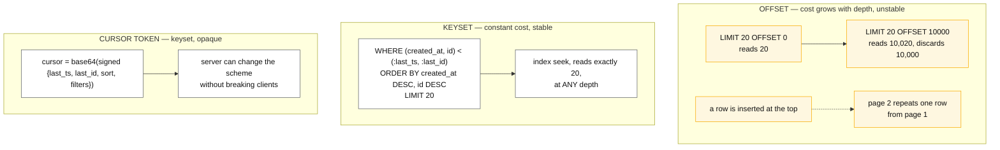

# Pagination patterns

## Core concept

Pagination looks like a UI concern and is a correctness concern. `OFFSET 10000` is not "skip
10,000 rows" to a database — it is "produce 10,010 rows, discard 10,000", so the cost of page N
grows linearly with N and the last page is the most expensive query in your system.

Worse, offset pagination is **unstable under concurrent writes**. If a row is inserted before your
position between page 1 and page 2, every subsequent row shifts down one and you see an item
twice; if a row is deleted, you skip one silently. A user scrolling a busy feed sees duplicates
and misses items, and it never appears in a test because the test data does not move.

**Keyset (cursor) pagination fixes both** by paging on a *position in the sort order* rather than
a count of skipped rows. The cost is that you give up random access to page N — which almost no
real product needs, and which is the only thing offset was buying you.

## Mechanics & internals

### The three schemes



| Scheme | Cost of page N | Stable under writes | Jump to page N | Use when |
|---|---|---|---|---|
| **Offset/limit** | O(offset + limit) | **No** | Yes | Small, static, admin tables with a page-number UI |
| **Keyset** | O(limit) | Yes | No | Everything user-facing, especially infinite scroll |
| **Cursor token** | O(limit) | Yes | No | Public APIs — keyset with the implementation hidden |
| **Search `search_after`** | O(limit) | Mostly | No | Search engines; a point-in-time view can pin the snapshot |

### Keyset, done correctly

The one rule people get wrong: **the sort key must be unique, or you must make it unique.**

```sql
-- WRONG: created_at is not unique. Rows sharing a timestamp are skipped or repeated
WHERE created_at < :last_created_at ORDER BY created_at DESC LIMIT 20

-- RIGHT: a tuple comparison on (sort key, tiebreaker) — and the tiebreaker is the PK
WHERE (created_at, id) < (:last_created_at, :last_id)
ORDER BY created_at DESC, id DESC
LIMIT 20
```

The index must match the ORDER BY exactly — `(created_at DESC, id DESC)` — or the engine sorts,
and you have paid for a full sort to return twenty rows. Row-value comparison (`(a, b) < (x, y)`)
is supported by PostgreSQL and MySQL and is the clean expression; engines without it need the
expanded `a < x OR (a = x AND b < y)`, which must be written carefully enough to remain
index-usable.

### The cursor token

Never expose raw keys. Encode `{sort_key_values, sort_direction, filter_hash, version}`, base64
it, and **sign or HMAC it**. Three reasons, all real:

- **Compatibility**: you can change from offset to keyset, or add a tiebreaker, without breaking
  every client — bump `version` and handle both.
- **Correctness**: the `filter_hash` lets you reject a cursor reused with different filters, which
  otherwise returns nonsense that looks like a bug in your ranking.
- **Safety**: an unsigned cursor is user-controlled input straight into a `WHERE` clause. Sign it.

Cursors should also be documented as **opaque and short-lived**. A client that stores one for a
week and replays it has pinned a position in data that has since been deleted.

### Stability is a spectrum, and you must pick a point

Keyset pagination guarantees you do not *repeat or skip* because of shifting offsets. It does not
give you a consistent snapshot: a row inserted between two pages you have already passed will
never be seen, and a row modified so it sorts differently may appear twice.

| Guarantee | How | Cost |
|---|---|---|
| No duplicates/skips from shifting | Keyset on a unique tuple | Free. Do this always |
| Full point-in-time snapshot | Search engine PIT, database snapshot, or an immutable sort key | Resources held open; a timeout you must handle |
| "New items" handled explicitly | Page backwards from the cursor, or a "5 new items" affordance | Product work, and usually the right answer |

**Sorting by a mutable field is the hardest case.** Paginating by relevance, price or a score that
changes underneath you cannot be made stable by cursors alone — the row genuinely moved. Either
snapshot the ranking (materialise a result-set id and page that) or accept and document the
instability.

### Deep paging is usually the wrong requirement

If a user is on page 500, the interface has failed — nobody reads 10,000 results. Offer better
filters, a jump-to-date, or a bulk export for the legitimate "I need all of it" case. An export is
a different operation with different economics: a streaming cursor over a snapshot, produced
asynchronously, not a paginated API hammered 500 times.

**Distributed sorts make deep paging quadratic.** Page 500 of a sharded or federated query means
every shard must produce its top `500 × 20` and the coordinator merges 10,000 rows per shard to
return 20. This is why search engines cap result depth by default, and the cap is a feature.

## Numbers that matter

```
Offset cost, PostgreSQL, 10M-row table, indexed sort:
  OFFSET 0      → ~0.1 ms
  OFFSET 10,000 → ~15 ms
  OFFSET 1,000,000 → ~1.5 s     ← same query, same index, 15,000× slower
Keyset at every one of those depths: ~0.1 ms. The index seek does not care.

Scatter-gather deep paging: N shards × (offset + limit) rows merged centrally.
  10 shards, page 500 at 20/page → 100,000 rows fetched to return 20.

Page size: 20-100 is the usual sweet spot. Beyond a few hundred, serialisation
  and transfer dominate and the client cannot render it anyway. Cap it server-side
  and return the cap rather than erroring — an uncapped `limit` parameter is a
  denial-of-service primitive.

Cursor size: keep it under ~1 KB. It travels in every URL, gets logged, and
  hits URL length limits (~8 KB is a common ceiling) if you stuff a filter set in it.
```

## Failure modes

| Failure | Looks like | Why |
|---|---|---|
| **Duplicate and missing items on scroll** | "I saw that post twice" | Offset pagination over a table that is being written to |
| **Non-unique sort key** | Items at a shared timestamp skipped | No tiebreaker in the keyset comparison |
| **Deep page timeout** | Page 1 fast, page 900 times out | Offset scanning, or a distributed merge |
| **Cursor reused with different filters** | Wrong or empty results, looks like a ranking bug | No filter fingerprint in the cursor |
| **Unsigned cursor** | Users paging into other tenants' data | Cursor decoded straight into a query predicate |
| **Index does not match ORDER BY** | Full sort on every page | Direction or column order mismatch |
| **`hasMore` computed from page fullness** | Last page never terminates, or terminates one page early | A full page does not mean more rows exist. Fetch `limit + 1`, or trust the store's own cursor |
| **Empty page treated as the end** | Results silently truncated | Some stores apply the page cap *before* the filter, so an empty page with a continuation token is normal |
| **Total count on every page** | The count is slower than the query | `COUNT(*)` over a filtered set is a full scan. Return an estimate, or nothing |

**The one to volunteer:** *an empty page does not mean the end.* Several stores paginate on bytes
scanned rather than rows returned, apply filters after that cap, and hand back a continuation
token with zero results. Code that stops when a page is empty silently truncates the result set,
and the bug appears only for filters with low selectivity.

## Trade-offs vs alternatives

| Option | Take it when | Give up |
|---|---|---|
| **Offset** | Admin tables, small static data, page numbers genuinely needed | Stability and deep-page performance |
| **Keyset** | Default for anything user-facing | Jump-to-page-N, and total-page-count UI |
| **Cursor token** | Public API | Clients can no longer construct positions themselves — which is the point |
| **Snapshot / PIT** | Correctness over a moving set matters more than resources | Held resources and an expiry to handle |
| **Streaming export** | "Give me everything" | Not a paginated API at all; treat it as a job |

**The UI constrains the backend more than people expect.** A page-number widget commits you to
offset semantics or to a count you cannot afford. Infinite scroll and "load more" are compatible
with keyset and are why they became the norm — the interface changed to match what is cheap and
correct, not the other way round.

## Real-world examples

- **Every major public API uses opaque cursors**, not page numbers, and none of them let you jump
  to page 500. That convergence is the evidence.
- **Search engines cap result depth** by default and require an explicit point-in-time or
  scroll-style mechanism to go deeper, precisely because of the scatter-gather multiplication.
- **The classic incident** is a nightly job that paginates with offset over a table that is being
  written to, and silently processes 98% of the rows. It succeeds, it is green, and the gap is
  found weeks later by a reconciliation report.

## On AWS and Azure

| | AWS | Azure |
|---|---|---|
| **The service** | DynamoDB `Query`/`Scan` with `LastEvaluatedKey`/`ExclusiveStartKey`; Aurora/RDS with SQL keyset; OpenSearch `search_after` with a point-in-time | Cosmos DB for NoSQL with continuation tokens; Azure SQL with `OFFSET/FETCH` or keyset; Azure AI Search with `$skip` and `$top` |
| **What you configure** | `Limit`, the key schema that makes the sort order an index seek, and whether a `FilterExpression` runs after the page cap | `maxItemCount`, the continuation token passed back verbatim, partition key to avoid a cross-partition query |
| **The default that bites** | **A `Query` returns at most 1 MB per page**, and with a `FilterExpression` the cap is applied to the items *read* **before** the filter — so "a page can return zero matching items and still include a `LastEvaluatedKey`". The docs are explicit: "The only way to know when you have reached the end of the result set is when `LastEvaluatedKey` is empty." Stopping on an empty page is a silent data-loss bug | A single Cosmos operation is capped at **5 seconds of execution and a 4 MB response**; when a query hits either, it "returns a page of results and a continuation token to the client to resume execution". So a page boundary is a *resource* boundary, not a row count — the same "empty page, more results" shape, arriving for a different reason |
| **What it costs you** | `Limit` bounds items *read*, not items *matched*, so a low-selectivity filter burns read capacity on rows the caller never sees. Push selectivity into the key condition, not the filter | A cross-partition query fans out to every physical partition and merges, which is scatter-gather deep paging with the multiplication described above. Partition-scoped queries paginate cheaply; cross-partition ones get worse with depth |

Both vendors have independently arrived at the same contract: **a continuation token, and the rule
that only its absence means the end.** Any client loop written against row counts rather than that
token is wrong on both clouds — and wrong in a way that returns a 200 and silently short results.

## In an LLM deployment

- **RAG retrieval is not pagination and should not be paginated.** Top-k from a vector index is a
  ranked cut, not a page; there is no stable next page because "the next 10 nearest" is a
  different query with different recall characteristics. If you need more context, raise k or
  re-rank — do not page.
- **Paginating a corpus into a context window is a real pattern and a real trap.** Feeding a
  document to a model in chunks is offset pagination over text, with the same instability: a
  document edited between chunks produces a summary of two different documents. Snapshot the
  document version and chunk *that*.
- **Agent tool results need cursors, and models handle them badly.** A tool that returns "page 1 of
  47" invites the model to loop, consuming context and tokens on every page. Return a bounded,
  *summarised* result with a count, and make "fetch more" an explicit, budgeted decision rather
  than something the model can do unboundedly.
- **The empty-page trap is worse with an agent in the loop.** A model that sees zero results and a
  continuation token will usually conclude there is nothing there and stop — so the silent
  truncation above becomes a confidently wrong answer instead of a short list.

## Staff-level follow-ups

1. A user reports seeing the same item twice while scrolling. Diagnose it without looking at the
   code, then tell me the fix and what it costs the UI.
2. Design pagination for results sorted by a relevance score that changes every few minutes. What
   can you guarantee, and what do you tell the user?
3. A nightly reconciliation job paginates a table that is being written to. What is wrong, how
   would you detect that it has already been silently skipping rows, and how do you fix it?
4. Your API must support "jump to page 500". Push back — and if the requirement survives, how
   would you implement it without a full scan?
5. What exactly goes in a cursor token, and what happens if a client replays a week-old one?

## See also

- [../fundamentals/indexing-and-query-planning.md](../fundamentals/indexing-and-query-planning.md)
  — why the index must match the ORDER BY for keyset to be a seek
- [../fundamentals/partitioning-strategies.md](../fundamentals/partitioning-strategies.md) — the
  scatter-gather multiplication that makes deep paging quadratic
- [cqrs.md](cqrs.md) — paging a read model that is being rewritten underneath the reader
- [../fundamentals/geospatial-indexing.md](../fundamentals/geospatial-indexing.md) — paging a
  distance-ranked set whose members move
- [../04-frontend-cases/infinite-feed.md](../04-frontend-cases/infinite-feed.md) — the client half
  of this problem

## Referenced by

- [CQRS](cqrs.md)
- [Design a proximity service](../03-backend-cases/proximity-service.md)
- [Geospatial indexing](../fundamentals/geospatial-indexing.md)
- [Patterns index](README.md)
- [Topic manifest](../topics/manifest.md)

## Sources

- [AWS — paginating table query results in DynamoDB](https://docs.aws.amazon.com/amazondynamodb/latest/developerguide/Query.Pagination.html) — 1 MB page size, `LastEvaluatedKey`/`ExclusiveStartKey` protocol, "a page can return zero matching items and still include a `LastEvaluatedKey`", and "The only way to know when you have reached the end of the result set is when `LastEvaluatedKey` is empty"
- [Azure — Cosmos DB service quotas and default limits](https://learn.microsoft.com/en-us/azure/cosmos-db/concepts-limits) — 5 second maximum execution for a single operation, 4 MB maximum response size, and the continuation-token behaviour when either is reached
