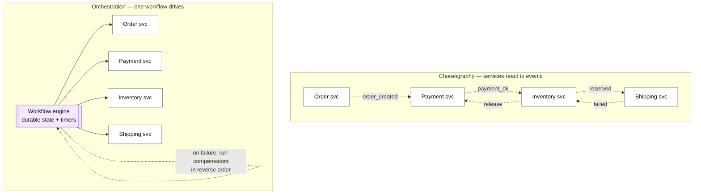
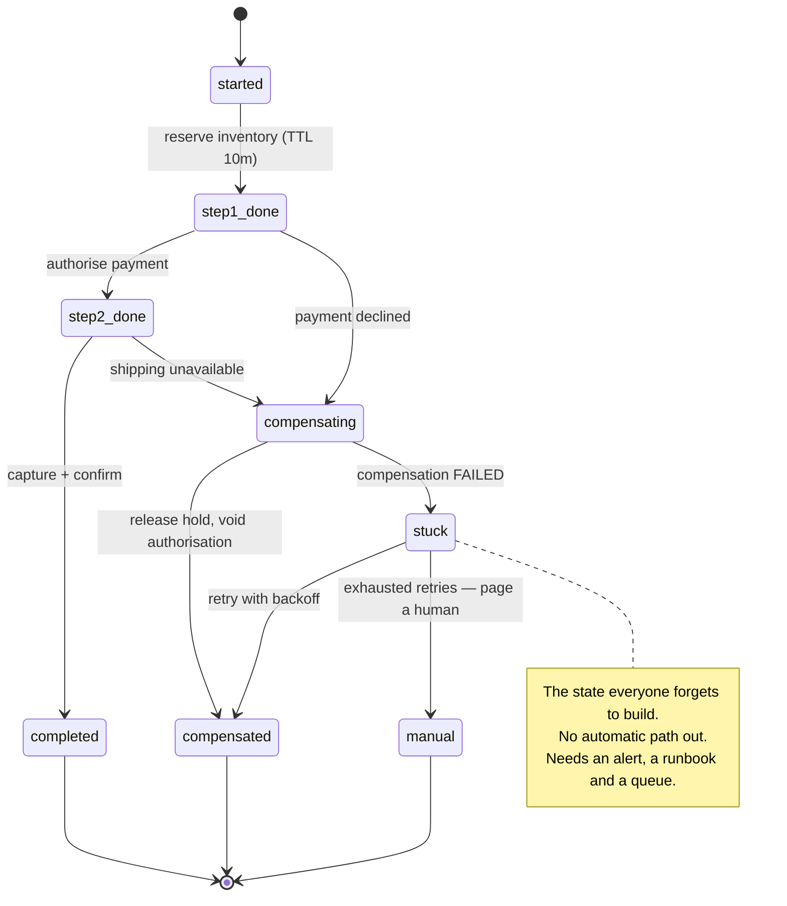

# Saga pattern

## Core concept

A saga replaces one distributed transaction with a **sequence of local transactions**, each with a
compensating action that semantically undoes it. You get atomicity-ish behaviour across services
without holding locks across service boundaries — and you give up **isolation**, permanently.
Intermediate states are visible to everyone: for a window measured in seconds to minutes, the order
exists but is unpaid, the seat is held but unconfirmed, the money has left one account and not
arrived at the other.

That lost isolation is the whole design cost, and it is where the real work is. The mechanical part
— "call service A, then B, and if B fails call A's compensator" — is easy and is what tutorials
cover. The hard parts are: **compensation is not rollback**, some steps cannot be compensated at
all, and every intermediate state is a state the product must be able to explain to a user.

**When it earns its complexity:** a business process spanning services or long time periods, where
2PC is unavailable or unacceptable. **What it costs if adopted too early:** N compensating paths
that are never exercised, a workflow engine to operate, and a system where "what state is this
order in?" needs a query rather than a column. If the whole process fits in one database, use a
transaction — a saga inside one service is complexity with no purchaser.

## Mechanics & internals

### Compensation is not rollback

A rollback restores the prior state as if nothing happened. A compensation performs a **new
business action** whose effect approximates undoing the previous one, and the difference is
visible to users and auditors:

| Step | "Rollback" | Actual compensation |
|---|---|---|
| Charged a card | — | Issue a refund. The charge and refund **both appear on the statement** |
| Sent an email | — | Send a correction. You cannot unsend |
| Shipped a box | — | Accept a return; pay for the reverse logistics |
| Decremented inventory | Increment it back | Works — but the item may have been sold in between |
| Allocated a seat | Release it | Works if nobody else booked it meanwhile |

Two consequences fall out. First, **some steps have no compensation**, which is why the correct
design frequently reorders the saga to put irreversible steps **last**, after every reversible step
has succeeded. Second, **compensations must themselves be idempotent and retryable**, because the
compensation can also fail — and a failed compensation is the worst state in the system, since
nothing further will fix it automatically.

### Choreography vs orchestration

| | Choreography | Orchestration |
|---|---|---|
| Coordination | Each service reacts to events | One workflow owns the sequence |
| Coupling | Low pairwise, **high conceptual** — the process exists nowhere | Services coupled to the orchestrator |
| Visibility | "What state is this order in?" requires reconstructing from logs | One query |
| Failure handling | Every service must know which compensators to trigger | Centralised, explicit, testable |
| Cycles | Easy to create accidentally; hard to detect | Structurally impossible |
| Fits | 2–3 steps, genuinely independent services | **4+ steps, or anything with money, timeouts or human approval** |

The honest rule: **choreography scales to about three steps.** Beyond that, the process is real but
lives only as an emergent property of event handlers, and nobody can answer "why is this order
stuck?" without reading four services' logs. Orchestration makes the process a first-class object
with durable state — which is exactly why workflow engines exist.

### Isolation: the missing ACID letter, and what to do about it

Sagas have no isolation, so anomalies from
[../fundamentals/transaction-isolation-levels.md](../fundamentals/transaction-isolation-levels.md)
reappear at the business level: lost updates, dirty reads of intermediate state, and the saga
equivalent of write skew. The standard countermeasures:

- **Semantic lock** — mark the record's state (`PENDING_PAYMENT`) so other operations know it is
  mid-saga and can refuse or queue. The most common and most useful.
- **Commutative updates** — design steps so order does not matter (`balance += x` rather than
  `balance = y`).
- **Pessimistic view ordering** — reorder steps so the most damaging dirty read is impossible
  (deduct the risky thing last).
- **Re-read value / version check** — verify the value has not changed before compensating.
- **By value** — route high-value requests through 2PC or a single-partition design and let
  low-value ones use the saga. Explicit risk-based routing, and an underused answer.

### TCC: reservations instead of undo

Try-Confirm-Cancel replaces "do then undo" with "**reserve, then commit or release**". The seat is
held for ten minutes rather than booked-then-unbooked; the funds are authorised rather than
captured-then-refunded. This is strictly better where the domain supports a reservation concept,
because the intermediate state is *designed* rather than accidental, and cancellation leaves no
trace a customer can see.

The cost is a timeout you must own: every reservation needs an expiry, a sweeper that releases
abandoned holds, and a decision about what happens when the confirm arrives **after** the
reservation expired.

## Numbers that matter

| Quantity | Value | Confidence |
|---|---|---|
| Steps where choreography stops working | ~3 | Convention, and the point where "where is this order?" becomes unanswerable |
| Saga duration | Seconds (checkout) to **days** (fulfilment, KYC, human approval) | Design input — it decides whether you need durable timers |
| Inconsistency window | = saga duration. Every intermediate state is user-visible for that long | Structural |
| Reservation TTL (TCC) | 5–15 minutes for checkout; matches the user's patience | Product decision |
| Compensation failure rate | Low but **never zero** — budget for a manual queue | Order of magnitude |
| Stuck-workflow alert | Any saga in a non-terminal state past `2 × p99` duration | The single most important saga alert |
| Workflow-engine state per saga | ~KB of history; millions of open workflows is normal | Order of magnitude |
| Retry policy per step | Exponential + jitter, capped; distinguish retryable from terminal | See [../fundamentals/timeouts-retries-backoff.md](../fundamentals/timeouts-retries-backoff.md) |

**The arithmetic that decides the design.** A checkout saga with 4 steps at p99 = 300 ms each has a
~1.2 s inconsistency window — a product can hide that with a spinner. A fulfilment saga spanning a
warehouse pick, a carrier handoff and a delivery confirmation has a window measured in **days**,
which means every intermediate state needs a name, a UI representation, a support answer and a
timeout. Same pattern, entirely different amount of work, and the difference is duration.

## Failure modes

| Failure | Symptom | Mitigation |
|---|---|---|
| **Stuck saga** | Order sits in `PENDING_PAYMENT` forever; nobody notices until a customer complains | Alert on non-terminal states past `2 × p99`; a reconciliation sweep as a backstop |
| **Compensation fails** | Money taken, product not shipped, no automatic path back | Compensations idempotent and retried; terminal failures go to a human queue with a runbook |
| **Compensation for a step that cannot be undone** | Email sent, box shipped, statement shows a charge and a refund | Reorder so irreversible steps are last; prefer TCC reservations |
| **Dirty read of intermediate state** | A report counts unpaid orders as revenue; a second saga acts on a half-applied state | Semantic locks; explicit state machine; exclude non-terminal states from queries |
| **Choreography cycle** | Services trigger each other in a loop; events multiply | Orchestration, or an explicit event-flow diagram reviewed like code |
| **Duplicate step execution** | Double charge on retry | Every step idempotent, keyed by saga id + step — see [../fundamentals/idempotency.md](../fundamentals/idempotency.md) |
| **Orchestrator is a single point of failure** | Workflow engine down = all business processes stop | Durable, replicated engine; and know your blast radius before adopting one |
| **Expired reservation confirmed later** | Confirm arrives after the hold was released and the item resold | Define the behaviour explicitly: fail the confirm, or re-acquire and possibly fail |
| **No end-to-end test of the compensating path** | Compensators are dead code until the day they matter | Test the failure path in CI; run game days that fail a middle step |

**The one that hurts most** is the failed compensation, because it has no automatic resolution:
the system has taken an action it cannot take back and cannot complete. Every saga design should
state, explicitly, what the manual queue is, who owns it, and what the customer is told while a
saga sits in it. A design that has no answer has quietly decided the answer is "a support ticket
and an apology".

## Trade-offs vs alternatives

| Approach | Isolation | Complexity | Fits |
|---|---|---|---|
| **Single-database transaction** | Full ACID | **None** | Everything that fits in one database. Try this first, seriously |
| **Single-partition design** | Full | Data-model work | Redesign so the transaction is local — the best answer when reachable |
| **Saga, choreography** | None | Low per service, high system-wide | 2–3 steps, no money, tolerant of odd intermediate states |
| **Saga, orchestration** | None + semantic locks | Medium; an engine to run | 4+ steps, money, timeouts, human approval |
| **TCC / reservations** | Better — the intermediate state is designed | Medium; TTLs and sweepers | Inventory, seats, funds — anywhere "hold" is a domain concept |
| **2PC** | Full | High, and blocking | Within one database cluster; almost never across services |
| **Do nothing / eventual reconciliation** | None | Lowest | Low-value flows where a nightly job fixing discrepancies is genuinely acceptable — say so out loud |

### Where staff engineers get this wrong

1. **Saying "saga" and stopping.** The pattern name is the easy part; the design is the
   compensations, the semantic locks, the stuck-state alerting and the manual queue.
2. **Treating compensation as rollback.** Refunds appear on statements, emails cannot be unsent.
   Name the real business action for each step.
3. **Choreography past three steps.** The process becomes emergent, unobservable, and impossible to
   answer questions about.
4. **Forgetting the stuck state.** Sagas do not fail loudly; they stall. Without an alert on
   non-terminal age, they are discovered by customers.
5. **Not reordering for irreversibility.** Putting the irreversible step first guarantees the worst
   compensations. Order the steps by how badly they undo.
6. **Skipping the isolation countermeasures.** No isolation means business-level dirty reads —
   semantic locks are not optional decoration.
7. **Reaching for a saga when one transaction would do.** The most common over-application: a saga
   between two tables in the same database.

## Real-world examples

- **Garcia-Molina & Salem (1987)** — the original paper, written about long-lived transactions in a
  single database, decades before microservices. Worth reading to see that the pattern is about
  *duration*, not distribution.
- **Temporal / Cadence** — durable execution: workflow code whose state survives process death,
  with built-in timers, retries and compensation. The dominant orchestration answer, and the reason
  "just write the workflow as code" became viable.
- **AWS Step Functions** — managed orchestration with explicit state machines; the saga pattern is
  one of its documented use cases, with error handling and catch/compensate branches.
- **Ticket and seat booking** — TCC in its natural home: hold, then confirm or expire. See
  the reservation discussion in
  [../03-backend-cases/payments-ledger.md](../03-backend-cases/payments-ledger.md).
- **Payment authorisation and capture** — the card networks' own two-phase design, and the clearest
  real-world example of "reserve then commit" beating "do then undo".

## Staff-level follow-ups

1. Take a four-step checkout and write the compensator for each step in business terms. Which one
   has no compensator, and how do you reorder the saga because of it?
2. Your saga has been stuck in step 3 for six hours across 400 orders. Describe detection,
   triage and remediation — and the alert you would have needed.
3. Compare choreography and orchestration for a fulfilment process spanning three days and two
   external partners. Pick one and say what you give up.
4. Give three isolation anomalies a saga can produce in a real product and the countermeasure for
   each. Which is most dangerous and why?
5. When would you use 2PC or a single-partition redesign instead? Name the property of the data
   that decides it.

## See also

- [distributed-transactions.md](./distributed-transactions.md) — the alternative and why it usually loses
- [outbox-pattern.md](./outbox-pattern.md) — how each step publishes its event atomically
- [../fundamentals/idempotency.md](../fundamentals/idempotency.md) — every step and every compensator needs this
- [../fundamentals/transaction-isolation-levels.md](../fundamentals/transaction-isolation-levels.md) — the anomalies that reappear at business level
- [../03-backend-cases/payments-ledger.md](../03-backend-cases/payments-ledger.md) — sagas with money attached

## Referenced by

- [Distributed transactions](distributed-transactions.md)
- [Outbox pattern](outbox-pattern.md)
- [Patterns index](README.md)
- [Topic manifest](../topics/manifest.md)
- [Transactions, sagas and idempotency](../02-primitives/transactions-and-idempotency.md)

## Sources

- [Garcia-Molina & Salem — Sagas (SIGMOD 1987)](https://www.cs.cornell.edu/andru/cs711/2002fa/reading/sagas.pdf)
- [Temporal — workflow durability and saga guidance](https://docs.temporal.io/encyclopedia/workflows)
- [AWS — implement the saga pattern with Step Functions](https://docs.aws.amazon.com/step-functions/latest/dg/sample-saga-pattern.html)
- [microservices.io — saga pattern and countermeasures](https://microservices.io/patterns/data/saga.html)
- [Chris Richardson — Microservices Patterns, ch.4 (saga countermeasures: semantic lock, commutative updates, by-value)](https://microservices.io/book)
